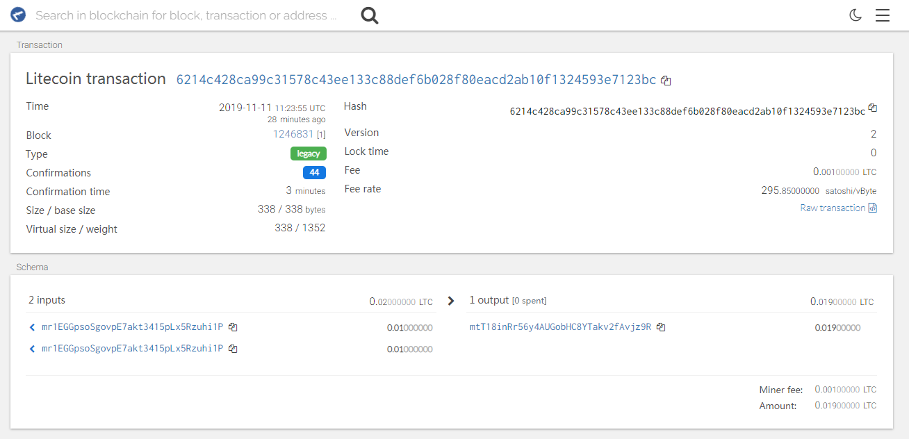

## LTC和BTC的区别

唯一的区别在于:从公钥转为地址的那一步,如下:

第四步(在RIPEMD-160散列前面添加版本字节)，而不是0x00来使用比特币
`0x30`用于Litecoin主网
`0x6F`用于Litecoin测试网


## LTC节点搭建

`litecoin.conf` 配置文件内容:

```
datadir=/data1/ltcmainnet
dbcache=4096
server=1
txindex=1
daemon=1
rpcuser=ltc  #rpc用户名
rpcpassword=ltc123456  #rpc密码
rest=1
rpcport=8089
rpcallowip=0.0.0.0/0
deprecatedrpc=accounts

```


`litecoin-test.conf `配置文件内容:

```
datadir=/data2/ltctestnet
dbcache=4096
server=1
txindex=1
daemon=1
rpcuser=ltc   #rpc用户名
rpcpassword=ltc123456 #rpc密码
rest=1
testnet=1
rpcallowip=0.0.0.0/0
deprecatedrpc=accounts
[test]
rpcport=18089
rpcbind=0.0.0.0:18089
```


## LTC交易签名

>  和BTC交易签名流程完全一样


### 0.获取测试币

获取测试币   https://tltc.bitaps.com/ 


### 1. 获取私钥

```
alias ltctest='litecoin-cli -conf=/root/.litecoin/litecoin-test.conf '

ltctest dumpprivkey mr1EGGpsoSgovpE7akt3415pLx5Rzuhi1P
cNao2XXbKTPHjpHS4DP2RYGhHR3ZmafsUGPXVFjCbsYVz1ZLKFN1   #私钥
```


### 2.创建交易


```

[root@blockchain-node2 rpc_shell]# ltctest  help createrawtransaction
createrawtransaction [{"txid":"id","vout":n},...] [{"address":amount},{"data":"hex"},...] ( locktime ) ( replaceable )

Create a transaction spending the given inputs and creating new outputs.
Outputs can be addresses or data.
Returns hex-encoded raw transaction.
Note that the transaction's inputs are not signed, and
it is not stored in the wallet or transmitted to the network.

Arguments:
1. "inputs"                (array, required) A json array of json objects
     [
       {
         "txid":"id",      (string, required) The transaction id
         "vout":n,         (numeric, required) The output number
         "sequence":n      (numeric, optional) The sequence number
       } 
       ,...
     ]
2. "outputs"               (array, required) a json array with outputs (key-value pairs)
   [
    {
      "address": x.xxx,    (obj, optional) A key-value pair. The key (string) is the litecoin address, the value (float or string) is the amount in LTC
    },
    {
      "data": "hex"        (obj, optional) A key-value pair. The key must be "data", the value is hex encoded data
    }
    ,...                     More key-value pairs of the above form. For compatibility reasons, a dictionary, which holds the key-value pairs directly, is also
                             accepted as second parameter.
   ]
3. locktime                  (numeric, optional, default=0) Raw locktime. Non-0 value also locktime-activates inputs
4. replaceable               (boolean, optional, default=false) Marks this transaction as BIP125 replaceable.
                             Allows this transaction to be replaced by a transaction with higher fees. If provided, it is an error if explicit sequence numbers are incompatible.

Result:
"transaction"              (string) hex string of the transaction

Examples:
> litecoin-cli createrawtransaction "[{\"txid\":\"myid\",\"vout\":0}]" "[{\"address\":0.01}]"
> litecoin-cli createrawtransaction "[{\"txid\":\"myid\",\"vout\":0}]" "[{\"data\":\"00010203\"}]"
> curl --user myusername --data-binary '{"jsonrpc": "1.0", "id":"curltest", "method": "createrawtransaction", "params": ["[{\"txid\":\"myid\",\"vout\":0}]", "[{\"address\":0.01}]"] }' -H 'content-type: text/plain;' http://127.0.0.1:9332/
> curl --user myusername --data-binary '{"jsonrpc": "1.0", "id":"curltest", "method": "createrawtransaction", "params": ["[{\"txid\":\"myid\",\"vout\":0}]", "[{\"data\":\"00010203\"}]"] }' -H 'content-type: text/plain;' http://127.0.0.1:9332/

[root@blockchain-node2 rpc_shell]# 
```


### 3.获取 UTXO

```
ltctest listunspent

{
    "txid": "2a8a19cd89dcf627333c5d3ddaf3361e853eabac1774d147fa53aecfcc9ca7f9",
    "vout": 0,
    "address": "mr1EGGpsoSgovpE7akt3415pLx5Rzuhi1P",
    "label": "user1",
    "account": "user1",
    "scriptPubKey": "76a914730a3c3ac544e47de6b26cc89dd8b3d76edd027688ac",
    "amount": 0.01000000,
    "confirmations": 119196,
    "spendable": true,
    "solvable": true,
    "safe": true
  },
  {
    "txid": "5b15547b3076a4489d4acdb2812d63bfa06e1cbd8c1faec0b572dd893c96aefa",
    "vout": 0,
    "address": "mr1EGGpsoSgovpE7akt3415pLx5Rzuhi1P",
    "label": "user1",
    "account": "user1",
    "scriptPubKey": "76a914730a3c3ac544e47de6b26cc89dd8b3d76edd027688ac",
    "amount": 0.01000000,
    "confirmations": 107284,
    "spendable": true,
    "solvable": true,
    "safe": true
  }
  
```

 


```
[root@blockchain-node2 rpc_shell]# ltctest createrawtransaction "[{\"txid\":\"2a8a19cd89dcf627333c5d3ddaf3361e853eabac1774d147fa53aecfcc9ca7f9\",\"vout\":0}, {\"txid\":\"5b15547b3076a4489d4acdb2812d63bfa06e1cbd8c1faec0b572dd893c96aefa\",\"vout\":0}]" "[{\"mtT18inRr56y4AUGobHC8YTakv2fAvjz9R\":0.019}]"
0200000002f9a79ccccfae53fa47d17417acab3e851e36f3da3d5d3c3327f6dc89cd198a2a0000000000fffffffffaae963c89dd72b5c0ae1f8cbd1c6ea0bf632d81b2cd4a9d48a476307b54155b0000000000ffffffff01e0fd1c00000000001976a9148dda575f1524741e28b595270552fb42115fa7ba88ac00000000

```


### 4.签名交易

- `signrawtransactionwithkey`接口文档

```

[root@blockchain-node2 rpc_shell]# ltctest  help  signrawtransactionwithkey
signrawtransactionwithkey "hexstring" ["privatekey1",...] ( [{"txid":"id","vout":n,"scriptPubKey":"hex","redeemScript":"hex"},...] sighashtype )

Sign inputs for raw transaction (serialized, hex-encoded).
The second argument is an array of base58-encoded private
keys that will be the only keys used to sign the transaction.
The third optional argument (may be null) is an array of previous transaction outputs that
this transaction depends on but may not yet be in the block chain.

Arguments:
1. "hexstring"                      (string, required) The transaction hex string
2. "privkeys"                       (string, required) A json array of base58-encoded private keys for signing
    [                               (json array of strings)
      "privatekey"                  (string) private key in base58-encoding
      ,...
    ]
3. "prevtxs"                        (string, optional) An json array of previous dependent transaction outputs
     [                              (json array of json objects, or 'null' if none provided)
       {
         "txid":"id",               (string, required) The transaction id
         "vout":n,                  (numeric, required) The output number
         "scriptPubKey": "hex",     (string, required) script key
         "redeemScript": "hex",     (string, required for P2SH or P2WSH) redeem script
         "amount": value            (numeric, required) The amount spent
       }
       ,...
    ]
4. "sighashtype"                    (string, optional, default=ALL) The signature hash type. Must be one of
       "ALL"
       "NONE"
       "SINGLE"
       "ALL|ANYONECANPAY"
       "NONE|ANYONECANPAY"
       "SINGLE|ANYONECANPAY"

Result:
{
  "hex" : "value",                  (string) The hex-encoded raw transaction with signature(s)
  "complete" : true|false,          (boolean) If the transaction has a complete set of signatures
  "errors" : [                      (json array of objects) Script verification errors (if there are any)
    {
      "txid" : "hash",              (string) The hash of the referenced, previous transaction
      "vout" : n,                   (numeric) The index of the output to spent and used as input
      "scriptSig" : "hex",          (string) The hex-encoded signature script
      "sequence" : n,               (numeric) Script sequence number
      "error" : "text"              (string) Verification or signing error related to the input
    }
    ,...
  ]
}

Examples:
> litecoin-cli signrawtransactionwithkey "myhex"
> curl --user myusername --data-binary '{"jsonrpc": "1.0", "id":"curltest", "method": "signrawtransactionwithkey", "params": ["myhex"] }' -H 'content-type: text/plain;' http://127.0.0.1:9332/

```

- 签名需要输入的utxo

```
{
    "txid": "2a8a19cd89dcf627333c5d3ddaf3361e853eabac1774d147fa53aecfcc9ca7f9",
    "vout": 0,
    "address": "mr1EGGpsoSgovpE7akt3415pLx5Rzuhi1P",
    "label": "user1",
    "account": "user1",
    "scriptPubKey": "76a914730a3c3ac544e47de6b26cc89dd8b3d76edd027688ac",
    "amount": 0.01000000,
    "confirmations": 119196,
    "spendable": true,
    "solvable": true,
    "safe": true
  },
  {
    "txid": "5b15547b3076a4489d4acdb2812d63bfa06e1cbd8c1faec0b572dd893c96aefa",
    "vout": 0,
    "address": "mr1EGGpsoSgovpE7akt3415pLx5Rzuhi1P",
    "label": "user1",
    "account": "user1",
    "scriptPubKey": "76a914730a3c3ac544e47de6b26cc89dd8b3d76edd027688ac",
    "amount": 0.01000000,
    "confirmations": 107284,
    "spendable": true,
    "solvable": true,
    "safe": true
  }

```


- 签名


```

[root@blockchain-node2 rpc_shell]# 
[root@blockchain-node2 rpc_shell]# ltctest signrawtransactionwithkey   0200000002f9a79ccccfae53fa47d17417acab3e851e36f3da3d5d3c3327f6dc89cd198a2a0000000000fffffffffaae963c89dd72b5c0ae1f8cbd1c6ea0bf632d81b2cd4a9d48a476307b54155b0000000000ffffffff01e0fd1c00000000001976a9148dda575f1524741e28b595270552fb42115fa7ba88ac00000000   "[\"cNao2XXbKTPHjpHS4DP2RYGhHR3ZmafsUGPXVFjCbsYVz1ZLKFN1\"]"  "[{\"txid\":\"2a8a19cd89dcf627333c5d3ddaf3361e853eabac1774d147fa53aecfcc9ca7f9\",\"vout\":0,\"scriptPubKey\": \"76a914730a3c3ac544e47de6b26cc89dd8b3d76edd027688ac\",\"amount\":0.01000000}, {\"txid\":\"5b15547b3076a4489d4acdb2812d63bfa06e1cbd8c1faec0b572dd893c96aefa\",\"vout\":0,\"scriptPubKey\": \"76a914730a3c3ac544e47de6b26cc89dd8b3d76edd027688ac\", \"amount\": 0.01000000}]"
{
  "hex": "0200000002f9a79ccccfae53fa47d17417acab3e851e36f3da3d5d3c3327f6dc89cd198a2a000000006a473044022002e0b6cc60fb11adda00604e21fdf4063906f6755ae8a8921beefb5b44c90617022052debc5a0947a0fb06976ce5028bea21b8ca81a3f625de49fca4ede6d2d13a2d012103ca790d1d02ce9f1817cd29cc8fcffe468ea6fd470d8fd6276bd4d70c42f02108fffffffffaae963c89dd72b5c0ae1f8cbd1c6ea0bf632d81b2cd4a9d48a476307b54155b000000006a473044022042e881d7f3771fde298b32d7d836499523c3408a622d23e30ba2b99c10e3bc2602207843f9bd598bfce0b6fbfb2d7645dd4e037cb9de923da2805e07ba939957d94d012103ca790d1d02ce9f1817cd29cc8fcffe468ea6fd470d8fd6276bd4d70c42f02108ffffffff01e0fd1c00000000001976a9148dda575f1524741e28b595270552fb42115fa7ba88ac00000000",
  "complete": true
}
[root@blockchain-node2 rpc_shell]# 
[root@blockchain-node2 rpc_shell]# 

```


### 5.广播交易

- sendrawtransaction 接口文档

```

[root@blockchain-node2 rpc_shell]# 
[root@blockchain-node2 rpc_shell]# ltctest help sendrawtransaction
sendrawtransaction "hexstring" ( allowhighfees )

Submits raw transaction (serialized, hex-encoded) to local node and network.

Also see createrawtransaction and signrawtransaction calls.

Arguments:
1. "hexstring"    (string, required) The hex string of the raw transaction)
2. allowhighfees    (boolean, optional, default=false) Allow high fees

Result:
"hex"             (string) The transaction hash in hex

Examples:

Create a transaction
> litecoin-cli createrawtransaction "[{\"txid\" : \"mytxid\",\"vout\":0}]" "{\"myaddress\":0.01}"
Sign the transaction, and get back the hex
> litecoin-cli signrawtransaction "myhex"

Send the transaction (signed hex)
> litecoin-cli sendrawtransaction "signedhex"

As a json rpc call
> curl --user myusername --data-binary '{"jsonrpc": "1.0", "id":"curltest", "method": "sendrawtransaction", "params": ["signedhex"] }' -H 'content-type: text/plain;' http://127.0.0.1:9332/

[root@blockchain-node2 rpc_shell]# 
[root@blockchain-node2 rpc_shell]# 

```

- 广播


```

[root@blockchain-node2 rpc_shell]# 
[root@blockchain-node2 rpc_shell]# ltctest sendrawtransaction 0200000002f9a79ccccfae53fa47d17417acab3e851e36f3da3d5d3c3327f6dc89cd198a2a000000006a473044022002e0b6cc60fb11adda00604e21fdf4063906f6755ae8a8921beefb5b44c90617022052debc5a0947a0fb06976ce5028bea21b8ca81a3f625de49fca4ede6d2d13a2d012103ca790d1d02ce9f1817cd29cc8fcffe468ea6fd470d8fd6276bd4d70c42f02108fffffffffaae963c89dd72b5c0ae1f8cbd1c6ea0bf632d81b2cd4a9d48a476307b54155b000000006a473044022042e881d7f3771fde298b32d7d836499523c3408a622d23e30ba2b99c10e3bc2602207843f9bd598bfce0b6fbfb2d7645dd4e037cb9de923da2805e07ba939957d94d012103ca790d1d02ce9f1817cd29cc8fcffe468ea6fd470d8fd6276bd4d70c42f02108ffffffff01e0fd1c00000000001976a9148dda575f1524741e28b595270552fb42115fa7ba88ac00000000
6214c428ca99c31578c43ee133c88def6b028f80eacd2ab10f1324593e7123bc
[root@blockchain-node2 rpc_shell]# 
[root@blockchain-node2 rpc_shell]# 
[root@blockchain-node2 rpc_shell]# 
[root@blockchain-node2 rpc_shell]# 

```


### 6.查询交易

```
[root@blockchain-node2 rpc_shell]# ltctest getrawtransaction 6214c428ca99c31578c43ee133c88def6b028f80eacd2ab10f1324593e7123bc true
{
  "txid": "6214c428ca99c31578c43ee133c88def6b028f80eacd2ab10f1324593e7123bc",
  "hash": "6214c428ca99c31578c43ee133c88def6b028f80eacd2ab10f1324593e7123bc",
  "version": 2,
  "size": 338,
  "vsize": 338,
  "weight": 1352,
  "locktime": 0,
  "vin": [
    {
      "txid": "2a8a19cd89dcf627333c5d3ddaf3361e853eabac1774d147fa53aecfcc9ca7f9",
      "vout": 0,
      "scriptSig": {
        "asm": "3044022002e0b6cc60fb11adda00604e21fdf4063906f6755ae8a8921beefb5b44c90617022052debc5a0947a0fb06976ce5028bea21b8ca81a3f625de49fca4ede6d2d13a2d[ALL] 03ca790d1d02ce9f1817cd29cc8fcffe468ea6fd470d8fd6276bd4d70c42f02108",
        "hex": "473044022002e0b6cc60fb11adda00604e21fdf4063906f6755ae8a8921beefb5b44c90617022052debc5a0947a0fb06976ce5028bea21b8ca81a3f625de49fca4ede6d2d13a2d012103ca790d1d02ce9f1817cd29cc8fcffe468ea6fd470d8fd6276bd4d70c42f02108"
      },
      "sequence": 4294967295
    },
    {
      "txid": "5b15547b3076a4489d4acdb2812d63bfa06e1cbd8c1faec0b572dd893c96aefa",
      "vout": 0,
      "scriptSig": {
        "asm": "3044022042e881d7f3771fde298b32d7d836499523c3408a622d23e30ba2b99c10e3bc2602207843f9bd598bfce0b6fbfb2d7645dd4e037cb9de923da2805e07ba939957d94d[ALL] 03ca790d1d02ce9f1817cd29cc8fcffe468ea6fd470d8fd6276bd4d70c42f02108",
        "hex": "473044022042e881d7f3771fde298b32d7d836499523c3408a622d23e30ba2b99c10e3bc2602207843f9bd598bfce0b6fbfb2d7645dd4e037cb9de923da2805e07ba939957d94d012103ca790d1d02ce9f1817cd29cc8fcffe468ea6fd470d8fd6276bd4d70c42f02108"
      },
      "sequence": 4294967295
    }
  ],
  "vout": [
    {
      "value": 0.01900000,
      "n": 0,
      "scriptPubKey": {
        "asm": "OP_DUP OP_HASH160 8dda575f1524741e28b595270552fb42115fa7ba OP_EQUALVERIFY OP_CHECKSIG",
        "hex": "76a9148dda575f1524741e28b595270552fb42115fa7ba88ac",
        "reqSigs": 1,
        "type": "pubkeyhash",
        "addresses": [
          "mtT18inRr56y4AUGobHC8YTakv2fAvjz9R"
        ]
      }
    }
  ],
  "hex": "0200000002f9a79ccccfae53fa47d17417acab3e851e36f3da3d5d3c3327f6dc89cd198a2a000000006a473044022002e0b6cc60fb11adda00604e21fdf4063906f6755ae8a8921beefb5b44c90617022052debc5a0947a0fb06976ce5028bea21b8ca81a3f625de49fca4ede6d2d13a2d012103ca790d1d02ce9f1817cd29cc8fcffe468ea6fd470d8fd6276bd4d70c42f02108fffffffffaae963c89dd72b5c0ae1f8cbd1c6ea0bf632d81b2cd4a9d48a476307b54155b000000006a473044022042e881d7f3771fde298b32d7d836499523c3408a622d23e30ba2b99c10e3bc2602207843f9bd598bfce0b6fbfb2d7645dd4e037cb9de923da2805e07ba939957d94d012103ca790d1d02ce9f1817cd29cc8fcffe468ea6fd470d8fd6276bd4d70c42f02108ffffffff01e0fd1c00000000001976a9148dda575f1524741e28b595270552fb42115fa7ba88ac00000000",
  "blockhash": "491d60b9e210dea1c422ea2790a1379500a903ef5a0c3d172ad4393964237720",
  "confirmations": 1,
  "time": 1573471633,
  "blocktime": 1573471633
}
[root@blockchain-node2 rpc_shell]# 


```


 https://tltc.bitaps.com/6214c428ca99c31578c43ee133c88def6b028f80eacd2ab10f1324593e7123bc 

