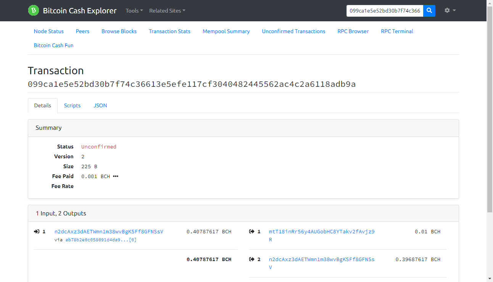

- 测试私钥

```
BTC	n2dcAxz3dAETWmn1m38wvBgKSFf8GFNSsV	cNnc6mXN1ebnqPPGN2BDSgK6UiTAXCfZyo2NpJs1EqRmQULaCd4u
```


- 获取UTXO

```
{
    "txid": "ab78b2e0c058091d4da9c89cebeed86e814b1a9bfd83f11085590bfe8399d02b",
    "vout": 0,
    "address": "bchtest:qrneesv2s349pwtqzmppk0wkw9njw6a4vc4vudpdmr",
    "label": "user",
    "account": "user",
    "scriptPubKey": "76a914e79cc18a846a50b96016c21b3dd67167276bb56688ac",
    "amount": 0.40787617,
    "confirmations": 26041,
    "spendable": false,
    "solvable": false,
    "safe": true
  }

```


- `createrawtransaction`接口文档

```
[root@localhost rpc_shell]# 
[root@localhost rpc_shell]# bchtest help createrawtransaction
createrawtransaction [{"txid":"id","vout":n},...] [{"address":amount},{"data":"hex"},...] ( locktime )

Create a transaction spending the given inputs and creating new outputs.
Outputs can be addresses or data.
Returns hex-encoded raw transaction.
Note that the transaction's inputs are not signed, and
it is not stored in the wallet or transmitted to the network.

Arguments:
1. "inputs"                (array, required) A json array of json objects
     [
       {
         "txid":"id",      (string, required) The transaction id
         "vout":n,         (numeric, required) The output number
         "sequence":n      (numeric, optional) The sequence number
       } 
       ,...
     ]
2. "outputs"               (array, required) a json array with outputs (key-value pairs)
   [
    {
      "address": x.xxx,    (obj, optional) A key-value pair. The key (string) is the bitcoin address, the value (float or string) is the amount in BCH
    },
    {
      "data": "hex"        (obj, optional) A key-value pair. The key must be "data", the value is hex encoded data
    }
    ,...                     More key-value pairs of the above form. For compatibility reasons, a dictionary, which holds the key-value pairs directly, is also
                             accepted as second parameter.
   ]
3. locktime                  (numeric, optional, default=0) Raw locktime. Non-0 value also locktime-activates inputs

Result:
"transaction"              (string) hex string of the transaction

Examples:
> bitcoin-cli createrawtransaction "[{\"txid\":\"myid\",\"vout\":0}]" "[{\"address\":0.01}]"
> bitcoin-cli createrawtransaction "[{\"txid\":\"myid\",\"vout\":0}]" "[{\"data\":\"00010203\"}]"
> curl --user myusername --data-binary '{"jsonrpc": "1.0", "id":"curltest", "method": "createrawtransaction", "params": ["[{\"txid\":\"myid\",\"vout\":0}]", "[{\"address\":0.01}]"] }' -H 'content-type: text/plain;' http://127.0.0.1:8332/
> curl --user myusername --data-binary '{"jsonrpc": "1.0", "id":"curltest", "method": "createrawtransaction", "params": ["[{\"txid\":\"myid\",\"vout\":0}]", "[{\"data\":\"00010203\"}]"] }' -H 'content-type: text/plain;' http://127.0.0.1:8332/

[root@localhost rpc_shell]# 

```


- 创建交易  

```
[root@localhost rpc_shell]# bchtest createrawtransaction "[{\"txid\":\"ab78b2e0c058091d4da9c89cebeed86e814b1a9bfd83f11085590bfe8399d02b\",\"vout\":0}]" "[{\"mtT18inRr56y4AUGobHC8YTakv2fAvjz9R\":0.01},{\"n2dcAxz3dAETWmn1m38wvBgKSFf8GFNSsV\":0.39687617}]"
02000000012bd09983fe0b598510f183fd9b1a4b816ed8eeeb9cc8a94d1d0958c0e0b278ab0000000000ffffffff0240420f00000000001976a9148dda575f1524741e28b595270552fb42115fa7ba88acc1955d02000000001976a914e79cc18a846a50b96016c21b3dd67167276bb56688ac00000000
[root@localhost rpc_shell]# 
[root@localhost rpc_shell]# 


```


- signrawtransactionwithkey接口文档

```
[root@localhost rpc_shell]# bchtest help signrawtransactionwithkey
signrawtransactionwithkey "hexstring" ["privatekey1",...] ( [{"txid":"id","vout":n,"scriptPubKey":"hex","redeemScript":"hex"},...] sighashtype )

Sign inputs for raw transaction (serialized, hex-encoded).
The second argument is an array of base58-encoded private
keys that will be the only keys used to sign the transaction.
The third optional argument (may be null) is an array of previous transaction outputs that
this transaction depends on but may not yet be in the block chain.

Arguments:
1. "hexstring"                      (string, required) The transaction hex string
2. "privkeys"                       (string, required) A json array of base58-encoded private keys for signing
    [                               (json array of strings)
      "privatekey"                  (string) private key in base58-encoding
      ,...
    ]
3. "prevtxs"                        (string, optional) An json array of previous dependent transaction outputs
     [                              (json array of json objects, or 'null' if none provided)
       {
         "txid":"id",               (string, required) The transaction id
         "vout":n,                  (numeric, required) The output number
         "scriptPubKey": "hex",     (string, required) script key
         "redeemScript": "hex",     (string, required for P2SH) redeem script
         "amount": value            (numeric, required) The amount spent
       }
       ,...
    ]
4. "sighashtype"                    (string, optional, default=ALL) The signature hash type. Must be one of
       "ALL|FORKID"
       "NONE|FORKID"
       "SINGLE|FORKID"
       "ALL|FORKID|ANYONECANPAY"
       "NONE|FORKID|ANYONECANPAY"
       "SINGLE|FORKID|ANYONECANPAY"

Result:
{
  "hex" : "value",                  (string) The hex-encoded raw transaction with signature(s)
  "complete" : true|false,          (boolean) If the transaction has a complete set of signatures
  "errors" : [                      (json array of objects) Script verification errors (if there are any)
    {
      "txid" : "hash",              (string) The hash of the referenced, previous transaction
      "vout" : n,                   (numeric) The index of the output to spent and used as input
      "scriptSig" : "hex",          (string) The hex-encoded signature script
      "sequence" : n,               (numeric) Script sequence number
      "error" : "text"              (string) Verification or signing error related to the input
    }
    ,...
  ]
}

Examples:
> bitcoin-cli signrawtransactionwithkey "myhex"
> curl --user myusername --data-binary '{"jsonrpc": "1.0", "id":"curltest", "method": "signrawtransactionwithkey", "params": ["myhex"] }' -H 'content-type: text/plain;' http://127.0.0.1:8332/

[root@localhost rpc_shell]# 

```


- 签名交易

```
[root@localhost rpc_shell]# 
[root@localhost rpc_shell]# 
[root@localhost rpc_shell]# bchtest signrawtransactionwithkey   02000000012bd09983fe0b598510f183fd9b1a4b816ed8eeeb9cc8a94d1d0958c0e0b278ab0000000000ffffffff0240420f00000000001976a9148dda575f1524741e28b595270552fb42115fa7ba88acc1955d02000000001976a914e79cc18a846a50b96016c21b3dd67167276bb56688ac00000000   "[\"cNnc6mXN1ebnqPPGN2BDSgK6UiTAXCfZyo2NpJs1EqRmQULaCd4u\"]"  "[{\"txid\":\"ab78b2e0c058091d4da9c89cebeed86e814b1a9bfd83f11085590bfe8399d02b\",\"vout\":0,\"scriptPubKey\": \"76a914e79cc18a846a50b96016c21b3dd67167276bb56688ac\",\"amount\":0.40787617}]"
{
  "hex": "02000000012bd09983fe0b598510f183fd9b1a4b816ed8eeeb9cc8a94d1d0958c0e0b278ab000000006a47304402203d03b6fb13db15d78f0a748b46f2d66a7615e7b211aab9623e85374473db9d7c0220340f0ff8a75e9614834dcc3b0a851f025518329371974b69ea39e29f4f43c99a412103f5587de88a406fe4d0eab9a84689f958fa65d2d680ed9b98164801c8e0967634ffffffff0240420f00000000001976a9148dda575f1524741e28b595270552fb42115fa7ba88acc1955d02000000001976a914e79cc18a846a50b96016c21b3dd67167276bb56688ac00000000",
  "complete": true
}
[root@localhost rpc_shell]# 
[root@localhost rpc_shell]# 


```


- 交易广播

```

[root@localhost rpc_shell]# 
[root@localhost rpc_shell]# 
[root@localhost rpc_shell]# bchtest sendrawtransaction 02000000012bd09983fe0b598510f183fd9b1a4b816ed8eeeb9cc8a94d1d0958c0e0b278ab000000006a47304402203d03b6fb13db15d78f0a748b46f2d66a7615e7b211aab9623e85374473db9d7c0220340f0ff8a75e9614834dcc3b0a851f025518329371974b69ea39e29f4f43c99a412103f5587de88a406fe4d0eab9a84689f958fa65d2d680ed9b98164801c8e0967634ffffffff0240420f00000000001976a9148dda575f1524741e28b595270552fb42115fa7ba88acc1955d02000000001976a914e79cc18a846a50b96016c21b3dd67167276bb56688ac00000000
099ca1e5e52bd30b7f74c36613e5efe117cf3040482445562ac4c2a6118adb9a
[root@localhost rpc_shell]# 
[root@localhost rpc_shell]# 

```


- 交易查询

```
[root@localhost rpc_shell]# bchtest getrawtransaction 099ca1e5e52bd30b7f74c36613e5efe117cf3040482445562ac4c2a6118adb9a true
{
  "txid": "099ca1e5e52bd30b7f74c36613e5efe117cf3040482445562ac4c2a6118adb9a",
  "hash": "099ca1e5e52bd30b7f74c36613e5efe117cf3040482445562ac4c2a6118adb9a",
  "version": 2,
  "size": 225,
  "locktime": 0,
  "vin": [
    {
      "txid": "ab78b2e0c058091d4da9c89cebeed86e814b1a9bfd83f11085590bfe8399d02b",
      "vout": 0,
      "scriptSig": {
        "asm": "304402203d03b6fb13db15d78f0a748b46f2d66a7615e7b211aab9623e85374473db9d7c0220340f0ff8a75e9614834dcc3b0a851f025518329371974b69ea39e29f4f43c99a[ALL|FORKID] 03f5587de88a406fe4d0eab9a84689f958fa65d2d680ed9b98164801c8e0967634",
        "hex": "47304402203d03b6fb13db15d78f0a748b46f2d66a7615e7b211aab9623e85374473db9d7c0220340f0ff8a75e9614834dcc3b0a851f025518329371974b69ea39e29f4f43c99a412103f5587de88a406fe4d0eab9a84689f958fa65d2d680ed9b98164801c8e0967634"
      },
      "sequence": 4294967295
    }
  ],
  "vout": [
    {
      "value": 0.01000000,
      "n": 0,
      "scriptPubKey": {
        "asm": "OP_DUP OP_HASH160 8dda575f1524741e28b595270552fb42115fa7ba OP_EQUALVERIFY OP_CHECKSIG",
        "hex": "76a9148dda575f1524741e28b595270552fb42115fa7ba88ac",
        "reqSigs": 1,
        "type": "pubkeyhash",
        "addresses": [
          "bchtest:qzxa546lz5j8g83gkk2jwp2jldppzha8hgkq6atpfm"
        ]
      }
    },
    {
      "value": 0.39687617,
      "n": 1,
      "scriptPubKey": {
        "asm": "OP_DUP OP_HASH160 e79cc18a846a50b96016c21b3dd67167276bb566 OP_EQUALVERIFY OP_CHECKSIG",
        "hex": "76a914e79cc18a846a50b96016c21b3dd67167276bb56688ac",
        "reqSigs": 1,
        "type": "pubkeyhash",
        "addresses": [
          "bchtest:qrneesv2s349pwtqzmppk0wkw9njw6a4vc4vudpdmr"
        ]
      }
    }
  ],
  "hex": "02000000012bd09983fe0b598510f183fd9b1a4b816ed8eeeb9cc8a94d1d0958c0e0b278ab000000006a47304402203d03b6fb13db15d78f0a748b46f2d66a7615e7b211aab9623e85374473db9d7c0220340f0ff8a75e9614834dcc3b0a851f025518329371974b69ea39e29f4f43c99a412103f5587de88a406fe4d0eab9a84689f958fa65d2d680ed9b98164801c8e0967634ffffffff0240420f00000000001976a9148dda575f1524741e28b595270552fb42115fa7ba88acc1955d02000000001976a914e79cc18a846a50b96016c21b3dd67167276bb56688ac00000000",
  "blockhash": "00000000953c6d5aca85fc3f36aa4acb1321eb366b35e35f499a0c23f6b11dc8",
  "confirmations": 1,
  "time": 1573475656,
  "blocktime": 1573475656
}
[root@localhost rpc_shell]# 


```


 http://testnet.imaginary.cash/tx/099ca1e5e52bd30b7f74c36613e5efe117cf3040482445562ac4c2a6118adb9a 




