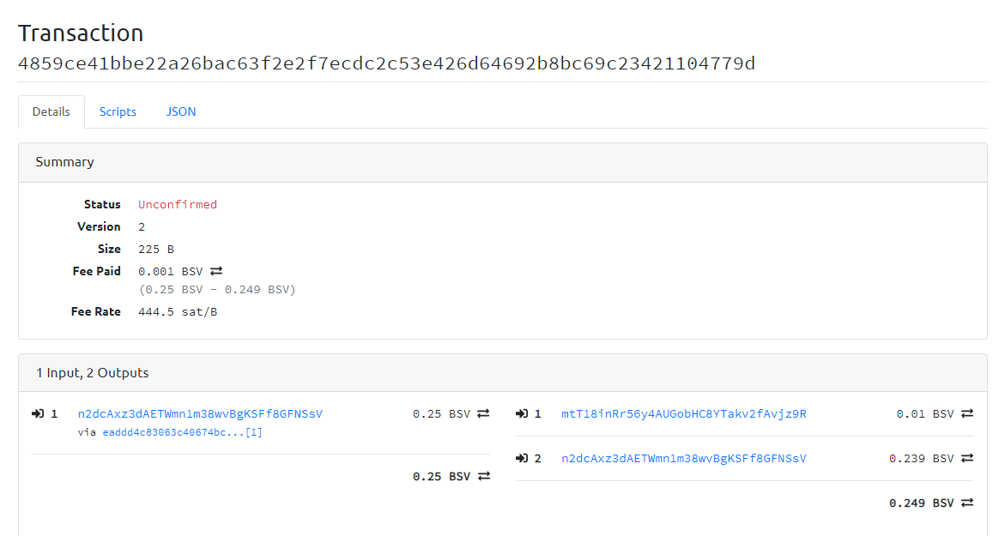

- 测试私钥

```
BTC	n2dcAxz3dAETWmn1m38wvBgKSFf8GFNSsV	cNnc6mXN1ebnqPPGN2BDSgK6UiTAXCfZyo2NpJs1EqRmQULaCd4u
```


- utxo

```
 {
    "txid": "eaddd4c83063c40674bc254da48020c679c817fb16dd50de88271de609bcf4c7",
    "vout": 1,
    "address": "bchtest:qrneesv2s349pwtqzmppk0wkw9njw6a4vc4vudpdmr",
    "account": "user",
    "scriptPubKey": "76a914e79cc18a846a50b96016c21b3dd67167276bb56688ac",
    "amount": 0.25000000,
    "confirmations": 20499,
    "spendable": false,
    "solvable": false,
    "safe": true
  }

```


- createrawtransaction 接口文档

```
[root@localhost rpc_shell]# bsvtest help createrawtransaction
createrawtransaction [{"txid":"id","vout":n},...] {"address":amount,"data":"hex",...} ( locktime )

Create a transaction spending the given inputs and creating new outputs.
Outputs can be addresses or data.
Returns hex-encoded raw transaction.
Note that the transaction's inputs are not signed, and
it is not stored in the wallet or transmitted to the network.

Arguments:
1. "inputs"                (array, required) A json array of json objects
     [
       {
         "txid":"id",    (string, required) The transaction id
         "vout":n,         (numeric, required) The output number
         "sequence":n      (numeric, optional) The sequence number
       } 
       ,...
     ]
2. "outputs"               (object, required) a json object with outputs
    {
      "address": x.xxx,    (numeric or string, required) The key is the bitcoin address, the numeric value (can be string) is the BSV amount
      "data": "hex"      (string, required) The key is "data", the value is hex encoded data
      ,...
    }
3. locktime                  (numeric, optional, default=0) Raw locktime. Non-0 value also locktime-activates inputs

Result:
"transaction"              (string) hex string of the transaction

Examples:
> bitcoin-cli createrawtransaction "[{\"txid\":\"myid\",\"vout\":0}]" "{\"address\":0.01}"
> bitcoin-cli createrawtransaction "[{\"txid\":\"myid\",\"vout\":0}]" "{\"data\":\"00010203\"}"
> curl --user myusername --data-binary '{"jsonrpc": "1.0", "id":"curltest", "method": "createrawtransaction", "params": ["[{\"txid\":\"myid\",\"vout\":0}]", "{\"address\":0.01}"] }' -H 'content-type: text/plain;' http://127.0.0.1:8332/
> curl --user myusername --data-binary '{"jsonrpc": "1.0", "id":"curltest", "method": "createrawtransaction", "params": ["[{\"txid\":\"myid\",\"vout\":0}]", "{\"data\":\"00010203\"}"] }' -H 'content-type: text/plain;' http://127.0.0.1:8332/

[root@localhost rpc_shell]# 

```

>  和 bch不同 output是一个 object, 而不是array

- 创建交易

```
[root@localhost rpc_shell]# 
[root@localhost rpc_shell]# bsvtest createrawtransaction "[{\"txid\":\"eaddd4c83063c40674bc254da48020c679c817fb16dd50de88271de609bcf4c7\",\"vout\":1}]" "{\"mtT18inRr56y4AUGobHC8YTakv2fAvjz9R\":0.01,\"n2dcAxz3dAETWmn1m38wvBgKSFf8GFNSsV\":0.239}"
0200000001c7f4bc09e61d2788de50dd16fb17c879c62080a44d25bc7406c46330c8d4ddea0100000000ffffffff0240420f00000000001976a9148dda575f1524741e28b595270552fb42115fa7ba88ac60af6c01000000001976a914e79cc18a846a50b96016c21b3dd67167276bb56688ac00000000
[root@localhost rpc_shell]# 


```


- signrawtransaction 接口文档

```
[root@localhost rpc_shell]# 
[root@localhost rpc_shell]# bsvtest help signrawtransaction
signrawtransaction "hexstring" ( [{"txid":"id","vout":n,"scriptPubKey":"hex","redeemScript":"hex"},...] ["privatekey1",...] sighashtype )

Sign inputs for raw transaction (serialized, hex-encoded).
The second optional argument (may be null) is an array of previous transaction outputs that
this transaction depends on but may not yet be in the block chain.
The third optional argument (may be null) is an array of base58-encoded private
keys that, if given, will be the only keys used to sign the transaction.


Arguments:
1. "hexstring"     (string, required) The transaction hex string
2. "prevtxs"       (string, optional) An json array of previous dependent transaction outputs
     [               (json array of json objects, or 'null' if none provided)
       {
         "txid":"id",             (string, required) The transaction id
         "vout":n,                  (numeric, required) The output number
         "scriptPubKey": "hex",   (string, required) script key
         "redeemScript": "hex",   (string, required for P2SH or P2WSH) redeem script
         "amount": value            (numeric, required) The amount spent
       }
       ,...
    ]
3. "privkeys"     (string, optional) A json array of base58-encoded private keys for signing
    [                  (json array of strings, or 'null' if none provided)
      "privatekey"   (string) private key in base58-encoding
      ,...
    ]
4. "sighashtype"     (string, optional, default=ALL) The signature hash type. Must be one of
       "ALL"
       "NONE"
       "SINGLE"
       "ALL|ANYONECANPAY"
       "NONE|ANYONECANPAY"
       "SINGLE|ANYONECANPAY"
       "ALL|FORKID"
       "NONE|FORKID"
       "SINGLE|FORKID"
       "ALL|FORKID|ANYONECANPAY"
       "NONE|FORKID|ANYONECANPAY"
       "SINGLE|FORKID|ANYONECANPAY"

Result:
{
  "hex" : "value",           (string) The hex-encoded raw transaction with signature(s)
  "complete" : true|false,   (boolean) If the transaction has a complete set of signatures
  "errors" : [                 (json array of objects) Script verification errors (if there are any)
    {
      "txid" : "hash",           (string) The hash of the referenced, previous transaction
      "vout" : n,                (numeric) The index of the output to spent and used as input
      "scriptSig" : "hex",       (string) The hex-encoded signature script
      "sequence" : n,            (numeric) Script sequence number
      "error" : "text"           (string) Verification or signing error related to the input
    }
    ,...
  ]
}

Examples:
> bitcoin-cli signrawtransaction "myhex"
> curl --user myusername --data-binary '{"jsonrpc": "1.0", "id":"curltest", "method": "signrawtransaction", "params": ["myhex"] }' -H 'content-type: text/plain;' http://127.0.0.1:8332/

[root@localhost rpc_shell]# 

```


- 交易签名

> 和 bch不同的是   用的是 signrawtransaction 而不是 signrawtransactionwithkey,  私钥数组是最后一个参数

```

[root@localhost rpc_shell]# bsvtest signrawtransaction   "0200000001c7f4bc09e61d2788de50dd16fb17c879c62080a44d25bc7406c46330c8d4ddea0100000000ffffffff0240420f00000000001976a9148dda575f1524741e28b595270552fb42115fa7ba88ac60af6c01000000001976a914e79cc18a846a50b96016c21b3dd67167276bb56688ac00000000"     "[{\"txid\":\"eaddd4c83063c40674bc254da48020c679c817fb16dd50de88271de609bcf4c7\",\"vout\":1,\"scriptPubKey\": \"76a914e79cc18a846a50b96016c21b3dd67167276bb56688ac\",\"amount\":\"0.25000000\"}]"   "[\"cNnc6mXN1ebnqPPGN2BDSgK6UiTAXCfZyo2NpJs1EqRmQULaCd4u\"]"
{
  "hex": "0200000001c7f4bc09e61d2788de50dd16fb17c879c62080a44d25bc7406c46330c8d4ddea010000006a47304402200e80899440b0d50d00784b2a089fcfc7745e2558fc6b4b94c624707b4aec104e02206ddd18cda2182b897bf54303c6c271484c6d3b29933c15cec4553f7dff101092412103f5587de88a406fe4d0eab9a84689f958fa65d2d680ed9b98164801c8e0967634ffffffff0240420f00000000001976a9148dda575f1524741e28b595270552fb42115fa7ba88ac60af6c01000000001976a914e79cc18a846a50b96016c21b3dd67167276bb56688ac00000000",
  "complete": true
}
[root@localhost rpc_shell]# 


```


- 广播交易

```

[root@localhost rpc_shell]# 
[root@localhost rpc_shell]# bsvtest sendrawtransaction 0200000001c7f4bc09e61d2788de50dd16fb17c879c62080a44d25bc7406c46330c8d4ddea010000006a47304402200e80899440b0d50d00784b2a089fcfc7745e2558fc6b4b94c624707b4aec104e02206ddd18cda2182b897bf54303c6c271484c6d3b29933c15cec4553f7dff101092412103f5587de88a406fe4d0eab9a84689f958fa65d2d680ed9b98164801c8e0967634ffffffff0240420f00000000001976a9148dda575f1524741e28b595270552fb42115fa7ba88ac60af6c01000000001976a914e79cc18a846a50b96016c21b3dd67167276bb56688ac00000000
4859ce41bbe22a26bac63f2e2f7ecdc2c53e426d64692b8bc69c23421104779d
[root@localhost rpc_shell]# 
[root@localhost rpc_shell]# 

```


- 交易查询

```
[root@localhost rpc_shell]# bsvtest getrawtransaction 4859ce41bbe22a26bac63f2e2f7ecdc2c53e426d64692b8bc69c23421104779d true
{
  "hex": "0200000001c7f4bc09e61d2788de50dd16fb17c879c62080a44d25bc7406c46330c8d4ddea010000006a47304402200e80899440b0d50d00784b2a089fcfc7745e2558fc6b4b94c624707b4aec104e02206ddd18cda2182b897bf54303c6c271484c6d3b29933c15cec4553f7dff101092412103f5587de88a406fe4d0eab9a84689f958fa65d2d680ed9b98164801c8e0967634ffffffff0240420f00000000001976a9148dda575f1524741e28b595270552fb42115fa7ba88ac60af6c01000000001976a914e79cc18a846a50b96016c21b3dd67167276bb56688ac00000000",
  "txid": "4859ce41bbe22a26bac63f2e2f7ecdc2c53e426d64692b8bc69c23421104779d",
  "hash": "4859ce41bbe22a26bac63f2e2f7ecdc2c53e426d64692b8bc69c23421104779d",
  "size": 225,
  "version": 2,
  "locktime": 0,
  "vin": [
    {
      "txid": "eaddd4c83063c40674bc254da48020c679c817fb16dd50de88271de609bcf4c7",
      "vout": 1,
      "scriptSig": {
        "asm": "304402200e80899440b0d50d00784b2a089fcfc7745e2558fc6b4b94c624707b4aec104e02206ddd18cda2182b897bf54303c6c271484c6d3b29933c15cec4553f7dff101092[ALL|FORKID] 03f5587de88a406fe4d0eab9a84689f958fa65d2d680ed9b98164801c8e0967634",
        "hex": "47304402200e80899440b0d50d00784b2a089fcfc7745e2558fc6b4b94c624707b4aec104e02206ddd18cda2182b897bf54303c6c271484c6d3b29933c15cec4553f7dff101092412103f5587de88a406fe4d0eab9a84689f958fa65d2d680ed9b98164801c8e0967634"
      },
      "sequence": 4294967295
    }
  ],
  "vout": [
    {
      "value": 0.01000000,
      "n": 0,
      "scriptPubKey": {
        "asm": "OP_DUP OP_HASH160 8dda575f1524741e28b595270552fb42115fa7ba OP_EQUALVERIFY OP_CHECKSIG",
        "hex": "76a9148dda575f1524741e28b595270552fb42115fa7ba88ac",
        "reqSigs": 1,
        "type": "pubkeyhash",
        "addresses": [
          "bchtest:qzxa546lz5j8g83gkk2jwp2jldppzha8hgkq6atpfm"
        ]
      }
    },
    {
      "value": 0.23900000,
      "n": 1,
      "scriptPubKey": {
        "asm": "OP_DUP OP_HASH160 e79cc18a846a50b96016c21b3dd67167276bb566 OP_EQUALVERIFY OP_CHECKSIG",
        "hex": "76a914e79cc18a846a50b96016c21b3dd67167276bb56688ac",
        "reqSigs": 1,
        "type": "pubkeyhash",
        "addresses": [
          "bchtest:qrneesv2s349pwtqzmppk0wkw9njw6a4vc4vudpdmr"
        ]
      }
    }
  ]
}
[root@localhost rpc_shell]# 

```


 https://testnet.bitcoincloud.net/tx/4859ce41bbe22a26bac63f2e2f7ecdc2c53e426d64692b8bc69c23421104779d 





