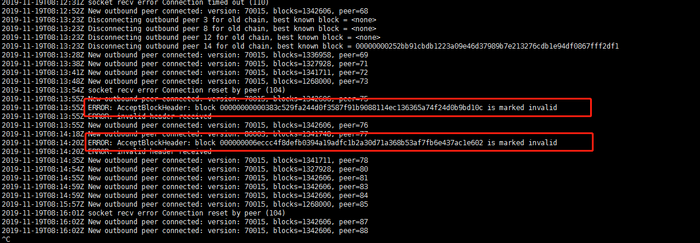

# 硬分叉导致的无效区块处理


- 问题原因

  节点未及时更新, 导致节点不能识别新的区块, 而把新的区块标记为无效区块,  在更新节点程序之后, 节点程序并不会自动修改那个区块的状态, 所以会报错, 而节点同步也被卡住.  





- 处理方法 

  使用reconsiderblock命令重新判断区块, 然后,  再重启节点程序即可

```
bchtest reconsiderblock 000000006eccc4f8defb0394a19adfc1b2a30d71a368b53af7fb6e437ac1e602
```

​	

​	