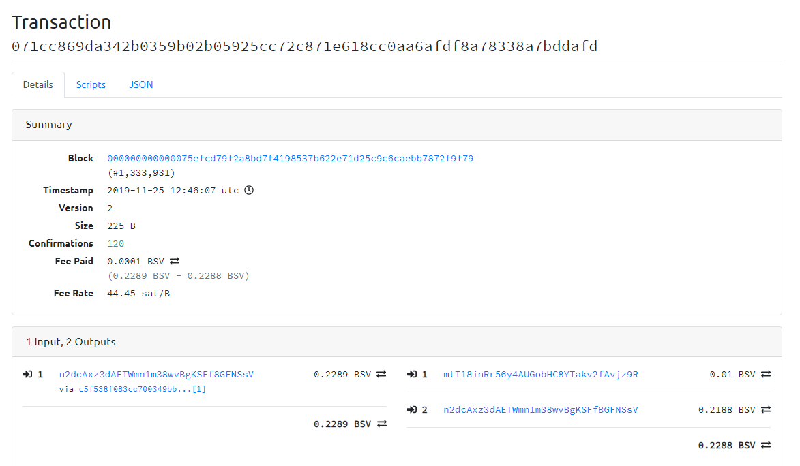

### BSV交易签名的问题


### 尝试使用BCH的RPC签名BSV的交易


- 测试私钥和地址

  ```
  BTC	n2dcAxz3dAETWmn1m38wvBgKSFf8GFNSsV	cNnc6mXN1ebnqPPGN2BDSgK6UiTAXCfZyo2NpJs1EqRmQULaCd4u
  ```

- 获取utxos

  ```
  
  [root@localhost rpc_shell]# bsvtest listunspent 0 99999  "[\"n2dcAxz3dAETWmn1m38wvBgKSFf8GFNSsV\"]"  
  [
    {
      "txid": "c5f538f083cc700349bbd492d04a92ac39360987d804b3da7a6d2a06a0739ce3",
      "vout": 1,
      "address": "bchtest:qrneesv2s349pwtqzmppk0wkw9njw6a4vc4vudpdmr",
      "account": "user",
      "scriptPubKey": "76a914e79cc18a846a50b96016c21b3dd67167276bb56688ac",
      "amount": 0.22890000,
      "confirmations": 2002,
      "spendable": false,
      "solvable": false,
      "safe": true
    }
  ]
  
  ```


- 创建交易

  ```
  bsvtest createrawtransaction "[{\"txid\":\"c5f538f083cc700349bbd492d04a92ac39360987d804b3da7a6d2a06a0739ce3\",\"vout\":1}]" "{\"mtT18inRr56y4AUGobHC8YTakv2fAvjz9R\":0.01,\"n2dcAxz3dAETWmn1m38wvBgKSFf8GFNSsV\":0.2188}"
  
  
  0200000001e39c73a0062a6d7adab304d887093639ac924ad092d4bb490370cc83f038f5c50100000000ffffffff0240420f00000000001976a9148dda575f1524741e28b595270552fb42115fa7ba88acc0dc4d01000000001976a914e79cc18a846a50b96016c21b3dd67167276bb56688ac00000000
  
  
  ```


- 使用bsv节点签名(正常操作)

  ```
  bsvtest signrawtransaction   "0200000001e39c73a0062a6d7adab304d887093639ac924ad092d4bb490370cc83f038f5c50100000000ffffffff0240420f00000000001976a9148dda575f1524741e28b595270552fb42115fa7ba88acc0dc4d01000000001976a914e79cc18a846a50b96016c21b3dd67167276bb56688ac00000000"     "[{\"txid\":\"c5f538f083cc700349bbd492d04a92ac39360987d804b3da7a6d2a06a0739ce3\",\"vout\":1,\"scriptPubKey\": \"76a914e79cc18a846a50b96016c21b3dd67167276bb56688ac\",\"amount\":\"0.22890000\"}]"   "[\"cNnc6mXN1ebnqPPGN2BDSgK6UiTAXCfZyo2NpJs1EqRmQULaCd4u\"]"
  
  
  
  {
    "hex": "0200000001e39c73a0062a6d7adab304d887093639ac924ad092d4bb490370cc83f038f5c5010000006b48304502210087eedc522ee1ca5d0c28ff84c5187a30e0a06b5ba436453b9d6ac881a1cac63302207e17d8b42ec13b93947cef0a86a96a05d77441729b21836fb537a6706213d35d412103f5587de88a406fe4d0eab9a84689f958fa65d2d680ed9b98164801c8e0967634ffffffff0240420f00000000001976a9148dda575f1524741e28b595270552fb42115fa7ba88acc0dc4d01000000001976a914e79cc18a846a50b96016c21b3dd67167276bb56688ac00000000",
    "complete": true
  }
  
  ```

- 使用BCH节点签名BSV交易

  ```
  [root@localhost rpc_shell]# bchtest signrawtransactionwithkey   "0200000001e39c73a0062a6d7adab304d887093639ac924ad092d4bb490370cc83f038f5c50100000000ffffffff0240420f00000000001976a9148dda575f1524741e28b595270552fb42115fa7ba88acc0dc4d01000000001976a914e79cc18a846a50b96016c21b3dd67167276bb56688ac00000000"  "[\"cNnc6mXN1ebnqPPGN2BDSgK6UiTAXCfZyo2NpJs1EqRmQULaCd4u\"]"   "[{\"txid\":\"c5f538f083cc700349bbd492d04a92ac39360987d804b3da7a6d2a06a0739ce3\",\"vout\":1,\"scriptPubKey\": \"76a914e79cc18a846a50b96016c21b3dd67167276bb56688ac\",\"amount\":\"0.22890000\"}]"
  {
    "hex": "0200000001e39c73a0062a6d7adab304d887093639ac924ad092d4bb490370cc83f038f5c5010000006a47304402201318aba5c15996c1424b32ee0cee7816fcf8d86882bc429237c154e655f3d8fd022024ecebe7724f66d6d592b905d6c1f8802dac29998e3538176f7146675f9be835412103f5587de88a406fe4d0eab9a84689f958fa65d2d680ed9b98164801c8e0967634ffffffff0240420f00000000001976a9148dda575f1524741e28b595270552fb42115fa7ba88acc0dc4d01000000001976a914e79cc18a846a50b96016c21b3dd67167276bb56688ac00000000",
    "complete": true
  }
  
  
  ```

  

- 使用 BSV节点解码交易

  ```
  
  //使用 bsv的rpc接口  可以解压
  [root@localhost rpc_shell]# bsvtest decoderawtransaction 0200000001e39c73a0062a6d7adab304d887093639ac924ad092d4bb490370cc83f038f5c5010000006a47304402201318aba5c15996c1424b32ee0cee7816fcf8d86882bc429237c154e655f3d8fd022024ecebe7724f66d6d592b905d6c1f8802dac29998e3538176f7146675f9be835412103f5587de88a406fe4d0eab9a84689f958fa65d2d680ed9b98164801c8e0967634ffffffff0240420f00000000001976a9148dda575f1524741e28b595270552fb42115fa7ba88acc0dc4d01000000001976a914e79cc18a846a50b96016c21b3dd67167276bb56688ac00000000
  {
    "txid": "071cc869da342b0359b02b05925cc72c871e618cc0aa6afdf8a78338a7bddafd",
    "hash": "071cc869da342b0359b02b05925cc72c871e618cc0aa6afdf8a78338a7bddafd",
    "size": 225,
    "version": 2,
    "locktime": 0,
    "vin": [
      {
        "txid": "c5f538f083cc700349bbd492d04a92ac39360987d804b3da7a6d2a06a0739ce3",
        "vout": 1,
        "scriptSig": {
          "asm": "304402201318aba5c15996c1424b32ee0cee7816fcf8d86882bc429237c154e655f3d8fd022024ecebe7724f66d6d592b905d6c1f8802dac29998e3538176f7146675f9be835[ALL|FORKID] 03f5587de88a406fe4d0eab9a84689f958fa65d2d680ed9b98164801c8e0967634",
          "hex": "47304402201318aba5c15996c1424b32ee0cee7816fcf8d86882bc429237c154e655f3d8fd022024ecebe7724f66d6d592b905d6c1f8802dac29998e3538176f7146675f9be835412103f5587de88a406fe4d0eab9a84689f958fa65d2d680ed9b98164801c8e0967634"
        },
        "sequence": 4294967295
      }
    ],
    "vout": [
      {
        "value": 0.01000000,
        "n": 0,
        "scriptPubKey": {
          "asm": "OP_DUP OP_HASH160 8dda575f1524741e28b595270552fb42115fa7ba OP_EQUALVERIFY OP_CHECKSIG",
          "hex": "76a9148dda575f1524741e28b595270552fb42115fa7ba88ac",
          "reqSigs": 1,
          "type": "pubkeyhash",
          "addresses": [
            "bchtest:qzxa546lz5j8g83gkk2jwp2jldppzha8hgkq6atpfm"
          ]
        }
      },
      {
        "value": 0.21880000,
        "n": 1,
        "scriptPubKey": {
          "asm": "OP_DUP OP_HASH160 e79cc18a846a50b96016c21b3dd67167276bb566 OP_EQUALVERIFY OP_CHECKSIG",
          "hex": "76a914e79cc18a846a50b96016c21b3dd67167276bb56688ac",
          "reqSigs": 1,
          "type": "pubkeyhash",
          "addresses": [
            "bchtest:qrneesv2s349pwtqzmppk0wkw9njw6a4vc4vudpdmr"
          ]
        }
      }
    ]
  }
  [root@localhost rpc_shell]# 
  ```

- 使用BSV的广播接口进行广播

  ```
  //使用bsv的广播接口进行广播
  bsvtest sendrawtransaction  0200000001e39c73a0062a6d7adab304d887093639ac924ad092d4bb490370cc83f038f5c5010000006a47304402201318aba5c15996c1424b32ee0cee7816fcf8d86882bc429237c154e655f3d8fd022024ecebe7724f66d6d592b905d6c1f8802dac29998e3538176f7146675f9be835412103f5587de88a406fe4d0eab9a84689f958fa65d2d680ed9b98164801c8e0967634ffffffff0240420f00000000001976a9148dda575f1524741e28b595270552fb42115fa7ba88acc0dc4d01000000001976a914e79cc18a846a50b96016c21b3dd67167276bb56688ac00000000
  
  
  //txid
  071cc869da342b0359b02b05925cc72c871e618cc0aa6afdf8a78338a7bddafd
  
  ```

  

- 获取交易详情

   https://testnet.bitcoincloud.net/tx/071cc869da342b0359b02b05925cc72c871e618cc0aa6afdf8a78338a7bddafd 

  ```
  [root@localhost rpc_shell]# bsvtest getrawtransaction 071cc869da342b0359b02b05925cc72c871e618cc0aa6afdf8a78338a7bddafd true
  {
    "hex": "0200000001e39c73a0062a6d7adab304d887093639ac924ad092d4bb490370cc83f038f5c5010000006a47304402201318aba5c15996c1424b32ee0cee7816fcf8d86882bc429237c154e655f3d8fd022024ecebe7724f66d6d592b905d6c1f8802dac29998e3538176f7146675f9be835412103f5587de88a406fe4d0eab9a84689f958fa65d2d680ed9b98164801c8e0967634ffffffff0240420f00000000001976a9148dda575f1524741e28b595270552fb42115fa7ba88acc0dc4d01000000001976a914e79cc18a846a50b96016c21b3dd67167276bb56688ac00000000",
    "txid": "071cc869da342b0359b02b05925cc72c871e618cc0aa6afdf8a78338a7bddafd",
    "hash": "071cc869da342b0359b02b05925cc72c871e618cc0aa6afdf8a78338a7bddafd",
    "size": 225,
    "version": 2,
    "locktime": 0,
    "vin": [
      {
        "txid": "c5f538f083cc700349bbd492d04a92ac39360987d804b3da7a6d2a06a0739ce3",
        "vout": 1,
        "scriptSig": {
          "asm": "304402201318aba5c15996c1424b32ee0cee7816fcf8d86882bc429237c154e655f3d8fd022024ecebe7724f66d6d592b905d6c1f8802dac29998e3538176f7146675f9be835[ALL|FORKID] 03f5587de88a406fe4d0eab9a84689f958fa65d2d680ed9b98164801c8e0967634",
          "hex": "47304402201318aba5c15996c1424b32ee0cee7816fcf8d86882bc429237c154e655f3d8fd022024ecebe7724f66d6d592b905d6c1f8802dac29998e3538176f7146675f9be835412103f5587de88a406fe4d0eab9a84689f958fa65d2d680ed9b98164801c8e0967634"
        },
        "sequence": 4294967295
      }
    ],
    "vout": [
      {
        "value": 0.01000000,
        "n": 0,
        "scriptPubKey": {
          "asm": "OP_DUP OP_HASH160 8dda575f1524741e28b595270552fb42115fa7ba OP_EQUALVERIFY OP_CHECKSIG",
          "hex": "76a9148dda575f1524741e28b595270552fb42115fa7ba88ac",
          "reqSigs": 1,
          "type": "pubkeyhash",
          "addresses": [
            "bchtest:qzxa546lz5j8g83gkk2jwp2jldppzha8hgkq6atpfm"
          ]
        }
      },
      {
        "value": 0.21880000,
        "n": 1,
        "scriptPubKey": {
          "asm": "OP_DUP OP_HASH160 e79cc18a846a50b96016c21b3dd67167276bb566 OP_EQUALVERIFY OP_CHECKSIG",
          "hex": "76a914e79cc18a846a50b96016c21b3dd67167276bb56688ac",
          "reqSigs": 1,
          "type": "pubkeyhash",
          "addresses": [
            "bchtest:qrneesv2s349pwtqzmppk0wkw9njw6a4vc4vudpdmr"
          ]
        }
      }
    ],
    "blockhash": "000000000000075efcd79f2a8bd7f4198537b622e71d25c9c6caebb7872f9f79",
    "confirmations": 3,
    "time": 1574685967,
    "blocktime": 1574685967
  }
  
  ```





