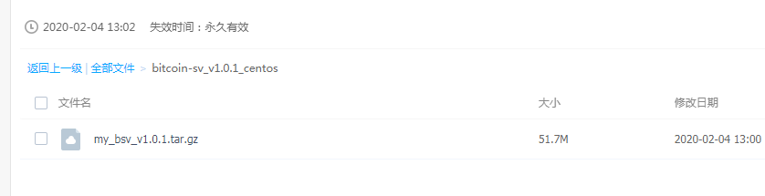
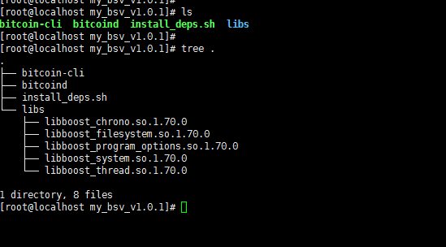

## 编译好的可执行文件`bitcoin-cli` 和 `bitcoind`


- 下载:  https://pan.baidu.com/s/1dcb2CB7D_tTlaJe2cEUtfg

  

  

- 修改配置文件, 添加一下配置:

  ```
  maxstackmemoryusageconsensus=200000000
  excessiveblocksize=2000000000
  ```

---


## CentOS 7 编译bitcoin-sv的步骤

参考: https://github.com/bitcoin-sv/bitcoin-sv/blob/master/doc/build-unix.md


## 安装相关依赖

```
yum update

yum install  dnf

# 安装依赖
sudo dnf install gcc-c++ libtool make autoconf automake openssl-devel libevent-devel  libdb-devel libdb-cxx-devel


# 支持 C++17
sudo yum install centos-release-scl
sudo yum install devtoolset-7-gcc*
scl enable devtoolset-7 bash


```


### 编译boost 1.70.0

```


wget https://dl.bintray.com/boostorg/release/1.70.0/source/boost_1_70_0.tar.gz

tar xzvf boost_1_70_0.tar.gz

./bootstrap.sh

./b2 install

```


### 编译bitcoin-sv

```

wget https://github.com/bitcoin-sv/bitcoin-sv/archive/v1.0.1.tar.gz

./autogen.sh

./configure --enable-cxx --disable-shared --with-pic

make
```


