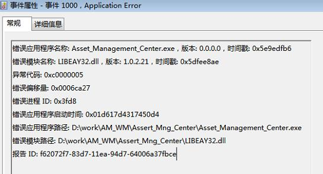

错误事件




QT编译选项添加了 `/EHa`  即使用 C++异常机制 和 SEH异常机制(Windows系统特有)  ,  关于 SEH (Structure Exception Handler)的详细信息可以参考 <<Windows核心编程>> 第23~25章

```
win* {
QMAKE_CXXFLAGS_EXCEPTIONS_ON = /EHa
QMAKE_CXXFLAGS_STL_ON = /EHa
}
```


- 本程序代码中

  ```cpp
  char *pszTmp = NULL;
  try{
     strcpy(pszTmp, "hello");
  }
  catch(...){
     qDebug() << QString("exception occured") ;
  }
  ```

  可以捕获异常


- 动态库中的异常

  ```cpp
  ---------
  int myadd(int a, int b)
  {
      char *pszTmp = NULL;
      strcpy(pszTmp, "hello");
      return a + b;
  }
  
  ---------
  
  char *pszTmp = NULL;
  try{
     int sum = myadd(10, 100);  //通过动态库方式调用myadd
  }
  catch(...){
     qDebug() << QString("exception occured") ;
  }
  ```

  可以捕获动态库中的异常

- 其他线程中的异常

  ```cpp
  
  void MyTestFunc()
  {
      char *pszTmp = NULL;
      strcpy(pszTmp, "hello");
  }
  --------
  
  try
  {
    	std::thread  thrd( MyTestFunc  );
     	thrd.join();
  }
  catch(...)
  {
    qDebug() << QString("exception occured") ;
  }
  ```

  不能捕获


#### 总结

经过定位,  引发异常的代码在其他线程中 , 在 QNetworkReply 实现类中的SSL加解密函数中,  具体代码未知暂时没有时间去分析.

