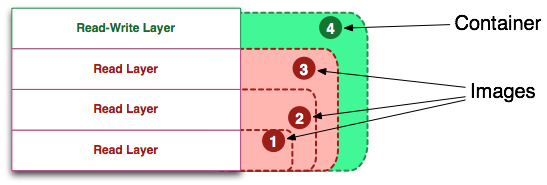
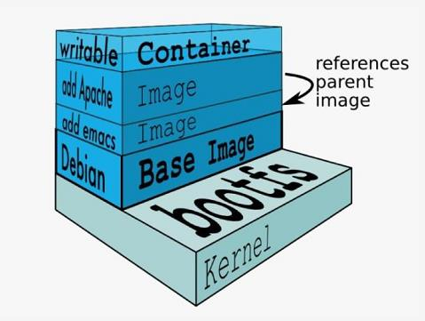
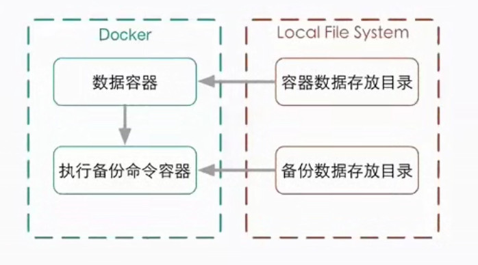
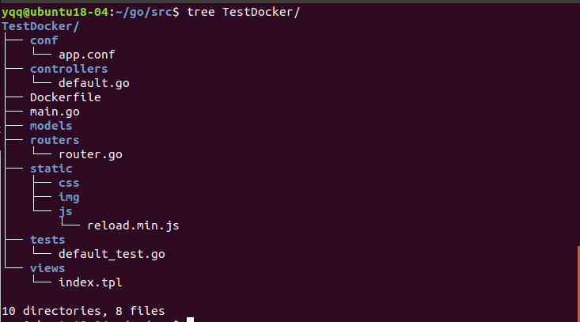
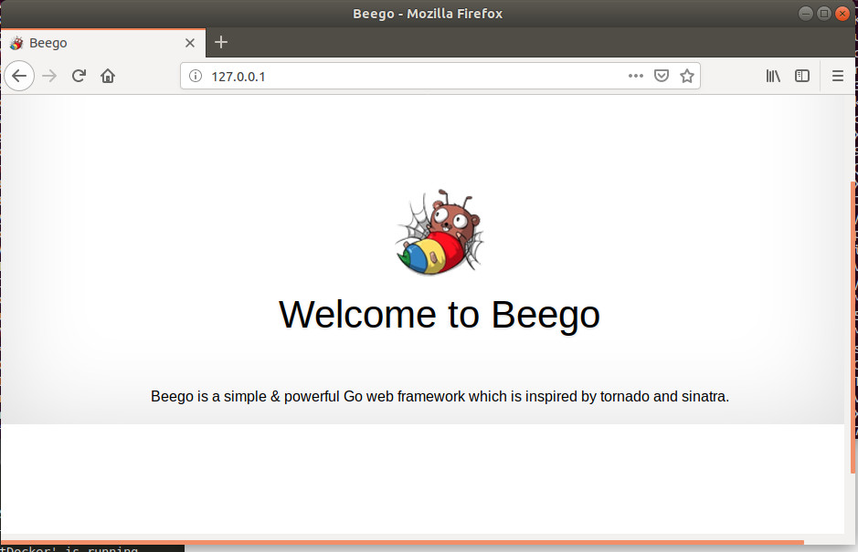
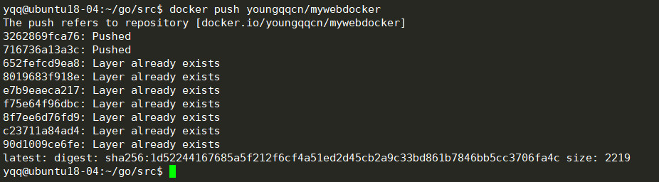
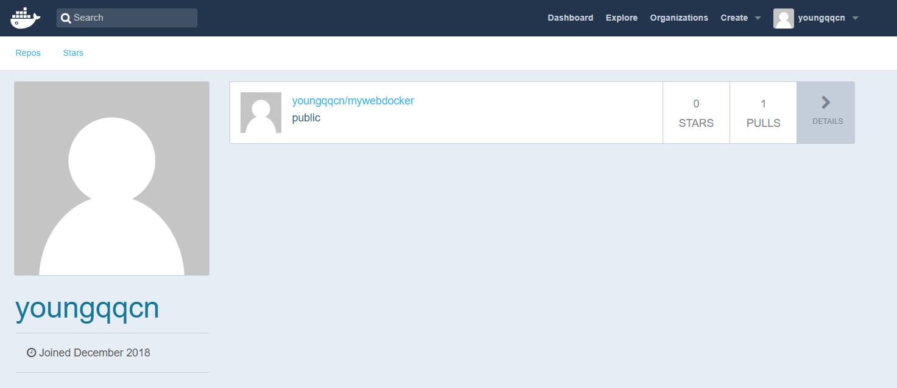
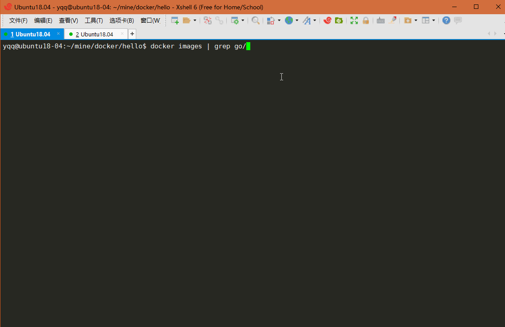

# Docker学习笔记

## Docker分层结构理解(核心)

一个docker镜像有多个**可读镜像层**组成, 然后运行的容器会在这个docker镜像上面加上一层**可写容器层**, 任何的对文件的更改都只存在此容器层.因此任何对容器的操作均不会影响到镜像.

如果想保存修改过的容器层, 生成一个新的镜像可以使用 `docker commit`命令进行提交.



至于容器如何获取镜像层文件而又不影响到是镜像层的呢？docker是这样实现的？
如果需要获取某个文件，那么容器曾会从上到下去下一层的镜像层去获取文件，如果该层文件不存在，那么就会去下一镜像层去寻找，直到最后一层。对于用户而言，用户面向的是一个叠加后的文件系统。

而任何对于文件的操作都会记录在容器层，例如说修改文件，容器层会把在镜像层找到的文件拷贝到容器层然后进行修改，删除文件则会在容器层内记录删除文件的记录。



分层结构的优点:

- 基本上每个软件都是基于某个镜像去运行的，因此一旦某个底层环境出了问题，就不需要去修改全部基于该镜像的软件的镜像，只需要修改底层环境的镜像.

- 这个好处也是最大好处，就是可以**共享资源**，其他相同环境的软件镜像都共同去享用同一个环境镜像，而不需要每个软件镜像要去创建一个底层环境.


> 本节引自: https://www.cnblogs.com/s-b-b/p/8533936.html


## Docker的基本组成


- Docker客户端 /守护进程
C/S架构
本地/远程

- Docker镜像


- Docker容器
- Docker Registry  仓库
    公有
    私有
- Docker Hub


## Docker优点

Docker容器的能力
- 文件系统隔离:每个容器都有自己的root文件系统
- 进程隔离:每个容器都运行在自己的进程环境中
- 网络隔离:容器间的虚拟网络接口和IP地址都是分开的
- 资源隔离和分组:使用 groups将CPU和内存之类的资源独立分配给每个
Docker容器

## Docker安装和配置

 #### Ubuntu安装

```
uname -a   //查看linux内核
```

### 添加用户组
```
sudo groupadd docker
sudo gpasswd -a ${USER} docker
sudo service docker restart
newgrp - docker
重新登录即可, 就不用使用sudo了
```

## 容器的基本操作

#### 启动容器

```
docker run IMAGE [COMMAND][ARG...]
例如:
docker run ubuntu echo "hello docker"  //如果本地没有Ubuntu镜像, 会从docker hub中拉取
```

#### 启动交互式容器

```
docker run -i -t IMAGE  /bin/bash
-i        --interactive=true|fase   默认是false
-t      --tty=true|false 默认是false
例如:

```


#### 查看docker容器

```
docker  -ps   //查看正在运行的容器
docker -ps -a //查看所有容器
docker inspect   容器id或者容器名字    //查看容器信息

```


#### 重新启动停止的容器

```
docker start -i   
```

#### 删除已经停止的容器

```
docker rm  容器id
```


#### 守护式容器

- 方法一
```
docker run -i -t IMAGE  /bin/bash       //使用  ctrl+p 和 ctrl+q 退出交互式容器
docker attach  容器id      //重新进入, 守护式容器
```

- 方法二
```
docker run -d ubuntu /bin/bash     //以守护进程方式运行命令, 命令运行完了,就退出了
```


#### 查看容器日志

```
docker logs [-f][-t][--tail]  容器名  

例如:
  docker logs -tf  --tail 0 66002527b240
```


#### 查看运行中的容器内部进程情况

```
docker top  容器id
```

#### 在运行中的容器内启动新进程

```
docker exce [-d][-i][-t]  容器id或者容器名字  [COMMAND][ARG...]

例如:

 docker exec -i -t 66002527b240 /bin/bash
 然后退出
 用docker top 查看即可
```


#### 停止运行容器

```
docker stop   //发送结束信号, 等待容器运行结束, 并返回容器id
docker kill   //直接杀死, 并返回容器id
```


#### Docker帮助文档

```
man docker-run
man docker-logs
...
```

## Docker镜像操作

#### 查看docker镜像

```
docker images
docker images --no-trunk
```


#### 查看image的详细信息
```
docker inspect  imageID

```


#### 删除镜像

```
docker rmi  imageID .....
```


```
docker search [OPTION] TERM
--automated
-s  制定star的数量
```


#### 拉取镜像
```
docker pull
```

#### 推送镜像
```
docker push
```

###构建镜像(重点掌握)

- docker commit 通过容器构建

```
docker commit [OPTION] CONSTAINER [REPOSITORY[:TAG]]
- a, author=""   
-m, --message=""  
-p, --pause=true   Pause contanier during commit
```

例如:
```
docker ps -a   //查看所有容器, 找到修改过的容器对应的id
docker commit -a "yqq" -m "ubuntu-with-vim" ca06b5a473ae ubuntu_with_vim  //创建镜像

```

实际例子, 在Ubuntu镜像中安装了一些软件, 作为以后自己的开发环境
```
root@88063c36274a:/mine/go# exit   //退出容器
exit
yqq@ubuntu18-04:~$
yqq@ubuntu18-04:~$
yqq@ubuntu18-04:~$ docker ps -a  //查看所有容器
CONTAINER ID        IMAGE               COMMAND                  CREATED             STATUS                     PORTS                  NAMES
88063c36274a        aliyun_ubuntu       "/bin/bash"              20 minutes ago      Exited (0) 8 seconds ago                          trusting_edison
56bbd50e13b5        nginx               "nginx -g 'daemon of…"   2 hours ago         Up 2 hours                 0.0.0.0:8080->80/tcp   epic_wing
yqq@ubuntu18-04:~$
yqq@ubuntu18-04:~$
yqq@ubuntu18-04:~$ docker commit -a "yqq" -m "installed golang python g++" 88063c36274a my_dev_ubuntu      //提交刚才修改过的容器, 生成镜像   
sha256:58978f24808959effa333e86a0c9163b7c1bd1c98f74dd5fb5c6d004408b35c8
yqq@ubuntu18-04:~$ docker images   //查看所有镜像
REPOSITORY          TAG                 IMAGE ID            CREATED             SIZE
my_dev_ubuntu       latest              58978f248089        6 seconds ago       688MB
aliyun_ubuntu       latest              05a713fa81c4        23 minutes ago      204MB
ubuntu_test_test    latest              d27f050e1bc0        About an hour ago   86.2MB
nginx               latest              568c4670fa80        12 days ago         109MB
ubuntu              18.04               93fd78260bd1        2 weeks ago         86.2MB
ubuntu              latest              93fd78260bd1        2 weeks ago         86.2MB
centos              centos7.1.1503      000733bc1a76        2 months ago        212MB
yqq@ubuntu18-04:~$
yqq@ubuntu18-04:~$
yqq@ubuntu18-04:~$
yqq@ubuntu18-04:~$ docker run -i -t my_dev_ubuntu /bin/bash    //运行刚才的镜像
root@bab9fb62deb4:/# g++    //安装了g++
g++: fatal error: no input files
compilation terminated.
root@bab9fb62deb4:/# gcc  //安装了gcc
gcc: fatal error: no input files
compilation terminated.
root@bab9fb62deb4:/# python    //安装了python
Python 2.7.15rc1 (default, Nov 12 2018, 14:31:15)
[GCC 7.3.0] on linux2
Type "help", "copyright", "credits" or "license" for more information.
>>>

```


- docker build  通过Dockerfile文件创建


### 运行一个docker镜像

```
docker run  -d -p 8080:80 nginx  //运行成功后 访问 http://localhost:8080 就可以看到Nginx的欢迎界面
```


### 使用Dockerfile构建镜像
```
docker build  
```

### Docker的CS模式

docker的客户端与服务端通过  socket进行通信

unix
tcp
fd


### Docker 守护进程的配置和操作

-  使用 service命令管理
```
 sudo service docker start
 sudo service docker stop
 sudo service docker restart
```

### Docker远程访问
```
1.修改服务器和客户端  -H 选项的值  为 tcp
2.export DOCKER_HOST="tcp://xxxxxxxxx:端口"  (端口一般是2375)   //这种方式也可以让
```


## Dockerfile指令

- `FROM <image>   ` 指定基础镜像
- `MAINTAINER`  指定维护者信息
- `RUN <COMMAND>`  shell模式    , 每个RUN指令, 都会在上一个镜像上创建一个镜像
- `RUN [] ` exec模式
-` EXPOSE`  指定镜像暴露端口号, 在使用时需要手动开启端口(端口映射)
- `CMD []`   exec模式, 在容器启动时运行相应的命令
- `CMD command param1 param2` shell模式, 如果run时指定了命令, 则会覆盖dockerfile中的命令
- `ENTRYPOINT[]`
- `ENTRYPOINT `
- `ADD`   包含了类似tar的解压功能
- `COPY` 如果单纯复制文件, 推荐使用COPY
- `VOLUME`  添加卷
- `WORKDIR `  设置工作目录(一般使用绝对路径)
- `ENV`  设置环境变量
- `USER` 指定以哪个用户身份运行
- `ONBUILD` 镜像触发器(本次构建不会执行, 被子镜像依赖时, 在子镜像构建时会执行)


## Docker的构建过程
- 从基础镜像运行一个容器
- 执行一天命令, 对容器做出修改
- 执行类似docker commit的操作, 提交一个新的镜像层
- 再基于刚提交的镜像运行一个新容器
- 执行Dockerfile中的下一条指令, ......, 直至所有指令执行完毕.


会删除中间层容器, 但未删除中间层创建的镜像, 因此可以查看中间层镜像, 这样就可以调试.


## Docker构建缓存

- 不是使用构建缓存 `docker build --no-cache` , 也可以修改 ENV设置的缓存时间

- `docker history` 查看镜像构建过程


## Docker容器的网络基础

docker0  虚拟网桥(链路层)

linux网桥  
- 可以设置ip


## Docker容器与外部容器的网络连接

- ip_forward

- iptables

## Docker容器的数据管理

### Docker容器的数据卷

1.什么是数据卷:
- 数据卷独立于联合文件系统, 镜像基于联合文件系统
- 数据卷存在宿主机中, Docker数据卷和Docker的生命周期分离的

2.数据卷(Data Volume)的特点
- 数据卷在容器启动时初始化,如果容器使用的镜像在挂载点包含了数据,这些
- 数据会拷贝到新初始化的数据卷中。
- 数据卷可以在容器之间共享和重用
- 可以对数据卷里的内容直接进行修改
- 数据卷的变化不会影响镜像的更新
- 卷会一直存在,即使挂载数据卷的容器已经被删除

```
docker run -it -v ~/datavolume:/data --name dvt1 ubuntu /bin/bash   //可写可读
docker run -it -v ~/datavolume:/data:ro --name dvt1 ubuntu /bin/bash //只读

VOLUME  //指定的数据卷,每个镜像启动后都不一样
```
- Docker的数据卷容器

注意:  数据卷容器只是起到"数据卷配置参数"的传递作用!!(即,删除了数据卷容器, 新建的容器依然可以访问数据卷)

docker run --volumes-from

实际操练
```
#1.编译Dockerfile, 如下
FROM ubuntu
VOLUME ["/datavolume1", "/datavolume2"]
CMD /bin/bash

# 构建镜像
docker build -t dvtest .

# 启动镜像
docker run -it --name dv1 dvtest  /bin/bash

# 在数据卷中创建文件
echo "hello docker" > datavolume1/hello.txt
exit //退出

# 启动dv2  , 共享dv1的数据卷
docker run -it --volumes-from dv1 --name dv2 ubuntu /bin/bash  
cat datavolume1/hello.txt  //查看文件

# ok

```


## Docker数据卷的备份和还原 - 数据备份
```
docker run --volumes-from dv1 -v ~/backup:/backup --name dv4 ubuntu tar cvf /backup/dv4.tar /datavolume1
```




数据还原和数据备份一样(解压缩)


## Docker容器通过网桥实现跨主机链接


# 实战: 使用Docker部署Go Web项目

- 环境: Ubuntu18.04  Docker  
- Web框架:  Beego

## 步骤1:新建Web项目

在Ubuntu中使用 `bee new TestDocker`命令新建一个Beego项目TestDocker, 进入TestDocker目录, 并使用bee run运行TestDocker项目, 如果没有报错就可以访问http://127.0.0.1:8080了. 如果需要安装一些依赖库, 自行安装即可.




## 步骤2:编写Dockerfile

因为网速慢, 所以`go get` 获取GitHub上的相关依赖库速度很慢, 这里我将Web依赖的库和项目文件全部打包到docker镜像中. 而其他依赖也在$GOPATH/src下, 所以在 src目录进行docker镜像的构建. Dockerfile内容如下:

```Dockerfile
FROM golang                    #基于golang官方镜像
MAINTAINER yqq youngqq@163.com #作者信息
COPY .  /go/src/               #src下的所有文件(包括项目依赖的库)复制到镜像的/go/src
WORKDIR /go/src/TestDocker     #指定工作目录, 后面的指令都是基于这个目录
RUN go build                   
EXPOSE 8080                    #设置开放端口
CMD ["./TestDocker"]           #镜像启动时执行的命令, 即运行TestDocker可执行文件
```


## 步骤3:构建镜像

运行`docker build -t youngqqcn/mywebdocker .`构建镜像, 输出结果如下:

```shell
yqq@ubuntu18-04:~/go/src$ docker build -t youngqqcn/mywebdocker .
Sending build context to Docker daemon   69.4MB
Step 1/7 : FROM golang            //建议:提前拉取golang的官方镜像
 ---> df6ac9d1bf64
Step 2/7 : MAINTAINER yqq youngqqcn@163.com
 ---> Using cache
 ---> 7f8b7d632edf
Step 3/7 : COPY ./ /go/src/
 ---> Using cache
 ---> 33572e6d5736
Step 4/7 : WORKDIR /go/src/TestDocker
 ---> Using cache
 ---> dd9afe323dbe
Step 5/7 : RUN go build
 ---> Using cache
 ---> ca29ccd5cc11
Step 6/7 : EXPOSE 8080
 ---> Using cache
 ---> 2e809f083db5
Step 7/7 : CMD ["./TestDocker"]
 ---> Using cache
 ---> 1b4f5ffaf4f0
Successfully built 1b4f5ffaf4f0
Successfully tagged youngqqcn/mywebdocker:latest
```


运行 `docker images` 查看所有的镜像, 可以看到youngqqcn/mywebdocker已经构建成功.

```shell
yqq@ubuntu18-04:~/go/src$ docker images
REPOSITORY          TAG                 IMAGE ID            CREATED             SIZE
youngqqcn/mywebdocker         latest              1b4f5ffaf4f0        29 minutes ago      861MB
```


##步骤4:运行镜像验证部署结果

```shell
docker run -it --name mygoweb -p 80:8080 -d youngqqcn/mywebdocker
```

- -i 以交互模式运行容器，通常与 -t 同时使用；

- -t 为容器重新分配一个伪输入终端，通常与 -i 同时使用；

- -p 端口映射，格式为：主机(宿主)端口:容器端口, 如上命令, 将宿主的80端口与容器的8080端口映射
- -d 以守护进程方式(后台)运行


使用浏览器查看本机(宿主机) http://127.0.0.1 , 结果如下图




## 步骤5 : 将镜像推送的Docker hub

- 使用`sudo docker login`命令, 登录docker

```shell
yqq@ubuntu18-04:~$ sudo docker login
Login with your Docker ID to push and pull images from Docker Hub. If you don't have a Docker ID, head over to https://hub.docker.com to create one.
Username: youngqqcn                  //注意这里是dockerid, 不是邮箱
Password: 

Login Succeeded
yqq@ubuntu18-04:~$ 

```


- 使用 `docker tag`命令修改标签

  ```shell
  docker tag youngqqcn/mywebdocker youngqqcn/mywebdocker
  ```

- 使用`docker push`命令上传镜像, 如果出现`denied: requested access to the resource is denied`的错误, 请再次登录账户. 如果上传ok, 就会出现如下界面:

```
yqq@ubuntu18-04:~/go/src$ docker push youngqqcn/mywebdocker
The push refers to repository [docker.io/youngqqcn/mywebdocker]
3262869fca76: Pushing [=======>                                           ]  2.755MB/18.17MB
716736a13a3c: Pushing [==>                                                ]  3.807MB/68.59MB
652fefcd9ea8: Layer already exists 
8019683f918e: Layer already exists 
e7b9eaeca217: Layer already exists 
f75e64f96dbc: Layer already exists 
8f7ee6d76fd9: Layer already exists 
c23711a84ad4: Layer already exists 
90d1009ce6fe: Layer already exists 
```

> 从上面可以清晰地看出Docker的镜像分层结构, 上层的镜像层建立在底层的镜像层之上.

上传成功:






# Docker镜像优化

- 减小镜像大小有两种方法,:

  - 使用链式指令: 在Docker中,每条指令都会创建一个镜像层, 如果将多条命令合成一条那么就会减少中间层. 即将多条指令通过"&&"和"\\"合成一条 , 并在当前层清理上一层环境, 可以参考: http://www.dockerinfo.net/3328.html

  - 分离编译镜像和部署镜像

    docker镜像的另一类无用文件就是编译过程中的依赖文件，例如在编译过程中应用到的依赖的源代码库，如编译文件和头文件。一旦应用程序编译完毕，这些文件就不再用到了。例如: 将程序编译成可执行文件之后复制到镜像中并添加运行依赖即可.(二进制镜像)  , 参考:(https://www.jianshu.com/p/3e2127616e28)

    优化效果

    

    > 注意: 如果进入build目录, 执行ls命令可能会发生"段错误", 是因为ls使用了build目录中的动态库.
    >
    >  scratch 使用: http://cloud.51cto.com/art/201412/462603.htm

