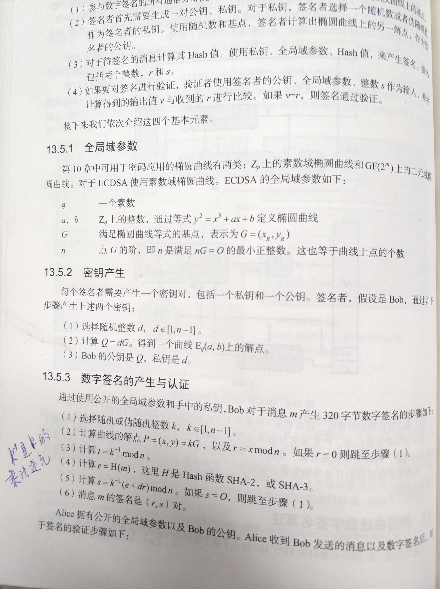
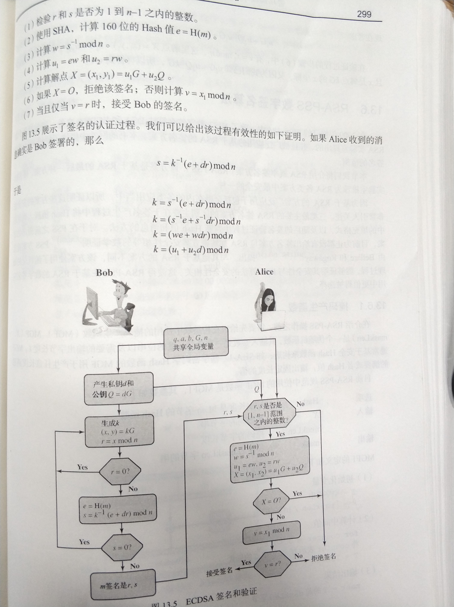
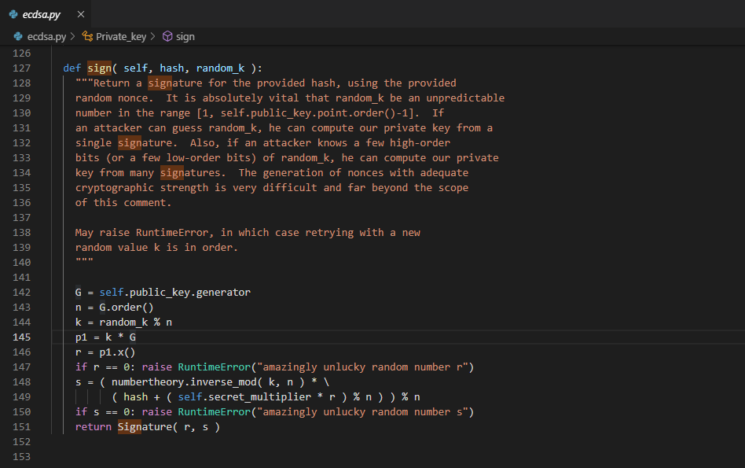

# ECDSA签名算法

- 维基百科 https://en.wikipedia.org/wiki/Elliptic_Curve_Digital_Signature_Algorithm#Signature_generation_algorithm

- 《密码编码学与网络安全——原理与实践》（第七版） William Stallings 著   王后珍  李莉  杜瑞颖 等译  P298-P299

- ECDSA签名算法的python的实现

### 需要注意的几点

- `k`是随机数，如果采用了其他不同的随机算法生成了不同的k, 最后的签名结果也会不一样
- `r`值跟`k`值相关,  `s`值则跟  `e` , `k^-1`, `d`相关
- 有些地方对签名结果 `r` 和`s`要求较高 ,  如EOS的签名必须满足 `r[0] & 0x80 == 0`  并且 `s[0] && 0x80 == 0`  , 这里的`r[0]`, `s[0]`是大端的第0个字节.

