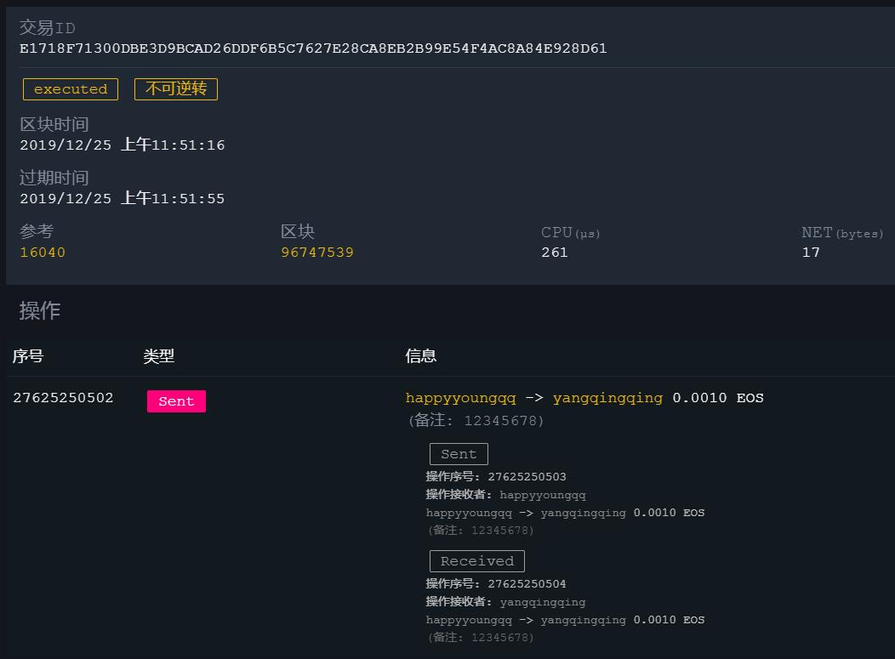

# EOS对接文档

## 技术预研

### 参考文档

- EOS官方技术白皮书:https://github.com/EOSIO/Documentation/blob/master/zh-CN/TechnicalWhitePaper.md

- https://github.com/eosnewyork/eospy
- 一些公共开放API的节点:  https://www.eosdocs.io/resources/apiendpoints/


### 几个关键的问题

#### 1.用户充币地址如何离线生成?

- 离线生成私钥和公钥, 最好生成两对公私钥对, 一个作为`active`, 一个作为`owner` 
- 在线创建账户时, 指定  `owner`和`active`的公钥即可
- `owner`和`active`权限管理说明:
  - `owner`:代表账户的所有权, 可以做所有的操作(包括转账), 可以进行权限设置, 管理`active`和其他角色
  - `active`:用于日常使用, 如转账, 投票等


#### 2.是否需要搭建交易所的全节点? 如何搭建?

##### 2.1 自己搭建节点

- 安全, 不依赖第三方
- 成本高, 需要维护EOS节点
- 如果能快速同步区块数据, 最好自己搭建节点.
- 从短期来看维护一个EOS节点, 成本(人力,物力)过高;  从长远角度来看, 部署EOS节点是必须的.
- 如果后期需要对接EOS上的DAPP或代币, 自己部署独立的EOS节点也是必须的.

##### 2.2 使用公共的节点 (短期方案)

- 可以使用公共的开放节点的节点获取区块信息(充币监测), 交易广播

- 第三方节点能够查询多少天以前的区块数据?

```python
>>>(95919439.0 -  94420000.0 ) / (3600.0 * 24.0 * 2 ) 
8.67730902
```

> 注意事项: 使用第三方的公共节点, 需要注意公共节点的安全性, 可用性.
>
> - 安全性: 交易数据造假?
> - 可用性: 节点宕机? 网络延时是否严重? 是否有限频? 


##### 2.3 使用服务商的API

使用服务商的API, 可以减少部署和维护EOS全节点的成本(人力, 物力)

- [dfuse](https://www.dfuse.io/zh/)

- [blockdog](https://www.blockdog.com/)

  ```
  免费版API密钥：940dd99f-f68d-4d88-8b8e-fe7b05562ce3
  ```

  

#### 3.用户充币如何扫描检测? 需要注意哪些问题?

- 通过`/v1/chain/get_block`获取区块信息


扫描算法

- 算法A:  只扫不可逆区块, 每个区块都扫
  - 缺点: 频率太高, 可能被第三方公共节点限制频率; 浪费很多资源
  - 优点: 不会遗漏充值
- 算法B: 只扫不可逆区块, 按一个周期查询账户的余额, 对比上一个周期的余额, 如果余额没有变化, 则直接更新已扫区块高度;  若余额有变化, 则扫描这个周期内的所有的区块获取充币交易, 然后再更新已扫区块高度.
  - 可能存在的问题
    -  如果一个周期内减少的金额(转出)和增加的金额(充币)一样, 导致总的金额没有变化, 那么就会漏掉一些充值交易.
    - 如果周期过大, 一次需要扫描的区块过多, 因为网络原因或其他原因, (总是)在中途失败, 那么就会导致"卡死"在某个区块高度, 无法扫到最新区块, 造成充币不到账的问题.


> 算法B 相对于 算法A, 平均请求次数减少约99%


防止假充值, 需要注意的问题:

- 只扫描不可逆区块

- 需要验证 `action.account` , `actions.data.to`, `actions.data.quantity`

- 必须判断交易的状态, 即`transactions.status` 必须为 `'executed'`, 防止 `hard-failed`的交易


#### 4.如何转账(离线签名)?

服务端可以使用`eospy`库,  离线端(C++)实现对"交易序列化后的Hash"进行签名.

##### 在线获取

- `ref_block_num` : 取 `last_irreversible_block_num & 0xFFFF` , 即截止当前为止最新的一个不可逆区块的高度的低16位

- `ref_block_prefix`: 获取区块高度为`last_irreversible_block_num` 的区块内容中的`ref_block_prefix`字段


##### 离线签名

创建交易, 交易序列化, 等前期的工作由服务端完成,  离线端只负责对交易序列化后的hash进行签名.


#### 5. 关于EOS资源模型

参考文档

- https://www.jianshu.com/p/6b507c9dac66

- https://www.jianshu.com/p/9c9cb374fa00
- http://www.shixiaohou.com/9146.html
- https://baijiahao.baidu.com/s?id=1621644525841099171&wfr=spider&for=pc

- http://baijiahao.baidu.com/s?id=1605043373377670832&wfr=spider&for=pc
- CPU的消耗情况:  https://www.jianshu.com/p/140d17861313


各种资源说明

- CPU 和 NET: 
  - 代表每个用户一段时间内能消耗的资源量. 
  - 用户通过抵押EOS来换取CPU或NET资源, 获取的CPU或NET资源数量是跟随市场实时价格上下波动的. 如果涨价,那么现在你的可用资源就会减少; 如果降价, 那么现在你的可用资源就会增多. 
  - 每笔交易都会占用CPU的时间(以ms为单位),  越复杂的交易类型占用的CPU时间就越长.
  - 消耗的资源24小时后会自动恢复(每小时恢复1/24).
  - 可以通过增加抵押的EOS数量, 来换取更多的资源
- RAM: 
  - 将数据存储在区块链上, 需要消耗RAM, DAPP需要用到RAM. (类似ETH合约中的状态)
  - 普通转账
  - 创建新账户会消耗 4KB
  - 和 CPU/NET 不同,  RAM是可以自由买(抵押)卖(赎回)的, 价格由市场决定.  可以低买高卖.
  - 买卖RAM会收取 0.5% 的手续费


普通EOS转账(带短memo)消耗的资源

- 实际交易: https://eosflare.io/tx/E1718F71300DBE3D9BCAD26DDF6B5C7627E28CA8EB2B99E54F4AC8A84E928D61
- CPU消耗约  250us ~ 600us
- NET消耗约  15 bytes ~  50 bytes
- 不消耗RAM

