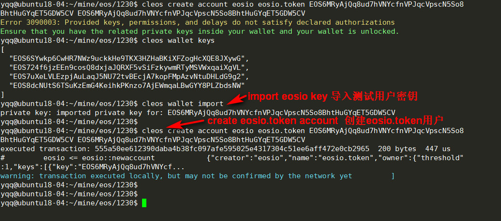
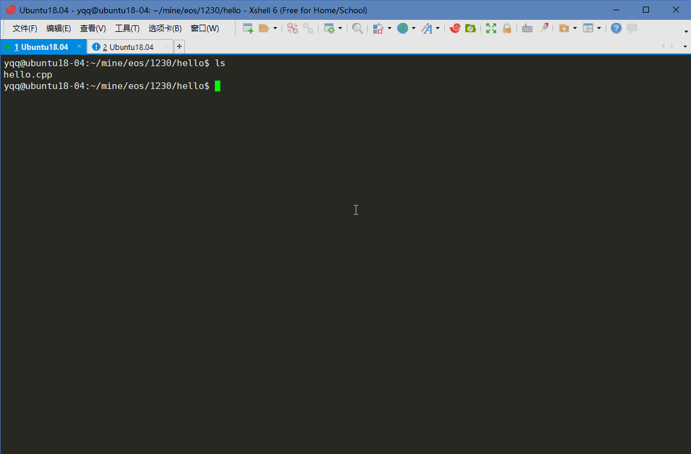
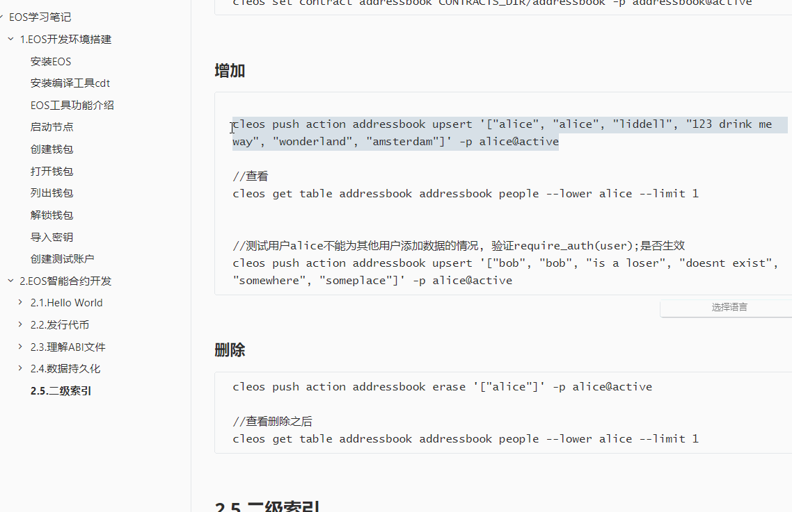

# EOS学习笔记

[TOC]


> 参考文档:  https://www.twle.cn/c/yufei/eosio/eosio-basic-contract.html


## 1.EOS开发环境搭建

### 安装EOS

-  直接下载deb安装即可:  https://github.com/EOSIO/eos/releases

  ```
  wget https://github.com/eosio/eos/releases/download/v1.5.2/eosio_1.5.2-1-ubuntu-18.04_amd64.deb
  sudo apt install ./eosio_1.5.2-1-ubuntu-18.04_amd64.deb
  ```


### 安装编译工具cdt

- 直接下载deb安装即可: https://github.com/EOSIO/eosio.cdt/releases
- `sudo dpkg -i deb包名`安装deb包
- 使用  `eosio-cpp --version`检查是否安装成功

> 注意: 如果是用虚拟机的, 至少需要CPU核数为2(大于1即可), 否则使用eosio-cpp进行编译, 会一直卡死, 智能Ctrl+C中断, 而且不会生成ABI文件.

### EOS工具功能介绍

- nodeos : EOS节点工具, EOS核心程序

- cleos : 客户端
- keosd: 钱包密钥管理工具

- eosio-cpp: 智能合约编译工具, 将C++编译为WASM并生成ABI


### 启动节点

```
nodeos -e -p eosio --plugin eosio::chain_api_plugin --plugin eosio::history_api_plugin --contracts-console

```

>  如果出现错误: `throw database dirty flag set` , 加上`--delete-all-blocks`即可解决


### 创建钱包

```
cleos wallet create -n yqq -f eospass.txt
```

记录钱包密码(解锁和交易都需要用到):

```
PW5HpgpPxyhshPoiqzecwkUN829zBKw7m4wgqEmAdGKG2YBy3PxU4
```


### 打开钱包

```
cleos wallet open
```


### 列出钱包

```
cleos wallet list
```


### 解锁钱包

```
cleos wallet unlock
```


### 导入密钥

```
cleos create key --to-console   //创建密钥对
cleos wallet import   //导入创建出来的密钥
```

注意: 记得导入以下超级账号, 用于测试

eosio public key: `EOS6MRyAjQq8ud7hVNYcfnVPJqcVpscN5So8BhtHuGYqET5GDW5CV`
eosio private key: `5KQwrPbwdL6PhXujxW37FSSQZ1JiwsST4cqQzDeyXtP79zkvFD3`




### 创建测试账户

- 列出当前钱包密钥对 `cleos wallet private_keys`

  ```
   [[
      "EOS6SYwkp6CwHR7NWz9uckkHe9TKX3HZHaBKiXFZogHcXQE8JXywG",
      "5K8KtTwMarCCZnNY6XTp8WBvSSSJx1jMqLzLweYcDkDs56UDmdg"
    ],[
      "EOS724f6jzEEn9cosQ8dxjaJQRXF5vSiFzkywmRTyMSVWxqaiXgVL",
      "5KMq5XogpYSGED2dBES9nnG5qa1xMqDPN5cqdfwfkeAHgTmzmkB"
    ],[
      "EOS7uXeLVLEzpjAuLaqJ5NU72tvBEcjA7kopFMpAzvNtuDHLdG9g2",
      "5J7iz8Umnx8Y4URqduKqeou7GHM6G2MrS85buTDEEU8WnE9CqZr"
    ],[
      "EOS8dcNUtS6TSuKzEmG4KeihkPKnzo7AjEWmqaLBwGYY8PLZbdsNW",
      "5K1EwcNAHQ2tbRcXGHHn9nJDxxnNPAhaYT1f8SKS9fNPccfBFgV"
    ]
  ]
  ```

- 创建eosio.token账户, 指定创建者是eosio(管理员账户)

  ```
  cleos create account eosio eosio.token EOS6MRyAjQq8ud7hVNYcfnVPJqcVpscN5So8BhtHuGYqET5GDW5CV EOS6MRyAjQq8ud7hVNYcfnVPJqcVpscN5So8BhtHuGYqET5GDW5CV
  
  ```

- 创建hello账户

  ```
  cleos create account eosio hello EOS6MRyAjQq8ud7hVNYcfnVPJqcVpscN5So8BhtHuGYqET5GDW5CV EOS6MRyAjQq8ud7hVNYcfnVPJqcVpscN5So8BhtHuGYqET5GDW5CV
  ```

- 创建hi账户

  ```
  cleos create account eosio hi EOS6MRyAjQq8ud7hVNYcfnVPJqcVpscN5So8BhtHuGYqET5GDW5CV EOS6MRyAjQq8ud7hVNYcfnVPJqcVpscN5So8BhtHuGYqET5GDW5CV
  ```


## 2.EOS智能合约开发

>  参考: https://developers.eos.io/eosio-home/docs/

### 2.1.Hello World

#### 编写合约

hello.cpp

```c++
#include <eosiolib/eosio.hpp>
#include <eosiolib/print.hpp>

using namespace eosio;

class hello : public contract {
  public:
      using contract::contract;

      [[eosio::action]]
      void hi() {
         print("Hello World");
      }
};
EOSIO_DISPATCH( hello, (hi))
```

#### 编译合约

```
eosio-cpp -o hello.wasm hello.cpp --abigen
```

#### 部署合约

```
cleos set contract hello ../hello -p 
```

#### 运行合约

```
cleos push action hello hi '[]' -p hello@active
```

如果没有看到 ">> Hello world" ,  需要重新启动nodeos,  在启动选项中加入`--contracts-console`, 注意: 启动之后需要重新创建测试用户!!!


> 如果nodeos 重启了, 必须重新创建测试账号!! 否则也会报错: 
>
> yqq@ubuntu18-04:~/mine/eos/1230/hello$ cleos set contract hello ../hello -p 
> Failed to get existing code hash, continue without duplicate check...
> Reading WASM from /home/yqq/mine/eos/1230/hello/hello.wasm...
> Publishing contract...
> Error 3090003: Provided keys, permissions, and delays do not satisfy declared authorizations
> Ensure that you have the related private keys inside your wallet and your wallet is unlocked.

#### 运行效果演示



### 2.2.发行代币

#### 下载测试代码

```
git clone https://github.com/EOSIO/eosio.contracts --branch v1.4.0 --single-branch
cd eosio.contracts/eosio.token
```

#### 创建测试账户

```
cleos create account eosio eosio.token EOS6MRyAjQq8ud7hVNYcfnVPJqcVpscN5So8BhtHuGYqET5GDW5CV
```

#### 编译智能合约

```
eosio-cpp -I include -o eosio.token.wasm src/eosio.token.cpp --abigen
```

#### 部署代币智能合约

```
cleos set contract eosio.token CONTRACTS_DIR/eosio.contracts/eosio.token --abi eosio.token.abi -p eosio.token@active


结果:
Reading WASM from ...
Publishing contract...
executed transaction: 69c68b1bd5d61a0cc146b11e89e11f02527f24e4b240731c4003ad1dc0c87c2c  9696 bytes  6290 us
#         eosio <= eosio::setcode               {"account":"eosio.token","vmtype":0,"vmversion":0,"code":"0061736d0100000001aa011c60037f7e7f0060047f...
#         eosio <= eosio::setabi                {"account":"eosio.token","abi":"0e656f73696f3a3a6162692f312e30000605636c6f73650002056f776e6572046e61...
warning: transaction executed locally, but may not be confirmed by the network yet         ]
```


#### 创建代币

调用create接口创建代币, create函数, 第2个参数有两部分组成: 最大发行数量 + 代币名

```c++
void token::create( name   issuer ,  //发行者
                    asset  maximum_supply )   //最大发行数量+代币名
```

```
cleos push action eosio.token create '[ "eosio", "1000000000.0000 SYS"]' -p eosio.token@active

//-p  指定权限和创建者
```

这样就创建了一个名为 `SYS`代币.


#### 发行代币

调用合约eosio.token中的issue方法, 发行代币

```
cleos push action eosio.token issue '[ "alice", "100.0000 SYS", "memo" ]' -p eosio@active       
//如果没有账户alice, 会报Eorror 3050003错误
//创建一个alice即可,注意指定eosio为创建者
```

运行结果:

```
yqq@ubuntu18-04:~/mine/eos/eosio.contracts/eosio.token$ cleos push action eosio.token issue '[ "alice", "100.0000 SYS", "memo" ]' -p eosio@active
executed transaction: 6384bc6e9f1c8e61f045a1475dcdd5abc8bd5fe749e0b295953f961df4242943  128 bytes  509 us
#   eosio.token <= eosio.token::issue           {"to":"alice","quantity":"100.0000 SYS","memo":"memo"}
#   eosio.token <= eosio.token::transfer        {"from":"eosio","to":"alice","quantity":"100.0000 SYS","memo":"memo"}
#         eosio <= eosio.token::transfer        {"from":"eosio","to":"alice","quantity":"100.0000 SYS","memo":"memo"}
#         alice <= eosio.token::transfer        {"from":"eosio","to":"alice","quantity":"100.0000 SYS","memo":"memo"}
warning: transaction executed l
ocally, but may not be confirmed by the network yet         ] 
```

可以看到有几个不同动作: 1个issue和3个transfer, 虽然我们提交的操作只有issue, 但是这一个issue其实是以一个"inline transfer"来执行的, 并且会通知发送者和接收者.有时候eosio.token会跳过"inline transfer" 而直接修改账户余额.


#### 转账

调用transfer方法进行转账

```
cleos push action eosio.token transfer '[ "alice", "bob", "25.0000 SYS", "m" ]' -p alice@active   
//如果没有bob账户, 先创建bob账户


//查看转账后, bob的余额
cleos get currency balance eosio.token bob SYS
//输出: 25.00 SYS

//查看alice的余额
cleos get currency balance eosio.token alice SYS
//输出: 75.00 SYS
```


#### 代码分析

EOS使用多索引表存储合约数据


### 2.3.理解ABI文件

Application Binary Interface (ABI) 是一个用于描述智能合约的Json文件.ABI文件描述了数据库的状态转换.你可以使用ABI描述你的智能合约, 其他开发人员和用户也可以使用Json语你的智能合约交互.

> 执行交易时会绕过ABI文件, 消息和动作的传递不必按照ABI进行, ABI这是一个指导性的文件.


#### 一个ABI文件结构

```
{
   "version": "eosio::abi/1.0",
   "types": [],
   "structs": [],
   "actions": [],
   "tables": [],
   "ricardian_clauses": [],
   "abi_extensions": [],
   "___comment" : ""
}
```


#### types

用于描述作为public函数参数的自定义类型. 或者用于作为需要在ABI文件说明的结构体成员的自定义类型.

#### structs

用于描述public函数或者结构体;  name是参数名或者结构体字段名 ;Fields用于描述函数参数 或者 结构体成员.

#### actions

描述public函数

#### tables

表结构体, 类似传统关系型数据库的表.

```
{
  "name": "",       //The name of the table, determined during instantiation. 
  "type": "", 			//The table's corresponding struct, 关联的结构体
  "index_type": "", //The type of primary index of this table
  "key_names" : [], //An array of key names, length must equal length of key_types member
  "key_types" : []  //An array of key types that correspond to key names array member, length of array must equal length of key names array.
}
```


### 2.4.数据持久化

对table的增删改查

#### 编写合约

```c++
#include <eosiolib/eosio.hpp>

using namespace eosio;

class [[eosio::contract]] addressbook : public eosio::contract {  //使用辅助属性，让ABI生成器提取参数信息和结构体信息

	public:
		using contract::contract;
		addressbook(name receiver, name code, datastream<const char*> ds):contract(receiver, code, ds){}


		[[eosio::action]]   //使用辅助属性，让ABI生成器提取参数信息和结构体信息
		void upsert(name user, std::string first_name, std::string last_name, std::string street, std::string city, std::string state)
		{
			require_auth(user);

			address_index addresses(_code, _code.value);

			auto iterator = addresses.find(user.value);

			if(iterator == addresses.end())
			{
				//如果用户不存在， 则创建用户
				addresses.emplace(user, [&](auto &row){
						row.key = user;
						row.first_name = first_name;
						row.last_name = last_name;
						row.street = street;
						row.city = city;
						row.state = state;
						});
			}
			else
			{
				//如果用户已经存在则修改信息
				//std::string changes;
				addresses.modify(iterator, user, [&]( auto& row ) {
						row.key = user;
						row.first_name = first_name;
						row.last_name = last_name;
						row.street = street;
						row.city = city;
						row.state = state;
						});
			}
		}


		[[eosio::action]]   //使用辅助属性，让ABI生成器提取参数信息和结构体信息
		void erase(name user)//删除用户
		{
			require_auth(user);
			address_index addresses(_self, _code.value);
			auto iterator = addresses.find(user.value);
			eosio_assert(iterator != addresses.end(), "要删除的数据不存在");
			addresses.erase(iterator);
		}

	private: 
  
		//struct person;
		struct [[eosio::table]] person{ //使用辅助属性，让ABI生成器提取参数信息和结构体信息
			name key;
			std::string first_name;
			std::string last_name;
			std::string street;
			std::string city;
			std::string state;

			uint64_t primary_key() const{return key.value;}
		};

		typedef eosio::multi_index<"people"_n, person> address_index;

};


//这个宏定义是给wasm编译器用的，用来将一个调用与合约中的具体函数关联映射起来
EOSIO_DISPATCH(addressbook, (upsert)(erase))
```


#### 编译部署

```
eosio-cpp -o addressbook.wasm addressbook.cpp --abigen
cleos create account eosio addressbook YOUR_PUBLIC_KEY YOUR_PUBLIC_KEY -p eosio@active    //创建测试账户,  YOUR_PUBLIC_KEY是 eosio的公钥

cleos set contract addressbook CONTRACTS_DIR/addressbook -p addressbook@active
```


#### 增加

```

cleos push action addressbook upsert '["alice", "alice", "liddell", "123 drink me way", "wonderland", "amsterdam"]' -p alice@active

//查看
cleos get table addressbook addressbook people --lower alice --limit 1


//测试用户alice不能为其他用户添加数据的情况, 验证require_auth(user);是否生效
cleos push action addressbook upsert '["bob", "bob", "is a loser", "doesnt exist", "somewhere", "someplace"]' -p alice@active
```


#### 删除

```
cleos push action addressbook erase '["alice"]' -p alice@active

//查看删除之后
cleos get table addressbook addressbook people --lower alice --limit 1
```


运行效果




### 2.5.二级索引

> 参考: https://developers.eos.io/eosio-home/docs/secondary-indices


