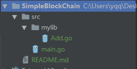

# Go知识点复习

## 1.关于包的使用和GOPATH的配置

- src:用于以代码包的形式组织并保存Go源码文件, 需要手动创建
- pkg目录：用于存放经由go install命令构建安装后的代码包（包含Go库源码文件）的“.a”归档文件
- bin目录：与pkg目录类似，在通过go install命令完成安装后，保存由Go命令源码文件生成的可执行文件



```go
//Add.go
package mylib

func Add(a, b int) (ret int)  {
	ret = a + b
	return ret
}
```

```go
//main.go
package main

import (
	"mylib"
	"fmt"
)
func main() {
	fmt.Println( mylib.Add(10, 10) )
}
```

环境变量配置

```go
GOPATH=C:\Users\yqq\Desktop\QBlockChainNotes\Go语言\Go语言编写比特币\SimpleBlockChain
GOBIN=$GOPATH\bin
```

关于`go run ` , `go build` , `go install` 命令

- `go run`是直接编译执行, 不会生成exe文件
- `go build` 用于编译测试, 检查是否有错误
- `go install`第一步编译导入的包文件, 放到pkg目录下; 第二步编译主程序生成可执行文件.


# go语言实现区块链

### 1.挖矿原理

```go
package main

import (
	"crypto/sha256"
	"strconv"
	"fmt"
	"time"
)

func main()  {

	startTime := time.Now()
	time.Sleep(3 * time.Second)
	for i := 0; i <100000000000000000; i++{

		data := sha256.Sum256([]byte(strconv.Itoa(i)))
		fmt.Printf("%10d, %x\n", i, data)
		if string(data[len(data) -  2 : ]) == "00"{   
			fmt.Printf("挖矿成功, 耗时%f 秒\n", time.Since(startTime).Seconds())
			break
		}
	}
}
```


### 2.PoW工作量证明实现

通过调整nonce是Hash值小于设定的某个值, 类似 000000xxxxxx...xxxx, 如下:

```
000000aece8f5d530b8b3c24e80dc7d8c55db4fc131e315f73e14699000c9373
```

```go
//挖矿核心代码
func (pow *ProofOfWork)Run() (int, []byte ){

	var hashInt big.Int
	var hash [32]byte
	nonce := 0

    //通过调整变化 nonce是 当前区块的hash值小于设定的一个值
	for nonce < maxNonce{
        data := pow.prepareData(nonce) //准备数据(由各种信息拼接在一起, nonce是可变的)
		hash = sha256.Sum256(data) //计算出hash
		fmt.Printf("\r%x", hash)

		hashInt.SetBytes(hash[:]) //获取要对比的数据

		//找一个数(data的hash值) : 小于  1 << (256-targetBits)
		if hashInt.Cmp(pow.target) == -1{
			break
		}else{
			nonce ++
		}
	}

	fmt.Println("\n\n")
	return  nonce, hash[:]   
}
```

