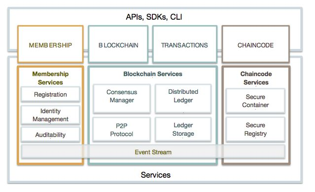
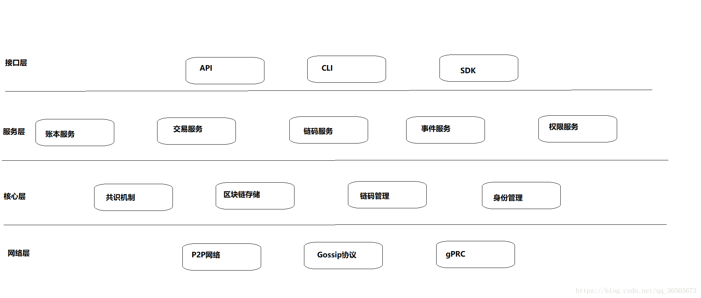
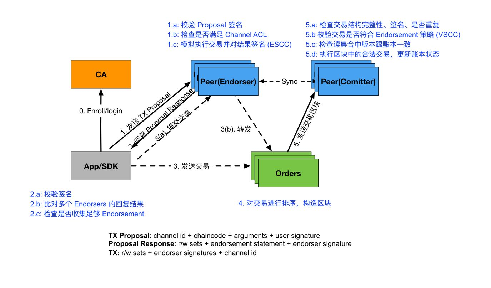
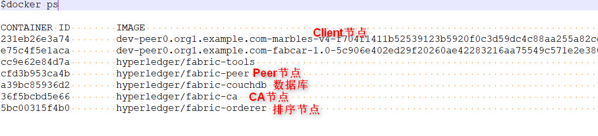
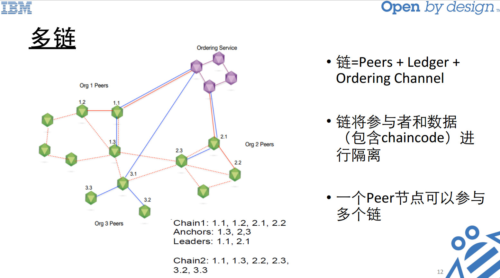
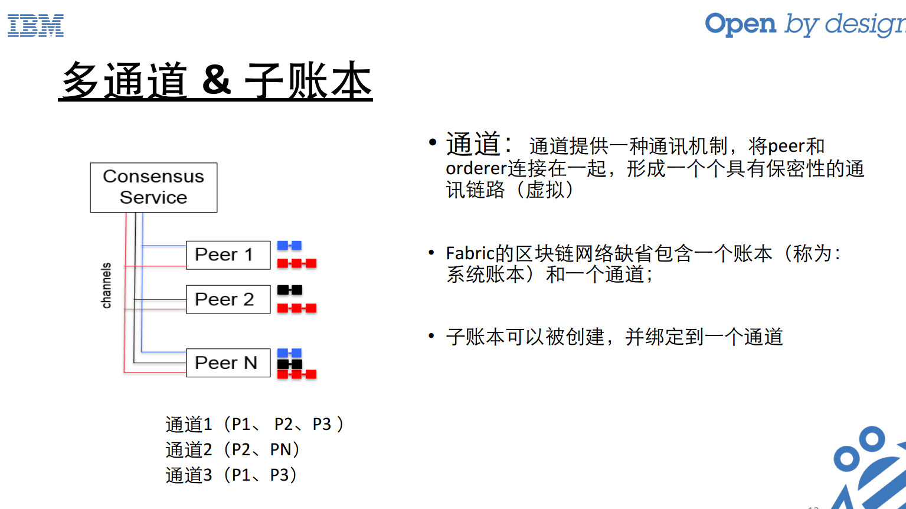

### Fabric架构图

### Fabric架构分层图

### Fabric交易流程

### Fabric节点类型

节点(Peer)是区块链的通信主体，是逻辑概念。节点之间通过gRPC消息进行通信

- CA节点: 给用户颁发注册证书

- Client节点：也就是应用程序，它必须连接到一个peer节点或者排序服务节点才能与区块链网络进行通信.他有两大职责：操作Fabric网络；操作运行在网络中的链码。需要具有submitter的能力

- Peer节点：
  - Endorser(背书节点):  动态的，根据背书策略选择，它们负责对交易和提案进行检查和背书然后发送各自的response给客户端 .
  - Committer(记账节点,或称确认节点）: 所有的Peer节点都是记账节点，负责对排序服务节点传过来的区块进行各种验证然后写入账本，更改数据库.

- Oderer节点(排序节点,或称共识节点)：接收有背书签名的交易，进行排序生成区块，**广播**给所有记账节点（peer节点）. 一个区块含有多个交易. kafka集群实现交易排序的功能. Orderer支持多通道，彼此相互隔离. 它不需要知道交易的内容，提高安全性隐私性. 目前支持Solo(单节点共识), Kafka(分布式队列)和SBFT(简单拜占庭容错)三种共识协议.

启动fabcar项目之后, 使用 `docker ps`命令查看运行中的容器

### 名词解释和理解

- Chaincode (链码)

  > 简单理解: hyperledger的智能合约
  >
  > 学术定义: 链码是一个运行在账本上的程序，它可以对资产进行增删改查等操作

- Leader Peer(主节点)

  >简单理解:  类似Pub-Sub模式(发布-订阅模式)中的Publisher(发布者). 
  >
  >主节点在Fabric中的作用:
  >
  >Leader Peer 是内网向外公开的一个节点
  >
  >Orderer节点将block信息发给Leader, Leader在分发给其他Peer.

- Anchor Peer (锚节点)

  > 简单理解: 一个内网中能被所有人看到的节点. 注意和Leader Peer区分.
  >
  > 定义: 锚节点是通道中能被所有对等节点探测、并能与之进行通信的一种对等节点。通
  > 道中的每个成员都有一个（或多个，以防单点故障）锚节点，允许属于不同成员
  > 身份的节点来发现通道中存在的其它节点。 
  >
  >
  >
  > 关于Leader Peer 和 Anchor Peer深入理解: 
  >
  > 

- Channel(通道)

  > 简单理解: 类似在Peer和Orderer间建立了VPN.
  >
  > 定义: 通道提供⼀种通讯机制， 将peer和orderer连接在⼀起， 形成⼀个个具有保密性的虚拟通讯链路 .
  >
  > 

- Gossip协议

  > 简单理解: Gossip协议是一种分布式一致性协议, 用于系统容错设计和多节点共识.
  >
  > Gossip在Fabric中的功能:
  >
  > 1.管理peer和channel成员
  >
  > 2.channel上的所有peer间广播账本数据
  >
  > 3.channel上的所有peer间同步账本数据
  >
  >
  >
  > Gossip原理及实现: https://blog.csdn.net/u010278923/article/details/79698757

### 参考

- https://blog.csdn.net/sinat_23588337/article/details/80766890

- https://blog.csdn.net/sniperlei/article/details/70148342

- https://blog.csdn.net/zhuweiqin2937/article/details/83381471
