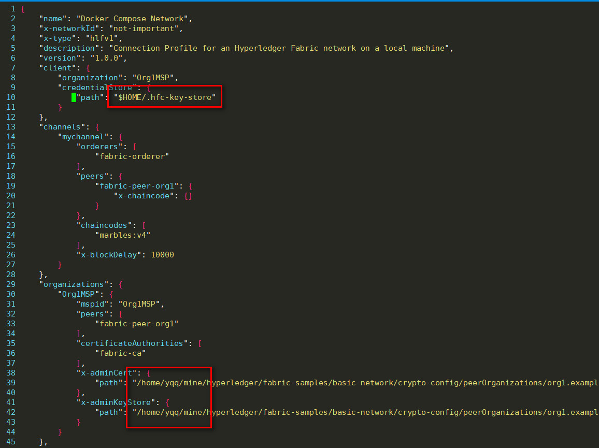
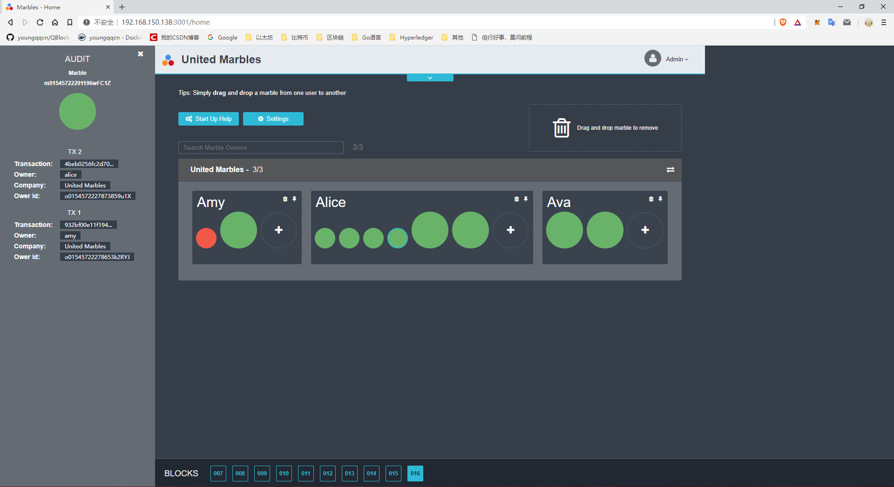

> 假设你的系统上已经搭建过Fabric, 并且成功运行过Fabcar等示例程序.


## 下载代码和安装工具

```
#最好切换到$HOME目录, 当然, 也可以切换到自定义工作目录(后面需要修改配置文件)
cd ~       

#如果之前已经搭建过fabric,则不需要重新下载
git clone https://github.com/hyperledger/fabric-samples.git   

#下载弹珠项目代码  (--depth 1 表示只下载最新一次提交,体积小, 速度快. 其他分支就没了)
git clone https://github.com/IBM-Blockchain/marbles.git --depth 1

#全局安装gulp
sudo npm install gulp -g 

```


##  开启网络

```
#根据你的实际情况, 切换到fabric-samples目录
cd fabric-samples   

#安装依赖
sudo npm install  

--------------------------------
#清除所有容器
docker rm -f $(docker ps -aq)  

#查看镜像删除历史镜像, 如果之前运行过(或者出错了想重来)那就会存在一个镜像
#发现有包含 fabcar或 marbles 的镜像, 使用 "docker rmi  镜像ID"命令删掉镜像
docker images    

docker network prune

--------------------------------

cd  fabcar   #进入fabcar目录

sudo ./startFabric.sh   #启动网络

sudo node enrollAdmin.js   #注册管理员

sudo node registerUser.js   #注册用户

sudo node query.js    #查询

#如果一切没有报错, 进入下一步
```


## 启动marbles

```

cd marbles    #进入marbles项目目录

sudo npm install   #安装依赖

sudo node install_chaincode.js       #如果报  "SDK Cannot find ORG" , 参考问题1
sudo node instantiate_chaincode.js

sudo npm install gulp -g       

gulp marbles_local                  #如果报错 "Failed to load user...", 参考问题2
```


### 问题1:

> 描述: Install chaincode error - SDK Cannot find ORG
>
> 参考: https://github.com/IBM-Blockchain/marbles/issues/217#issuecomment-385145737
>
> 解决方法: 如果fabric-samples不在`~`目录下, 则将 `$HOME`改成fabric-samples绝对路径即可, 如下图


### 问题2:

> 描述: error: [Client.js]: Failed to load user "admin" from local key value store
>
> 参考: https://github.com/IBM-Blockchain/marbles/issues/208#issuecomment-379668034
>
> 解决方法:  在执行 `gulp marbles_local `之前,  执行`sudo cp ~/fabric-samples/fabcar/hfc-key-store/*  ~/.hfc-key-store/ `将fabcar的密钥文件复制到 `./.hfc-key-store`


## 运行结果

如果上一步都正常的话, 用浏览器打开http://localhost:3001, 按照提示步骤操作即可. 效果如下图:



