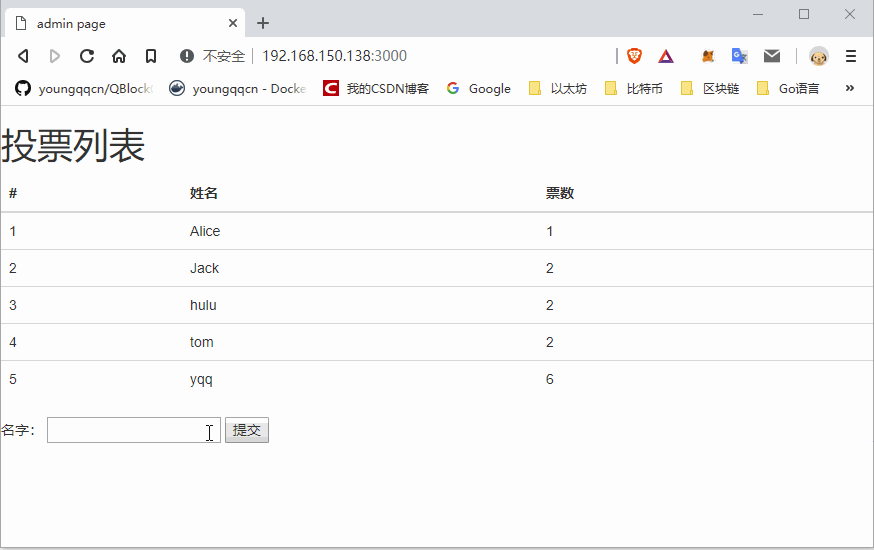

### 投票项目部署

```
git	clone https://github.com/didianV5/voteApp.git 

chmod	-R	777	voteApp
cd	voteApp
cd	app

#删除 docker	容器
docker rm -f $(docker ps -aq)

#启动fabric的网络
./startFabric.sh

#安装 node 依赖包
npm	install

#注册管理员
node enrollAdmin.js

#注册用户
node registerUser.js

#启动项目
node index.js


访问 http://localhost:3000
```

### 遇到的问题

- 问题描述: 添加投票时显示  `txid:undefined`

  > Failed to invoke successfully :: TypeError: fabric_client.newEventHub is not a function

- 解决方法: 

  > https://stackoverflow.com/questions/51436123/unable-to-find-neweventhub-function?answertab=votes#tab-top

### 代码分析

使用了koa框架 + fabric-node-sdk, 核心代码如下: 

```js
//调用Chaincode的 getUserVote方法查询所有用户的投票信息
const request = {
    chaincodeId: 'vote',
    txId: tx_id,
    fcn: 'getUserVote',
    args: [""]
};

// send the query proposal to the peer
return channel.queryByChaincode(request);

//-----------------------------------------

//调用Chaincode的 voteUser方法进行投票
// send proposal to endorser
const request = {
    chaincodeId: 'vote',
    fcn: 'voteUser',
    args: [username],
    chainId: 'mychannel',
    txId: tx_id
};

// send the transaction proposal to the peers
return channel.sendTransactionProposal(request);
```


### 运行效果

