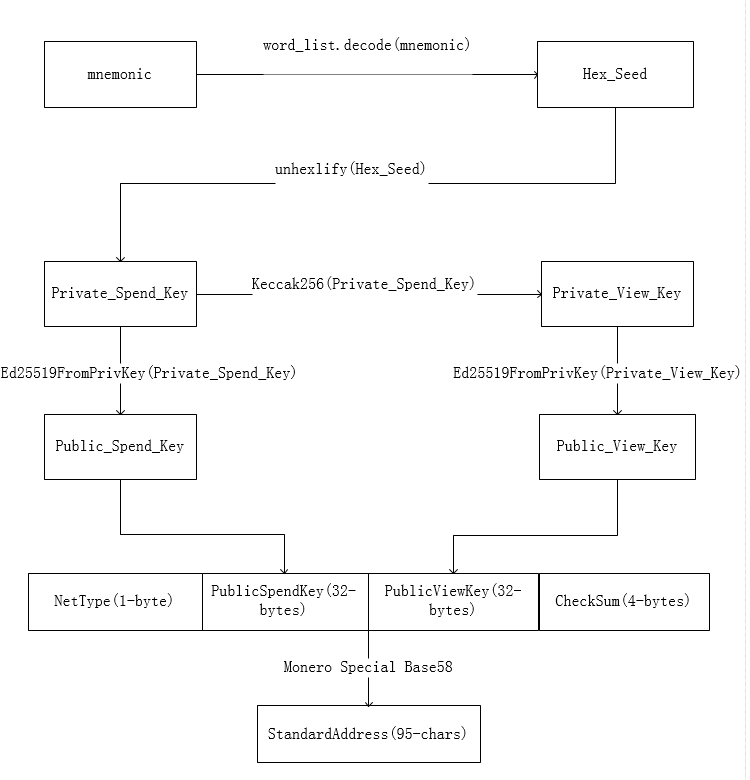
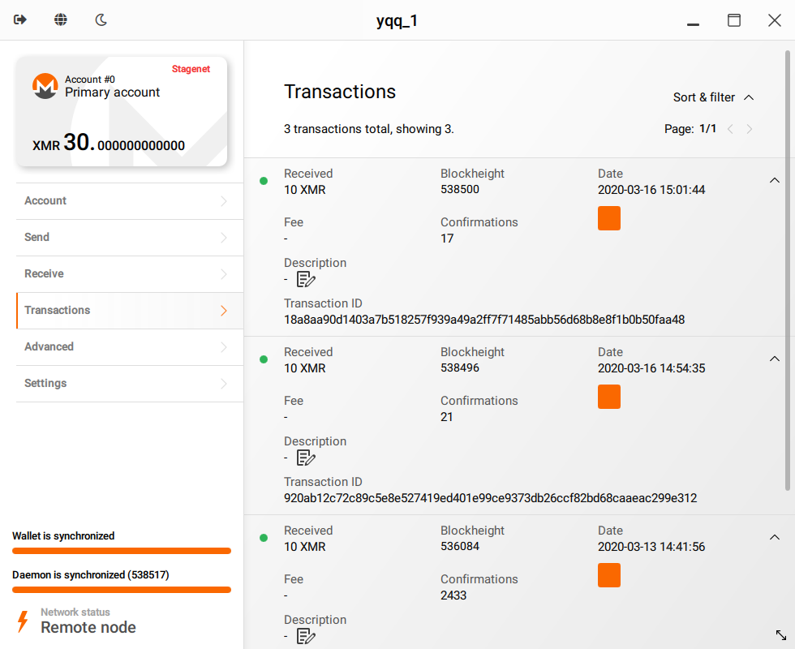
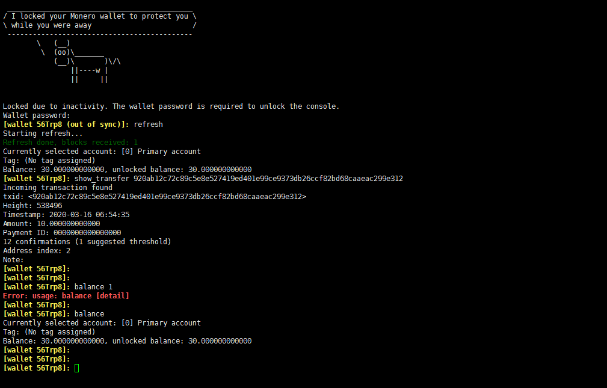

## Monero 的技术点

参考文档:

- https://monerodocs.org/
- https://github.com/monerobook/monerobook/blob/master/chapters/5.md
- wallet_rpc 文档(不是最新):  https://web.getmonero.org/resources/developer-guides/wallet-rpc.html
- daemon_rpc文档(不是最新): https://web.getmonero.org/resources/developer-guides/daemon-rpc.html
- 最新版的WalletRPC接口列表:  https://github.com/monero-project/monero/blob/756f06cd839a3260407d28ed6084435b0b8b744c/src/wallet/wallet_rpc_server.h


### 几个可执行文件的用途

| Executable                             | Description                                                  |
| :------------------------------------- | ------------------------------------------------------------ |
| `monerod`                              | The full node daemon. Does not require a wallet. [Documentation](https://monerodocs.org/interacting/monerod-reference/). |
| `monero-wallet-gui`                    | Wallet logic and **graphical** user interface. Requires `monerod` running. |
| `monero-wallet-cli`                    | Wallet logic and **commandline** user interface. Requires `monerod` running. |
| `monero-wallet-rpc`                    | Wallet logic and **HTTP API** (JSON-RPC protocol). Requires `monerod` running. |
| `monero-blockchain-export`             | (导出本地区块数据)Tool to export blockchain to `blockchain.raw` file. |
| `monero-blockchain-import`             | (导入下载好区块数据的工具)Tool to import [blockchain.raw](https://downloads.getmonero.org/blockchain.raw) - ideally your own trusted copy. |
| `monero-gen-trusted-multisig`          | (多重签名相关)Tool to generate a set of multisig wallets. See chapter on [multisignatures](https://monerodocs.org/multisignature). |
| `monero-blockchain-mark-spent-outputs` | (普通开发者不需要关心)Advanced tool to mitigate potential privacy issues related to Monero forks. You normally shouldn't be concerned with that. See the [commit](https://github.com/monero-project/monero/commit/df6fad4c627b99a5c3e2b91b69a0a1cc77c4be14#diff-0410fba131d9a7024ed4dcf9fb4a4e07) and [pull request](https://github.com/monero-project/monero/pull/3322). |
| `monero-blockchain-usage`              | (普通开发者不需要关心)Advanced tool to mitigate potential privacy issues related to Monero forks. You normally shouldn't be concerned with that. See the [commit](https://github.com/monero-project/monero/commit/0590f62ab64cf023d397b995072035986931a6b4) and the [pull request](https://github.com/monero-project/monero/pull/3322). |
| `monero-blockchain-ancestry`           | (普通开发者不需要关心)Advanced research tool to learn ancestors of a transaction, block or chain. Irrelevant for normal users. See this [pull request](https://github.com/monero-project/monero/pull/4147/files). |
| `monero-blockchain-depth`              | (普通开发者不需要关心)Advanced research tool to learn depth of a transaction, block or chain. Irrelevant for normal users. See this [commit](https://github.com/monero-project/monero/commit/289880d82d3cb206a2cf4ae67d2deacdab43d4f4#diff-34abcc1a0c100efb273bf36fb95ebfa0). |


### 交互

>  https://monerodocs.org/interacting/overview/

`monorod`和`monero-wallet-rpc`的API是分开的 (与比特币的bitcoind不同), 即:

- `monorod`只有节点相关的API, 
- `monero-wallet-rpc`只有钱包相关的API, 

 所以, 需要同时运行两个守护进程才能使用所有API(也可以使用信任的远程公共节点).


| Executable          | p2p network | node commands via keyboard | node HTTP API | wallet commands via keyboard | wallet HTTP API | wallet via GUI |
| :------------------ | :---------- | :------------------------- | :------------ | :--------------------------- | :-------------- | :------------- |
| `monerod`           | ✔           | ✔                          | ✔             |                              |                 |                |
| `monero-wallet-cli` |             |                            |               | ✔                            |                 |                |
| `monero-wallet-rpc` |             |                            |               |                              | ✔               |                |
| `monero-wallet-gui` |             |                            |               |                              |                 | ✔              |


### monerod数据目录

>  https://monerodocs.org/interacting/overview/#data-directory

- 在Linux上默认目录是`$HOME/.bitmonero/`如果是测试网, 则会生成子目录`stagenet`或`testnet`
- 可以通过 `--config-file`指定配置文件`bitmonero.conf`的目录

- 可以通过在   `--data-dir`  制定区块数据存放目录

- data目录
  - `lmdb/` - the blockchain database directory
  - `p2pstate.bin` - saved memory of discovered and rated peers
  - `bitmonero.log` - log file


启动与停止

- 后台启动 `monerod  --config-file=/root/.bitmonero.conf --detach`  (如果需要同步全节点, 可以参考上一篇关于同步全节点文档)

- 优雅的停止  `./monerod exit `


### RPC API

> https://monerodocs.org/interacting/monerod-reference/#node-rpc-api

- `monerod` 提供了一下数据

  - 区块链数据(状态, 区块内容, 交易, 等等...)
  - 节点本身的状态信息和数据等
  - 提供钱包的接口(send transactions)

  

### 公私钥,地址, 钱包等相关概念

> 可以参考: https://www.monero.how/monero-glossary

- *mnemonic seed* (助记词) , 即  HD(分层确定性钱包) 中的助记词

- *primary address* (原始地址),  即索引为` 0 `的子账户

- *Spendable Wallet* (可转账钱包)

- *View Only Wallet* (观察钱包)

- *PaymentID*

  >  https://monero.stackexchange.com/a/4343

  payment id 是交易附加的一段信息

  

- *Private spend key*

  > 参考: https://monerodocs.org/cryptography/asymmetric/private-key/#private-spend-key

  **真正的私钥**,  用来花费门罗币的私钥, 即进行交易签名的私钥

- *Private view key* 

  > 参考: https://monerodocs.org/cryptography/asymmetric/private-key/#private-view-key

  用来解密入账交易(incoming),  因为门罗币的交易信息(源地址,目的地址,金额等等)是不透明的.

- *Public view key*  

  用来识别入账交易( 交易的发送方会使用 Public view key 对交易进行加密 ), 接收方则需用 Private view key 对内容进行解密.

- *Public spend key*

  用来指定UTXO的接收方, (交易的发送方会制定 UTXO的公钥为 Public Spend Key) ,  接收方花费此笔UTXO 时则需要 使用 Private Spend Key 进行签名

- *Tx_Key*

  用于证明交易  详情可以参考RPC接口 `get_tx_key` 和 `check_tx_key`


### 地址分类

#### Standard  标准地址

> https://monerodocs.org/public-address/standard-address/

- 即默认地址, 有  `public spend key `和 `public veiw key`组成
- 一共 69 个字节,  经过特殊的base58编码(**和一般的base58不同**)形成95个字符长度字符串

| Index | Size in bytes | Description                                                  |
| :---- | :------------ | :----------------------------------------------------------- |
| 0     | 1             | identifies the network and address type; [18](https://github.com/monero-project/monero/blob/793bc973746a10883adb2f89827e223f562b9651/src/cryptonote_config.h#L149) - main chain; [53](https://github.com/monero-project/monero/blob/793bc973746a10883adb2f89827e223f562b9651/src/cryptonote_config.h#L161) - test chain; stagenet是24 |
| 1     | 32            | public spend key                                             |
| 33    | 32            | public view key                                              |
| 65    | 4             | checksum ([Keccak-f[1600\] hash](https://github.com/monero-project/monero/blob/8f1f43163a221153403a46902d026e3b72f1b3e3/src/common/base58.cpp#L261) of the previous 65 bytes, trimmed to first [4](https://github.com/monero-project/monero/blob/8f1f43163a221153403a46902d026e3b72f1b3e3/src/common/base58.cpp#L53) bytes) |


标准地址生成流程




标准地址生成源码

```python
def public_address(self, net=const.NET_MAIN):
    """Returns the master :class:`Address <monero.address.Address>` represented by the seed.

    :param net: the network, one of `const.NET_*`; default is `const.NET_MAIN`

    :rtype: :class:`Address <monero.address.Address>`
    """
    # backward compatibility
    _net = net[:-3] if net.endswith('net') else net
    if _net != net:
        warnings.warn(
            "Argument '{:s}' is deprecated and will not be accepted in 0.8, "
            "use one of monero.const.NET_*".format(net),
            DeprecationWarning)
        net = _net
    if net not in const.NETS:
        raise ValueError(
            "Invalid net argument '{:s}'. Must be one of monero.const.NET_*".format(net))
    netbyte = (18, 53, 24)[const.NETS.index(net)]
    data = "{:x}{:s}{:s}".format(netbyte, self.public_spend_key(),self.public_view_key())
    h = keccak_256()
    h.update(unhexlify(data))
    checksum = h.hexdigest()
    return address(base58.encode(data + checksum[0:8]))
```


#### Subaddress 子地址

> https://monerodocs.org/public-address/subaddress/

这里的子地址, 并不是真正意义上的子地址, 和BTC的地址概念不同


子地址生成流程


> 问题:  m 虽然是 sub_private_view_key 但是似乎并作为解析output的view key使用


Subaddress地址生成源码

```python

def get_address(master_addr, major, minor, seed : Seed):
    """
    Calculates sub-address for account index (`major`) and address index within
    the account (`minor`).

    :rtype: :class:`BaseAddress <monero.address.BaseAddress>`
    """
    # ensure indexes are within uint32
    if major < 0 or major >= 2 ** 32:
        raise ValueError('major index {} is outside uint32 range'.format(major))
    if minor < 0 or minor >= 2 ** 32:
        raise ValueError('minor index {} is outside uint32 range'.format(minor))
    master_address = master_addr  #self.address()
    if major == minor == 0:  #如果是  (0, 0) 则直接返回
        return master_address


    priv_view_key =  seed.secret_view_key()
    master_svk = unhexlify(priv_view_key)

    pub_spend_key = seed.public_spend_key()
    master_psk = unhexlify( pub_spend_key  )

    # master_svk = unhexlify(self.view_key())
    # master_psk = unhexlify(self.address().spend_key())

    # m = Hs("SubAddr\0" || master_svk || major || minor)
    hsdata = b''.join([
        b'SubAddr\0', master_svk,
        struct.pack('<I', major), struct.pack('<I', minor)])
    m = keccak_256(hsdata).digest()
    
    # D = master_psk + m * B
    D = ed25519.edwards_add(
        ed25519.decodepoint(master_psk),
        ed25519.scalarmult_B(ed25519.decodeint(m)))

    # C = master_svk * D
    C = ed25519.scalarmult(D, ed25519.decodeint(master_svk))
    netbyte = bytearray([const.SUBADDR_NETBYTES[const.NETS.index(master_address.net)]])
    data = netbyte + ed25519.encodepoint(D) + ed25519.encodepoint(C)
    checksum = keccak_256(data).digest()[:4]
    return address.SubAddress(base58.encode(hexlify(data + checksum)))
```


> 更多关于子地址: [3_XMR地址生成.md](./3_XMR地址生成.md)


#### Integrated  集成地址

- 一共77字节, 经过base58编码后地址字符串长度为: 106 字符

| Index | Size in bytes | Description                                                  |
| :---- | :------------ | :----------------------------------------------------------- |
| 0     | 1             | identifies the network and address type; [19](https://github.com/monero-project/monero/blob/793bc973746a10883adb2f89827e223f562b9651/src/cryptonote_config.h#L150) - main chain; [54](https://github.com/monero-project/monero/blob/793bc973746a10883adb2f89827e223f562b9651/src/cryptonote_config.h#L162) - test chain |
| 1     | 32            | public spend key                                             |
| 33    | 32            | public view key                                              |
| 65    | 8             | compact payment ID - 8 bytes randomly generated by the recipient; note that it does not need encryption in the address itself but it is hidden in a transaction paying to integrated address to prevent linking payment with the address by external observers |
| 73    | 4             | checksum ([Keccak-f[1600\] hash](https://github.com/monero-project/monero/blob/8f1f43163a221153403a46902d026e3b72f1b3e3/src/common/base58.cpp#L261) of the previous 73 bytes, trimmed to first [4](https://github.com/monero-project/monero/blob/8f1f43163a221153403a46902d026e3b72f1b3e3/src/common/base58.cpp#L53) bytes) |


### 主链和测试链

> https://monerodocs.org/infrastructure/networks/

- Mainnet

  主链  ,   18080 P2P   , 18081  JSON-RPC server 

- Stagenet 

  - 测试链, 开发者用,  38080 P2P   , 38081  JSON-RPC server 
  - 可以指定远程  daemon节点  `monero-stagenet.exan.tech:38081`
  - 获取测试币的水龙头:  https://community.xmr.to/faucet/stagenet/

- Testnet  测试链

  - 测试链, 开发者用

- Private Testnet  私有测试链


### 钱包客户端

#### monero-wallet-gui  

- 下载地址: https://github.com/monero-project/monero-gui/releases

- 使用方法,  可以选择测试网,   "高级设置>>stagenet" ,  远程节点设置为`monero-stagenet.exan.tech:38081`

  

#### monero-wallet-cli

- 使用方法:  `monero-wallet-cli --stagenet  --daemon-address monero-stagenet.exan.tech:38081  --trusted-daemon --wallet-file=/root/.bitmonero/stagenet/wallet_files/yqq_stagenet`
- 下载地址: https://github.com/monero-project/monero/releases




### 区块和交易


移至: [4_XMR交易过程.md](4_XMR交易过程.md)


