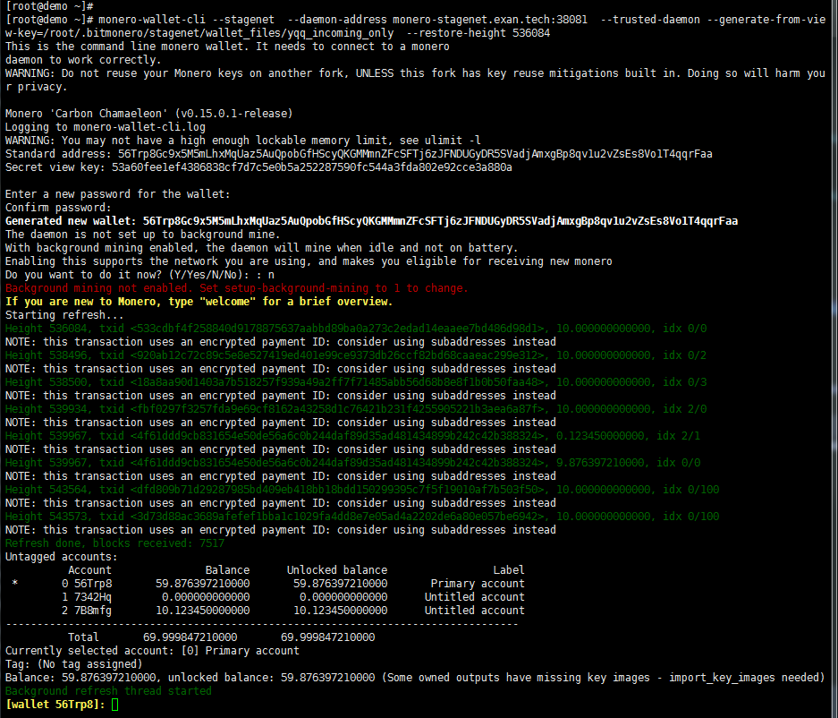
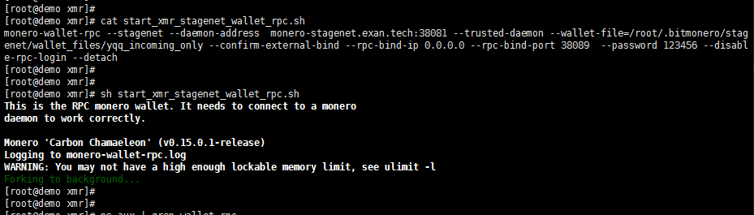
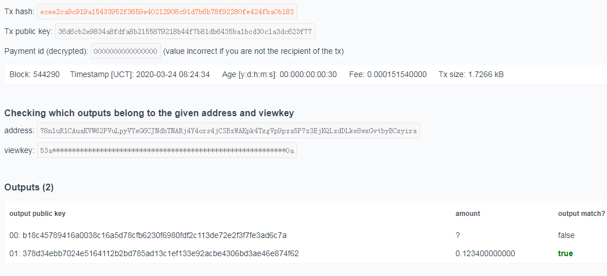

# 交易所对接 XMR


## 充币

### 用户充币地址生成

使用 subaddress 即可


### 充币数据监测

> monero-wallet-rpc 的API文档:   https://web.getmonero.org/resources/developer-guides/wallet-rpc.html


 **步骤1** :   使用  `monero-wallet-cli`  的以下选项生成 `incoming-only`钱包:

```
--generate-from-view-key arg   
//Generate incoming-only wallet from view key
// arg 是新生成的钱包路径


--subaddress-lookahead arg   
//Set subaddress lookahead sizes to <major>:<minor>
//cli 默认是 "look ahead" 200个subAddress, 如果需要钱包帮忙观察更多的子地址则需要指定此参数   
// 例如:  --subaddress-lookahead   5:10000   //表示5个子账户 每个账户 "look ahead" 10000个subaddress
```


观察钱包生成过程

```
#使用远程节点
monero-wallet-cli --stagenet  --daemon-address monero-stagenet.exan.tech:38081  --trusted-daemon --generate-from-view-key=/root/.bitmonero/stagenet/deposit/watch_only_wallet   --subaddress-lookahead  2:50000


#使用本地节点
monero-wallet-cli --stagenet  --daemon-address 127.0.0.1:38081  --trusted-daemon --generate-from-view-key=/root/.bitmonero/stagenet/deposit/watch_only_wallet   --subaddress-lookahead  2:50000
```

  


```
private_view_key:  53a60fee1ef4386838cf7d7c5e0b5a252287590fc544a3fda802e92cce3a880a
primary_address: 56Trp8Gc9x5M5mLhxMqUaz5AuQpobGfHScyQKGMMmnZFcSFTj6zJFNDUGyDR5SVadjAmxgBp8qv1u2vZsEs8Vo1T4qqrFaa

restore_height : 535000
```





**步骤2**: 使用 `monero-wallet-rpc` 导入上一步生成的`Private View Key` 作为 `incoming-only` 钱包.   这样就可以RPC接口获取钱包的入账数据.

- 启动  monero-wallet-rpc  ,  注意端口不要学wiki页面中把端口设置为  `18082`(主网) 或 `38082`(测试网)(默认是ZMQ的RPC端口)

  ```
  monero-wallet-rpc --stagenet --daemon-address  monero-stagenet.exan.tech:38081 --trusted-daemon --wallet-file=/root/.bitmonero/stagenet/wallet_files/yqq_incoming_only --confirm-external-bind --rpc-bind-ip 0.0.0.0 --rpc-bind-port 38089  --password 123456 --disable-rpc-login --detach
  ```





- 优雅停止

  ```
  curl -X POST http://127.0.0.1:38089/json_rpc -d '{"jsonrpc":"2.0","id":"0","method":"stop_wallet"}' -H 'Content-Type: application/json' 
  ```


- **get_transfers**

  > https://web.getmonero.org/zh-cn/resources/developer-guides/wallet-rpc.html#get_transfers
  
  根据此RPC接口即可获取所有充币交易详情,  根据需要自行添加过滤条件即可
  
  ```
  curl -X POST http://127.0.0.1:18089/json_rpc -d '{"jsonrpc":"2.0","id":"0","method":"get_transfers","params":{"in":true,"account_index":1}}' -H 'Content-Type: application/json'
  ```
  
  如果  result 为空   则为   `"result":{}`


- **incoming_transfers**   

  内部调用了`get_transfers`,  获取钱包的所有入账交易信息, 

  如果  result 为空   则为   `"result":{}`
  
  ```
  [root@demo xmr]# curl -X POST https://192.168.10.160:38089/json_rpc -d '{"jsonrpc":"2.0","id":"0","method":"incoming_transfers","params":{"transfer_type":"all"}}' -H 'Content-Type: application/json' --insecure
  
  
  {
    "id": "0",
    "jsonrpc": "2.0",
    "result": {
      "transfers": [{
        "amount": 10000000000000,
        "block_height": 536084,
        "frozen": false,
        "global_index": 2329106,
        "key_image": "0da9c81fee4bcf650f9a112811e551f8a6062a9fa3b8c9e4d70c568fa3505557",
        "spent": true,
        "subaddr_index": {
          "major": 0,
          "minor": 0
        },
        "tx_hash": "533cdbf4f258840d9178875637aabbd89ba0a273c2edad14eaaee7bd486d98d1",
        "unlocked": true
      },{
        "amount": 10000000000000,
        "block_height": 538496,
        "frozen": false,
        "global_index": 2359202,
        "key_image": "d0f89cd8c09e16d3a98659949ca7d4c1eca2da25e175fb8f2fae56334ab0b993",
        "spent": false,
        "subaddr_index": {
          "major": 0,
          "minor": 2
        },
        "tx_hash": "920ab12c72c89c5e8e527419ed401e99ce9373db26ccf82bd68caaeac299e312",
        "unlocked": true
      }]
    }
  }
  ```
  
  


根据返回的数据, 并没有直接得到 subaddress, 只有  `major` 和 `minor`的信息,   有以下2种方式可以获得subaddress的地址字符串信息

- 根据**主地址**的 `Private View Key`和`Public Spend Key`(public spend key 可直接由master standard address得到)推导出  `( major, minor ) `的地址(推导过程可以看 [2_XMR的技术概念.md](2_XMR的技术概念.md) 和 [3_XMR地址生成.md](3_XMR地址生成.md))

- 根据  `get_address` RPC 接口可以通过   `major`和 `minor` 获取地址

  **get_address**

  Return the wallet's addresses for an account. Optionally filter for specific set of subaddresses.

  Alias: *getaddress*.

  Inputs:

  - *account_index* - unsigned int; Return subaddresses for this account.
  - *address_index* - array of unsigned int; (Optional) List of subaddresses to return from an account.

  Outputs:

  - *address* - string; The 95-character hex address string of the monero-wallet-rpc in session.

  - addresses

    array of addresses informations

    - *address* string; The 95-character hex (sub)address string.
    - *label* string; Label of the (sub)address
    - *address_index* unsigned int; index of the subaddress
    - *used* boolean; states if the (sub)address has already received funds

  ```
  [root@demo xmr]# curl -X POST http://127.0.0.1:38089/json_rpc -d '{"jsonrpc":"2.0","id":"0","method":"get_address","params":{"account_index":0,"address_index":[2]}}' -H 'Content-Type: application/json'
  
  
  {
    "id": "0",
    "jsonrpc": "2.0",
    "result": {
      "address": "56Trp8Gc9x5M5mLhxMqUaz5AuQpobGfHScyQKGMMmnZFcSFTj6zJFNDUGyDR5SVadjAmxgBp8qv1u2vZsEs8Vo1T4qqrFaa",
      "addresses": [{
        "address": "75kjb3c6SaM58L7fAWsB9UQfHhr1i2aRqLeH7rFDXJMkfm2XVAPw1EhVbtwcEgERCjGubTXADzUudBLm5f1Xg1r7AZXvwR5",
        "address_index": 2,
        "label": "",
        "used": true
      }]
    }
  }
  ```

  

## 提币


### 获取账户余额

- get_balance  Return the wallet's balance.

  Alias: *getbalance*.

  Inputs:

  - *account_index* - unsigned int; Return balance for this account.
  - *address_indices* - array of unsigned int; (Optional) Return balance detail for those subaddresses.

  Outputs:

  - *balance* - unsigned int; The total balance of the current monero-wallet-rpc in session.
  - *unlocked_balance* - unsigned int; Unlocked funds are those funds that are sufficiently deep enough in the Monero blockchain to be considered safe to spend.
  - *multisig_import_needed* - boolean; True if importing multisig data is needed for returning a correct balance.
  - per_subaddress\- array of subaddress information; Balance information for each subaddress in an account.
    - *address_index* - unsigned int; Index of the subaddress in the account.
    - *address* - string; Address at this index. Base58 representation of the public keys.
    - *balance* - unsigned int; Balance for the subaddress (locked or unlocked).
    - *unlocked_balance* - unsigned int; Unlocked balance for the subaddress.
    - *label* - string; Label for the subaddress.
    - *num_unspent_outputs* - unsigned int; Number of unspent outputs available for the subaddress.

  

  ```
  [root@demo ~]# curl -X POST http://127.0.0.1:38089/json_rpc -d '{"jsonrpc":"2.0","id":"0","method":"get_balance","params":{"accoun_index":0,"address_indices":[0, 3]}}' -H 'Content-Type: application/json'
  {
    "id": "0",
    "jsonrpc": "2.0",
    "result": {
      "balance": 79876397210000,  //总金额
      "blocks_to_unlock": 0,
      "multisig_import_needed": false,
      "per_subaddress": [{
        "account_index": 0,
        "address": "56Trp8Gc9x5M5mLhxMqUaz5AuQpobGfHScyQKGMMmnZFcSFTj6zJFNDUGyDR5SVadjAmxgBp8qv1u2vZsEs8Vo1T4qqrFaa",
        "address_index": 0,
        "balance": 19876397210000,  //子账户的余额
        "blocks_to_unlock": 0,
        "label": "Primary account",
        "num_unspent_outputs": 2,
        "unlocked_balance": 19876397210000
      },{
        "account_index": 0,
        "address": "7BfWgCVsN3a4dn1WC4bNpjQo85QfkD7NvQMABDPyhZr7jDYRTHhkzJg4Dve9NpsWfX85D9HHQnjN29k1NReF7xNcE1sadQE",
        "address_index": 3,
        "balance": 10000000000000,  //子账户的余额
        "blocks_to_unlock": 0,
        "label": "",
        "num_unspent_outputs": 1,
        "unlocked_balance": 10000000000000
      }],
      "unlocked_balance": 79876397210000   //已解锁的(如果是view-only wallet 一直是锁定状态)
    }
  }
  ```

  


### 离线签名(冷签名)

> 参考:  https://github.com/monero-project/monero/blob/master/tests/functional_tests/cold_signing.py
>
> 源码:  [cold_signing.py](./src/cold_signing.py)
>
> 最新版的WalletRPC接口列表:  https://github.com/monero-project/monero/blob/756f06cd839a3260407d28ed6084435b0b8b744c/src/wallet/wallet_rpc_server.h


```python
def create(self, idx):
    print('Creating hot and cold wallet')

    #关闭钱包
    self.hot_wallet = Wallet(idx = 0)
    # close the wallet if any, will throw if none is loaded
    try: self.hot_wallet.close_wallet()
    except: pass

    self.cold_wallet = Wallet(idx = 1)
    # close the wallet if any, will throw if none is loaded
    try: self.cold_wallet.close_wallet()
    except: pass

    seed = 'velvet lymph giddy number token physics poetry unquoted nibs useful sabotage limits benches lifestyle eden nitrogen anvil fewest avoid batch vials washing fences goat unquoted'
    
    
    #调用 RPC接口 restore_deterministic_wallet 临时生成签名钱包
    res = self.cold_wallet.restore_deterministic_wallet(seed = seed)
    self.cold_wallet.set_daemon('127.0.0.1:11111', ssl_support = "disabled")
    spend_key = self.cold_wallet.query_key("spend_key").key
    view_key = self.cold_wallet.query_key("view_key").key
    
    
    #调用 RPC接口 generate_from_keys 临时生成  view-only(watch-only) 观察钱包
    res = self.hot_wallet.generate_from_keys(viewkey = view_key, address = '42ey1afDFnn4886T7196doS9GPMzexD9gXpsZJDwVjeRVdFCSoHnv7KPbBeGpzJBzHRCAs9UxqeoyFQMYbqSWYTfJJQAWDm')

    ok = False
    try: res = self.hot_wallet.query_key("spend_key")
    except: ok = True
    assert ok
    ok = False
    try: self.hot_wallet.query_key("mnemonic")
    except: ok = True
    assert ok
    assert self.cold_wallet.query_key("view_key").key == view_key
    assert self.cold_wallet.get_address().address == self.hot_wallet.get_address().address


def transfer(self):
    daemon = Daemon()

    print("Creating transaction in hot wallet")

    dst = {'address': '42ey1afDFnn4886T7196doS9GPMzexD9gXpsZJDwVjeRVdFCSoHnv7KPbBeGpzJBzHRCAs9UxqeoyFQMYbqSWYTfJJQAWDm', 'amount': 1000000000000}

    self.hot_wallet.refresh()
    res = self.hot_wallet.export_outputs()
    self.cold_wallet.import_outputs(res.outputs_data_hex)
    res = self.cold_wallet.export_key_images(True)
    self.hot_wallet.import_key_images(res.signed_key_images, offset = res.offset)

    res = self.hot_wallet.transfer([dst], ring_size = 11, get_tx_key = False)
    
    unsigned_txset = res.unsigned_txset

    print('Signing transaction with cold wallet')
    res = self.cold_wallet.describe_transfer(unsigned_txset = unsigned_txset)
    
    res = self.cold_wallet.sign_transfer(unsigned_txset)
    
    signed_txset = res.signed_txset
    
    txid = res.tx_hash_list[0]
    

    print('Submitting transaction with hot wallet')
    res = self.hot_wallet.submit_transfer(signed_txset)
    
    res = self.hot_wallet.get_transfers()
    
    self.hot_wallet.refresh()

    res = self.hot_wallet.get_transfers()
   
    res = self.hot_wallet.get_tx_key(txid) #tx_key 用来是证明交易, 参考RPC接口, get_tx_key 和 check_tx_key
    
    res = self.cold_wallet.get_tx_key(txid)
    

```


#### 步骤0: 准备工作

- view-only 钱包作为热钱包

- 开启另外一个 wallet_rpc 服务(模拟冷钱包),  到时候可以将此服务至于离线环境,  使用  `--offline` 模式

  ```
  monero-wallet-rpc --stagenet --daemon-address monero-stagenet.exan.tech:38081 --trusted-daemon --wallet-file=/root/.bitmonero/stagenet/wallet_files/yqq_stagenet --confirm-external-bind --rpc-bind-ip 0.0.0.0 --rpc-bind-port 48089 --password 123456 --disable-rpc-login --detach
  

  
  #######################  离线钱包创建  ###########################
  #离线模式创建签名包  如果子地址较多, 需要制定 --subaddress-lookahead , 不然导入 tx_outputs会报错txo不属于当前钱包
  monero-wallet-cli --stagenet   --offline  --restore-deterministic-wallet   --subaddress-lookahead  2:50000   --generate-new-wallet=/root/.bitmonero/stagenet/wallet_files/cold_wallet 
  
  #stagenet助记词(仅测试 only test)
  dozen lazy lucky itinerary egotistic inbound eating deity debut knapsack sedan onslaught atrium uphill dwarf furnished ongoing rated exotic sidekick names budget lazy misery inbound
  ###################################################################
  
  #####################  离线 WalletRPC 启动 ##########################
  monero-wallet-rpc --stagenet --wallet-file=/root/.bitmonero/stagenet/wallet_files/cold_wallet --confirm-external-bind --rpc-bind-ip 0.0.0.0 --rpc-bind-port 48089 --password 123456 --disable-rpc-login --detach --offline
  ####################################################################
  ```
  
  

#### 步骤1: 热观察钱包, 导出TXO

- `self.hot_wallet.refresh()`   刷新

- `self.hot_wallet.export_outputs`  导出 TXO

```
curl -X POST http://127.0.0.1:38089/json_rpc -d '{"jsonrpc":"2.0","id":"0","method":"export_outputs"}' -H 'Content-Type: application/json'

{
  "id": "0",
  "jsonrpc": "2.0",
  "result": {
    "outputs_data_hex": "4d6f6e65726f206f7574707574206578706f72740463ad63ee6293669c8cd7b7383ee664b28933a6f70a0d316b3b8becc7273c8613d95f44a17daf4ff4ff750c9eda7d22a74de500f509021e4b10a1b66615a8ef3da80da0cbaaa5623850b17444993c6fac7f7af7ffe1c3cdd5b946e98fefc7ee932ae353a0a070c2c23bbd08b9ae15bfd068e2315ef21015ac79d5ebca2e939388ffee77bc3674bab5e91200f9cad81cfbe8f130d03a71268069d49b2fe478fcd1e104431e2327f083590402"
  }
}

```


#### 步骤2:  冷钱包导入TXO

- ` self.cold_wallet.import_outputs`

```
curl -X POST http://127.0.0.1:48089/json_rpc -d '{"jsonrpc":"2.0","id":"0","method":"import_outputs","params":{"outputs_data_hex":"4d6f6e65726f206f7574707574206578706f72740463ad63ee6293669c8cd7b7383ee664b28933a6f70a0d316b3b8becc7273c8613d95f44a17daf4ff4ff750c9eda7d22a74de500f509021e4b10a1b66615a8ef3da80da0cbaaa5623850b17444993c6fac7f7af7ffe1c3cdd5b946e98fefc7ee932ae353a0a070c2c23bbd08b9ae15bfd068e2315ef21015ac79d5ebca2e939388ffee77bc3674bab5e91200f9cad81cfbe8f130d03a71268069d49b2fe478fcd1e104431e2327f083590402"}}' -H 'Content-Type: application/json'


{
  "id": "0",
  "jsonrpc": "2.0",
  "result": {
    "num_imported": 10
  }
}

```


#### 步骤3:   冷钱包导出签名后的 key-image 

- self.cold_wallet.export_key_images(all=True)

> 用于告知热观察钱包那些TXO是已经花费过的, 这很关键, 因为在进行交易创建时,因为环机密交易机制和环签名机制, 外界是无法得知TXO是被花费过; 
>
> 关于 key-image的作用, 更多详情请看  [4_XMR交易过程.md](4_XMR交易过程.md)

```
curl -X POST http://127.0.0.1:48089/json_rpc -d '{"jsonrpc":"2.0","id":"0","method":"export_key_images", "params":{"all":true}}' -H 'Content-Type: application/json'


{
  "id": "0",
  "jsonrpc": "2.0",
  "result": {
    "offset": 0,
    "signed_key_images": [{
      "key_image": "0da9c81fee4bcf650f9a112811e551f8a6062a9fa3b8c9e4d70c568fa3505557",
      "signature": "28d4495bed538a050656acfbd07b6e088083a59d9602f9a13cf17cf08577b7088961f2babaff9f3d71df25e4cc95a0245a69795a5ec351f101c696c6d3913d03"
    },{
      "key_image": "d0f89cd8c09e16d3a98659949ca7d4c1eca2da25e175fb8f2fae56334ab0b993",
      "signature": "ede65432268501733303ec02a1d5f404da8091e0f498263d84c813a4185b930a1e7139b687f4169b93912fadb4da3e2f51b4c9012059a2e560d4ff828bf64c05"
    },{
      "key_image": "4cf2b0947e848958073860efe0e4fa240024e13bed87abb72f9172e79a13618a",
      "signature": "b3018f0e42ff44e9d4c41014685228b94b78d2783615bbb39c1080bb2453320ecebb3fe080bb08b6262cca02b7cf8ad77314316c740644f73fba3f4453eca809"
    },{
      "key_image": "8092f1d06bb7be3c9d9d134d144aa1f75004dbab432a6e6295dcd748480b2e9b",
      "signature": "a40d9bdf0d693f746daaa7243670feff6b0fd418748f4c1c77f64d8dce02b10334e2935cd246ed5e1784aac6a210d23f6eeb1f3dfba0f2178e1ab198d2b5040f"
    },{
      "key_image": "445ce4b7619b55ec7f59b7524808575ee279a45d27f28feb6c66482b8d71ad72",
      "signature": "18b65dce51c64518ad2b9de41a864b234b642d2ea4a100a1c78e4948c0253a0a33099f88b94a0ad8a91afea3a566dce2cb22eebb86ae729decc7a2f7a85c730b"
    },{
      "key_image": "3bdd72f523dd0f80a34c763e1da73aed2dea4ad3d1f928cfd456f6cd8e44fe61",
      "signature": "093e023ad864a3e766bccd8b5e20531f1e37b2cc2a3d4cb92d7d00ad8da67308215e6d0bd90002bfe6f130da81a8095aa84c3a23259a108e909cb94300be060d"
    },{
      "key_image": "6335f1056f983bbda6bc4448d4564cd37d782136a0d3dfb35d90afb244104c0c",
      "signature": "9d0a4048a9d3fe5ec7c79b795d787e0c036205be398ae2b8285c0b88e542d502f8a524e8c23c9b821d14057e16e8d4988ae14297362068919b227ff36ee3c50f"
    },{
      "key_image": "55b4981b45fdb1e934c276f6948d4978f7f9cdaf8eee6235d8b1ecfbfe9b7092",
      "signature": "186b1e4cc8f311fb81738536b7c6427f40bf5029ac3c138401d91a401478530871048f008947732d8f836a3b61b96cc4fd526a6e14d17e9c42122071eca59d0e"
    },{
      "key_image": "f7c8efcac41c01408f694a11544a01e6794a8fd20ade2ee75b47818dba694164",
      "signature": "7631cb08b100308e57c36b5136f25faf6ccb553667c0c472c66fc58a727c8e02665bdadf65464dab93407db64562df090eebb6f68481400795996dbbc6c80f0a"
    },{
      "key_image": "39a64803d25bbbd259e5cb345ee80115d95f3ef2a1241ceeef70633aca37a6ec",
      "signature": "792b5b53daef114515c1609cd000490455e448a6bcfffd2ee0c241d59baf6e0a245be3bb342d4f7e07549cadd83feae28ecc85b5cf70b92c5b1f144a20776706"
    }]
  }
}
```


#### 步骤4:   热观察钱包导入已签名的key-image

- self.hot_wallet.import_key_images(res.signed_key_images, offset = res.offset)


```
curl -X POST http://127.0.0.1:38089/json_rpc -d '{"jsonrpc":"2.0","id":"0","method":"import_key_images", "params":{"offset":0, "signed_key_images":[{"key_image": "0da9c81fee4bcf650f9a112811e551f8a6062a9fa3b8c9e4d70c568fa3505557","signature": "28d4495bed538a050656acfbd07b6e088083a59d9602f9a13cf17cf08577b7088961f2babaff9f3d71df25e4cc95a0245a69795a5ec351f101c696c6d3913d03"    },{"key_image": "d0f89cd8c09e16d3a98659949ca7d4c1eca2da25e175fb8f2fae56334ab0b993","signature": "ede65432268501733303ec02a1d5f404da8091e0f498263d84c813a4185b930a1e7139b687f4169b93912fadb4da3e2f51b4c9012059a2e560d4ff828bf64c05"    },{"key_image": "4cf2b0947e848958073860efe0e4fa240024e13bed87abb72f9172e79a13618a","signature": "b3018f0e42ff44e9d4c41014685228b94b78d2783615bbb39c1080bb2453320ecebb3fe080bb08b6262cca02b7cf8ad77314316c740644f73fba3f4453eca809"    },{"key_image": "8092f1d06bb7be3c9d9d134d144aa1f75004dbab432a6e6295dcd748480b2e9b","signature": "a40d9bdf0d693f746daaa7243670feff6b0fd418748f4c1c77f64d8dce02b10334e2935cd246ed5e1784aac6a210d23f6eeb1f3dfba0f2178e1ab198d2b5040f"    },{"key_image": "445ce4b7619b55ec7f59b7524808575ee279a45d27f28feb6c66482b8d71ad72","signature": "18b65dce51c64518ad2b9de41a864b234b642d2ea4a100a1c78e4948c0253a0a33099f88b94a0ad8a91afea3a566dce2cb22eebb86ae729decc7a2f7a85c730b"    },{"key_image": "3bdd72f523dd0f80a34c763e1da73aed2dea4ad3d1f928cfd456f6cd8e44fe61","signature": "093e023ad864a3e766bccd8b5e20531f1e37b2cc2a3d4cb92d7d00ad8da67308215e6d0bd90002bfe6f130da81a8095aa84c3a23259a108e909cb94300be060d"    },{"key_image": "6335f1056f983bbda6bc4448d4564cd37d782136a0d3dfb35d90afb244104c0c","signature": "9d0a4048a9d3fe5ec7c79b795d787e0c036205be398ae2b8285c0b88e542d502f8a524e8c23c9b821d14057e16e8d4988ae14297362068919b227ff36ee3c50f"    },{"key_image": "55b4981b45fdb1e934c276f6948d4978f7f9cdaf8eee6235d8b1ecfbfe9b7092","signature": "186b1e4cc8f311fb81738536b7c6427f40bf5029ac3c138401d91a401478530871048f008947732d8f836a3b61b96cc4fd526a6e14d17e9c42122071eca59d0e"    },{"key_image": "f7c8efcac41c01408f694a11544a01e6794a8fd20ade2ee75b47818dba694164","signature": "7631cb08b100308e57c36b5136f25faf6ccb553667c0c472c66fc58a727c8e02665bdadf65464dab93407db64562df090eebb6f68481400795996dbbc6c80f0a"    },{"key_image": "39a64803d25bbbd259e5cb345ee80115d95f3ef2a1241ceeef70633aca37a6ec","signature": "792b5b53daef114515c1609cd000490455e448a6bcfffd2ee0c241d59baf6e0a245be3bb342d4f7e07549cadd83feae28ecc85b5cf70b92c5b1f144a20776706"    }]}}' -H 'Content-Type: application/json'


{
  "id": "0",
  "jsonrpc": "2.0",
  "result": {
    "height": 544076,
    "spent": 10000000000000,
    "unspent": 79999847210000
  }
}
```


#### 步骤5:   热观察钱包构造未签名交易

- self.hot_wallet.transfer([dst], ring_size = 11, get_tx_key = False)


```
curl -X POST http://127.0.0.1:38089/json_rpc -d '{"jsonrpc":"2.0","id":"0","method":"transfer","params":{"destinations":[{"amount":123400000000,"address":"78n1uR1CAuaKVW62PVuLpyVYeG6CJNdbTNARj4Y4ors4jCSBzWAKpk4TxgVp9pza5P7z3EjKQLzdDLke8wxGvtbyBCxyira"}],"account_index":0,"subaddr_indices":[0],"ring_size":11,"unlock_time":0}}' -H 'Content-Type: application/json'


{
  "id": "0",
  "jsonrpc": "2.0",
  "result": {
    "amount": 123400000000,
    "fee": 151540000,
    "multisig_txset": "",
    "tx_blob": "",
    "tx_hash": "63d8a7237a7c978c907e53298e0dcd02853eed7ed0e9baf741f627536c2da609",
    "tx_key": "",
    "tx_metadata": "",
    "unsigned_txset": "4d6f6e65726f20756e7369676e65642074782073657404493a9253ab4eafdfaf15692ed6d0302be8c78a5801db93019431c8f608fde4494af9889817bfa18cbd808195bf9613c6d02823fa2cb6a368c9485fe6e49d7c8356728ef2ef3fc3f23307e9da9c03748880098678110037c3bee605b90dd8ff46601e8b7949ec3f670e662aa210f37e34b3764dfe021455cd571f484ba28842b6b389e71766bdd51fdb3cc8887f56bfab9191a835d73c92b9cab5bf559861009d86fe04de3a6f1f6a0c92de6e72cd0051bab06daf2b791b91e68227ee51f7d2feded12856e43d3390ead67f5bef8b7e390a1b6fd6242645bd30a17ab8003058568e045970fdceee5fbdb60e8ea9f4d1df7100b7f585c666532402976b71fb1a17f22772b0f45bfd5cda5cb3e833f2ae73a2965541625ee47498e11d365a57443957f34cd2987bf4c94fdca3617a7a6b41b8ee1d0ca5f84cb356b12af7893211d715db6229d1b234b442d30860e0136c59dd4f3b71afe21eb935fba6b88d28172fc544db01fe41a4568e02a0d9ca27d44a006cca55939e4d52884605a7ec3aae4762da0e49b18c1d1f0e08d7980fcada9343dd16a1cdac7cbb63afebb5df2f6708459eade096c591411bde214f49ce04aadf233f3d1b330dfeb90994cc9754f1e121fa37a272e2b4a464fe02204df515fd9506f69fb9e4f97480b39b05f61db0473107b16143f675d0eccbc3d202faac42b4ebe8c76b3f8629896faee84c2056b991f9c24b2e6be69218c718dd83f9192b17065707ea9930e88e2905e0a055614ea29191f1722d0db02e46ff6861a6cfd26eff3382b90ce789d0ab6faa9f2051f8520bfa42bb4e46b89c9fd24be0cb1f6cb2e1c3fc4bd512c72306266c3a44c5263ab6b23381fdd09683942186d47abb3627f594d83d9d11c8ea86f49d7b5d00ede019b22bf52ec205f2b451fa8d4eb1314ff3c56f4459800c2cdc5055cac4f15f722323df7e504cc5a755d61dd0149200e23e216d46ba021d663854365860effac79f51e904fe13b87205bdcdaf2a4b480175aba1c325250e2e809a30e7742b7b72456522bb798cae8aa74343eb66494020ea812732256981f19f73db11885829c07d0f4707ab08f2145e98886381585ab89a95230ab04dc86c39e5636cf6053681975e09ebd715c44b897676374bc5f618fed8d24a539f5c27f218d786c5f9e1234d187eee0d5f852ddbdf7c4f355a1874323dd66f672b69a3ac2b6e29716dc5328213cda3eb23cd921652b86171a37b0656d9f05da794513c603e164f5929b1de3897215bfb6c15e13ce7503e4491ff873b3bfc3b8dc3a81a77160591de885a3ecbc77610fbb256a9ba5ba8863b4ff42cd0311e9695b9d5231368f320b74ce714743ad0c54fc6a1bb57557222fa50fe3d707871e164f56406f9d470cbaa17adc53e18f5c927f2799316414a76128ac44811d425fd88136c9170b403dbde93b483fdadd607d5c22144bc965ac10922b635482535cdc42fda77e0c4c84ce7325d473d8752d7797346fefe5217ecd99d939eb9c7c1771dc11deb4ecf47cbc8b79de9eb914231915846e6ef415b531f7a166387dfb6f352ebc75312ae339ed54aef341825cd4e2585986dc69bb1b64cb39c705a9e217b891f6561de233deace13b11ca6b63015baf1944d57d904326de28f0bba4cbab0043ba25335f80778b977ccdb10b7c58cdc51b0fe85540da647059421fdf4bc1e3b068ad254d1c4e0098a90f7ee8ae501bbf4adb2ee3a7793480bda0202ca9435bf3ed936e1debfb9e9d27d5810a4068f5a472ecadd454e6cb85e0b14480aba5173712acacc03fdc5bcf4f0c37057c825c2b77e391c82b4740c8f5bc6325bcdfbe0b896d2727b2490d84750e6c6e4ba8902c7f8c0adb0845ae20804d6083344dfa0e5933154988cc3cb21ef94ffe8da7510d29bec0f3eb937ed346a274d8643c7aa907d3183a663cd7e185af70c85a33160297a279d2178af18bff0669a23db0141aa3982f66607d8096412b83a95af08d8e14d86b49f9f93d83fb1c2ba72e16b296e2743b44949992d46989dba277398193b61ffbe13ee847acb64fa9bff05304941d6ef651a68e4cd4a8677aa6b438625835102afe2676ced3bfaa35e39883303459e0f0953f927b789bd9502659ff55c2326a02308e33016efdd43eac9142d32914f998ecfa59b2303f4b73ccc375c22cc7d4807f18923cf3287bd8ea50009d37a9f52070118dec2b1be13f11672b4dd8f3f6865852772c981e60ea92c3886c1c43dac0ac54e766c6936cb49a5d459a5acf5f294234fb66ba65b18ea96b21649e625a87b8ee023c83bc8fd7e98fa83ae3c2b7526b284a136f3adc5dfa935b8c2116463a3a360632913eab28f8332df6df2793fd1e3b4f1e7c8bc226dc40e3491d04548aea46e8b65a7446bd45279015cee80ddc184081eba08b2319aad10d882e0f8421c0554377071203b62bab9ca36192521043a0e"
  }
}
```


#### 步骤6:   冷钱包解析未签名的交易详情, 确认交易数据

- self.cold_wallet.describe_transfer(unsigned_txset = unsigned_txset)


```
 curl -X POST http://127.0.0.1:48089/json_rpc -d  '{"jsonrpc":"2.0","id":"0","method":"describe_transfer","params":{"unsigned_txset":"4d6f6e65726f20756e7369676e65642074782073657404493a9253ab4eafdfaf15692ed6d0302be8c78a5801db93019431c8f608fde4494af9889817bfa18cbd808195bf9613c6d02823fa2cb6a368c9485fe6e49d7c8356728ef2ef3fc3f23307e9da9c03748880098678110037c3bee605b90dd8ff46601e8b7949ec3f670e662aa210f37e34b3764dfe021455cd571f484ba28842b6b389e71766bdd51fdb3cc8887f56bfab9191a835d73c92b9cab5bf559861009d86fe04de3a6f1f6a0c92de6e72cd0051bab06daf2b791b91e68227ee51f7d2feded12856e43d3390ead67f5bef8b7e390a1b6fd6242645bd30a17ab8003058568e045970fdceee5fbdb60e8ea9f4d1df7100b7f585c666532402976b71fb1a17f22772b0f45bfd5cda5cb3e833f2ae73a2965541625ee47498e11d365a57443957f34cd2987bf4c94fdca3617a7a6b41b8ee1d0ca5f84cb356b12af7893211d715db6229d1b234b442d30860e0136c59dd4f3b71afe21eb935fba6b88d28172fc544db01fe41a4568e02a0d9ca27d44a006cca55939e4d52884605a7ec3aae4762da0e49b18c1d1f0e08d7980fcada9343dd16a1cdac7cbb63afebb5df2f6708459eade096c591411bde214f49ce04aadf233f3d1b330dfeb90994cc9754f1e121fa37a272e2b4a464fe02204df515fd9506f69fb9e4f97480b39b05f61db0473107b16143f675d0eccbc3d202faac42b4ebe8c76b3f8629896faee84c2056b991f9c24b2e6be69218c718dd83f9192b17065707ea9930e88e2905e0a055614ea29191f1722d0db02e46ff6861a6cfd26eff3382b90ce789d0ab6faa9f2051f8520bfa42bb4e46b89c9fd24be0cb1f6cb2e1c3fc4bd512c72306266c3a44c5263ab6b23381fdd09683942186d47abb3627f594d83d9d11c8ea86f49d7b5d00ede019b22bf52ec205f2b451fa8d4eb1314ff3c56f4459800c2cdc5055cac4f15f722323df7e504cc5a755d61dd0149200e23e216d46ba021d663854365860effac79f51e904fe13b87205bdcdaf2a4b480175aba1c325250e2e809a30e7742b7b72456522bb798cae8aa74343eb66494020ea812732256981f19f73db11885829c07d0f4707ab08f2145e98886381585ab89a95230ab04dc86c39e5636cf6053681975e09ebd715c44b897676374bc5f618fed8d24a539f5c27f218d786c5f9e1234d187eee0d5f852ddbdf7c4f355a1874323dd66f672b69a3ac2b6e29716dc5328213cda3eb23cd921652b86171a37b0656d9f05da794513c603e164f5929b1de3897215bfb6c15e13ce7503e4491ff873b3bfc3b8dc3a81a77160591de885a3ecbc77610fbb256a9ba5ba8863b4ff42cd0311e9695b9d5231368f320b74ce714743ad0c54fc6a1bb57557222fa50fe3d707871e164f56406f9d470cbaa17adc53e18f5c927f2799316414a76128ac44811d425fd88136c9170b403dbde93b483fdadd607d5c22144bc965ac10922b635482535cdc42fda77e0c4c84ce7325d473d8752d7797346fefe5217ecd99d939eb9c7c1771dc11deb4ecf47cbc8b79de9eb914231915846e6ef415b531f7a166387dfb6f352ebc75312ae339ed54aef341825cd4e2585986dc69bb1b64cb39c705a9e217b891f6561de233deace13b11ca6b63015baf1944d57d904326de28f0bba4cbab0043ba25335f80778b977ccdb10b7c58cdc51b0fe85540da647059421fdf4bc1e3b068ad254d1c4e0098a90f7ee8ae501bbf4adb2ee3a7793480bda0202ca9435bf3ed936e1debfb9e9d27d5810a4068f5a472ecadd454e6cb85e0b14480aba5173712acacc03fdc5bcf4f0c37057c825c2b77e391c82b4740c8f5bc6325bcdfbe0b896d2727b2490d84750e6c6e4ba8902c7f8c0adb0845ae20804d6083344dfa0e5933154988cc3cb21ef94ffe8da7510d29bec0f3eb937ed346a274d8643c7aa907d3183a663cd7e185af70c85a33160297a279d2178af18bff0669a23db0141aa3982f66607d8096412b83a95af08d8e14d86b49f9f93d83fb1c2ba72e16b296e2743b44949992d46989dba277398193b61ffbe13ee847acb64fa9bff05304941d6ef651a68e4cd4a8677aa6b438625835102afe2676ced3bfaa35e39883303459e0f0953f927b789bd9502659ff55c2326a02308e33016efdd43eac9142d32914f998ecfa59b2303f4b73ccc375c22cc7d4807f18923cf3287bd8ea50009d37a9f52070118dec2b1be13f11672b4dd8f3f6865852772c981e60ea92c3886c1c43dac0ac54e766c6936cb49a5d459a5acf5f294234fb66ba65b18ea96b21649e625a87b8ee023c83bc8fd7e98fa83ae3c2b7526b284a136f3adc5dfa935b8c2116463a3a360632913eab28f8332df6df2793fd1e3b4f1e7c8bc226dc40e3491d04548aea46e8b65a7446bd45279015cee80ddc184081eba08b2319aad10d882e0f8421c0554377071203b62bab9ca36192521043a0e"}' -H 'Content-Type: application/json'
 
 
 
 {
  "id": "0",
  "jsonrpc": "2.0",
  "result": {
    "desc": [{
      "amount_in": 9876397210000,
      "amount_out": 9876245670000,
      "change_address": "56Trp8Gc9x5M5mLhxMqUaz5AuQpobGfHScyQKGMMmnZFcSFTj6zJFNDUGyDR5SVadjAmxgBp8qv1u2vZsEs8Vo1T4qqrFaa",
      "change_amount": 9752845670000,
      "dummy_outputs": 0,
      "extra": "011550047a8dde4d0231085aee5084cdceddb78cfa3e678040890e54c2e7fe32130209010000000000000000",
      "fee": 151540000,
      "payment_id": "",
      "recipients": [{
        "address": "78n1uR1CAuaKVW62PVuLpyVYeG6CJNdbTNARj4Y4ors4jCSBzWAKpk4TxgVp9pza5P7z3EjKQLzdDLke8wxGvtbyBCxyira",
        "amount": 123400000000
      }],
      "ring_size": 11,
      "unlock_time": 0
    }]
  }
}
```


#### 步骤7:  冷钱包对未签名交易进行签名

- self.cold_wallet.sign_transfer(unsigned_txset)


```
curl -X POST http://127.0.0.1:48089/json_rpc -d '{"jsonrpc":"2.0","id":"0","method":"sign_transfer","params":{"unsigned_txset":"4d6f6e65726f20756e7369676e65642074782073657404493a9253ab4eafdfaf15692ed6d0302be8c78a5801db93019431c8f608fde4494af9889817bfa18cbd808195bf9613c6d02823fa2cb6a368c9485fe6e49d7c8356728ef2ef3fc3f23307e9da9c03748880098678110037c3bee605b90dd8ff46601e8b7949ec3f670e662aa210f37e34b3764dfe021455cd571f484ba28842b6b389e71766bdd51fdb3cc8887f56bfab9191a835d73c92b9cab5bf559861009d86fe04de3a6f1f6a0c92de6e72cd0051bab06daf2b791b91e68227ee51f7d2feded12856e43d3390ead67f5bef8b7e390a1b6fd6242645bd30a17ab8003058568e045970fdceee5fbdb60e8ea9f4d1df7100b7f585c666532402976b71fb1a17f22772b0f45bfd5cda5cb3e833f2ae73a2965541625ee47498e11d365a57443957f34cd2987bf4c94fdca3617a7a6b41b8ee1d0ca5f84cb356b12af7893211d715db6229d1b234b442d30860e0136c59dd4f3b71afe21eb935fba6b88d28172fc544db01fe41a4568e02a0d9ca27d44a006cca55939e4d52884605a7ec3aae4762da0e49b18c1d1f0e08d7980fcada9343dd16a1cdac7cbb63afebb5df2f6708459eade096c591411bde214f49ce04aadf233f3d1b330dfeb90994cc9754f1e121fa37a272e2b4a464fe02204df515fd9506f69fb9e4f97480b39b05f61db0473107b16143f675d0eccbc3d202faac42b4ebe8c76b3f8629896faee84c2056b991f9c24b2e6be69218c718dd83f9192b17065707ea9930e88e2905e0a055614ea29191f1722d0db02e46ff6861a6cfd26eff3382b90ce789d0ab6faa9f2051f8520bfa42bb4e46b89c9fd24be0cb1f6cb2e1c3fc4bd512c72306266c3a44c5263ab6b23381fdd09683942186d47abb3627f594d83d9d11c8ea86f49d7b5d00ede019b22bf52ec205f2b451fa8d4eb1314ff3c56f4459800c2cdc5055cac4f15f722323df7e504cc5a755d61dd0149200e23e216d46ba021d663854365860effac79f51e904fe13b87205bdcdaf2a4b480175aba1c325250e2e809a30e7742b7b72456522bb798cae8aa74343eb66494020ea812732256981f19f73db11885829c07d0f4707ab08f2145e98886381585ab89a95230ab04dc86c39e5636cf6053681975e09ebd715c44b897676374bc5f618fed8d24a539f5c27f218d786c5f9e1234d187eee0d5f852ddbdf7c4f355a1874323dd66f672b69a3ac2b6e29716dc5328213cda3eb23cd921652b86171a37b0656d9f05da794513c603e164f5929b1de3897215bfb6c15e13ce7503e4491ff873b3bfc3b8dc3a81a77160591de885a3ecbc77610fbb256a9ba5ba8863b4ff42cd0311e9695b9d5231368f320b74ce714743ad0c54fc6a1bb57557222fa50fe3d707871e164f56406f9d470cbaa17adc53e18f5c927f2799316414a76128ac44811d425fd88136c9170b403dbde93b483fdadd607d5c22144bc965ac10922b635482535cdc42fda77e0c4c84ce7325d473d8752d7797346fefe5217ecd99d939eb9c7c1771dc11deb4ecf47cbc8b79de9eb914231915846e6ef415b531f7a166387dfb6f352ebc75312ae339ed54aef341825cd4e2585986dc69bb1b64cb39c705a9e217b891f6561de233deace13b11ca6b63015baf1944d57d904326de28f0bba4cbab0043ba25335f80778b977ccdb10b7c58cdc51b0fe85540da647059421fdf4bc1e3b068ad254d1c4e0098a90f7ee8ae501bbf4adb2ee3a7793480bda0202ca9435bf3ed936e1debfb9e9d27d5810a4068f5a472ecadd454e6cb85e0b14480aba5173712acacc03fdc5bcf4f0c37057c825c2b77e391c82b4740c8f5bc6325bcdfbe0b896d2727b2490d84750e6c6e4ba8902c7f8c0adb0845ae20804d6083344dfa0e5933154988cc3cb21ef94ffe8da7510d29bec0f3eb937ed346a274d8643c7aa907d3183a663cd7e185af70c85a33160297a279d2178af18bff0669a23db0141aa3982f66607d8096412b83a95af08d8e14d86b49f9f93d83fb1c2ba72e16b296e2743b44949992d46989dba277398193b61ffbe13ee847acb64fa9bff05304941d6ef651a68e4cd4a8677aa6b438625835102afe2676ced3bfaa35e39883303459e0f0953f927b789bd9502659ff55c2326a02308e33016efdd43eac9142d32914f998ecfa59b2303f4b73ccc375c22cc7d4807f18923cf3287bd8ea50009d37a9f52070118dec2b1be13f11672b4dd8f3f6865852772c981e60ea92c3886c1c43dac0ac54e766c6936cb49a5d459a5acf5f294234fb66ba65b18ea96b21649e625a87b8ee023c83bc8fd7e98fa83ae3c2b7526b284a136f3adc5dfa935b8c2116463a3a360632913eab28f8332df6df2793fd1e3b4f1e7c8bc226dc40e3491d04548aea46e8b65a7446bd45279015cee80ddc184081eba08b2319aad10d882e0f8421c0554377071203b62bab9ca36192521043a0e"}}' -H 'Content-Type: application/json'


{
  "id": "0",
  "jsonrpc": "2.0",
  "result": {
    "signed_txset": "4d6f6e65726f207369676e65642074782073657404f7c0485ac507eb2f3edca224bcc8017f2c5afa61aed0715a7fe08fc43d936254fd509ff8ee34a9476e054543c7d9ea9e91bc1a7980e439e8e541258d667a94eaa18b299c5714464557273ba47360adffb02cf6013efb2d38a8bff0419187d4959988d4cab1f7a1acb20ff68a5d774449f0b0be72d41a79aa19d2b7472736bd3bcab4c288ef2338d058909b7ce7cc124493d9ebdde83d58eef2e6af7409d223b0340a7984f87da6723f3be33dfa7dff197327347ec9303e53620d421bf80d435b589598d036029659ac756aa7e4aad41c5922fb398435ccdde14873c2f691281e8231b6930b920413c22f5e850d18dbbd02ae2de8749909ec671bf1fb1c1356ac77b569b05d5474410158b96af71b88def4f3d42e000862eb73e55c9098d7a1e0830e109fb7bf81d77a3d3a2cea8fdaa2ef26e6b32f4c9540592fe4a8d754b439aef60cf8263c80ba3aeed45fbfe4df66c41db4fbdcacaf480a3654481f29fedd1ead1476fa3a6ea45f1b947e240a7e209e64c72ca4cb4c5ba0be1e7261ec5a5794b41ba6e4080971db3f54ee4c9b781e5b04cfb6c189b40e41e6c2a11b28d9bcba353c03f52e6c01c63f61201fe25313755bbc3bc61950afcc4d8d519b4204a4a4f26a25e761805238751b7378577aa29c55a43216f3fb3286688126660c975605a26f911e1866dff0c725d3b3cf7070501cc05eb973c3f3f7fec1b1ec7e108ce0d68d6ce5caadd490cfd5f7f6a75045aa20f989d469ea27f989ae6c371eb59698c22ec90eb3305f5d18c4cf563a02b8b7ee0bcec50d71c1bc62e3ecf6427435c3ce12a68fad8827059cc8cc93464da531407226388e21da19570d67780b94e7fd47791bc76c6025b2aa772b4c3d87a9b819834cf71abac87a799e05039539c49b85b36fec288791e981f807977935decc9c812e9b6034a369698cb9945303a58436d20679394e4fc0787ec58d02ea3b6dd4c140d9aaf6cddfb52f8f00d42cb28e094c8cf7fba8698b68850f829b5801d7182ea28237fe3a987827108cab7b14e57be2cd3ec458b6067cc28b31be75ed4f6f3ba63d17439f5eca4c0a82d241134cae2b7c7d55082fe4ff25dbea0ca860edd926b50c5945a0bafbf791fa1745fc19c878565c2a092f8bcfc1b31d52288fc972b2072253ac646cd85c2198de7ba782517d2ab2d805af3f7159da34205ddf5769d28d9c00725d08838d88cb35f954c968d8a19d5c2a4e877e7cca03662e94ec3f7a59358fd0a8c91aa0c6461cd885d41140409dfa6885f700ce6fd1253af5e698f82170618d7cea1507a0dc57c66e577b0899ec76794b78f695082e066140c284813faafafaf244e9a38ea4e7ee50b5423205ca1d5da1b7d4264c0f91b6345b9728a8476354a1f5382f36fc0e3511b97a4de1f23c3b314996e947085cd052e250f38a88618e5452a3567849b83ee7946f288f571954f244c261d2c00c6be318e7aca2c12633e4e9c72e98ab6e8842ab727fea8141849c3b39c32d354c0637d2c6c5f13abdfa285420931ee251a8955780e63d818a8620c7e7b780f49c828d89b74864964dd0f68f91549ab59ff6c80c4d37654e74016d0d168ded4fcc809f4305390209655181fc0e68a0fc46a39e630520d611617cee7df943ce7f72ee025886bc4ef41b06569be436a29ceecaf3e0cba999810674ad6f6b4f64c0b41ce0fa6df4f93e8a723b5f785f39d0b089729f74444f2504cb4ca57a6370b295bd0649d1ac770f52e63232d40db914e477edbdf04b0edaa3b58e9f409aa252aea94289b743343ade5fec01313600bb112e5840e113f6ec3d800d2466266c8dc5c4bb68a9359850cb95da4edd0e588d86aa77bc4b33faed50586400e2a89e99c442997462e21eff66717998e3be9b072a2d7a366aa05a4914581c231017b9cdf973ecd75bd3c05b1cf849812c5efa198859d506a3ea9ea9c321fee9db29537ecc1843aa0c3d07a38b6587ceab37f7dfc1b9c966636d4555d17a9f0a7adf1f28534943fcccc90e3735cec0a44b56fe180bc42878e703c256a9585580308efcdb0428c461c6dc71083edf3d56319fef480cf15166ea454b0a7d4e96f8c548775578a980487a1a0d197e6113022fb57ed431486c31d9126bad196050258591d890574cacd6339b05a2efed6c1d9e30ddca6f42dd94ce13315644ce348ba8aa9c92a2ed02476eee9606228e5b57f108353306d9c3d6580d8ae702911c803761dbe89bd3f8c6b89886c7dfd9edaf877149e33b2eca237a1e045ad287d8f4f5b45c44edcbd113d8973302f549f500786f48e67b186f2666457e7f99669a50e7d251576b522501b014045c59b5503cf2e989a0574d10167990167dce110c9280886f0a6106ea9eeccac966182b39047305abc14f6e9e9c4574af4e7f9e6585091d649bdd5d4ead871ed3ac7ea21c1b6f82b441afa2d8e92696169e2940bbecf7dc81d0da41494f99cf766bc91f70d6bbd07afd2b4a59c9de1c3aa378cf65cd7618cc93270010ed0983a6c7e42de1015db042eace126c12da5d0e7eece65440ffeb5f7bdd88572a323ea1c2d8a7b260764fd1a23011a148df2d99f4eb5d16788fe65c6ab85e71a2e52cf4ec214593d433c11c73cc444fcb7f74ea0eb8649185b0bb962d327dc0a66b5cf0c5d565e0cc08e5c2af171274d2cfe08622023fd3a145eeab8d44800209c37979a49e26b15457ebbe61bbbe9d943a2001744da5e86881e86176979eccdb7fb41efc51afca40001de4c1a69080b134ab5ba9023d8d85b9151960e85d1c4af11a57ce63e126c24d808544acc3bfeffabde560878c133cf4f0d8407415228f617363c0c7c936ca790e01ca2701ac414469bb08279d6fc1b7ccfea69a831d4bf2ccfe660e99c752ad826fe165b0c4983bccfe40430023587e745aeb6ad71488140ccd6b1ea384a645b7dbde954638aa901a8698357f1c2efe3b3ab9d77586cba170e0724a974fa924f7de08a92861a9a6e50d98cfd52954f44dd948428d7fda51c1224e1f24d71d0b328a460bc492aefd0928e1fbc133e0ad41db2948064e34b384200b60f4bb383c4327b0ea4a31ea0ef3cba451c4a23d90b4fe9df2482504b6d7404cdd043154e7525b5a61416621a762b84eb62d08d618def337bc58580211c5b6a0114bd3fb08695b87aa0d7d1a5516114caca58c51d222952e98d76f7cdcd53afb722f5765ed2264c44f7e41443c2ce33a7084f1de69352ab0c7122b081dc0c9063394c47c390ba5dbc7b2ab5f7d5d18ce228f18f6ab1dea004924d939022d39d305665d5827b7b06384ceab372ea8c50abd00aee281026219ae86daa8699e285c10d7ad9c0e43c0ca264bd4a1ae2edc9a3c310d2bb4dea7f84be7642cabed8f1ecdf04c58e94b0d9bef7a0d1e34edfa11bb18a852f0c6b477303330b22eadc75c70958ce8750f7510c590c528cf07ca6f2f46364bc6e5c0adfaab362f1b6c57e50a98d3ecff28d91c6e0ed0c11514bbc47fbb170242a831fb75c3ae0d0caa526af82476fa3dce2da1382f4545f016fd6def688b886c3167016f61f7f4924e1f36d4d0e9b9413e0649fcbc6b121ae2cbf28db12e8f5c584a6f7e6bcbd401211940dd687ac6344ed2bf684819cd2170a2f7b3d935127b2498425fe16d27149b2f28f24829424f0e41a68b9204521e6a3aa200945b0f1e613f95258d5cb1fb446f34b31d3cc400896d92e731d95f1359577132f0a72742c5282513968ad2e23d4afcc0e3534a38ff35e384026419f70e8aff24f07b6affc28aed1eb623b0c0068fe426505ae73f28629b05ca4b0be83e1174f1d6f718222f90778227a04c66c2cd076f35a37c27cd045e72c99bb3a02bb2503d1263468470b1a36ee8605a8a147c755ab3a857d622c49e1fe0aad44dec2be24ecbebc58f8b43639e27435a43b0bb0df39969065d61856a480931748c74cca8ce3559c9128d70ef5c693028adebfd2154dc22502b557c0a2768f609363a43d87c77dad6088de2775ebd420c31b918af78e7b3602296312e4ff0ebe7b95871959091c8a7bae4506c95684bf4d570380710d24d179aa20c854c0e796f8ebf572c54a475b3e765cf58cfecf552cc4613288e90b38a21a7b09e4ef2fa3cf6e5a4abf0ebc16f556ad2a14dce60006cb1ed8f5b208af5248c9899d6f6bb4f11bf20d4665cd7d99f3836069881b817d6c64df5439d0f91090ae096d4ad43d0afd510a62f054f541031b26edaca45acba8d7329c9d57b848af43498c2c3778c7839200c16187e2d85c7fe8ada6ff90e5c758277411445a904f8d470907067a783c20bbc59774a4ed6e14159a0667d28f3bf02fd6b75e95348f3c2023c22ecff1b41b6defcba07f661b45d733782dfb83ca4d5b293e850068d5b96e43f91cfb1bfba309b3821d35add90c4ee8a4b70fc32c86526278e825d894eed66e08e11de4144c3109b51c89fc77735dec5d074e245c656fc4be8518f839a99a6f14a9443a6d5e6278296750218cf878020729d55cf7116d7185879709b4b5677dddf386c4aa888b06d2c33f6965a6e41a808b190f59c8b029259e1dfc70c3a54d2eeb8ba3edf9779cb7c915ec135a208d85742dcd2e347aebbeda47c5fd692a3d468267db1ad27bdd618371e7482abee25ff6fe39b1de2a3f77c33284129ce3634e2877eb2645d6399c7f11ebff846f56d88eea2cb8eb76f912a4bbc310ea6aa62e2a2e73bc155f9099fe71fbbb0bab4ebcca4bed1ae7aa2d16b70712d73433b59329489066052c8e22eb529bd88a3e2f598aadb3904eaf8316686920d28a5d3a310dec7a3e721f6352da3243d55a6f19b2deb10572ac3ef1f53f8bda26dd474f185c4fc473d627a30169e90d3b82c651e8b1b0efc2799a4eb5055d039b174be57f379e8310b94d8255d79d232324a6fdc793073c5d9775af893d44243d4d6d21221749d87fe56e18d7e3d5f8b1dd2097318bea63f7c62f5244411b2a353ec06ec57c1f0ab5f4d31cda7458c16d22da76257cb9f05c753bf3e6c502286b4afd01d72ad78bf16d2eb4844f2af1029b5d2257e80077bfaf30f51807c384b471524c8550ac2f532fec0cda919eb1e1e0f68a1870b25c858eb44047d00955da690cf10da0942bcd918a1a7ce9f03210c16ccf21c18865542a5d80d1ced897faf105cc0c77e9ebff6246cd0c1b9b5ad98899eebca78bbcf943251babca9826b1ac324bab0e9b00926d07e48869d4558440123a3f1e819be08ff0da9fe08e7f90a46d6e1ca4901506588fbf8dd311543c6f9fe6a164cbbb505007260e3a56982e807886e7cf5138eac3231688ae27863ccab75f1a582e884a5bbd098f2490cac63dd19199f4aa9e8aaccbd7c3701480f6706475db79123b65acc88497f5cb69bdf741705d8f669b6a4e580ea2ace4f1408a8b5a8e6b803f279f3a2215f3b1c47910e76fc20af1d2071aaca38a1964a4011b9c4cb47bccf6be9384fd7aa7bf51b5b1b45cd50483351bf19b22e150a433708361cd65603f635c9d734f4b741e230f3f51440837ae35ae8295841d3be16992dcfae24bb08b3e9fb24f5e1f6a898b433618bb546c7e9196e19e60f498cb507540edda30412a95fb5bb0a018089ca2068a9fc84c40b4fab6986e47963e5e6cf8cf986874ea09e986b2900ba25dba1d70ee54c5a2744ffba827b9aaa4fbbe1b4b351b5fbfff2855aaa5da8e1365d1b53f8fb675ae778de080e1621e1a1dff5dfb177119bf18542b762f1766d4ba9c09cbec309232c98d5c0fe6922c629d95878a6c2a92b6938e914dd86d9cac8e519876cc0beb8e794e7f3bd72a737b02743ba43cf285924937292bb821e56189c33c0ef8f64b5438f6f4f4bc4eca9a491dfb07b54efe0d303a760250ffc65ed550525d136808a3927e5c0d64723f3d23c5456675dda14dedc6d105c11a03ba6105489011c16c7fdcf1884a6906ec301bcccf0e3b631833c2e0230598c004bf47245a6c6f7940b22634d5d8b3bfd4a1570c4e87709411833b7a8356cab16555e3d962f52b27c330a716af9663d98363f75018c0dd586ac5304a84869cc4037ade95e32afc36beba0f35d635c456b552184a826414caed092d85f98d07a8bb8bc87cb934682b3db5e59a36dc199e947ae7849ae6f66e71716fbe25adebf33d4ef5f4968a4005bb065a1f0002c42d35fdfb084d2dcdeeda31ab22f1fed34c126ff7913fc431376508bd64bf390499523916a368fc7c965ffc0aa534fd74a337de206e3aa882beedec270333f2cc0bbbc1bef91a09e122ae3d6bd90753596ef82eb579f5e8eb5867bad480ce5ff90c94afa7d2262a870adcdea0a12735aa003245a81c0d22507c04e74cfec4e927236d6e32a6533988f5e0ee1d5039afd85d0a9f8d095d025b0a6f3cd601a355498293314aa7ea2336fb5fdb37a815c7e5bcad7a39cd28efacae5f6df2d7709475bd34fae1219d57da9cc2cd50f4831ecd91f3de889b336aa077a2a961aef03dfe752b13e00e557ecf4a1f7e9d355dd2e5d0bc31037b7e5d0cf09959d6a389254950eca51054294f07749da2a31e8c2fda44a69959826f3b18c8d3e52a3e958005407",
    "tx_hash_list": ["ecee2ca9c919a15433952f3659e40212908c91d7b6b78f92280fe424fba0b183"]
  }
}

```


#### 步骤8:   热观察钱包广播交易

- self.hot_wallet.submit_transfer(signed_txset)

```
curl -X POST http://127.0.0.1:48089/json_rpc -d '{"jsonrpc":"2.0","id":"0","method":"submit_transfer","params":{"tx_data_hex":"4d6f6e65726f207369676e65642074782073657404f7c0485ac507eb2f3edca224bcc8017f2c5afa61aed0715a7fe08fc43d936254fd509ff8ee34a9476e054543c7d9ea9e91bc1a7980e439e8e541258d667a94eaa18b299c5714464557273ba47360adffb02cf6013efb2d38a8bff0419187d4959988d4cab1f7a1acb20ff68a5d774449f0b0be72d41a79aa19d2b7472736bd3bcab4c288ef2338d058909b7ce7cc124493d9ebdde83d58eef2e6af7409d223b0340a7984f87da6723f3be33dfa7dff197327347ec9303e53620d421bf80d435b589598d036029659ac756aa7e4aad41c5922fb398435ccdde14873c2f691281e8231b6930b920413c22f5e850d18dbbd02ae2de8749909ec671bf1fb1c1356ac77b569b05d5474410158b96af71b88def4f3d42e000862eb73e55c9098d7a1e0830e109fb7bf81d77a3d3a2cea8fdaa2ef26e6b32f4c9540592fe4a8d754b439aef60cf8263c80ba3aeed45fbfe4df66c41db4fbdcacaf480a3654481f29fedd1ead1476fa3a6ea45f1b947e240a7e209e64c72ca4cb4c5ba0be1e7261ec5a5794b41ba6e4080971db3f54ee4c9b781e5b04cfb6c189b40e41e6c2a11b28d9bcba353c03f52e6c01c63f61201fe25313755bbc3bc61950afcc4d8d519b4204a4a4f26a25e761805238751b7378577aa29c55a43216f3fb3286688126660c975605a26f911e1866dff0c725d3b3cf7070501cc05eb973c3f3f7fec1b1ec7e108ce0d68d6ce5caadd490cfd5f7f6a75045aa20f989d469ea27f989ae6c371eb59698c22ec90eb3305f5d18c4cf563a02b8b7ee0bcec50d71c1bc62e3ecf6427435c3ce12a68fad8827059cc8cc93464da531407226388e21da19570d67780b94e7fd47791bc76c6025b2aa772b4c3d87a9b819834cf71abac87a799e05039539c49b85b36fec288791e981f807977935decc9c812e9b6034a369698cb9945303a58436d20679394e4fc0787ec58d02ea3b6dd4c140d9aaf6cddfb52f8f00d42cb28e094c8cf7fba8698b68850f829b5801d7182ea28237fe3a987827108cab7b14e57be2cd3ec458b6067cc28b31be75ed4f6f3ba63d17439f5eca4c0a82d241134cae2b7c7d55082fe4ff25dbea0ca860edd926b50c5945a0bafbf791fa1745fc19c878565c2a092f8bcfc1b31d52288fc972b2072253ac646cd85c2198de7ba782517d2ab2d805af3f7159da34205ddf5769d28d9c00725d08838d88cb35f954c968d8a19d5c2a4e877e7cca03662e94ec3f7a59358fd0a8c91aa0c6461cd885d41140409dfa6885f700ce6fd1253af5e698f82170618d7cea1507a0dc57c66e577b0899ec76794b78f695082e066140c284813faafafaf244e9a38ea4e7ee50b5423205ca1d5da1b7d4264c0f91b6345b9728a8476354a1f5382f36fc0e3511b97a4de1f23c3b314996e947085cd052e250f38a88618e5452a3567849b83ee7946f288f571954f244c261d2c00c6be318e7aca2c12633e4e9c72e98ab6e8842ab727fea8141849c3b39c32d354c0637d2c6c5f13abdfa285420931ee251a8955780e63d818a8620c7e7b780f49c828d89b74864964dd0f68f91549ab59ff6c80c4d37654e74016d0d168ded4fcc809f4305390209655181fc0e68a0fc46a39e630520d611617cee7df943ce7f72ee025886bc4ef41b06569be436a29ceecaf3e0cba999810674ad6f6b4f64c0b41ce0fa6df4f93e8a723b5f785f39d0b089729f74444f2504cb4ca57a6370b295bd0649d1ac770f52e63232d40db914e477edbdf04b0edaa3b58e9f409aa252aea94289b743343ade5fec01313600bb112e5840e113f6ec3d800d2466266c8dc5c4bb68a9359850cb95da4edd0e588d86aa77bc4b33faed50586400e2a89e99c442997462e21eff66717998e3be9b072a2d7a366aa05a4914581c231017b9cdf973ecd75bd3c05b1cf849812c5efa198859d506a3ea9ea9c321fee9db29537ecc1843aa0c3d07a38b6587ceab37f7dfc1b9c966636d4555d17a9f0a7adf1f28534943fcccc90e3735cec0a44b56fe180bc42878e703c256a9585580308efcdb0428c461c6dc71083edf3d56319fef480cf15166ea454b0a7d4e96f8c548775578a980487a1a0d197e6113022fb57ed431486c31d9126bad196050258591d890574cacd6339b05a2efed6c1d9e30ddca6f42dd94ce13315644ce348ba8aa9c92a2ed02476eee9606228e5b57f108353306d9c3d6580d8ae702911c803761dbe89bd3f8c6b89886c7dfd9edaf877149e33b2eca237a1e045ad287d8f4f5b45c44edcbd113d8973302f549f500786f48e67b186f2666457e7f99669a50e7d251576b522501b014045c59b5503cf2e989a0574d10167990167dce110c9280886f0a6106ea9eeccac966182b39047305abc14f6e9e9c4574af4e7f9e6585091d649bdd5d4ead871ed3ac7ea21c1b6f82b441afa2d8e92696169e2940bbecf7dc81d0da41494f99cf766bc91f70d6bbd07afd2b4a59c9de1c3aa378cf65cd7618cc93270010ed0983a6c7e42de1015db042eace126c12da5d0e7eece65440ffeb5f7bdd88572a323ea1c2d8a7b260764fd1a23011a148df2d99f4eb5d16788fe65c6ab85e71a2e52cf4ec214593d433c11c73cc444fcb7f74ea0eb8649185b0bb962d327dc0a66b5cf0c5d565e0cc08e5c2af171274d2cfe08622023fd3a145eeab8d44800209c37979a49e26b15457ebbe61bbbe9d943a2001744da5e86881e86176979eccdb7fb41efc51afca40001de4c1a69080b134ab5ba9023d8d85b9151960e85d1c4af11a57ce63e126c24d808544acc3bfeffabde560878c133cf4f0d8407415228f617363c0c7c936ca790e01ca2701ac414469bb08279d6fc1b7ccfea69a831d4bf2ccfe660e99c752ad826fe165b0c4983bccfe40430023587e745aeb6ad71488140ccd6b1ea384a645b7dbde954638aa901a8698357f1c2efe3b3ab9d77586cba170e0724a974fa924f7de08a92861a9a6e50d98cfd52954f44dd948428d7fda51c1224e1f24d71d0b328a460bc492aefd0928e1fbc133e0ad41db2948064e34b384200b60f4bb383c4327b0ea4a31ea0ef3cba451c4a23d90b4fe9df2482504b6d7404cdd043154e7525b5a61416621a762b84eb62d08d618def337bc58580211c5b6a0114bd3fb08695b87aa0d7d1a5516114caca58c51d222952e98d76f7cdcd53afb722f5765ed2264c44f7e41443c2ce33a7084f1de69352ab0c7122b081dc0c9063394c47c390ba5dbc7b2ab5f7d5d18ce228f18f6ab1dea004924d939022d39d305665d5827b7b06384ceab372ea8c50abd00aee281026219ae86daa8699e285c10d7ad9c0e43c0ca264bd4a1ae2edc9a3c310d2bb4dea7f84be7642cabed8f1ecdf04c58e94b0d9bef7a0d1e34edfa11bb18a852f0c6b477303330b22eadc75c70958ce8750f7510c590c528cf07ca6f2f46364bc6e5c0adfaab362f1b6c57e50a98d3ecff28d91c6e0ed0c11514bbc47fbb170242a831fb75c3ae0d0caa526af82476fa3dce2da1382f4545f016fd6def688b886c3167016f61f7f4924e1f36d4d0e9b9413e0649fcbc6b121ae2cbf28db12e8f5c584a6f7e6bcbd401211940dd687ac6344ed2bf684819cd2170a2f7b3d935127b2498425fe16d27149b2f28f24829424f0e41a68b9204521e6a3aa200945b0f1e613f95258d5cb1fb446f34b31d3cc400896d92e731d95f1359577132f0a72742c5282513968ad2e23d4afcc0e3534a38ff35e384026419f70e8aff24f07b6affc28aed1eb623b0c0068fe426505ae73f28629b05ca4b0be83e1174f1d6f718222f90778227a04c66c2cd076f35a37c27cd045e72c99bb3a02bb2503d1263468470b1a36ee8605a8a147c755ab3a857d622c49e1fe0aad44dec2be24ecbebc58f8b43639e27435a43b0bb0df39969065d61856a480931748c74cca8ce3559c9128d70ef5c693028adebfd2154dc22502b557c0a2768f609363a43d87c77dad6088de2775ebd420c31b918af78e7b3602296312e4ff0ebe7b95871959091c8a7bae4506c95684bf4d570380710d24d179aa20c854c0e796f8ebf572c54a475b3e765cf58cfecf552cc4613288e90b38a21a7b09e4ef2fa3cf6e5a4abf0ebc16f556ad2a14dce60006cb1ed8f5b208af5248c9899d6f6bb4f11bf20d4665cd7d99f3836069881b817d6c64df5439d0f91090ae096d4ad43d0afd510a62f054f541031b26edaca45acba8d7329c9d57b848af43498c2c3778c7839200c16187e2d85c7fe8ada6ff90e5c758277411445a904f8d470907067a783c20bbc59774a4ed6e14159a0667d28f3bf02fd6b75e95348f3c2023c22ecff1b41b6defcba07f661b45d733782dfb83ca4d5b293e850068d5b96e43f91cfb1bfba309b3821d35add90c4ee8a4b70fc32c86526278e825d894eed66e08e11de4144c3109b51c89fc77735dec5d074e245c656fc4be8518f839a99a6f14a9443a6d5e6278296750218cf878020729d55cf7116d7185879709b4b5677dddf386c4aa888b06d2c33f6965a6e41a808b190f59c8b029259e1dfc70c3a54d2eeb8ba3edf9779cb7c915ec135a208d85742dcd2e347aebbeda47c5fd692a3d468267db1ad27bdd618371e7482abee25ff6fe39b1de2a3f77c33284129ce3634e2877eb2645d6399c7f11ebff846f56d88eea2cb8eb76f912a4bbc310ea6aa62e2a2e73bc155f9099fe71fbbb0bab4ebcca4bed1ae7aa2d16b70712d73433b59329489066052c8e22eb529bd88a3e2f598aadb3904eaf8316686920d28a5d3a310dec7a3e721f6352da3243d55a6f19b2deb10572ac3ef1f53f8bda26dd474f185c4fc473d627a30169e90d3b82c651e8b1b0efc2799a4eb5055d039b174be57f379e8310b94d8255d79d232324a6fdc793073c5d9775af893d44243d4d6d21221749d87fe56e18d7e3d5f8b1dd2097318bea63f7c62f5244411b2a353ec06ec57c1f0ab5f4d31cda7458c16d22da76257cb9f05c753bf3e6c502286b4afd01d72ad78bf16d2eb4844f2af1029b5d2257e80077bfaf30f51807c384b471524c8550ac2f532fec0cda919eb1e1e0f68a1870b25c858eb44047d00955da690cf10da0942bcd918a1a7ce9f03210c16ccf21c18865542a5d80d1ced897faf105cc0c77e9ebff6246cd0c1b9b5ad98899eebca78bbcf943251babca9826b1ac324bab0e9b00926d07e48869d4558440123a3f1e819be08ff0da9fe08e7f90a46d6e1ca4901506588fbf8dd311543c6f9fe6a164cbbb505007260e3a56982e807886e7cf5138eac3231688ae27863ccab75f1a582e884a5bbd098f2490cac63dd19199f4aa9e8aaccbd7c3701480f6706475db79123b65acc88497f5cb69bdf741705d8f669b6a4e580ea2ace4f1408a8b5a8e6b803f279f3a2215f3b1c47910e76fc20af1d2071aaca38a1964a4011b9c4cb47bccf6be9384fd7aa7bf51b5b1b45cd50483351bf19b22e150a433708361cd65603f635c9d734f4b741e230f3f51440837ae35ae8295841d3be16992dcfae24bb08b3e9fb24f5e1f6a898b433618bb546c7e9196e19e60f498cb507540edda30412a95fb5bb0a018089ca2068a9fc84c40b4fab6986e47963e5e6cf8cf986874ea09e986b2900ba25dba1d70ee54c5a2744ffba827b9aaa4fbbe1b4b351b5fbfff2855aaa5da8e1365d1b53f8fb675ae778de080e1621e1a1dff5dfb177119bf18542b762f1766d4ba9c09cbec309232c98d5c0fe6922c629d95878a6c2a92b6938e914dd86d9cac8e519876cc0beb8e794e7f3bd72a737b02743ba43cf285924937292bb821e56189c33c0ef8f64b5438f6f4f4bc4eca9a491dfb07b54efe0d303a760250ffc65ed550525d136808a3927e5c0d64723f3d23c5456675dda14dedc6d105c11a03ba6105489011c16c7fdcf1884a6906ec301bcccf0e3b631833c2e0230598c004bf47245a6c6f7940b22634d5d8b3bfd4a1570c4e87709411833b7a8356cab16555e3d962f52b27c330a716af9663d98363f75018c0dd586ac5304a84869cc4037ade95e32afc36beba0f35d635c456b552184a826414caed092d85f98d07a8bb8bc87cb934682b3db5e59a36dc199e947ae7849ae6f66e71716fbe25adebf33d4ef5f4968a4005bb065a1f0002c42d35fdfb084d2dcdeeda31ab22f1fed34c126ff7913fc431376508bd64bf390499523916a368fc7c965ffc0aa534fd74a337de206e3aa882beedec270333f2cc0bbbc1bef91a09e122ae3d6bd90753596ef82eb579f5e8eb5867bad480ce5ff90c94afa7d2262a870adcdea0a12735aa003245a81c0d22507c04e74cfec4e927236d6e32a6533988f5e0ee1d5039afd85d0a9f8d095d025b0a6f3cd601a355498293314aa7ea2336fb5fdb37a815c7e5bcad7a39cd28efacae5f6df2d7709475bd34fae1219d57da9cc2cd50f4831ecd91f3de889b336aa077a2a961aef03dfe752b13e00e557ecf4a1f7e9d355dd2e5d0bc31037b7e5d0cf09959d6a389254950eca51054294f07749da2a31e8c2fda44a69959826f3b18c8d3e52a3e958005407"}}' -H 'Content-Type: application/json'


{
  "id": "0",
  "jsonrpc": "2.0",
  "result": {
    "tx_hash_list": ["ecee2ca9c919a15433952f3659e40212908c91d7b6b78f92280fe424fba0b183"]
  }
}
```


#### 步骤9:  获取以广播的交易, 进行确认

- self.hot_wallet.get_transfers()

```
curl -X POST http://127.0.0.1:38089/json_rpc -d '{"jsonrpc":"2.0","id":"0","method":"get_transfers","params":{"in":false,"out":true,"pending":true,"failed":true,"pool":true,"account_index":0}}' -H 'Content-Type: application/json'


{
  "id": "0",
  "jsonrpc": "2.0",
  "result": {
    "out": [{
      "address": "56Trp8Gc9x5M5mLhxMqUaz5AuQpobGfHScyQKGMMmnZFcSFTj6zJFNDUGyDR5SVadjAmxgBp8qv1u2vZsEs8Vo1T4qqrFaa",
      "amount": 123400000000,
      "confirmations": 2,
      "double_spend_seen": false,
      "fee": 151540000,
      "height": 544290,
      "locked": true,
      "note": "",
      "payment_id": "0000000000000000",
      "subaddr_index": {
        "major": 0,
        "minor": 0
      },
      "subaddr_indices": [{
        "major": 0,
        "minor": 0
      }],
      "suggested_confirmations_threshold": 1,
      "timestamp": 1585038274,
      "txid": "ecee2ca9c919a15433952f3659e40212908c91d7b6b78f92280fe424fba0b183",
      "type": "out",
      "unlock_time": 0
    },{
      "address": "56Trp8Gc9x5M5mLhxMqUaz5AuQpobGfHScyQKGMMmnZFcSFTj6zJFNDUGyDR5SVadjAmxgBp8qv1u2vZsEs8Vo1T4qqrFaa",
      "amount": 0,
      "confirmations": 4325,
      "double_spend_seen": false,
      "fee": 152790000,
      "height": 539967,
      "locked": false,
      "note": "",
      "payment_id": "0000000000000000",
      "subaddr_index": {
        "major": 0,
        "minor": 0
      },
      "subaddr_indices": [{
        "major": 0,
        "minor": 0
      }],
      "suggested_confirmations_threshold": 0,
      "timestamp": 1584517611,
      "txid": "4f61ddd9cb831654e50de56a6c0b244daf89d35ad481434899b242c42b388324",
      "type": "out",
      "unlock_time": 0
    }]
  }
}

```


#### 在区块浏览器验证交易

https://community.xmr.to/explorer/stagenet/tx/ecee2ca9c919a15433952f3659e40212908c91d7b6b78f92280fe424fba0b183

```
address: 78n1uR1CAuaKVW62PVuLpyVYeG6CJNdbTNARj4Y4ors4jCSBzWAKpk4TxgVp9pza5P7z3EjKQLzdDLke8wxGvtbyBCxyira

private view key: 53a60fee1ef4386838cf7d7c5e0b5a252287590fc544a3fda802e92cce3a880a
```





#### 注意事项

如果忽略了步骤2, 步骤3, 步骤4 ,  则会导致广播时报错, 如下:

```
2020-03-24 06:05:10.517	[RPC1]	INFO	daemon.rpc	src/rpc/core_rpc_server.h:113	[127.0.0.1:60356 INC] calling /sendrawtransaction
2020-03-24 06:05:10.518	[RPC1]	INFO	perf.daemon.rpc	src/common/perf_timer.cpp:120	PERF             ----------
2020-03-24 06:05:10.570	[RPC1]	INFO	blockchain.db.lmdb	src/blockchain_db/lmdb/db_lmdb.cpp:2908	transaction with hash d88fef0b5c371639d64b91a0c7ad6b6aef466c0098c28b2407743ba6457d814c not found in db
2020-03-24 06:05:10.592	[RPC1]	INFO	perf.ringct	src/common/perf_timer.cpp:156	PERF    21191      verRctSemanticsSimple
2020-03-24 06:05:10.592	[RPC1]	INFO	blockchain.db.lmdb	src/blockchain_db/lmdb/db_lmdb.cpp:2908	transaction with hash d88fef0b5c371639d64b91a0c7ad6b6aef466c0098c28b2407743ba6457d814c not found in db
2020-03-24 06:05:10.652	[RPC1]	ERROR	verify	src/cryptonote_core/blockchain.cpp:3089	Key image already spent in blockchain: 0da9c81fee4bcf650f9a112811e551f8a6062a9fa3b8c9e4d70c568fa3505557
2020-03-24 06:05:10.652	[RPC1]	INFO	perf.blockchain	src/common/perf_timer.cpp:156	PERF    59134        check_tx_inputs
2020-03-24 06:05:10.652	[RPC1]	INFO	blockchain	src/cryptonote_core/blockchain.cpp:2725	HASH: <d88fef0b5c371639d64b91a0c7ad6b6aef466c0098c28b2407743ba6457d814c> I/M/O: 1/11/2 H: 0 ms: 59 B: 1770 W: 1770
2020-03-24 06:05:10.652	[RPC1]	INFO	txpool	src/cryptonote_core/tx_pool.cpp:274	tx used wrong inputs, rejected
2020-03-24 06:05:10.652	[RPC1]	INFO	perf.txpool	src/common/perf_timer.cpp:156	PERF    59550      add_tx
2020-03-24 06:05:10.652	[RPC1]	ERROR	verify	src/cryptonote_core/cryptonote_core.cpp:1035	Transaction verification failed: <d88fef0b5c371639d64b91a0c7ad6b6aef466c0098c28b2407743ba6457d814c>
2020-03-24 06:05:10.652	[RPC1]	WARNING	daemon.rpc	src/rpc/core_rpc_server.cpp:1125	[on_send_raw_tx]: tx verification failed: double spend, invalid input

```


## 归集

使用`SubAddress` 不需要进行归集

