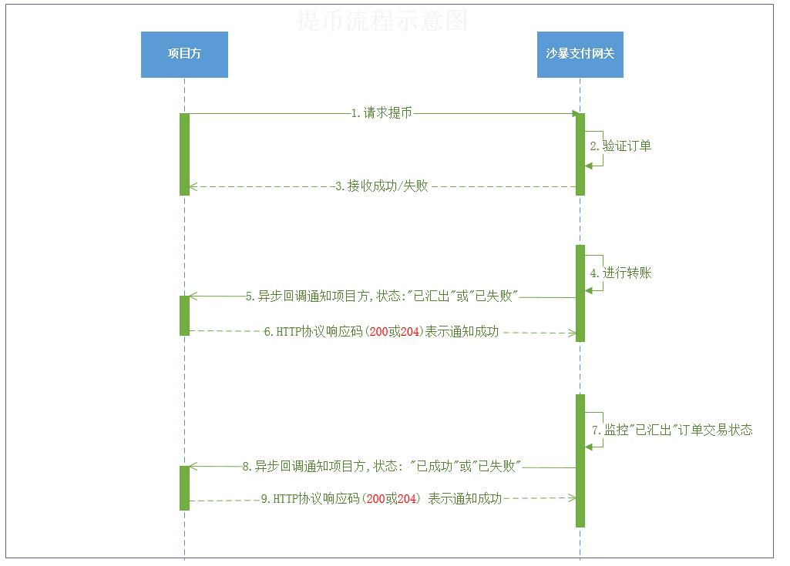

## 修改记录

| shbao版本号 | 修改内容                                                     | 修改日期   |
| ----------- | ------------------------------------------------------------ | ---------- |
| v1.0        | 新增 ETH、USDT和HTDF的充币、提币和归集功能                   | 2020.05.29 |
| v2.0        | 新增加 BTC充币、 提币和归集功能。API的请求参数和返回参数均未改动。注意BTC充币记录的`from_addr`和归集记录的`tx_hash`，文档中有详细说明。 | 2020.07.14 |
| v3.0        | 新增HRC20代币BTU(比特果)充币, 提币, 归集功能.<br> HRC20代币与HTDF共用充币地址和出币地址, 地址格式和tx_hash格式和HTDF完全一致, HRC20代币转账需要消耗HTDF作为矿工费, 类似ERC20-USDT代币交易 | 2020.08.10 |


## 支持币种

- BTC: 充币, 提币, 归集  (v2.0新增)
- ETH : 充币, 提币, 归集
- USDT: 充币, 提币, 归集
- HTDF: 充币, 提币, 归集
- BTU: 充币, 提币, 归集 (v3.0新增)

> 提示:  目前支持ERC20-USDT,  不支持 Omni-USDT和TRC20-USDT. 故下文中的USDT统一指ERC20-USDT, 不再另行说明.
>
> shbao测试环境说明: shbao支付网关的测试环境使用的是主网币, 即真实的币. 需项目方自行到交易所购买BTC, HTDF , ETH, USDT, BTU进行调试和测试. 

## 公共响应参数

| 字段      | 类型           | 描述                               |
| --------- | -------------- | ---------------------------------- |
| err_code  | Integer        | 错误码(0:成功,  其他错误码: 失败 ) |
| err_msg   | String 或 null | 错误信息(成功时为null)             |
| timestamp | Integer        | 时间戳(毫秒)                       |
| data      | Object 或 null | 数据(失败时为null)                 |


## 接口签名认证

- 签名算法 ed25519

- 签名消息:    timestamp | 接口名称(不带路径)|请求体的json字符串(键值按照字母顺序排序,去掉分割空白符)

- 请求头:

  > 特别注意: 如果使用nginx代理, 需要在配置文件中加上一行配置:   `underscores_in_headers on;`  
  >
  > 若使用了Apache, 请参考文章自行解决请求头被过滤的问题:  [解决Apache丢失含下划线的请求头](https://community.appdynamics.com/t5/Knowledge-Base/How-do-I-fix-Apache-and-Nginx-dropped-headers-needed-for/ta-p/37981)

  | HTTP请求头       | 说明                                                         |
  | ---------------- | ------------------------------------------------------------ |
  | PG_API_TIMESTAMP | 时间戳(精确到毫秒) , 过期时间2分钟(注意: 令网关的时间戳为`t_pg` ,  令用户的时间戳为 `t_usr`  ,  其中`t_usr`必须满足  `t_pg - 2min ≤  t_usr ≤  t_pg + 2min `) |
  | PG_API_KEY       | API KEY                                                      |
  | PG_API_SIGNATURE | 签名                                                         |

  > 提示: 服务器可以设置定时同步网络时间, 避免时间相差太大.
  >
  > 每隔一分钟更新一下时间
  >
  > ```
  > crontab -e
  > 
  > 输入
  > 
  > */1 * * * * /usr/sbin/ntpdate cn.ntp.org.cn
  > 
  > #关闭mail提示
  > echo "unset MAILCHECK">> /etc/profile
  > source /etc/profile
  > ```
  >

- 签名/验签步骤:
  
  - 项目方使用客户端私钥(PG_CLIENT_SIGN_KEY)对消息进行签名
  - 支付网关使用客户端公钥(PG_CLIENT_VERIFY_KEY)进行验签


### 接口签名与调用demo

- demo (Python版)

```python
#!coding:utf8
#author:yqq
#date:2020/6/16 0016 9:37
#description: shbao支付网关demo
#
# 运行环境:  python3.5及以上 , Linux,Unix, Mac OS, Windows(需要安装C++编译环境,如:visual studio 2015),
# 安装依赖: pip3 install requests , ed25519
# 启动: python3 demo.py


import json
import time
import requests
from ed25519 import SigningKey, VerifyingKey


def test_ed25519():
    # 测试 ED25519签名算法, 不同编程语言可以通过此测试用例,达成签名算法的一致
    # 温馨提示: data 仅仅是测试用例的数据, 仅仅用来测试ED255199签名算法的正确性, 并无实际含义, 不要猜疑
    # 不同编程语言可以通过此测试用例,达成签名的一致
    # 即测试以下内容:
    # 1. json对象转为json字符串时根据key按照字典排序, 并且去掉分隔的空白符
    # 2. json对象转为json字符串时, 对 None 或 null 的处理(不同编程语言可能不同)
    # 3. json对象bool 类型转为 json字符串时的情况
    # 4. json对象中内嵌 数组, 对象  的情况

    pg_client_sign_key = '7d9c911ca987e85c90af66511f0ba31ea95996ba7a095b5afcf58df82ae0016c'
    pg_client_verify_key = '77dbfd30dedf746fb6088017cf5fdcbe59411686784bd5a27ca40cef26cab4f7'
    api_name = 'this_is_api_name'
    data = {
        'book': 'book name',
        'apple': 'apple name',
        'cat': 'cat name',
        'null_field': None,
        'list_field': ['bbbbb', 'ccccc', 'aaaaaa'],
        'object_field': {
            'ccc': '0000',
            'bb': '11111',
            'aaa': '22222'
        },
        'is_ok': True,
    }

    try:
        data_json_str = json.dumps(data, separators=(',', ':'), sort_keys=True)  # 按照key字母顺序排序,并且去掉分隔的空白符
        print('json_str:{}'.format(data_json_str))

        # 进行断言
        right_data_json_str = '{"apple":"apple name","book":"book name","cat":"cat name","is_ok":true,"list_field":["bbbbb","ccccc","aaaaaa"],"null_field":null,"object_field":{"aaa":"22222","bb":"11111","ccc":"0000"}}'
        assert data_json_str == right_data_json_str, 'data_json_str 不正确!'

        timestamp_str = '1590156401029'
        print('tmpstamp_str:{}'.format(timestamp_str))

        join_str = '|'.join([timestamp_str, api_name, data_json_str])
        print('join_str:{}'.format(join_str))

        # 进行断言
        right_join_str = '1590156401029|this_is_api_name|{"apple":"apple name","book":"book name","cat":"cat name","is_ok":true,"list_field":["bbbbb","ccccc","aaaaaa"],"null_field":null,"object_field":{"aaa":"22222","bb":"11111","ccc":"0000"}}'
        assert join_str == right_join_str, "join_str 不正确!"


        #以下操作包含很多字节数组的操作, 不同语言有所不同, 请自行处理
        #转为字节数组,
        sign_msg_bytes = join_str.encode('utf8')
        print('sign_msg_bytes:{}'.format(sign_msg_bytes))
        right_sign_msg_bytes = b'1590156401029|this_is_api_name|{"apple":"apple name","book":"book name","cat":"cat name","is_ok":true,"list_field":["bbbbb","ccccc","aaaaaa"],"null_field":null,"object_field":{"aaa":"22222","bb":"11111","ccc":"0000"}}'

        #断言字节数组的长度和内容
        assert  len(sign_msg_bytes) == len(right_sign_msg_bytes) == 217 , 'sign_msg_bytes 长度不正确!'
        assert sign_msg_bytes == right_sign_msg_bytes , "sign_msg_bytes 不正确!"


        sk = SigningKey(sk_s=pg_client_sign_key.encode('utf8'), prefix='', encoding='hex')
        signature_bytes = sk.sign(msg=sign_msg_bytes, prefix='', encoding='hex')
        print('signature_bytes:{}'.format(signature_bytes))

        #断言签名 的字节数组的长度和内容
        right_signature_bytes = b'b49f98bb45152191eef0d10a44e726638e295aaf6f3cc6abcc80fe521db392fb06ea72b99a6a59c58661dd660984f24b958d4c907e1e776c4304f9dc045a4504'
        assert len(signature_bytes) == len(right_signature_bytes) ==  128 , "signature_bytes 长度不正确!"
        assert signature_bytes == right_signature_bytes , "signature_bytes 不正确!"

        # 进行断言
        signature_str = signature_bytes.decode('utf8')
        print('signature_str:{}'.format(signature_str))
        right_signature_str = 'b49f98bb45152191eef0d10a44e726638e295aaf6f3cc6abcc80fe521db392fb06ea72b99a6a59c58661dd660984f24b958d4c907e1e776c4304f9dc045a4504'
        assert len(signature_str) == len(right_signature_str) == 128 , 'signature_str 长度不正确!'
        assert signature_str == right_signature_str, 'signature_str 不正确!'


        #使用公钥进行 验证签名,  即 自签自验,  如果没有抛异常,则说明验签成功
        vk = VerifyingKey(vk_s=pg_client_verify_key, prefix='', encoding='hex')
        vk.verify(sig=signature_str, msg=sign_msg_bytes, prefix='', encoding='hex')
        print('验签成功')

        print('ED25519签名测试用例, 测试通过!')
    except Exception as e:
        print('ED25519签名测试用例,测试失败! {}'.format(e))
    pass


############################## 以下是测试支付网关API的测试用例 #############################################
GLOBAL_PRO_ID = 1
GLOBAL_API_KEY = 'ad68accaab14a18e15afe21f1330acac5ee3bb4d0c2709443b7d4def89b985bc'  # API KEY
GLOBAL_CLIENT_SIGN_KEY = '7d9c911ca987e85c90af66511f0ba31ea95996ba7a095b5afcf58df82ae0016c'  #客户端私钥
GLOBAL_HOST = 'http://192.168.10.174'

def comman_sign_and_request(req_body: dict, api_name: str, sign_key: str, api_key: str, api_url: str) :
    """
    签名函数
    :param req_data: 请求体
    :param api_name: 接口名
    :param timestamp_in_ms_str:  时间戳字符串(毫秒)
    :param sign_key: 客户端私钥
    :return: 签名字符串
    """

    #注意 签名用的时间戳字符串 要和  请求头里面的时间戳字符串 相同
    timestamp_in_ms_str = str(int(time.time() * 1000))
    print("时间戳(毫秒级)字符串:{}".format(timestamp_in_ms_str))

    json_str = json.dumps(req_body, separators=(',', ':'), sort_keys=True)  # 按照key字母顺序排序
    print('json字符串(key按照字母顺序排序):{}'.format(json_str))


    join_str = '|'.join([timestamp_in_ms_str, api_name, json_str])
    print('拼接的[签名消息体]:{}'.format(join_str))

    msg_bytes = join_str.encode('utf8')
    print('签名消息体的字节数组:{}'.format(msg_bytes))

    sk = SigningKey(sk_s=sign_key.encode('latin1'), prefix='', encoding='hex')
    sig_bytes = sk.sign(msg=msg_bytes, prefix='', encoding='hex')
    print("签名的字节数组:{}".format(sig_bytes))

    sig_str = sig_bytes.decode('utf8')
    print('签名的字符串形式:{}'.format(sig_str))


    ########## 开始请求 ############

    header = {
        'PG_API_KEY': api_key,
        'PG_API_TIMESTAMP': timestamp_in_ms_str, #注意 签名用的时间戳字符串 要和  请求头里面的时间戳字符串 相同
        'PG_API_SIGNATURE': sig_str
    }

    rsp = requests.post(url=api_url, json=req_body, headers=header)
    rsp_data = rsp.json()
    print(rsp_data)

    pass


def test_addaddresses():

    api_url =  GLOBAL_HOST + '/api/wallet/addaddresses'
    api_name = 'addaddresses'
    req_body = {
        'pro_id': GLOBAL_PRO_ID, #项目方id
        'address_count': 1, #申请地址数量
        'token_name': 'HTDF',   # 申请的币种名  HTDF 或 ETH.  注意: USDT共用ETH的地址,不需要单独申请
    }

    comman_sign_and_request(req_body=req_body,
                            api_name=api_name,
                            sign_key=GLOBAL_CLIENT_SIGN_KEY,
                            api_key=GLOBAL_API_KEY,
                            api_url=api_url)

    print('test_addaddresses() 测试结束')

    pass


def test_queryaddress():

    api_url = GLOBAL_HOST + '/api/wallet/queryaddresses'
    api_name = 'queryaddresses'

    req_body = {
        'pro_id': GLOBAL_PRO_ID,
        'token_name': 'HTDF', # HTDF 或 ETH , 注意: USDT共用ETH的地址,不需要单独申请
        'page_index':1,
        'page_size':20,
        # 'order_id':'202006081010508973077'  #可选参数,
    }

    comman_sign_and_request(req_body=req_body,
                            api_name=api_name,
                            sign_key=GLOBAL_CLIENT_SIGN_KEY,
                            api_key=GLOBAL_API_KEY,
                            api_url=api_url)

    print('test_queryaddress() 测试结束')
    pass


def test_queryaddaddressorder():

    api_url = GLOBAL_HOST + '/api/wallet/queryaddaddressesorder'
    api_name = 'queryaddaddressesorder'

    req_body = {
        'pro_id': GLOBAL_PRO_ID,
        'order_id':'202005281828093277212'  #申请充币地址的订单号
    }

    comman_sign_and_request(req_body=req_body,
                            api_name=api_name,
                            sign_key=GLOBAL_CLIENT_SIGN_KEY,
                            api_key=GLOBAL_API_KEY,
                            api_url=api_url)

    print('test_queryaddaddressorder() 测试结束')
    pass


def test_getdepositdata():

    api_url = GLOBAL_HOST + '/api/deposit/getdepositdata'
    api_name = 'getdepositdata'

    #方式1: 根据区块高度查询(推荐)
    req_body = {
        'pro_id': GLOBAL_PRO_ID,
        'token_name': 'HTDF',   # HTDF 或 ETH  或 USDT
        'start_height': 0,   #初始情况下设置为0即可. 后期根据自己库里面的最大高度减去一个常量(如:3000) 作为起始高度即可
        'end_height': 999999999,  #如果不是范围查询, 此值设置为 亿级别即可
        'page_index': 1,
        'page_size': 2,
    }

    #方式2: 根据时间戳(秒级)查询(做对账时, 可以使用此种查询方式)
    # req_body = {
    #     'pro_id': 1,
    #     'token_name': 'ETH',
    #     'start_blocktime': 0,
    #     'end_blocktime': 99999999999,
    #     'page_index': 1,
    #     'page_size': 2,
    # }

    comman_sign_and_request(req_body=req_body,
                            api_name=api_name,
                            sign_key=GLOBAL_CLIENT_SIGN_KEY,
                            api_key=GLOBAL_API_KEY,
                            api_url=api_url)

    print('test_getdepositdata() 测试结束')
    pass


def test_getcollectiondata():

    api_url =  GLOBAL_HOST + '/api/collection/getcollectiondata'
    api_name = 'getcollectiondata'

    req_body = {
        'pro_id': GLOBAL_PRO_ID,
        'token_name': 'HTDF',   # HTDF 或 ETH  或 USDT
        'start_time' : 0,
        'end_time' : 9999999999,
        'page_index':1,
        'page_size':20
    }

    comman_sign_and_request(req_body=req_body,
                            api_name=api_name,
                            sign_key=GLOBAL_CLIENT_SIGN_KEY,
                            api_key=GLOBAL_API_KEY,
                            api_url=api_url)

    print('test_getcollectiondata() 测试结束')
    pass


def test_withraw():

    api_url =  GLOBAL_HOST + "/api/withdraw/withdraw"
    api_name = 'withdraw'

    #生成唯一的order_id(长度大于10小于20即可), 此例仅供参考.  项目方需根据自己业务规则生成order_id
    order_id = (str(int(time.time()*1000000)) + str(int(time.time()*1000000)))[0:20]

    req_body = {
        "pro_id": GLOBAL_PRO_ID,
        "token_name": "HTDF",   # HTDF 或 ETH  或 USDT
        "order_id": order_id, #此order_id是由项目方自己生成唯一的订单号,注意和其他接口的order_id进行区分
        "from_address": 'htdf1vhq6c38demm58cnevc4sntc77z8ppvl85mj0a6',
        "to_address": 'htdf1up029t56rn9hfg72kp0f2mkn05j57a7t8422jx',
        "amount": '0.12345678',  #保留8位小数, 注意:超过8位小数则进行截取!
        "callback_url": "http://192.168.10.29:8001/notify/withdraw"  #回调接口的url, 由项目方实现,具体说明请看文档.
    }

    comman_sign_and_request(req_body=req_body,
                            api_name=api_name,
                            sign_key=GLOBAL_CLIENT_SIGN_KEY,
                            api_key=GLOBAL_API_KEY,
                            api_url=api_url)
    print('test_withraw() 测试结束')
    pass


def test_query_withdraw_order():

    api_url  = GLOBAL_HOST + "/api/withdraw/querywithdraworder"
    api_name = 'querywithdraworder'

    req_body = {
        'pro_id': GLOBAL_PRO_ID,
        'serial_id' : '202006081349179432754'   #此serial_id 是 withdraw接口返回数据中的 serial_id, 即订单的唯一标识
    }

    comman_sign_and_request(req_body=req_body,
                            api_name=api_name,
                            sign_key=GLOBAL_CLIENT_SIGN_KEY,
                            api_key=GLOBAL_API_KEY,
                            api_url=api_url)

    print("test_query_withdraw_order() 测试结束")
    pass


def test_queryallwithdrawdata():

    api_url = GLOBAL_HOST + "/api/withdraw/queryallwithdrawdata"
    api_name = 'queryallwithdrawdata'

    req_body = {
        'pro_id': GLOBAL_PRO_ID,
        'token_name': 'HTDF',  # HTDF 或 ETH  或 USDT
        'start_time': 0,
        'end_time': 9999999999,
        'page_index': 1,
        'page_size': 20
    }

    comman_sign_and_request(req_body=req_body,
                            api_name=api_name,
                            sign_key=GLOBAL_CLIENT_SIGN_KEY,
                            api_key=GLOBAL_API_KEY,
                            api_url=api_url)

    print("test_queryallwithdrawdata() 测试结束")
    pass


def main():

    test_ed25519()
    test_queryaddress()
    test_queryaddaddressorder()
    test_addaddresses()
    test_getdepositdata()
    test_withraw()
    test_queryallwithdrawdata()
    test_query_withdraw_order()
    test_getcollectiondata()


    pass


if __name__ == '__main__':

    main()
```


  


- 运行
  
```
  pip3 install ed25519

  python3 demo.py
```

  


- demo(Java版)

```java
//-------以下是Java的Ed25519的 签名/验签 demo, 仅作为参考, 项目方需根据自己业务进行具体实现-----------
import com.alibaba.fastjson.JSONObject;
import com.alibaba.fastjson.serializer.SerializerFeature;
import org.apache.commons.lang3.StringUtils;
import org.bouncycastle.crypto.Signer;
import org.bouncycastle.crypto.params.Ed25519PrivateKeyParameters;
import org.bouncycastle.crypto.params.Ed25519PublicKeyParameters;
import org.bouncycastle.crypto.signers.Ed25519Signer;
import java.util.Calendar;


public class PgEncryptUtilsDemo {

    public static byte[] hex2bytes(String hexString) {
        if (StringUtils.isEmpty(hexString)) {
            return null;
        }
        hexString = hexString.toLowerCase();
        final byte[] byteArray = new byte[hexString.length() >> 1];
        int index = 0;
        for (int i = 0; i < hexString.length(); i++) {
            if (index  > hexString.length() - 1) {
                return byteArray;
            }
            byte highDit = (byte) (Character.digit(hexString.charAt(index), 16) & 0xFF);
            byte lowDit = (byte) (Character.digit(hexString.charAt(index + 1), 16) & 0xFF);
            byteArray[i] = (byte) (highDit << 4 | lowDit);
            index += 2;
        }
        return byteArray;
    }

    public static String bytes2Hex(byte[] byteArray) {
        final StringBuilder hexString = new StringBuilder("");
        if (byteArray == null || byteArray.length <= 0) {
            return null;
        }
        for (int i = 0; i < byteArray.length; i++) {
            int v = byteArray[i] & 0xFF;
            String hv = Integer.toHexString(v);
            if (hv.length() < 2) {
                hexString.append(0);
            }
            hexString.append(hv);
      }
        return hexString.toString().toLowerCase();
    }

    /**
     * 签名
     * @param obj 请求对象
     * @param timestamp 时间戳（毫秒）--1590156401029
     * @param apiName 请求的API名称
     * @param privateKey 客户端私钥
     * @return
     * @throws Exception
     */
    public static String generateSignature(Object obj, long timestamp, String apiName, String privateKey) throws Exception {
        //按字母排序
        String content = JSONObject.toJSONString(obj, SerializerFeature.MapSortField, SerializerFeature.WriteMapNullValue);
        System.out.println("toJSONString:" + content);
        System.out.println("--------------------------");
        String enceyptStr = timestamp + "|" + apiName + "|" + content;
        System.out.println("joinStr:" + enceyptStr);
        System.out.println("--------------------------");
        //utf-8编码
        byte[] contentByte = enceyptStr.getBytes("UTF-8");
        Ed25519PrivateKeyParameters privateKeyRebuild = new Ed25519PrivateKeyParameters(hex2bytes(privateKey), 0);
        // 签名
        Signer signer = new Ed25519Signer();
        signer.init(true, privateKeyRebuild);
        signer.update(contentByte, 0, contentByte.length);
        byte[] signature = signer.generateSignature();
        return bytes2Hex(signature);
    }

    /**
     * 验签
     * @param obj 接收对象
     * @param timestamp 时间戳（毫秒）--1590156401029
     * @param apiName 请求的API名称
     * @param signatureStr 签名
     * @param serverVerifyKey 服务端公钥
     */
    public static Boolean verify(Object obj, String timestamp, String apiName, String signatureStr, String serverVerifyKey) {
        try {
            //按字母排序
            String content = JSONObject.toJSONString(obj, SerializerFeature.MapSortField, SerializerFeature.WriteMapNullValue);
            System.out.println("toJSONString:" + content);
            System.out.println("--------------------------");
            String enceyptStr = timestamp + "|" + apiName + "|" + content;
            System.out.println("joinStr:" + enceyptStr);
            System.out.println("--------------------------");
            //utf-8编码
            byte[] contentByte = enceyptStr.getBytes("UTF-8");
            Ed25519PublicKeyParameters ed25519PublicKeyParameters = new Ed25519PublicKeyParameters(hex2bytes(serverVerifyKey), 0);
            System.out.println(bytes2Hex(ed25519PublicKeyParameters.getEncoded()));
            byte[] signature = hex2bytes(signatureStr);
            // 验签
            Signer verifier = new Ed25519Signer();
            verifier.init(false, ed25519PublicKeyParameters);
            verifier.update(contentByte, 0, contentByte.length);
            return verifier.verifySignature(signature);
        }catch (Exception e){
            return false;
        }
    }
}
//--------------------签名/验签_End-------------------------


//-------以下是 SpringBoot 的Demo 仅作为接口调用参考,项目方需根据自己业务自行实现----------
import com.alibaba.fastjson.JSON;
import com.alibaba.fastjson.TypeReference;
import lombok.extern.slf4j.Slf4j;
import org.apache.commons.lang3.StringUtils;
import org.springframework.beans.factory.annotation.Autowired;
import org.springframework.beans.factory.annotation.Value;
import org.springframework.http.*;
import org.springframework.stereotype.Service;
import org.springframework.web.client.RestTemplate;
import java.math.BigDecimal;
import java.util.Calendar;

@Slf4j
@Service
public class JavaDemo {

    private static final String TOKEN_NAME = "USDT"; 
    
    //API_KEY
    @Value("${api-key}")
    private String apiKey;
    //客户端私钥
    @Value("${private-key}")
    private String privateKey;
    //服务端公钥(用于对支付网关回调请求数据进行验签)
    @Value("${server_verify_key}")
    private String serverVerifyKey;
    //支付网关url
    @Value("${pg-url}")
    private String pgUrl;
    //提币回调接口的URL
    @Value("${withdraw-callback-url}")
    private String withdrawCallbackUrl;
    //出币地址
    @Value("${withdraw-address}")
    private String withdrawAddress;
    //项目方ID
    @Value("${pro_id}")
    private Integer proId;
    

    @Autowired
    private RestTemplate restTemplate;

    //公共函数 (仅供参考)
    private< T > PgResult exchange(String module, String apiName, T param) {
        long timestamp = System.currentTimeMillis();
        String signature = null;
        try {
            signature = PgEncryptUtilsDemo.generateSignature(param, timestamp, apiName, privateKey);
         } catch (Exception e) {
            e.printStackTrace();
            throw RequestException.fail("连接签名错误");
         }
        if(signature == null) {
            throw RequestException.fail("连接签名错误");
        }
        HttpHeaders headers = new HttpHeaders();
        headers.setContentType(MediaType.APPLICATION_JSON);
        headers.set("PG_API_TIMESTAMP", String.valueOf(timestamp));
        headers.set("PG_API_KEY", apiKey);
        headers.set("PG_API_SIGNATURE", signature);
        
        HttpEntity < T > entity = new HttpEntity<>(param, headers);
        ResponseEntity<PgResult> exchange = restTemplate.exchange(pgUrl+ "/" + module + "/" + apiName,
                HttpMethod.POST, entity, PgResult.class);
        PgResult body = exchange.getBody();
        if (body == null) {
            throw new RequestException("返回为空");
        } else {
            log.info(JSON.toJSONString(body));
            if(body.getErr_code() != 0) {
                log.error(body.getErr_msg());
                throw RequestException.fail(body.getErr_msg());
            }
        }
        return body;
    }

    @Data
    public class PgAddressesReq {
        private Integer pro_id;
        private String token_name; //注意: USDT共用ETH, 不需单独申请USDT地址
        private Integer address_count;
    }

    //申请地址 (仅供参考)
    public void addAddresses(AccountAddressApplyDO accountAddressApplyDO) {
        PgAddressesReq pgAddressesReq = new PgAddressesReq();
        pgAddressesReq.setPro_id(proId);
        pgAddressesReq.setAddress_count(accountAddressApplyDO.getApplyCount());
        pgAddressesReq.setToken_name("ETH"); //注意: USDT共用ETH, 不需单独申请USDT地址
        PgResult result = exchange("wallet","addaddresses", pgAddressesReq);
        System.out.println(JSON.toJSONString(result));
    }

    //查询地址 (仅供参考)
    public void queryAddresses(PgAddressesQueryReq pgAddressesQueryReq) {
        pgAddressesQueryReq.setPro_id(proId);
        pgAddressesQueryReq.setToken_name("ETH");
        pgAddressesQueryReq.setPage_size(100);
        PgResult result = exchange("wallet","queryaddresses", pgAddressesQueryReq);
        System.out.println(JSON.toJSONString(result));
    }

    //查询申请地址订单详情 (仅供参考)
    public void queryAddAddressesOrder(String orderId) {
        PgQueryAddressesOrderReq pgQueryAddressesOrderReq = new PgQueryAddressesOrderReq();
        pgQueryAddressesOrderReq.setOrder_id(orderId);
        pgQueryAddressesOrderReq.setPro_id(proId);
        PgResult result = exchange("wallet","queryaddaddressesorder", pgQueryAddressesOrderReq);
        System.out.println(JSON.toJSONString(result));
    }

    //获取充币数据 (仅供参考)
    public void getDepositData(PgDepositQueryReq pgDepositQueryReq) {
        pgDepositQueryReq.setPro_id(proId);
        pgDepositQueryReq.setToken_name(CoinName.USDT);
        pgDepositQueryReq.setEnd_height(999999999);
        pgDepositQueryReq.setPage_size(50);
        PgResult result = exchange("deposit","getdepositdata", pgDepositQueryReq);
        System.out.println(JSON.toJSONString(result));
    }

    //提币 (仅供参考)
    public void withdraw(AccountWithdrawOrderDO withdrawOrder) {
        
        PgWithdrawReq param = new PgWithdrawReq();
        param.setOrder_id(withdrawOrder.getOrderNo());
        param.setFrom_address(withdrawAddress);
        param.setTo_address(withdrawOrder.getAddress());
        param.setAmount(withdrawOrder.getArrivalAmount().setScale(6, BigDecimal.ROUND_DOWN).toString());
        param.setToken_name(TOKEN_NAME);
        param.setPro_id(proId);
        param.setCallback_url(withdrawCallbackUrl);
        
        //调用发送申请
        PgResult<PgWithdrawResult> result = exchange("withdraw","withdraw",param);
         System.out.println(JSON.toJSONString(result));
    }

  
    //查询归集数据 (仅供参考)
    public PgCollectionQueryResult queryCollection(PgCollectionQueryReq pgCollectionQueryReq) {

        if(pgCollectionQueryReq == null) {
            pgCollectionQueryReq = new PgCollectionQueryReq();
        }
        if(pgCollectionQueryReq.getPage_index() == null) {
            pgCollectionQueryReq.setPage_index(1);
        }
        if(pgCollectionQueryReq.getPage_size() == null) {
            pgCollectionQueryReq.setPage_size(50);
        }
        if(pgCollectionQueryReq.getStart_time() == null) {
            pgCollectionQueryReq.setStart_time(0L);
        }
        if(pgCollectionQueryReq.getEnd_time() == null) {
            pgCollectionQueryReq.setEnd_time(Calendar.getInstance().getTimeInMillis()/1000);
        }
        
        pgCollectionQueryReq.setPro_id(proId);
        pgCollectionQueryReq.setToken_name(TOKEN_NAME);
        
        PgResult<PgCollectionQueryResult> result = exchange("collection","getcollectiondata",pgCollectionQueryReq);
        if(result == null) {
            throw RequestException.fail("查询失败");
        }
        PgCollectionQueryResult pgCollectionQueryResult =  JSON.parseObject(JSON.toJSONString(result.getData()), new TypeReference<PgCollectionQueryResult>() {});
        return pgCollectionQueryResult;
    }
}

//--------------SpringBoot Demo End--------------------------
```


- demo(PHP版)

  - 若请求接口出现报错`"err_code":403, "err_msg":"invalid auth"`, 即签名认证失败.  常见原因和解决方案如下(不限编程语言, 其他编程语言也可以适用):
    - 时间不同步. 解决方案: 请保证运行环境的时间和网络时间(UTC+8)同步!  
      - LInux环境请运行  `ntpdate cn.ntp.org.cn` 
      - Windows环境请自行同步时间
    - 请求格式不是json.  解决方案: 请务必使用   `application/json`, 而不是 `form`
    - 请求头丢失.  解决方案: 
      - 如果使用了nginx代理, 请参考上文, 在nginx配置文件中添加一行配置: `underscores_in_headers on;`
      - 若使用Apache请自行解决(Apache可参考: [解决Apache丢失含下划线的请求头](https://community.appdynamics.com/t5/Knowledge-Base/How-do-I-fix-Apache-and-Nginx-dropped-headers-needed-for/ta-p/37981)).
    - 请求数据格式错误,  解决方案: 请参考API文档给出的数据类型, 确保请求数据的正确性

  

  - 以下demo代码中的某些硬编码的参数, 请项目方自行更改成自己的参数, 例如: API KEY, 私钥, 提币地址等等...., 代码注释中不再赘述. 
  
  
  
  - php版Demo使用简单说明: 
    - 请将 `$GLOBAL_PRO_ID` 修改成对应的 `项目方ID`
    - 请将`$GLOBAL_HOST` 修改成对应的host
    - 请将`$GLOBAL_API_KEY` 修改成项目方自己的 `API KEY`
    - 请将 `$GLOBAL_CLIENT_SIGN_KEY` 修改成项目方自己的 `客户端私钥`
  
  

```php

class sign{
      ########### 以下是测试支付网关API的测试用例(仅供参考) ################
      private static $GLOBAL_PRO_ID = 1  #请换成自己的 项目方id
      private static $GLOBAL_HOST = 'https://test.shbao.me:8777'; //测试环境

      private static $GLOBAL_API_KEY = 'ad68accaab14a18e15afe21f1330acac5ee3bb4d0c2709443b7d4def89b985bc';  # API KEY, 请换成自己的 API KEY
      private static $GLOBAL_CLIENT_SIGN_KEY = '7d9c911ca987e85c90af66511f0ba31ea95996ba7a095b5afcf58df82ae0016c';  #客户端私钥, 请换成自己的客户端私钥
      
      public function getbytes($str) {
          $len = strlen($str);
          $bytes = array();
          for($i=0;$i<$len;$i++) {
              if(ord($str[$i]) >= 128){
                  $byte = ord($str[$i]);
              }else{
                  $byte = ord($str[$i]);
              }
              $bytes[] =  $byte ;
          }
          return $bytes;
      }
      
      public function toStr($bytes) {
          $str = ''; 
          foreach($bytes as $ch) { 
              $str .= chr($ch); 
          } 
          return $str; 
      }

      public function http_curl($url,$content='',$headers = array(),$type='get'){
          // 1. 初始化
          $ch = curl_init();
          // 2. 设置选项，包括URL
          curl_setopt($ch,CURLOPT_URL,$url);
          curl_setopt($ch, CURLOPT_HTTPHEADER, $headers);
          curl_setopt($ch, CURLOPT_SSL_VERIFYPEER, FALSE);
          curl_setopt($ch, CURLOPT_RETURNTRANSFER, TRUE); 
          curl_setopt($ch,CURLOPT_FOLLOWLOCATION,1);
          if($type=='post'){
              curl_setopt($ch, CURLOPT_POST, TRUE); 
              curl_setopt($ch, CURLOPT_POSTFIELDS, $content);
              $ret = curl_exec($ch);
              curl_close($ch);
          }else{
              // 3. 执行并获取HTML文档内容
              $ret = curl_exec($ch);
              // 4. 释放curl句柄
              curl_close($ch);
          }
          return $ret;
      }
      
      // 公共  签名和请求测试函数
      public function comman_sign_and_request($req_body,$api_name,$sign_key,$api_key,$api_url){
          
          //根据key按照字典(字母顺序)排序
          ksort($req_body);
          
          //注意:php版本必须是 5.4及以上,才能使用 JSON_UNESCAPED_SLASHES
          //使用JSON_UNESCAPED_SLASHES  防止 '/'被转义, 因withdraw接口的callback_url包含 '/'
          //如果php版本是 5.4以下的, 请使用字符串替换即可:  
          // 例如: $data_json_str = str_replace("\\/", "/", json_encode($req_body));
          $data_json_str  = json_encode($req_body, JSON_UNESCAPED_SLASHES);
          print('json_str : '.$data_json_str."\n");
      
          // #注意 签名用的时间戳字符串 要和  请求头里面的时间戳字符串 相同
          $timestamp_str = time() * 1000;  //
        
          // $timestamp_str = 1590156401029;
          print('tmpstamp_str : '.$timestamp_str."\n");
      
          $join_str  = implode("|",array($timestamp_str,$api_name,$data_json_str)); 
          print('join_str : '.$join_str."\n"); 
      
          $sign_msg_bytes = utf8_encode($join_str);
              
          $mySecret = $this->getbytes(hex2bin($sign_key));
      
          $myPublic = ed25519_publickey($this->toStr($mySecret));
          
          $signature_str = bin2hex(ed25519_sign($sign_msg_bytes, $this->toStr($mySecret), $myPublic));
          print('signature_str : '.$signature_str."\n");


      
          //注意 签名用的时间戳字符串 要和  请求头里面的时间戳字符串 相同
          $header  = array(
                  'PG_API_KEY:'.$api_key,
                  'PG_API_TIMESTAMP:'.$timestamp_str, 
                  'PG_API_SIGNATURE:'.$signature_str,
              );
      
          $data = $this->http_curl($api_url,$data_json_str,$header,'post');
          print('响应内容:'.$data."\n");
          return $data;
      }
      
      public function test_addaddresses(){
          $api_url = self::$GLOBAL_HOST.'/api/wallet/addaddresses';
          $api_name = 'addaddresses';

  		// 注意: 如果已经存在一笔"未完成"的申请订单, 不能再次申请. 详情请看下文API文档中的详细说明
          $req_body =array(
              'pro_id'=>self::$GLOBAL_PRO_ID,
              'address_count'=>1,
              'token_name'=>'HTDF'
          );
          
          $data = $this->comman_sign_and_request(
              $req_body,
              $api_name,
              self::$GLOBAL_CLIENT_SIGN_KEY,
              self::$GLOBAL_API_KEY,
              $api_url
          );
          
          print('test_addaddresses() 测试结束');
          
      }
      
      public function test_queryaddress(){
          $api_url = self::$GLOBAL_HOST.'/api/wallet/queryaddresses';
          $api_name = 'queryaddresses';

  

          $req_body =array(
              'pro_id'=>self::$GLOBAL_PRO_ID,
              'token_name'=>'HTDF', # HTDF 或 ETH , 注意: USDT共用ETH的地址,不需要单独申请
              'page_index'=>1,
              'page_size'=>20,
              # 'order_id':'202006081010508973077'  #可选参数,
          );
          
          $data = $this->comman_sign_and_request(
              $req_body,
              $api_name,
              self::$GLOBAL_CLIENT_SIGN_KEY,
              self::$GLOBAL_API_KEY,
              $api_url
          );
          
          print('test_queryaddress() 测试结束');
          
      }

  

      public function test_queryaddaddressorder(){
          $api_url = self::$GLOBAL_HOST.'/api/wallet/queryaddaddressesorder';
          $api_name = 'queryaddaddressesorder';


          $req_body =array(
              'pro_id'=>self::$GLOBAL_PRO_ID,
              'order_id'=>'202005281828093277212'  #申请充币地址的订单号
          );
          
          $data = $this->comman_sign_and_request(
              $req_body,
              $api_name,
              self::$GLOBAL_CLIENT_SIGN_KEY,
              self::$GLOBAL_API_KEY,
              $api_url
          );


   
          print('test_queryaddaddressorder() 测试结束');
          
      }

  

      public function test_getdepositdata(){
          $api_url = self::$GLOBAL_HOST.'/api/deposit/getdepositdata';
          $api_name = 'getdepositdata';

  

          $req_body =array(
              'pro_id'=>self::$GLOBAL_PRO_ID,
              'token_name'=>'HTDF',   # HTDF 或 ETH  或 USDT
              'start_height'=> 0,   #初始情况下设置为0即可. 后期根据自己库里面的最大高度减去一个常量(如:3000) 作为起始高度即可
              'end_height'=>999999999,  #如果不是范围查询, 此值设置为 亿级别即可
              'page_index'=> 1,
              'page_size'=> 2,
          );
    
          #方式2: 根据时间戳(秒级)查询(做对账时, 可以使用此种查询方式)
          # req_body = array(
          #     'pro_id'=> 1,
          #     'token_name'=> 'ETH',
          #     'start_blocktime'=> 0,
          #     'end_blocktime'=> 99999999999,
          #     'page_index'=> 1,
          #     'page_size'=> 2,
          # )
          $data = $this->comman_sign_and_request(
              $req_body,
              $api_name,
              self::$GLOBAL_CLIENT_SIGN_KEY,
              self::$GLOBAL_API_KEY,
              $api_url
          );
       
          print('test_getdepositdata() 测试结束');
      }

  

      public function test_getcollectiondata(){
          $api_url = self::$GLOBAL_HOST.'/api/collection/getcollectiondata';
          $api_name = 'getcollectiondata';
      
          $req_body =array(
              'pro_id'=>self::$GLOBAL_PRO_ID,
              'token_name'=> 'HTDF',   # HTDF 或 ETH  或 USDT
              'start_time' => 0,
              'end_time' =>9999999999,
              'page_index'=>1,
              'page_size'=>20
          );
          
          $data = $this->comman_sign_and_request(
              $req_body,
              $api_name,
              self::$GLOBAL_CLIENT_SIGN_KEY,
              self::$GLOBAL_API_KEY,
              $api_url
          );
          
          print('test_getcollectiondata() 测试结束');
      }

  

      public function test_withraw(){
          $api_url = self::$GLOBAL_HOST.'/api/withdraw/withdraw';
          $api_name = 'withdraw';
      
          #生成唯一的order_id(长度大于10小于20即可), 此例仅供参考.  项目方需根据自己业务规则生成order_id
          $order_id = rand(1000,9999).time() * 1000;
      
          $req_body =array(
              "pro_id"=>self::$GLOBAL_PRO_ID,
              "token_name"=> "HTDF",   # HTDF 或 ETH  或 USDT
              "order_id"=> $order_id, #此order_id是由项目方自己生成唯一的订单号,注意和其他接口的order_id进行区分
              "from_address"=> 'htdf1vhq6c38demm58cnevc4sntc77z8ppvl85mj0a6', // 请替换成支付网关分配给项目方的对应币种的出币地址(from)
              "to_address"=> 'htdf1up029t56rn9hfg72kp0f2mkn05j57a7t8422jx', // 请自行替换目的地址, 如果转错,资产不可找回!
              "amount"=>'0.12345678',  #自行替换金额, 注意是否满足网关配置最小提币金额的限制, 保留8位小数, 注意:超过8位小数则进行截取!
              "callback_url"=>"http://192.168.10.29:8001/notify/withdraw"  #回调接口的url, 由项目方实现,具体说明请看文档.
          );
          
          $data = $this->comman_sign_and_request(
              $req_body,
              $api_name,
              self::$GLOBAL_CLIENT_SIGN_KEY,
              self::$GLOBAL_API_KEY,
              $api_url
          );
          
          print('test_withraw() 测试结束');
          
      }
      
      public function test_query_withdraw_order(){
          $api_url = self::$GLOBAL_HOST.'/api/withdraw/querywithdraworder';
          $api_name = 'querywithdraworder';
      
          $req_body =array(
              'pro_id'=>self::$GLOBAL_PRO_ID,
              'serial_id' => '202006081349179432754'   #此serial_id 是 withdraw接口返回数据中的 serial_id, 即订单的唯一标识
          );
          
          $data = $this->comman_sign_and_request(
              $req_body,
              $api_name,
              self::$GLOBAL_CLIENT_SIGN_KEY,
              self::$GLOBAL_API_KEY,
              $api_url
          );
          print("test_query_withdraw_order() 测试结束");
      }
      
      ######此函数用于测试ED25519算法, 注意和上面的API测试用例区分##################
      public function test_ed25519(){
          //注意: 不要改动此函数中的变量的值!  否则断言会失败!
      
          # 此函数仅仅是, 测试 ED25519签名算法, 不是API签名示例!  API签名示例, 请往下看.
          # 不同编程语言可以通过此测试用例,达成签名算法的一致
          # 即测试以下内容:
          # 1. json对象转为json字符串时根据key按照字典排序, 并且去掉分隔的空白符
          # 2. json对象转为json字符串时, 对 None 或 null 的处理(不同编程语言可能不同)
          # 3. json对象bool 类型转为 json字符串时的情况
          # 4. json对象中内嵌 数组, 对象  的情况

         
          //不要改
          $pg_client_sign_key = '7d9c911ca987e85c90af66511f0ba31ea95996ba7a095b5afcf58df82ae0016c';
  		//不要改
          $pg_client_verify_key = '77dbfd30dedf746fb6088017cf5fdcbe59411686784bd5a27ca40cef26cab4f7';
          //不要改
          $api_name = 'this_is_api_name';
          
          $array = array(
              'ccc'=>'0000',
              'bb'=>'11111',
              'aaa'=>'22222'
          );
          ksort($array);
          // # 温馨提示: data 仅仅是测试用例的数据, 仅仅用来测试ED255199签名算法的正确性, 并无实际含义, 不要猜疑, 不要猜疑, 不要猜疑!
          $data = array(
              'book'=>'book name',
              'apple'=>'apple name',
              'cat'=>'cat name',
              'null_field'=>null,
              'list_field'=>array('bbbbb','ccccc','aaaaaa'),
              'object_field'=>$array,
              'is_ok'=>true
          );
          ksort($data);
          $data_json_str  = json_encode($data);
          print('json_str : '.$data_json_str."\n");


        
          $timestamp_str = 1590156401029;
          print('tmpstamp_str : '.$timestamp_str."\n");
      
          $join_str  = implode("|",array($timestamp_str,$api_name,$data_json_str)); 
          print('join_str : '.$join_str."\n"); 
      
          $sign_msg_bytes = utf8_encode($join_str);
          print('sign_msg_bytes : '.$sign_msg_bytes."\n");
      
          $mySecret = $this->getbytes(hex2bin($pg_client_sign_key));
      
          $myPublic = ed25519_publickey($this->toStr($mySecret));
          
          $signature_str = bin2hex(ed25519_sign($sign_msg_bytes, $this->toStr($mySecret), $myPublic));
          print('signature_str : '.$signature_str."\n");
          
          //正确的签名: 
          $rigth_signature_str = 'b49f98bb45152191eef0d10a44e726638e295aaf6f3cc6abcc80fe521db392fb06ea72b99a6a59c58661dd660984f24b958d4c907e1e776c4304f9dc045a4504';
      
          //对签名结果进行断言, 
        assert($signature_str==$rigth_signature_str, '签名不正确!');

   
          // 自签自验
        if(ed25519_sign_open($sign_msg_bytes,  $myPublic, hex2bin($signature_str))){
              print('验签通过'."\n");
            print('ed25519签名算法测试 成功!'."\n");
          }else{
            print('验签失败'."\n");
              print('ed25519签名算法测试 失败!'."\n");
          }
      
      }
      ##############################################

  }

  $run = new sign();
  $run->test_ed25519(); // 测试ED25519依赖是否安装成功, 需此函数测试通过之后才能进行下列API测试!
  //待 test_ed25519() 测试用例通过之后, 方可放开下列测试
  /*
  $run->test_addaddresses();
  $run->test_queryaddress();
  $run->test_queryaddaddressorder();
  $run->test_getdepositdata();
  $run->test_getcollectiondata(); //
  $run->test_withraw(); //
  $run->test_query_withdraw_order(); //
*/

  //------------------php demo 结束----------------------------------
```

- php版demo需要安装依赖
  
```
  git clone git://github.com/encedo/php-ed25519-ext.git
  cd php-ed25519-ext
  phpize
  ./configure
  make
  sudo make install

```

- 最后添加extension=ed25519.so到/etc/php.ini 拓展中


## 回调通知接口统一规范

>  注意: **此接口由项目方实现, 并在提币请求参数的`callback_url`填写正确的接口URL**

> 特别注意: 如果使用nginx代理, 需要在配置文件中加上一行配置:   `underscores_in_headers on;`

提币流程粗略的示意图, 如下:




回调通知接口用于更新**提币**订单的状态,  项目方需特别注意此接口的幂等性.

- 接口名:  `notifywithdraw`

- 请求方式: `POST`

- 请求超时时间: `5` 秒 (即网关发起请求后5秒内没有收到响应,则视为请求超时, 请求超时作`通知失败`处理)

- 请求参数格式:

  

  | 字段               | 类型    | 描述                                                         |
  | :----------------- | :------ | :----------------------------------------------------------- |
  | pro_id             | Integer | 项目方ID                                                     |
  | serial_id          | String  | 支付网关生成的流水号                                         |
  | order_id           | String  | 项目方生成的订单号(长度大于10)                               |
  | from_addr          | String  | 提币的from地址, 项目方的出币地址(由支付网关预先分配), USDT共用ETH的出币地址 |
  | to_addr            | String  | 提币的to地址                                                 |
  | token_name         | String  | 币种名(HTDF, ETH, USDT)                                      |
  | remark             | String  | 备注说明(如果没有备注,此值为空字符串)                        |
  | amount             | String  | 提币金额(默认保留8位小数)                                    |
  | block_height       | Integer | 区块高度                                                     |
  | block_time         | Integer | 区块时间戳(秒) (如果没有区块时间,此值为null)                 |
  | tx_hash            | String  | 交易哈希(交易ID)                                             |
  | order_status       | String  | 提币订单状态 (PROCESSING:订单处理中, SUCCESS:订单已成功, FAIL:订单已失败 ) |
  | transaction_status | String  | 转账交易状态(NOTYET:尚未转账,  PENDING:已汇出,  FAIL:交易失败 SUCCESS:交易成功 ) |

  示例:

  ```json
  {
      "pro_id":3,
      "serial_id":"202005181831579041811",
      "order_id":"202239489238493934424842390",
      "from_addr":"htdf15nxttnteyedpdjp8s05phytf9pz5plfe5364cy",
      "to_addr":"htdf1053car7qw5hh5xfa3z6re7jnd5fl6cetqs8777",
      "token_name":"HTDF",
      "remark":"",
      "amount":"1.12345678",
      "block_height":723422,
      "block_time":1589797917,
      "tx_hash":"7A8193B8D686B6B9C8C05D5D39229DCF4897030AE7A25D6FD5D43B2115A8DBA5",
      "order_status":"PROCESSING",
      "transaction_status":"SUCCESS",
  }
  ```


  - order_status  (订单状态):

    - `PROCESSING`: 订单处理中
    - `SUCCESS`:订单已成功
    - `FAIL`:订单已失败

    > 特别注意: 
    >
    > 订单状态转换方向必须是单向的:  `PROCESSING -->SUCCESS `   或 `PROCESSING --> FAIL`

  - transaction_status  (转账交易状态):

    - `NOTYET` : 尚未转账(交易尚未广播)
    - `PENDING`: 已汇出,等待交易被矿工打包(即交易已广播, 等待确认...)
    - `FAIL`: 交易失败
    - `SUCCESS`: 交易成功

    > 特别注意:
    >
    > 1.转账交易状态转换方向必须是单向的: `NOTYET-->PENDING-->SUCCESS`  或 `NOTYET-->PENDING-->FAIL`
    >
    > 2.当`transaction_status`状态为`PENDING`时, 展示给普通用户的提币状态应该为"已汇出,等待区块确认..."或其他类似含义的文字 . 

- 响应格式(<font color=red>沙暴支付网关只关心HTTP协议响应码! 不关心HTTP响应体内容 !  重要事情只说一遍.  </font> )

  - 通知成功: HTTP协议响应码为 `204` 或 `200` 即表示通知成功,  与响应体内容无关

  - 通知失败: HTTP协议响应码为 `3xx` 或  `4xx` 或 `5xx` 或 `拒绝连接`  或 `HTTP请求超时` ...

    > 如果通知失败,网关会继续通知,直到超过25小时(超过25小时则此订单不再回调通知).  所以, 项目方在请求提币时务必填写正确的回调URL, 否则可能遗漏数据!

- 接口签名
  - 签名算法: 同上文的 "API签名认证"
  - 请求头: 
    - PG_NOTIFY_TIMESTAMP : 时间戳(精确到毫秒) , 过期时间3分钟
    - PG_NOTIFY_SIGNATURE : 消息签名
  - 签名消息:  
    -  timestamp_str|notifywithdraw|请求体的json字符串(键值按照字母顺序排序,去掉分割空白符)
  - 签名步骤: 支付网关使用服务端私钥(PG_SERVER_SIGN_KEY)进行签名 ,  项目方使用服务端公钥(PG_SERVER_VERIFY_KEY)进行验签


示例(仅供参考)

  ```python
  callback_url = 'http://192.168.10.29:8001/demo/notifywithdraw'
  api_name = 'notifywithdraw'   #硬编码为 notifywithdraw 即可
  timeout = 5  #超时时间
  timestamp_str = str(int(time.time() * 1000))  #精确到毫秒
  req_data = {'pro_id':3,'serial_id':'xxx', .......}  # ........ 表示其他参数
  data_json_str = json.dumps(req_data, separators=(',', ':'), sort_keys=True)  
  join_str = '|'.join([timestamp_str, api_name, data_json_str])
  sign_msg_bytes = join_str.encode('utf8')
  sk = SigningKey(sk_s=svr_sign_key.encode('utf8'), prefix='', encoding='hex')
  signature_bytes = sk.sign(msg=sign_msg_bytes, prefix='', encoding='hex')
  signature_str = signature_bytes.decode('utf8')
  
  req_headers = {
      'PG_NOTIFY_TIMESTAMP': timestamp_str,
      'PG_NOTIFY_SIGNATURE': signature_str
  }
  
  rsp = requests.post(url=callback_url, json=req_data, headers=req_headers, timeout=5)
  http_status_code  = rsp.status_code
  
  #仅判断 HTTP协议响应码 , 不判断响应体(body)内容
  if  http_status_code == 204 or http_status_code == 200
  	print('通知成功')
  else:
      print('通知失败')
  ```


##  参数检查相关规则(仅供项目方参考)

以下提供了几个规则, 项目方实现自己的业务功能时可以适当参考,  注意, 下列规则仅供参考, 不强制项目方实现.

###  地址检查规则

- BTC地址检查规则(v2.0新增)

  目前shbao支付网关支持三种格式 : legacy, p2sh, bech32 用户的提币地址满足其中任意一种格式即可

  

  - legacy格式

    必须同时满足以下三个条件:

    - 严格区分大小写

    - 长度满足  26 ≤ length ≤ 34 

    - 以数字`'1'`开头
    
    - 满足Base58编码规则(即: 不包含数字字符(零)  `'0'` , 且不包含大写字母(欧)`'O'`, 且不包含小写字母(L) `'l'`, 且不包含大写字母(i)`'I'`), 当然,开发者也可以直接使用现成的base58编码库进行校验


    >  例如:   [12dRugNcdxK39288NjcDV4GX7rMsKCGn6B](https://btc.com/12dRugNcdxK39288NjcDV4GX7rMsKCGn6B) 


​    

  - p2sh格式

    必须同时满足以下两个条件:

    - 严格区分大小写

    - 长度满足  34 ≤ length ≤ 35

    - 以字符`'3'`开头

    - 满足Base58编码规则(即: 不包含数字字符(零)  `'0'` , 且不包含大写字母(欧)`'O'`, 且不包含小写字母(L) `'l'`, 且不包含大写字母(i)`'I'`), 当然,开发者也可以直接使用现成的base58编码库进行校验

      
    
    > 例如:  [39b69JCSTmyJ9VvqKSNB6zCtpS6Rc7XBLT](https://btc.com/39b69JCSTmyJ9VvqKSNB6zCtpS6Rc7XBLT) 

  

  - bech32格式

    必须同时满足以下两个条件:

    - 区分大小写
    
    - 长度满足  40 ≤ length ≤ 45
    - 以`"bc1"`开头
    - 除开头的"bc1"外, 后面的字符满足bech32编码规则(即: 即字符属于字符集:`qpzry9x8gf2tvdw0s3jn54khce6mua7l`), 当然,开发者也可以直接使用现成的bech32编码库进行校验


    >  例如:  [bc1qn5gagafj94lflpyrtzzvx0zgkup8s2956ryqk0](https://btc.com/bc1qn5gagafj94lflpyrtzzvx0zgkup8s2956ryqk0) 

- HTDF地址检查规则(BTU共用HTDF地址): 

  - 字符串长度为43 
  - 所有字符都是小写  
  - 由字母和数字组成  
  - 以 "htdf1" 开头 (注意: '1'是数字1, 不是字母L的小写l ! )

  > 例如:  htdf13q9jkku3wwmawk7wnd0j4zvg279hl8aw5402mp 

- ETH 地址检查规则(USDT共用ETH地址):

  - 字符串长度为42(包含"0x")
  - 是十六进制字符串(即以"0x"开头的十六进制字符串)
  - 除"0x"外, 后面的字符不区分大小写(建议统一使用小写)

  > 例如: 0xbb53f80309de9b82b62338eb6e7a8aab972c56a7


### 交易哈希(tx_hash)检查规则

-  BTC的交易哈希(tx_hash 或者称 txid): 

  - 由十六进制字符串组成
  - 不是"0x"开头
  - 不区分大小写
  - 字符串长度为 64

  >  例如:  54b5302487d41e7e70229801d14b92337798ef68474272b03599ca5627d61156

- HTDF和BTU的交易哈希(tx_hash) : 

  - 由十六进制字符串组成
  - 不是"0x"开头
  - 不区分大小写
  - 字符串长度为 64

  > 例如以下两个tx_hash都是有效的: 
  >
  > 1baecb5ad74c269ff3131918d15e19d4e4e10ecb1091af54d1f5f674dd76ba4f
  >
  > 801C1BDF3391E4549A325B88DE70F70CB0FA23C89E5D1FD89B69CEB2E75A0868


- ETH的交易哈希(tx_hash)规则:

  - 由十六进制字符串组成
  - 以"0x"开头
  - 不区分大小写
  - 字符串长度为  66(包含"0x")

  > 例如以下两个tx_hash都是有效的: 
  >
  > 0x1a99aa83088f6401438fc55a91eeeb2814f844cf0fa2ee3311f0099e080996c7
  >
  > 0x1A99AA83088F6401438FC55A91EEEB2814F844CF0FA2EE3311F0099E080996C7


### 提币检查规则

#### 精度相关

- BTC: 最多保留8位小数(如小数位超出, 则截断)

- HTDF和BTU:  最多保留8位小数(如小数位超出, 则截断)

- ETH: 最多保留8位小数(如小数位超出, 则截断)

- USDT: 最多保留6位小数(如超出, 则截断, 例如: 0.12345678, 截断为 0.123456)


### 其他

TODO

