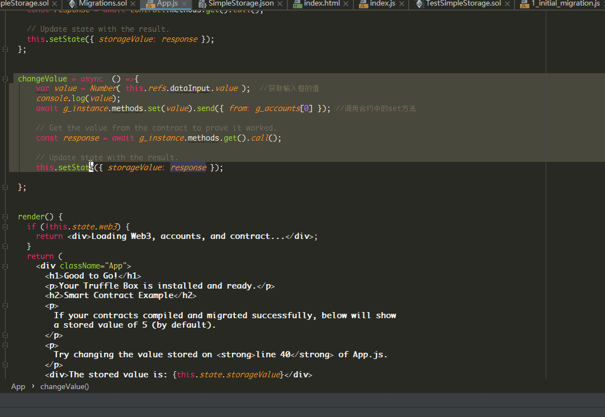
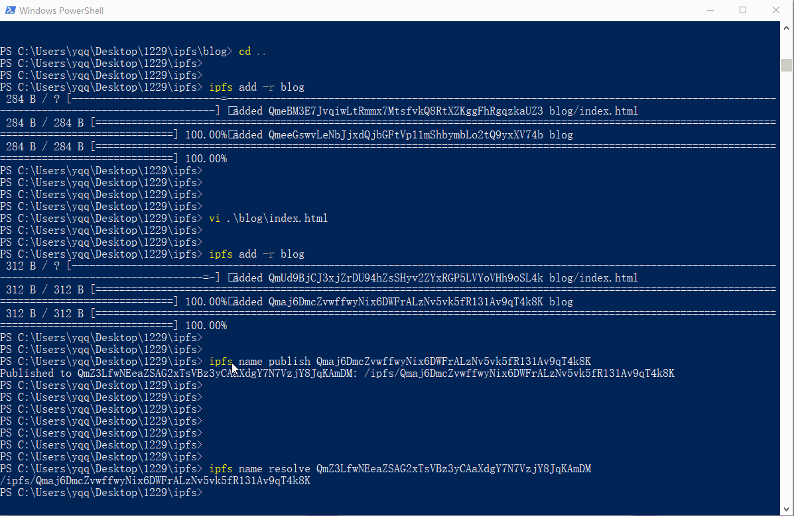

# Truffle学习笔记

安装truffle, 注意: 虽然目前truffle最新版是 `5.0.0`, 但是经过我实践之后, 返现和v4有很多不同(比如: `web3.eth.accounts;` 都获取不到账户), 还是那句话:  

>  "nodejs模块的版本问题会搞死人的 !"

目前4.1.15之前的版本都不能用了, 只能安装v4.1.15

`npm install truffle@4.1.15`


### 普通truffle项目

创建普通项目  `truffle init`即可


### react

创建react项目 `truffle unbox react`,  可能会遇到错误`npm WARN tar zlib error: unexpected end of file`, 这是在 安装client依赖发生的错误.


切换到 client目录执行 `npm install --no-package-lock`安装即可


> 错误: npm WARN tar zlib error: unexpected end of file
>
> 参考: https://github.com/npm/npm/issues/19353#issuecomment-367329967


启动项目:

- 在项目目录执行 `truffle develop`
- 打开metamask用custom RPC连接到 `http://127.0.0.1:9545`
- 然后执行  `compile`, 如果报错:编译版本不符, 将智能合约中版本降为`0.4.17`或其他低于或等于当前编译器版本即可.
- 打开另外一个终端, 进入client目录, 执行`npm start`, 这时浏览器会访问 `http://localhost:3000`, 因为Client/App.js中会调用合约的set方法, 需要花费gas, 所以提前将用户导入metamask, 确保metamask的当前选择的用户有以太币


项目效果


### 修改合约中变量

```js
  changeValue = async  () =>{
      var value = Number( this.refs.dataInput.value );  //获取输入框的值
      console.log(value);
      await g_instance.methods.set(value).send({ from: g_accounts[0] }); //调用合约中的set方法

      // Get the value from the contract to prove it worked.
      const response = await g_instance.methods.get().call();

      // Update state with the result.
      this.setState({ storageValue: response });

  };

-------------------------------
<div>
    <input  ref="dataInput" style={{width:200, height:30}}/>
    <button onClick={this.changeValue} style={{width:100, height:30}}>确定</button>
</div>
```




### IPFS搭建

>  参考: https://blog.csdn.net/u013022210/article/details/80363107


直接展示ipns部署博客效果




另外 可以通过nodejs和ipfs交互

`npm install ipfs-http-client`