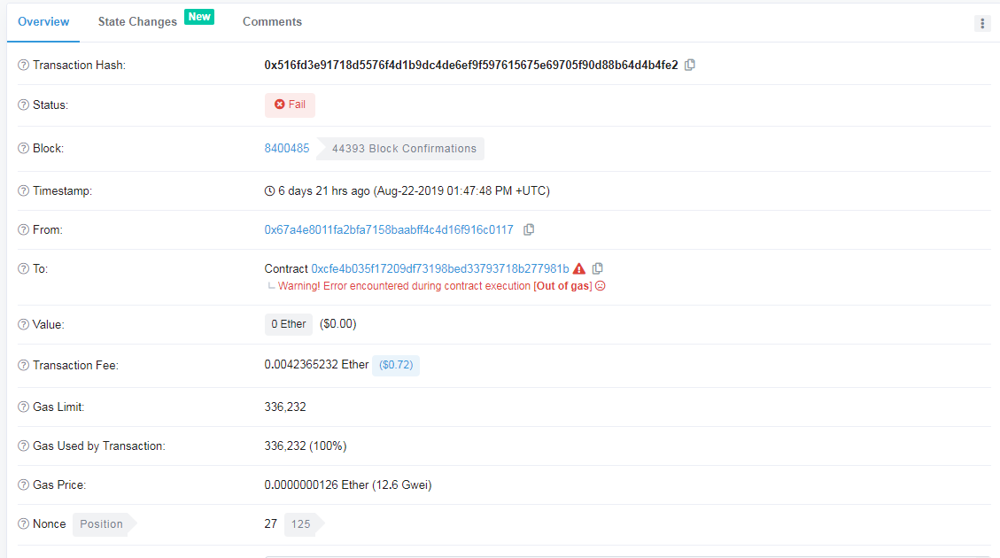

## ERC20 签名


<https://zhuanlan.zhihu.com/p/39656584>


#### 签名要点:

- To地址是ContractAddress

- data是代币调用智能合约的 transfer(address, uint256)  方法编码数据

  ```
   0xa9059cbb + 对方的转账地址hex + 转账的值的hex       //其中0xa9059cbb代表某个代币的转账方法hex(transfer)
  ```


## ABI 是什么

> https://www.cnblogs.com/tinyxiong/p/9453563.html

ABI 全称是 Application Binary Interface，翻译过来就是：应用程序二进制接口，简单来说就是 以太坊的调用合约时的接口说明。还不是很理解，没关系。


## 自己发布ERC20代币

> https://learnblockchain.cn/2018/01/12/create_token/


编译器选择  v0.4.17

我发行的 ERC20 Token 地址 

> https://rinkeby.etherscan.io/address/0x130fc2749d35fe026f32427f60dd3f2ecb6c2f33


```

> eth.getTransactionReceipt("0x1a24c6110139e963a901d30937bf299753fd0574c3c796dcb0379b1ae4171841")
{
  blockHash: "0x971e6e1cd533d7332d3fb38be084c2199a589ea9d2dfb2e5e9a6e01379556fba",
  blockNumber: 4988294,
  contractAddress: null,
  cumulativeGasUsed: 338664,
  from: "0x954d1a58c7abd4ac8ebe05f59191cf718eb0cb89",
  gasUsed: 53418,
  logs: [{
      address: "0x130fc2749d35fe026f32427f60dd3f2ecb6c2f33",
      blockHash: "0x971e6e1cd533d7332d3fb38be084c2199a589ea9d2dfb2e5e9a6e01379556fba",
      blockNumber: 4988294,
      data: "0x000000000000000000000000000000000000000000008a8ed1b5a15792880000",
      logIndex: 2,
      removed: false,
      topics: ["0xddf252ad1be2c89b69c2b068fc378daa952ba7f163c4a11628f55a4df523b3ef", "0x000000000000000000000000954d1a58c7abd4ac8ebe05f59191cf718eb0cb89", "0x00000000000000000000000056e5782c908f69bd46b7e77338349f961fbe55b1"],
      transactionHash: "0x1a24c6110139e963a901d30937bf299753fd0574c3c796dcb0379b1ae4171841",
      transactionIndex: 3
  }],
  logsBloom: "0x00000000000000000000000000040000000000000000000000000000000000000000000001000000000000000000000000000000000000000000000000000000000000000000000000000008000000000000000000000000000000000000000000000000000400000000000000000000000000000000000000000050000000000000000000000000000000000000000000000400000000000000000000000000020000000000000000000000000000000000200000000000000000000000000000000002000000000000000000000000000000000000000000000000000000000000000000000000000000000000000010000000004000000000000000000000",
  status: "0x1",
  to: "0x130fc2749d35fe026f32427f60dd3f2ecb6c2f33",
  transactionHash: "0x1a24c6110139e963a901d30937bf299753fd0574c3c796dcb0379b1ae4171841",
  transactionIndex: 3
}


```

- logs.address: 是合约的地址
- logs.data: 是交易额(十六进制)
- topic[0] : 是事件的 keccka(function(from, to, value)) hash值
- topic[1]: from  (token的发送方)
- topic[2]: to (token的接收方)


### ERC20转账

```python
#!coding:utf8

#author:yqq
#date:2019/8/28 0028 14:22
#description:  ETH 普通转账  /  ERC20 代币转账

from ethereum.transactions import  Transaction
import rlp
from rlp.sedes import big_endian_int , binary
from decimal import  Decimal


#普通的ETH转账成功的案例: https://rinkeby.etherscan.io/address/0x56e5782c908f69bd46b7e77338349f961fbe55b1
#ERC20-Token的转账成功案例: https://rinkeby.etherscan.io/tx/0xfa8da3dda31d644a5f654fc332284cafc2367990a529a14fdb0085b2e89259aa
#ERC20-Token 假交易的案例: https://rinkeby.etherscan.io/tx/0xa5c51ead7f209ac97fb8d8685171e2a5fc50bfb98b987cb6e3342670e9919b3a
#

Mainnet=0
Rinkeby=4


def to_zero_padded_str(in_data, target_len=64):
    # print(in_data)
    return '0' * (target_len - len(in_data)) + in_data


def make_data(abi_transfer='a9059cbb', to='0x123423', value=0x123424):
    return abi_transfer + to_zero_padded_str(to[2:]) + to_zero_padded_str(hex(int(value))[2:].replace('L', ''))
    pass


def main():

    erc20_data =  make_data(to='0x56e5782c908f69bd46b7e77338349f961fbe55b1', value=Decimal('2019.08281809')*(10**18))
    print( "erc20_data:{}".format( erc20_data) )

    tx = Transaction(nonce=120,
                     gasprice=10*(10**9),
                     startgas=210000,
                     to='0x130fc2749d35fe026f32427f60dd3f2ecb6c2f33',
                     value=1*(10**16),
                     # data=b''
                     data = erc20_data.decode('hex')
                     )
    tx.sender = '0x954d1a58c7abd4ac8ebe05f59191cf718eb0cb89'

    # print(tx.hash)
    signed_tx  =  tx.sign(key='DBBAD2A5682517E4FF095F948F721563231282CA4179AE0DFEA1C76143BA9607', network_id=Rinkeby)  # 4:Rinkeby
    print( signed_tx.hash.encode('hex'))
    rlp_data = rlp.encode(  rlp.infer_sedes(tx).serialize(tx) )
    print(rlp_data.encode('hex'))
    # print(signed_tx)

    pass


def main2():

    erc20_data =  make_data(to='0xdf88522B56B85d4F0Bb08a7494b97E017BC6CB31', value=Decimal('656340.20627410')*(10**18))
    print( "erc20_data:{}".format( erc20_data) )

    tx = Transaction(nonce=51,
                     gasprice=10*(10**9),
                     startgas=210000,
                     to='0x130fc2749d35fe026f32427f60dd3f2ecb6c2f33',
                     value=1*(10**16),
                     # data=b''
                     data = erc20_data.decode('hex')
                     )
    tx.sender = '0x56e5782c908f69bd46b7e77338349f961fbe55b1'

    # print(tx.hash)
    signed_tx  =  tx.sign(key='63C08FABC252B53B9471E520CE8199971DB8884B5B569CBBBD17BC714E6BB39F', network_id=Rinkeby)  # 4:Rinkeby
    print( signed_tx.hash.encode('hex'))
    rlp_data = rlp.encode(  rlp.infer_sedes(tx).serialize(tx) )
    print(rlp_data.encode('hex'))
    # print(signed_tx)

    pass

# 
# import ethereum.utils
# def main3():
# 
#     utils.sha3('')
# 
# 
# 
# 
#     pass


if __name__ == '__main__':

    # main()
    main2()
    # main3()


```


## 成功的ERC20 Token转账


```
> eth.getTransactionReceipt("0xa5c51ead7f209ac97fb8d8685171e2a5fc50bfb98b987cb6e3342670e9919b3a")
{
  blockHash: "0xc789baa019defb946c10679782a93f1a333a9c89f3e21bb05faca250b0cc9c3d",
  blockNumber: 4989987,
  contractAddress: null,
  cumulativeGasUsed: 24409,
  from: "0x56e5782c908f69bd46b7e77338349f961fbe55b1",
  gasUsed: 24409,
  logs: [],  //日志为空
  logsBloom: "0x00000000000000000000000000000000000000000000000000000000000000000000000000000000000000000000000000000000000000000000000000000000000000000000000000000000000000000000000000000000000000000000000000000000000000000000000000000000000000000000000000000000000000000000000000000000000000000000000000000000000000000000000000000000000000000000000000000000000000000000000000000000000000000000000000000000000000000000000000000000000000000000000000000000000000000000000000000000000000000000000000000000000000000000000000000000",
  status: "0x0", //状态为0
  to: "0x130fc2749d35fe026f32427f60dd3f2ecb6c2f33",
  transactionHash: "0xa5c51ead7f209ac97fb8d8685171e2a5fc50bfb98b987cb6e3342670e9919b3a",
  transactionIndex: 0
}
> 

```


```
> eth.getTransactionReceipt("0xfa8da3dda31d644a5f654fc332284cafc2367990a529a14fdb0085b2e89259aa")
{
  blockHash: "0xe639442fc8b9201e674dfffe2738ced535034324ebc533d429be7305c2407a28",
  blockNumber: 4989937,
  contractAddress: null,
  cumulativeGasUsed: 614873,
  from: "0x954d1a58c7abd4ac8ebe05f59191cf718eb0cb89",
  gasUsed: 38418,
  logs: [{
      address: "0x130fc2749d35fe026f32427f60dd3f2ecb6c2f33",
      blockHash: "0xe639442fc8b9201e674dfffe2738ced535034324ebc533d429be7305c2407a28",
      blockNumber: 4989937,
      data: "0x00000000000000000000000000000000000000000000006d7467257e5d192400",
      logIndex: 7,
      removed: false,
      topics: ["0xddf252ad1be2c89b69c2b068fc378daa952ba7f163c4a11628f55a4df523b3ef", "0x000000000000000000000000954d1a58c7abd4ac8ebe05f59191cf718eb0cb89", "0x00000000000000000000000056e5782c908f69bd46b7e77338349f961fbe55b1"],
      transactionHash: "0xfa8da3dda31d644a5f654fc332284cafc2367990a529a14fdb0085b2e89259aa",
      transactionIndex: 10
  }],
  logsBloom: "0x00000000000000000000000000040000000000000000000000000000000000000000000001000000000000000000000000000000000000000000000000000000000000000000000000000008000000000000000000000000000000000000000000000000000400000000000000000000000000000000000000000050000000000000000000000000000000000000000000000400000000000000000000000000020000000000000000000000000000000000200000000000000000000000000000000002000000000000000000000000000000000000000000000000000000000000000000000000000000000000000010000000004000000000000000000000",
  status: "0x1",
  to: "0x130fc2749d35fe026f32427f60dd3f2ecb6c2f33",
  transactionHash: "0xfa8da3dda31d644a5f654fc332284cafc2367990a529a14fdb0085b2e89259aa",
  transactionIndex: 10
}

```


### 事件日志 和 logsBloom分析


- 以太坊黄皮书中关于 `logsBloom`字段的描述

> logsBloom: The Bloom filter composed from indexable information (logger address and log topics) contained in each log entry from the receipt of each transaction in the transactions list.


- 以太坊源码中的实现

```go
// go-ethereum/core/types/bloom9.go

// Copyright 2014 The go-ethereum Authors
// This file is part of the go-ethereum library.
//
// The go-ethereum library is free software: you can redistribute it and/or modify
// it under the terms of the GNU Lesser General Public License as published by
// the Free Software Foundation, either version 3 of the License, or
// (at your option) any later version.
//
// The go-ethereum library is distributed in the hope that it will be useful,
// but WITHOUT ANY WARRANTY; without even the implied warranty of
// MERCHANTABILITY or FITNESS FOR A PARTICULAR PURPOSE. See the
// GNU Lesser General Public License for more details.
//
// You should have received a copy of the GNU Lesser General Public License
// along with the go-ethereum library. If not, see <http://www.gnu.org/licenses/>.

package types

import (
	"fmt"
	"math/big"

	"github.com/ethereum/go-ethereum/common/hexutil"
	"github.com/ethereum/go-ethereum/crypto"
)

type bytesBacked interface {
	Bytes() []byte
}

const (
	// BloomByteLength represents the number of bytes used in a header log bloom.
	BloomByteLength = 256

	// BloomBitLength represents the number of bits used in a header log bloom.
	BloomBitLength = 8 * BloomByteLength
)

// Bloom represents a 2048 bit bloom filter.
type Bloom [BloomByteLength]byte

// BytesToBloom converts a byte slice to a bloom filter.
// It panics if b is not of suitable size.
func BytesToBloom(b []byte) Bloom {
	var bloom Bloom
	bloom.SetBytes(b)
	return bloom
}

// SetBytes sets the content of b to the given bytes.
// It panics if d is not of suitable size.
func (b *Bloom) SetBytes(d []byte) {
	if len(b) < len(d) {
		panic(fmt.Sprintf("bloom bytes too big %d %d", len(b), len(d)))
	}
	copy(b[BloomByteLength-len(d):], d)
}

// Add adds d to the filter. Future calls of Test(d) will return true.
func (b *Bloom) Add(d *big.Int) {
	bin := new(big.Int).SetBytes(b[:])
	bin.Or(bin, bloom9(d.Bytes()))
	b.SetBytes(bin.Bytes())
}

// Big converts b to a big integer.
func (b Bloom) Big() *big.Int {
	return new(big.Int).SetBytes(b[:])
}

func (b Bloom) Bytes() []byte {
	return b[:]
}

func (b Bloom) Test(test *big.Int) bool {
	return BloomLookup(b, test)
}

func (b Bloom) TestBytes(test []byte) bool {
	return b.Test(new(big.Int).SetBytes(test))

}

// MarshalText encodes b as a hex string with 0x prefix.
func (b Bloom) MarshalText() ([]byte, error) {
	return hexutil.Bytes(b[:]).MarshalText()
}

// UnmarshalText b as a hex string with 0x prefix.
func (b *Bloom) UnmarshalText(input []byte) error {
	return hexutil.UnmarshalFixedText("Bloom", input, b[:])
}

//生成过滤器
func CreateBloom(receipts Receipts) Bloom {
	bin := new(big.Int)
	for _, receipt := range receipts {
		bin.Or(bin, LogsBloom(receipt.Logs))
	}

	return BytesToBloom(bin.Bytes())
}

func LogsBloom(logs []*Log) *big.Int {
	bin := new(big.Int)
	for _, log := range logs {
		bin.Or(bin, bloom9(log.Address.Bytes()))   //将地址加入过滤器
		for _, b := range log.Topics {
			bin.Or(bin, bloom9(b[:]))  //将topics的元素加入过滤器
		}
	}

	return bin
}

//计算过滤器
func bloom9(b []byte) *big.Int {
	b = crypto.Keccak256(b)

	r := new(big.Int)

	for i := 0; i < 6; i += 2 {
		t := big.NewInt(1)
		b := (uint(b[i+1]) + (uint(b[i]) << 8)) & 2047
		r.Or(r, t.Lsh(t, b))
	}

	return r
}

var Bloom9 = bloom9

func BloomLookup(bin Bloom, topic bytesBacked) bool {
	bloom := bin.Big()
	cmp := bloom9(topic.Bytes())

	return bloom.And(bloom, cmp).Cmp(cmp) == 0  //验证 topic是否在过滤中
}


```


- ETH区块头的信息, 区块头中logsBloom字段包含了所有交易的logs的logsBloom

```


> eth.getBlockByNumber("0x7f6414", false)
{
  difficulty: "0x80ef294c2069a",
  extraData: "0x5050594520737061726b706f6f6c2d6574682d636e2d687a",
  gasLimit: "0x7a2310",
  gasUsed: "0x7a1c34",
  hash: "0x6eabf54758b981adf0736ec5521593199b64d1af668120eacb9dea665c85a5f9",
  logsBloom: "0xd82011ccca1160c828c342000bcad811448c8290041c342a08c284a8001c106e601401400889090808965c029248094602600e8e0bc0149f03b001ce0039a8b0103862600001a05349849c2e518854b0b7016d00e27408e02560823a1910105003b290090cd00a02034a553f2cc80809d7141220a204006194281ff1088d7504300b88140044241400d2147ab06a00d080a5c885c14212c645250ce480320c346a2c2c0e204e796a8487339332829d0c22105470a0a8b031f9161124d40d05400003084246088d8c009a0420c6204ca48ac1c4559a18471c34e6b8e1108213d53010e22144a000c3850ac9c8c450f0c655c23d0a801804c888125784c2804265",
  miner: "0x5a0b54d5dc17e0aadc383d2db43b0a0d3e029c4c",
  mixHash: "0x2c08ca89b804f373aefb8157afc12a4e44df58a53719e1a05564d62867be2fac",
  nonce: "0x228a1e700639d330",
 //....其他信息省略....

```

- 交易的收据信息, 收据中的logsBloom只是当前交易的logs中的address 和 topic所决定

  ```
  
  > eth.getTransactionReceipt("0x866e638469e8ac0a50919254ed5191994f184358e380c9b9ea48e11a4a3a7d89")
  {
    blockHash: "0x6eabf54758b981adf0736ec5521593199b64d1af668120eacb9dea665c85a5f9",
    blockNumber: 8348692,
    contractAddress: null,
    cumulativeGasUsed: 7415262,
    from: "0xe29377ae332f422211dcfbd3ca0352d83e26dd47",
    gasUsed: 53246,
    logs: [{
        address: "0x1fcdce58959f536621d76f5b7ffb955baa5a672f",
        blockHash: "0x6eabf54758b981adf0736ec5521593199b64d1af668120eacb9dea665c85a5f9",
        blockNumber: 8348692,
        data: "0x0000000000000000000000000000000000000000000000000de0b6b3a7640000",
        logIndex: 125,
        removed: false,
        topics: ["0xddf252ad1be2c89b69c2b068fc378daa952ba7f163c4a11628f55a4df523b3ef", "0x000000000000000000000000e29377ae332f422211dcfbd3ca0352d83e26dd47", "0x00000000000000000000000033019e5f5e2340f12bd3da326b89ec65e7770869"],
        transactionHash: "0x866e638469e8ac0a50919254ed5191994f184358e380c9b9ea48e11a4a3a7d89",
        transactionIndex: 170
    }],
    logsBloom: "0x00000000000000000000000000400000000000000000000000000000000000000000000000000000000000000000000000000000000000000000000000000000100000000000000000000008000000000000000000000000000000000000000000000000000000000000000000000000000000008000000000000010000000000000000000000000000000000000000000000000000200000000000000000000200000000000000000000000000000000000000000000000000000000000000000000002000000000000000000000000000080000000000000002020000000000000000000000000000000000000000000000000000000000000000000000001",
    status: "0x1",
    to: "0x1fcdce58959f536621d76f5b7ffb955baa5a672f",
    transactionHash: "0x866e638469e8ac0a50919254ed5191994f184358e380c9b9ea48e11a4a3a7d89",
    transactionIndex: 170
  }
  
  ```

- pyethereum的源码

```python
class Log(rlp.Serializable):

    # TODO: original version used zpad (here replaced by int32.serialize); had
    # comment "why zpad"?
    fields = [
        ('address', utils.address),
        ('topics', CountableList(utils.int32)),
        ('data', binary)
    ]

    def __init__(self, address, topics, data):
        if len(address) == 40:
            address = decode_hex(address)
        assert len(address) == 20
        super(Log, self).__init__(address, topics, data)

    def bloomables(self):
        return [self.address] + [utils.int32.serialize(x) for x in self.topics]

    def to_dict(self):
        return {
            "bloom": encode_hex(bloom.b64(bloom.bloom_from_list(self.bloomables()))),
            "address": encode_hex(self.address),
            "data": b'0x' + encode_hex(self.data),
            "topics": [encode_hex(utils.int32.serialize(t))
                       for t in self.topics]
        }

    def __repr__(self):
        return '<Log(address=%r, topics=%r, data=%r)>' %  \
            (encode_hex(self.address), self.topics, self.data)
```


- 使用ethereum生成logsBloom进行比对

  ```python
  
  >>> from ethereum.messages import *
  >>> 
  >>> log = Log(address='1fcdce58959f536621d76f5b7ffb955baa5a672f', topics=[0xddf252ad1be2c89b69c2b068fc378daa952ba7f163c4a11628f55a4df523b3ef, 0x000000000000000000000000e29377ae332f422211dcfbd3ca0352d83e26dd47, 0x00000000000000000000000033019e5f5e2340f12bd3da326b89ec65e7770869], data='0000000000000000000000000000000000000000000000000de0b6b3a7640000'.decode('hex'))
  >>> 
  >>> log.to_dict()
  {'data': '0x0000000000000000000000000000000000000000000000000de0b6b3a7640000', 'topics': ['ddf252ad1be2c89b69c2b068fc378daa952ba7f163c4a11628f55a4df523b3ef', '000000000000000000000000e29377ae332f422211dcfbd3ca0352d83e26dd47', '00000000000000000000000033019e5f5e2340f12bd3da326b89ec65e7770869'], 'bloom': '00000000000000000000000000400000000000000000000000000000000000000000000000000000000000000000000000000000000000000000000000000000100000000000000000000008000000000000000000000000000000000000000000000000000000000000000000000000000000008000000000000010000000000000000000000000000000000000000000000000000200000000000000000000200000000000000000000000000000000000000000000000000000000000000000000002000000000000000000000000000080000000000000002020000000000000000000000000000000000000000000000000000000000000000000000001', 'address': '1fcdce58959f536621d76f5b7ffb955baa5a672f'}
  >>> 
  >>> 
  >>> log.bloomables()
  ['\x1f\xcd\xceX\x95\x9fSf!\xd7o[\x7f\xfb\x95[\xaaZg/', '\xdd\xf2R\xad\x1b\xe2\xc8\x9bi\xc2\xb0h\xfc7\x8d\xaa\x95+\xa7\xf1c\xc4\xa1\x16(\xf5ZM\xf5#\xb3\xef', '\x00\x00\x00\x00\x00\x00\x00\x00\x00\x00\x00\x00\xe2\x93w\xae3/B"\x11\xdc\xfb\xd3\xca\x03R\xd8>&\xddG', '\x00\x00\x00\x00\x00\x00\x00\x00\x00\x00\x00\x003\x01\x9e_^#@\xf1+\xd3\xda2k\x89\xece\xe7w\x08i']
  >>> 
  >>> bx = 0xd82011ccca1160c828c342000bcad811448c8290041c342a08c284a8001c106e601401400889090808965c029248094602600e8e0bc0149f03b001ce0039a8b0103862600001a05349849c2e518854b0b7016d00e27408e02560823a1910105003b290090cd00a02034a553f2cc80809d7141220a204006194281ff1088d7504300b88140044241400d2147ab06a00d080a5c885c14212c645250ce480320c346a2c2c0e204e796a8487339332829d0c22105470a0a8b031f9161124d40d05400003084246088d8c009a0420c6204ca48ac1c4559a18471c34e6b8e1108213d53010e22144a000c3850ac9c8c450f0c655c23d0a801804c888125784c2804265
  >>> 
  >>> 
  >>> //判断某个事件(ERC20的keccak256(transfer(from,to,value)) )是否在此区块中
  >>> bloom_query(bx, 'ddf252ad1be2c89b69c2b068fc378daa952ba7f163c4a11628f55a4df523b3ef'.decode('hex'))
  True
  >>> 
  >>>  //查看某个地址是否在此区块中, 注意地址 不要'0x'前缀
  >>> bloom_query(bx, '1fcdce58959f536621d76f5b7ffb955baa5a672f'.decode('hex'))
  True
  >>> 
  ```


- 分析失败的合约执行是否可以用logsBloom过滤

https://etherscan.io/tx/0x516fd3e91718d5576f4d1b9dc4de6ef9f597615675e69705f90d88b64d4b4fe2



```

> eth.getBlockByNumber("0x802e65", false)
{
  difficulty: "0x7e4b2262a729f",
  extraData: "0x505059452d65746865726d696e652d6575312d37",
  gasLimit: "0x7a2135",
  gasUsed: "0x7a156d",
  hash: "0xb84959b878c9e6a753637d0d8ded53fc3e404dd763cbc85351e1bf60c35cd2f4",
  logsBloom: "0x040e14c44940903a951a060d0311308f80408c11876cd83d141983460a42111a8e40004820581411b8a803024a1c8142044956101862a893020047380030f03ae564892be0024abe451a758849f8c8a88728650002c24143219160d894024409482018028b60a60006842670e4001c4107931214226a439a195069177022e0c702400b04804a940d118ec411801609e68240fc2d401a951d6049b110e150c9a212505c851e264028101146840806186620122700b80bf04145522020bdbd6a322610d07600440369091c2010ad0304050a5558552010421e2b801a50944ba928d311c5153612518860830412944820849610bc4007d4a4e80a253251418502c5",
  miner: "0xea674fdde714fd979de3edf0f56aa9716b898ec8",
  mixHash: "0x18e5df8b0941134b4a02f33679400ee52d6e8ebe7a22076c173ad63ee0f398ef",
  nonce: "0x1d6b49c20db8d89a",
  number: "0x802e65",
.....其他省略.....

>>> bx = 0x040e14c44940903a951a060d0311308f80408c11876cd83d141983460a42111a8e40004820581411b8a803024a1c8142044956101862a893020047380030f03ae564892be0024abe451a758849f8c8a88728650002c24143219160d894024409482018028b60a60006842670e4001c4107931214226a439a195069177022e0c702400b04804a940d118ec411801609e68240fc2d401a951d6049b110e150c9a212505c851e264028101146840806186620122700b80bf04145522020bdbd6a322610d07600440369091c2010ad0304050a5558552010421e2b801a50944ba928d311c5153612518860830412944820849610bc4007d4a4e80a253251418502c5
>>> 
>>> bloom_query(bx, 'cfe4b035f17209df73198bed33793718b277981b'.decode('hex'))
False

```


- 分析结论
  - 普通的ETH转账是没有log的
  - 只有成功执行完的合约才会生成log, 失败的不会生成log

