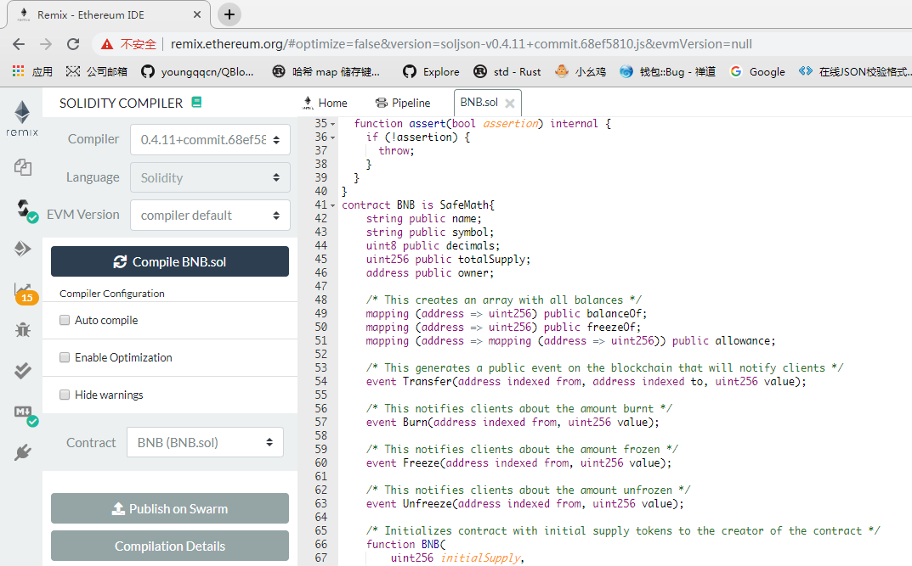
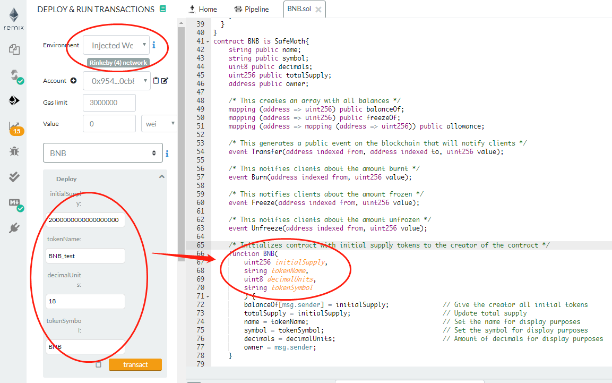
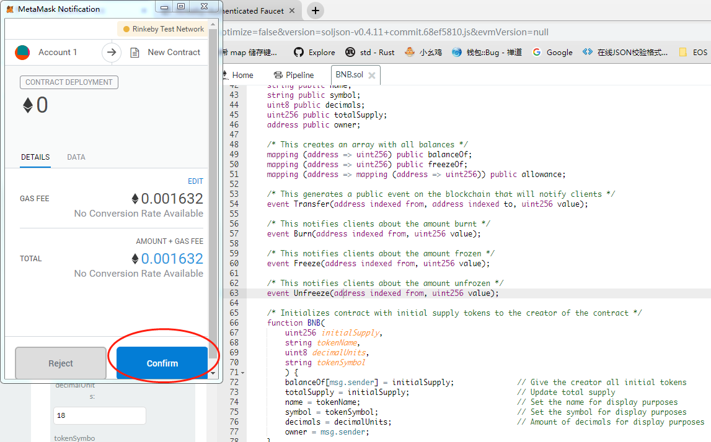
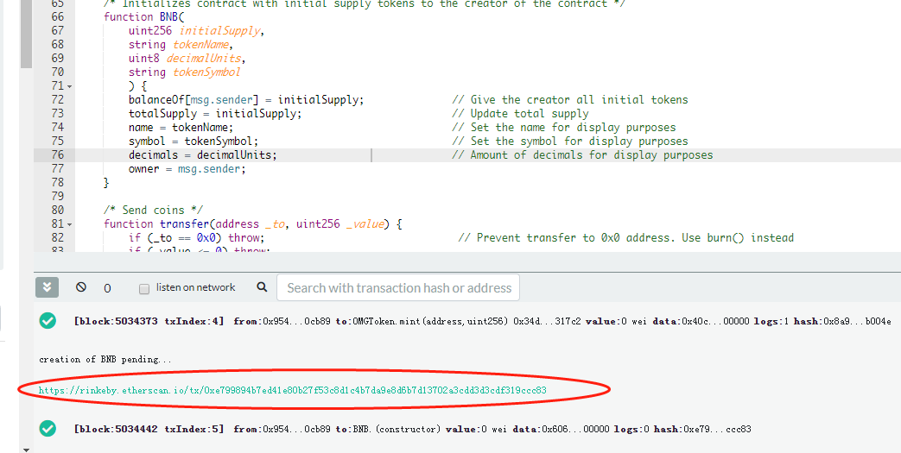
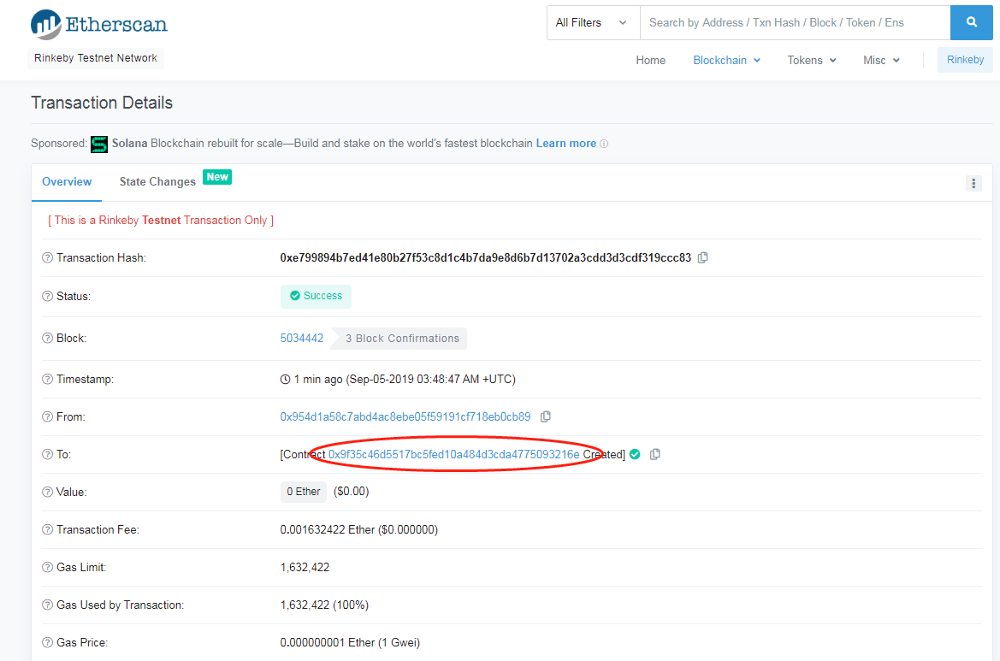
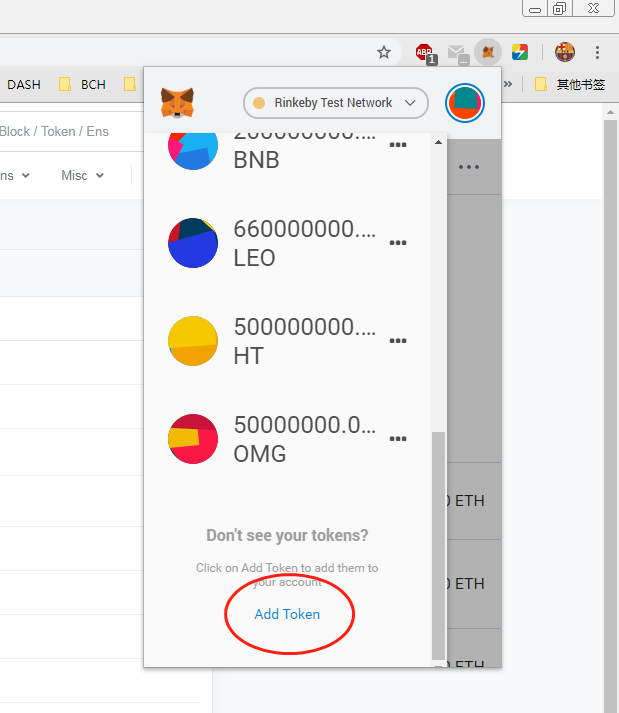
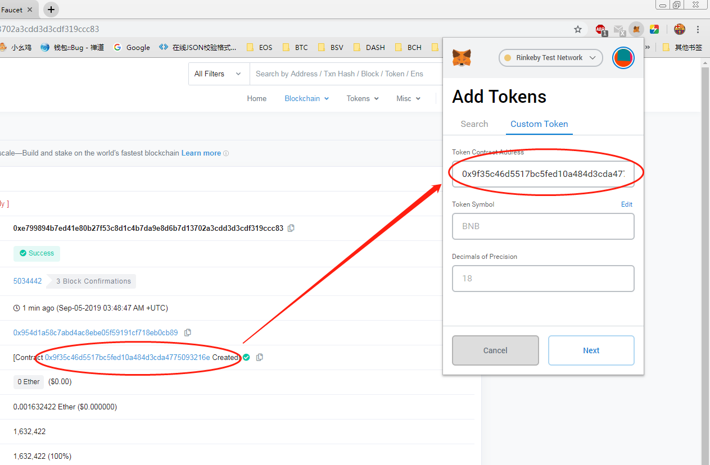

## 发行自己的代币

- 步骤1

  从https://etherscan.io/tokens 查找一个代币

  
  
- 步骤2

  复制其合约代码

  

- 步骤3

  在remix中编译合约代码

  

- 步骤4

  部署合约(需要提前安装Metamask, 并获取一些测试币), 这里Rinkeby测试为例

  可以在 https://faucet.rinkeby.io/ 获取 Rinkeby的测试币

  其中的 initialSupply是发行量  如果要发行200个, 则应填写  200000000000000000000 , 即 200 * (10^18), 18是decimalUnit小数位.

  

  

  

  

- 步骤5: 在Metamask中使用ERC20Token

  

  

  

至此,  ERC20 Token发行完毕, 总共发行了  2BNB   ,  如果想发行多一些, 在部署的时候把 initSupply设大一点即可.