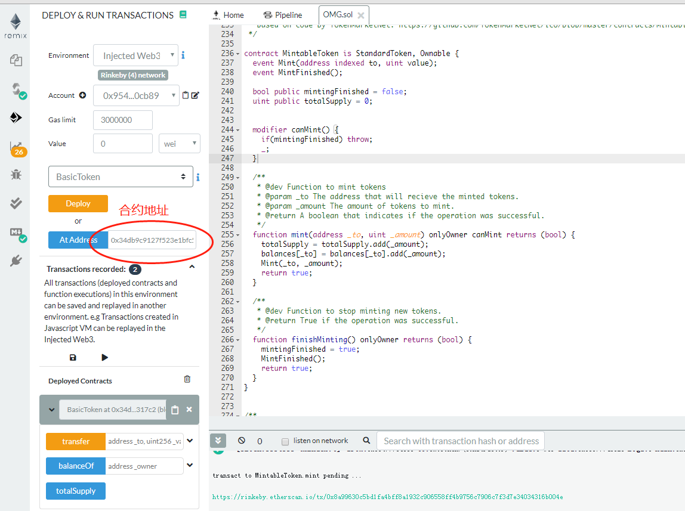

合约的调用




```
// Log represents a contract log event. These events are generated by the LOG opcode and
// stored/indexed by the node.
type Log struct {
	// Consensus fields:
	// address of the contract that generated the event
	Address common.Address `json:"address" gencodec:"required"`
	// list of topics provided by the contract.
	Topics []common.Hash `json:"topics" gencodec:"required"`
	// supplied by the contract, usually ABI-encoded
	Data []byte `json:"data" gencodec:"required"`

	// Derived fields. These fields are filled in by the node
	// but not secured by consensus.
	// block in which the transaction was included
	BlockNumber uint64 `json:"blockNumber"`
	// hash of the transaction
	TxHash common.Hash `json:"transactionHash" gencodec:"required"`
	// index of the transaction in the block
	TxIndex uint `json:"transactionIndex" gencodec:"required"`
	// hash of the block in which the transaction was included
	BlockHash common.Hash `json:"blockHash"`
	// index of the log in the block
	Index uint `json:"logIndex" gencodec:"required"`

	// The Removed field is true if this log was reverted due to a chain reorganisation.
	// You must pay attention to this field if you receive logs through a filter query.
	Removed bool `json:"removed"`
}
```


## 实现一个简单的 ERC20 代币水龙头

```
/*
author: yqq
data: 2019-09-06 12:33
desc: call erc20 contranct to transfer
*/

contract ERC20 {
    function totalSupply() public constant returns (uint);
    function balanceOf(address tokenOwner) public constant returns (uint balance);
    function allowance(address tokenOwner, address spender) public constant returns (uint remaining);
    function transfer(address to, uint tokens) public returns (bool success);
    function approve(address spender, uint tokens) public returns (bool success);
    function transferFrom(address from, address to, uint tokens) public returns (bool success);
    event Transfer(address indexed from, address indexed to, uint tokens);
    event Approval(address indexed tokenOwner, address indexed spender, uint tokens);
}


contract ERC20Faucet{
  address token_addr = 0xe30d2B6F144e6eAD802414C09a3F519B72Ff12F3; 

  function ERC20Faucet() public{
  }

  function getTokens(address to, uint256 value ) public {
    ERC20(token_addr).transfer(to, value );
  }
}
```

部署水龙头合约成功:

https://rinkeby.etherscan.io/tx/0x1fd57e172662f0981f601a1c1dd7527ae3ee307b8b36db0f97b4d4b7d8985133

向合约地址转一些测试Token:

https://rinkeby.etherscan.io/tx/0xb44d99315004431f1a15d89383d2a565a58029e30b382999650884976873581c


从水龙头获取测试Token:

https://rinkeby.etherscan.io/tx/0x57004ad1812036e6802ace93e71c02c1f071cee99d4a408c6ff45712a35a8151


## Bancor 协议


https://www.jianshu.com/p/7a535407d732
https://www.jianshu.com/p/c96100c60f9a
https://etherscan.io/address/0x1f573d6fb3f13d689ff844b4ce37794d79a7ff1c
https://mp.weixin.qq.com/s?__biz=MzUyNjcwMjY3NQ==&mid=2247484542&idx=1&sn=3981d497f33c0511f1b5d04df790fdc7&scene=21#wechat_redirect


https://etherscan.io/tx/0xf5983f143afe39c50c57b774fb41e527ec63ab5777afe0455b8d7aea635983a9