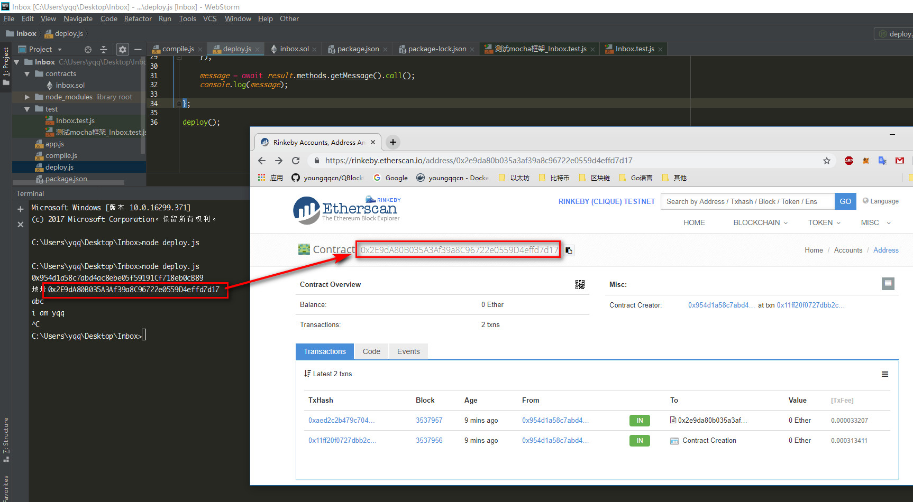
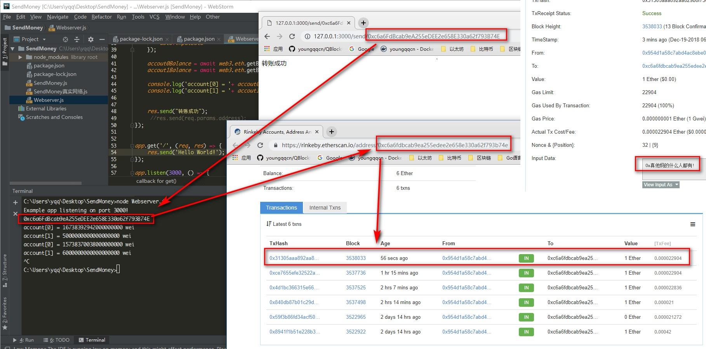

# 以太坊学习day2

### 安全问题

- **软分叉**:如果区块链的共识规则改变后,这种改变是向前兼容的,旧节点可以兼容新节点产生的区块,即为软
  分叉。
- **硬分叉**:如果区块链软件的共识规则被改变,并且这种规则改变无法向前兼容,旧节点无法认可新节点产生的
  区块,即为硬分叉.(例如以太坊的硬分叉)


### 环境搭建 

#### 0.npm和cnpm安装

- 高版本的nodejs, 安装时总是出现错误 , 建议退回到v8.10.0稳定版,   以后开发时也要注意, 别使用太新的版本.

- 安装淘宝npm镜像源`  npm --registry https://registry.npm.taobao.org.info underscore`, 然后在 用户目录下编辑`.npmrc`文件加入

  ```
  msvs_version=2015
  registry=https://registry.npm.taobao.org
  ```

- 参考https://jingyan.baidu.com/article/9080802239521cfd90c80f55.html 安装 cnpm.


#### 1.solc安装

高版本的solc总是编译报错, 安装  0.4.25就正常了  `npm install solc@0.4.25

#### 2.mocha安装

`npm install mocha -g` 安装即可,   目前我安装的版本是 5.2.0

#### 3.ganache安装

安装 6.1.6版本的, 太新的版本总是有坑. 

```
npm install  ganache-cli@6.1.6
```

#### 4.Web3安装

我遇到的坑和解决方法: https://github.com/ethereum/web3.js/issues/943#issuecomment-448249883

#### 5.truffle-hdwallet-provider安装

用npm安装, 总是卡在安装scrypt, 折腾到半夜, 最后用 `cnpm insta truffle-hdwallet-provider -g'`安装成功了.

使用时注意加'0x', 否则会有gas limit错误. `data:'0x'+bytecode`. [参考Stack Overflow](https://stackoverflow.com/questions/50201353/unhandledpromiserejectionwarning-error-the-contract-code-couldnt-be-stored-p)

#### 6.express安装 

`npm install express`安装即可


### 案例1:手动编译智能合约

智能合约源文件 inbox.sol

```sol
pragma solidity ^0.4.17;

contract Inbox {
    string  public message;
    
    function Inbox(string _message) public{
        message = _message;
    }
    
    function setMessage(string _message ) public{
        message = _message;
    }

    function getMessage() public view returns(string){
        return message;
    }
}
```


源文件 : compile.js

```js
//使用npm  install solc@0.4.25   , 高版本有错

const path = require("path");
const fs = require("fs");
const solc = require("solc");

const srcpath = path.resolve(__dirname, "contracts", "inbox.sol");
// console.log(srcpath);

const source = fs.readFileSync(srcpath, 'utf-8');
// console.log(source);

const result =  solc.compile(source, 1);
// console.log(result);

module.exports = result.contracts[':Inbox'];   //导出编译结果, 部署合约时需要用到
```


### 案例2:使用mocha编写测试用例

使用ganache作为测试网络

源文件: Inbox.test.js

```js
//'use strict';

/**
 * @author: yqq
 * @create: 2018-12-18 23:13
 * @descriptions:
 */

const assert = require('assert');
const ganache = require('ganache-cli');
const {interface, bytecode} = require('../compile');  //itface --> interface

//变量以大写开头, 表示是构造方法
const Web3 = require('web3');
const web3 = new Web3(ganache.provider());  //设置 ganache测试网络


describe('测试智能合约', ()=>{

    it('测试web3的版本', ()=>{
        console.log(web3.version);
    });
    
    
    it('测试web3的网络', ()=>{
        
        // console.log(web3.currentProvider);
        console.log(web3.utils.toHex("abcABC"));
        console.log(web3.utils.toHex({abc:"abc"}));
        console.log(web3.utils.fromAscii('ethereum', 32)); //将ascii码转为 十六进制字符串
        console.log(web3.utils.toWei('1', "ether")) //将以太币 转为  wei

    });


    it("测试web3的api", ()=>{
        web3.eth.getAccounts().then((accounts)=>{
            console.log(accounts);
        });
        		      web3.eth.getBalance('0x135D8ccF20f4125a547E2c8CaaEed04C422115EE').then((balance)=>{
            console.log(balance);
        });
    });

    it("使用ES6标准", async ()=>{
        const accounts =  await web3.eth.getAccounts();
        console.log(accounts);
        const money = await  web3.eth.getBalance(accounts[0]);
        console.log(web3.utils.fromWei(money, 'ether'), "eth");

    });


    it("测试部署智能合约", async ()=>{
        const accounts =  await web3.eth.getAccounts();
        const result = await new web3.eth.Contract(JSON.parse(interface))
            .deploy({data:bytecode, arguments:['abc']})
            .send({from:accounts[0], gas:1000000}); //gas limit 1000000刚刚,  太小会报错
        
        console.log("地址" + result.options.address);


        //测试getMessage
        let message = await result.methods.getMessage().call();
        console.log(message);
        assert.equal(message, "abc");


        //测试setMessage
        await result.methods.setMessage("i am yqq").send({
            from : accounts[0],
            gas : 1000000,
        });

        //再次读取
        message = await result.methods.getMessage().call();
        console.log(message);
        assert.equal(message, "i am yqq");

    });


});


```


### 案例3:部署智能合约到Rinkeby网络

使用 `truffle-hdwallet-provider` 和 `infura`将智能合约部署到Rinkeby测试网络.

源文件为: deploy.js

```js
const {interface, bytecode} = require('./compile');
const Web3 = require('web3');
const HDWalletProvider = require('truffle-hdwallet-provider');

//注册以太坊账号时, 获取的助记词
const mnemonic = "mother citizen apart father resemble coral section pony floor brother fuel lottery";

//在infura注册账号,并创建项目, 设置Rinkeby网络,即可获取链接
const provider = new HDWalletProvider(mnemonic, "https://rinkeby.infura.io/v3/db5a95cd5605439b8983f00bc6433878"); 
const web3 = new Web3(provider);


deploy = async ()=>{
    const accounts =  await web3.eth.getAccounts();
    console.log(accounts[0]);
    const result = await new web3.eth.Contract(JSON.parse(interface))
        .deploy({data:'0x'+bytecode, arguments:['abc']})  //注意: 需要 加 '0x', 否则报错 
        .send({from:accounts[0], gas:'3000000'}); //gas limit 

    console.log("地址" + result.options.address);

    let message = await result.methods.getMessage().call();
    console.log(message);

    //测试setMessage
    await result.methods.setMessage("i am yqq").send({
        from : accounts[0],
        gas : '3000000',
    });

    message = await result.methods.getMessage().call();
    console.log(message);

};

deploy();
```

部署结果: https://rinkeby.etherscan.io/address/0x2e9da80b035a3af39a8c96722e0559d4effd7d17




### 案例4:自己写一个水龙头

源文件: SendMoney/WebServer.js

```javascript
//'use strict';

/**
 * @author: yqq
 * @create: 2018-12-19 12:30
 * @descriptions:
 */

const HDWalletProvider = require('truffle-hdwallet-provider');
const mnemonic = "mother citizen apart father resemble coral section pony floor brother fuel lottery";
const provider = new HDWalletProvider(mnemonic, "https://rinkeby.infura.io/v3/db5a95cd5605439b8983f00bc6433878");
const Web3 = require('web3');
const web3 = new Web3(provider);

const express = require('express');
const app = express();

app.get('/send/:address', async (req, res) => {
    let toAddress = req.params.address;
    console.log(toAddress);

    const accounts = ['0x954d1a58c7abd4ac8ebe05f59191Cf718eb0cB89', toAddress];
    let accout0Balance = await web3.eth.getBalance(accounts[0]);
    let accout1Balance = await web3.eth.getBalance(accounts[1]);

    console.log('account[0] = '+ accout0Balance + ' wei');
    console.log('account[1] = '+ accout1Balance + ' wei');


    let strData  = '真他妈的什么人都有!';
    let inputData = '0x' + Buffer.from(strData).toString('hex');


    await web3.eth.sendTransaction({
        from:accounts[0],
        to: accounts[1],
        value: web3.utils.toWei('1', 'ether'),
        data:inputData
    });

    accout0Balance = await web3.eth.getBalance(accounts[0]);
    accout1Balance = await web3.eth.getBalance(accounts[1]);

    console.log('account[0] = '+ accout0Balance + ' wei');
    console.log('account[1] = '+ accout1Balance + ' wei');


    res.send("转账成功");
     //res.send(req.params.address);
});


app.get('/', (req, res) => {
    res.send('Hello World!');
});

app.listen(3000, () => {
   console.log('Example app listening on port 3000!');
});
```

转账结果:https://rinkeby.etherscan.io/tx/0x31305aaa892aa829b8f73dc7d424a0d0006f84099154c1e6cf4f4c35fec46365

