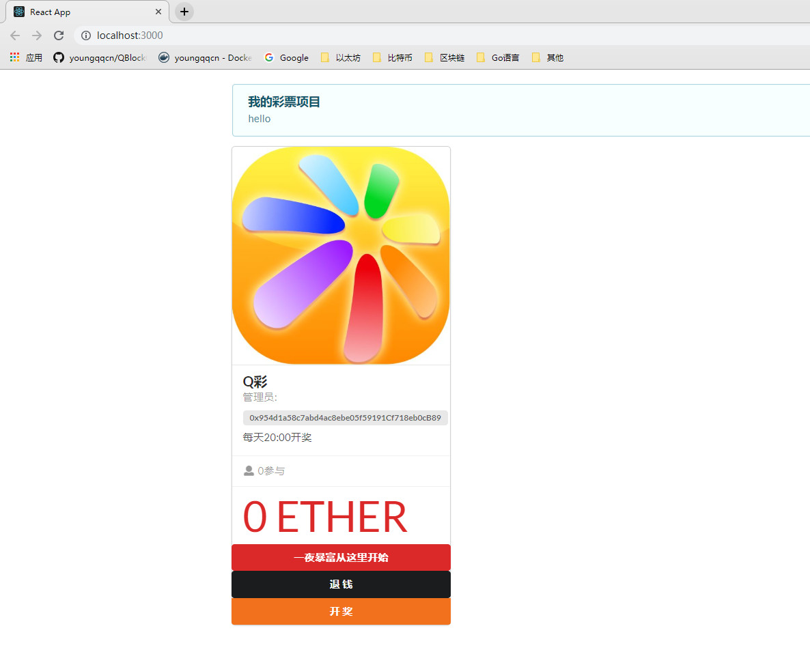
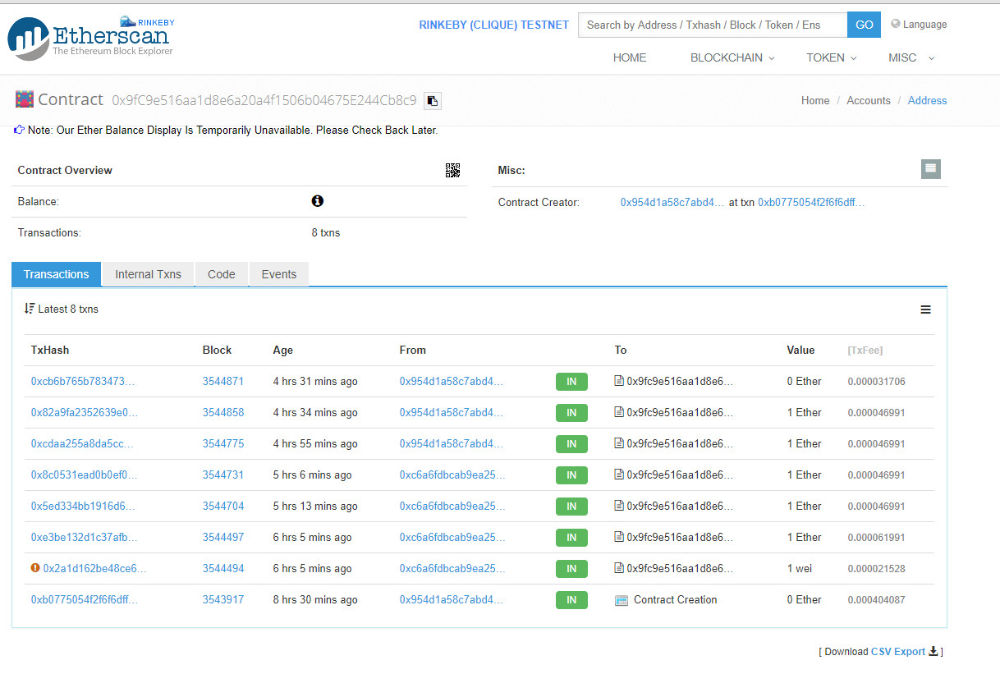
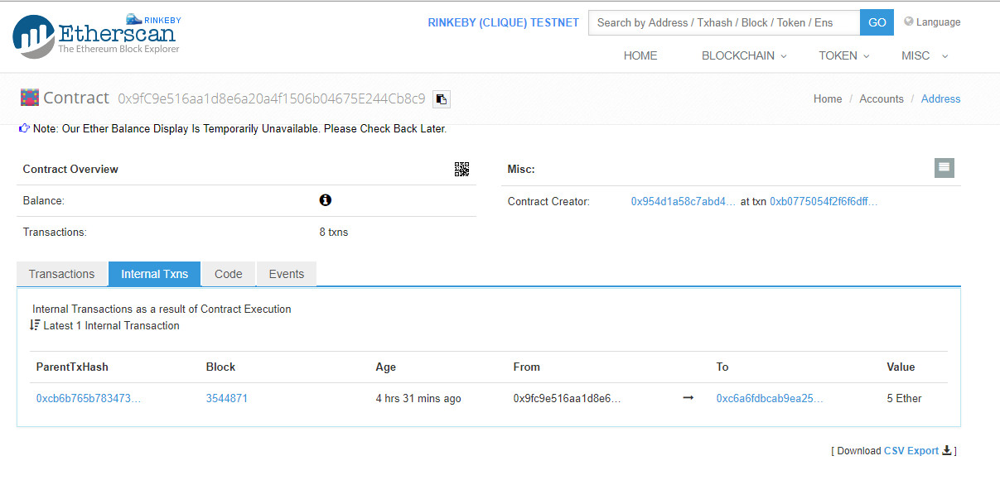

# 项目部署

```
cd lottery-react   //进入lottery-react目录
npm install       //根据package.json安装依赖
node deploy.js    //部署新的合约 , 获取智能合约地址
npm run start  //开始react 项目 访问  localhost:3000即可
```


# 案例:基于智能合约的彩票项目

- 合约地址:[0x9fC9e516aa1d8e6a20a4f1506b04675E244Cb8c9](https://rinkeby.etherscan.io/address/0x9fC9e516aa1d8e6a20a4f1506b04675E244Cb8c9)




- 投注和开奖结果

  

  