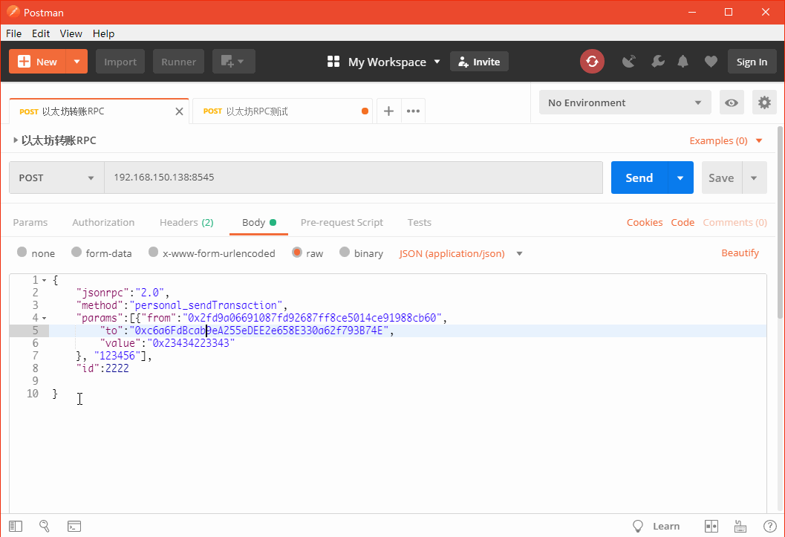
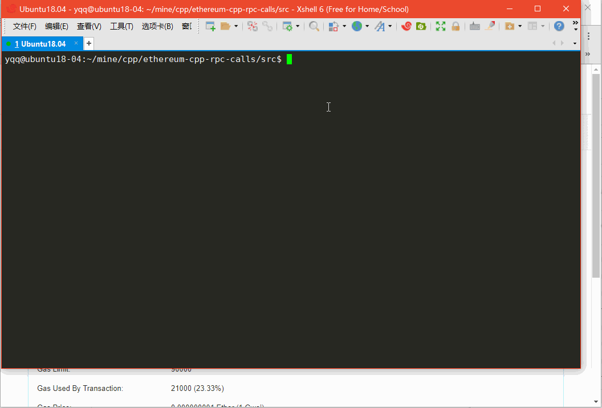

### 以太坊测试网络搭建


- 以轻节点方式启动Rinkeby网络

  ```
  geth --rpc --rinkeby --rpcapi="db,eth,net,web3,personal" --rpcport "8545" --rpcaddr "0.0.0.0" --rpccorsdomain "*" --syncmode=light
  
  ```

  其他选项 

  ```
  --datadir  /data/eth     #设置数据存储位置
  ```


- 查看同步情况

  ```
  #登陆
  geth attach rpc:http://127.0.0.1:8545
  
  #查看状态
  eth
  
  #查看最新区块高度
  eth.blockNumber
  
  # 查看同步状态，如果返回 false则表示未同步或同步到最新了
  eth.syncing
  
  ```

- 创建账户

  ```
  personal.newAccount("123456")   #创建账户, 密码是 "123456"
  ```


- 获取Rinkeby测试网络的测试币

  > https://faucet.rinkeby.io/


- 使用Postman调用RPC进行转账

  


- 使用C++调用RPC进行转账

  > https://github.com/mafoti/ethereum-cpp-rpc-calls

  ```cpp
  #include <iostream>
  #include <fstream>
  #include <assert.h>
  #include "ethereumapi.h"
  #include <jsonrpccpp/client/connectors/httpclient.h>
  
  using namespace jsonrpc;
  using namespace std;
  
  int main()
  {
  	//HttpClient httpclient("http://localhost:8101");
  	//HttpClient httpclient("http://192.168.0.112:8545");
  	HttpClient httpclient("http://127.0.0.1:8545");
  	EthereumAPI c(httpclient);
  	try
  	{
  		//cout << c.eth_accounts().isArray() << endl;
  		cout << c.eth_accounts()[0].asString() << endl;
  
  		std::string strFrom = c.eth_accounts()[0].asString() ;
  		assert(strFrom != "");
  
  		std::string strTo = "0xc6a6FdBcab9eA255eDEE2e658E330a62f793B74E";
  		assert(strTo != "");
  
  
  		std::string strTx = "[{\"from\":\"0x2fd9a06691087fd92687ff8ce5014ce91988cb60\",\
  							 \"to\":\"0xc6a6FdBcab9eA255eDEE2e658E330a62f793B74E\",\
  							 \"value\":\"0x19184e72a000\"}, \"123456\"]";
  
  
  
  		Json::Reader reader;
  		Json::Value p;
  		if(reader.parse(strTx, p)){
  
  			std::cout << p.toStyledString() << std::endl;
  
  			std::string strRet = c.personal_sendTransaction(p);
  			std::cout << "txid " <<  strRet << std::endl;
  		}
  	}
  	catch (JsonRpcException & e)
  	{
  		cerr << e.what() << endl;
  	}
  }
  ```

  ```makefile
  all:
  	g++  test_transaction.cpp -ljsoncpp -lcurl -ljsonrpccpp-common -ljsonrpccpp-client
  ```





​	

### 参考

- https://www.cnblogs.com/elvi/p/10203930.html