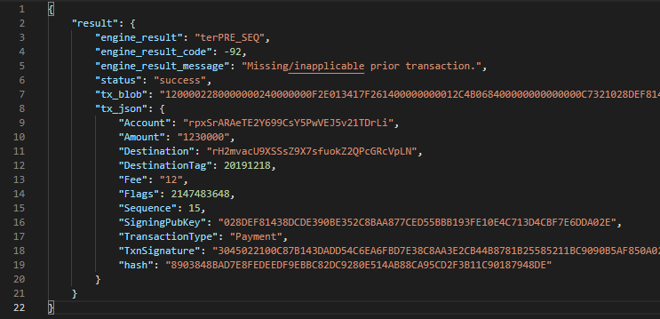
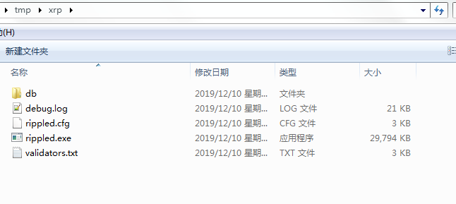

# XRP对接文档


## 技术预研

### 参考文档

- 官方文档:  https://xrpl.org/list-xrp-in-your-exchange.html 

- 官方文档:  https://xrpl.org/list-xrp-as-an-exchange.html#flow-of-funds 

- 交易所对接XRP(内容齐全, 很推荐)  https://blog.csdn.net/weixin_40396076/article/details/100202076 

-  XRP瑞波币JAVA接入 https://blog.csdn.net/liu1765686161/article/details/82492937 

- XRP离线签名JAVA   https://blog.csdn.net/liu1765686161/article/details/83347534 


| Operator | [Network](https://xrpl.org/parallel-networks.html) | JSON-RPC URL                             | WebSocket URL                    | Notes                                                        |
| -------- | -------------------------------------------------- | ---------------------------------------- | -------------------------------- | ------------------------------------------------------------ |
| Ripple   | **Mainnet**                                        | `https://s1.ripple.com:51234/`           | `wss://s1.ripple.com/`           | General purpose server cluster                               |
| Ripple   | **Mainnet**                                        | `https://s2.ripple.com:51234/`           | `wss://s2.ripple.com/`           | [Full-history server](https://xrpl.org/ledger-history.html#full-history) cluster |
| Ripple   | Testnet                                            | `https://s.altnet.rippletest.net:51234/` | `wss://s.altnet.rippletest.net/` | Testnet public server                                        |
| Ripple   | Devnet                                             | `https://s.devnet.rippletest.net:51234/` | `wss://s.devnet.rippletest.net/` | Devnet public server                                         |


- 获取历史数据(账户历史交易等):

  https://data.ripple.com

  https://testnet.data.api.ripple.com


### 几个关键的问题


#### 1.用户充币地址如何离线生成?

交易所使用一个地址即可, 用户充币时需要填写 `tag`, 交易所通过`tag`区分用户的充值.


如果用户不填写标签, 不能区分是哪个用户的充币, 只能人工干预.

ripple提供了一个接口, 来设置账户的接收交易, 必须填写 `DestinationTag`, 如果不填写则直接拒绝.

https://xrpl.org/require-destination-tags.html


这样的确防止了用户充币不填写标签的情况, 但是是否存在其他问题?


#### 2.交易所的全节点如何搭建?

- 字节搭建一个节点, 用于交易的广播, 和其他操作
- 也可以直接使用ripple官方的接口查询交易, 和广播交易


#### 3.用户充币如何扫描检测? 需要注意哪些问题?

 https://xrpl.org/list-xrp-as-an-exchange.html#deposit-xrp-into-exchange 


- 获取测试币

```
Address
rpxSrARAeTE2Y699CsY5PwVEJ5v21TDrLi
Secret
ssYt3QxVJtAqtw88REsc7S7X3mHrZ
Balance
1,000 XRP

---------------


Address
rBQUkC3iBBAXV7XT4DJeCPiMHQM6PVE555
Secret
snTru9VEkoQNwRoKTJzNDVg2TDgQk
Balance
1,000 XRP
```

  

- 查询账户交易历史:  https://github.com/ripple/rippled-historical-database#get-account-transaction-history


> GET /v2/accounts/{address}/transactions


| Field          | Value                                                        | Description                                                  |
| -------------- | ------------------------------------------------------------ | ------------------------------------------------------------ |
| `start`        | String - [Timestamp](https://github.com/ripple/rippled-historical-database#timestamps) | Start time of query range. The default is the earliest date available. 开始时间戳 |
| `end`          | String - [Timestamp](https://github.com/ripple/rippled-historical-database#timestamps) | End time of query range. The default is the current date. 结束时间戳 |
| `min_sequence` | String                                                       | Minimum sequence number to query.                            |
| `max_sequence` | String                                                       | Max sequence number to query.                                |
| `type`         | String                                                       | Restrict results to a specified [transaction type](https://developers.ripple.com/transaction-types.html). 交易类型, 普通的XRP转账类型是 `Payment` |
| `result`       | String                                                       | Restrict results to a specified [transaction result](https://developers.ripple.com/transaction-results.html).  交易结果(成功还是失败), 成功: `tesSUCCESS`  , 其他情况有不同的字符串状态 |
| `binary`       | Boolean                                                      | Return results in binary format. 是否返回十六进制字符串, 默认是false |
| `descending`   | Boolean                                                      | If `true`, return results in reverse chronological order. The default is `false`.  按照时间降序排列, 默认是 `false` |
| `limit`        | Integer                                                      | Maximum results per page. The default is 20. Cannot be more than 1,000.   每页的交易数量 |
| `marker`       | String                                                       | [Pagination](https://github.com/ripple/rippled-historical-database#pagination) key from previously returned response.  分页标志, 请求第二页以后的页需要带上此字段 |

  

  例如:

```
https://data.ripple.com/v2/accounts/r3Vh1bZbktiWRyJBe6BB9H3okW577u37BE/transactions?limit=2&start=1564642511&end=1565101720
  
  
  {
        "result": "success",
        "count": 2,
        "transactions": [
            {
                "hash": "37554EEC36B8E76593387380752994E5017843000EA401BEEDAABD2294F0899F",
                "ledger_index": 49050181,
                "date": "2019-08-01T14:55:11+00:00",
                "tx": {
                    "TransactionType": "Payment",
                    "Flags": 2147483648,
                    "Sequence": 238920,
                    "Amount": "99900000",
                    "Fee": "1000",
                    "SigningPubKey": "02820C6D08111F0AE73F1ED0463C5B50D0E45BF3DB4A36B1FCF5B2C8FBD9BB3EE6",
                    "TxnSignature": "304402206ACF8B1C44098C6B3AE9F1266DDDC3D1EF18438849BCA6CA531B60617DBB9E660220092B01BBC60866ACC7713D5CA67618739FB04A0B35A5AB524887ECD54372F6A5",
                    "Account": "rfexLLNpC6dqyLagjV439EyvfqdYNHsWSH",
                    "Destination": "r3Vh1bZbktiWRyJBe6BB9H3okW577u37BE"
                },
                "meta": {
                    "TransactionIndex": 4,
                    "AffectedNodes": [
                        {
                            "CreatedNode": {
                                "LedgerEntryType": "AccountRoot",
                                "LedgerIndex": "5C0CAE11030D79C566101617FAEEA165B7D9A1342A2B4FD06309CA3578B65F4F",
                                "NewFields": {
                                    "Sequence": 1,
                                    "Balance": "99900000",
                                    "Account": "r3Vh1bZbktiWRyJBe6BB9H3okW577u37BE"
                                }
                            }
                        },
                        {
                            "ModifiedNode": {
                                "LedgerEntryType": "AccountRoot",
                                "PreviousTxnLgrSeq": 49050173,
                                "PreviousTxnID": "077DAEBEE3031E5001DA890F442F5AAC944B0B26EDC0A5025848B42E099A851C",
                                "LedgerIndex": "74A1C26DB171CE0528DA9230BA0E567BB6023FD07C6544BAC97E953605760CB8",
                                "PreviousFields": {
                                    "Sequence": 238920,
                                    "Balance": "1671679385"
                                },
                                "FinalFields": {
                                    "Flags": 131072,
                                    "Sequence": 238921,
                                    "OwnerCount": 0,
                                    "Balance": "1571778385",
                                    "Account": "rfexLLNpC6dqyLagjV439EyvfqdYNHsWSH"
                                }
                            }
                        }
                    ],
                    "TransactionResult": "tesSUCCESS",
                    "delivered_amount": "99900000"
                }
            },
            {
                "hash": "1535E53D3C74A3F03A325BE43BE134367FCDC425015E8CEA706767186672A65C",
                "ledger_index": 49160675,
                "date": "2019-08-06T14:28:40+00:00",
                "tx": {
                    "TransactionType": "Payment",
                    "Flags": 2147483648,
                    "SourceTag": 102889,
                    "Sequence": 1,
                    "DestinationTag": 102889,
                    "Amount": "75000000",
                    "Fee": "5000",
                    "SigningPubKey": "02ED0A3DC98978AE75835F403B5BC79A994DBD41874A8A6BD2498E8FC1AD48BDF4",
                    "TxnSignature": "304402206DCF74EBF05C15D5F6ECB5CF18DB02E62D0C003C48D087E9BF18D8AB0269AF7502205080B6D155F95AB021A575277CD089898688C221F178826105C757FC48D771BA",
                    "Account": "r3Vh1bZbktiWRyJBe6BB9H3okW577u37BE",
                    "Destination": "rardRtq3DWjqgxLpEoHPcFv7dSuv4FgbSN"
                },
                "meta": {
                    "TransactionIndex": 4,
                    "AffectedNodes": [
                        {
                            "ModifiedNode": {
                                "LedgerEntryType": "AccountRoot",
                                "PreviousTxnLgrSeq": 49050181,
                                "PreviousTxnID": "37554EEC36B8E76593387380752994E5017843000EA401BEEDAABD2294F0899F",
                                "LedgerIndex": "5C0CAE11030D79C566101617FAEEA165B7D9A1342A2B4FD06309CA3578B65F4F",
                                "PreviousFields": {
                                    "Sequence": 1,
                                    "Balance": "99900000"
                                },
                                "FinalFields": {
                                    "Flags": 0,
                                    "Sequence": 2,
                                    "OwnerCount": 0,
                                    "Balance": "24895000",
                                    "Account": "r3Vh1bZbktiWRyJBe6BB9H3okW577u37BE"
                                }
                            }
                        },
                        {
                            "ModifiedNode": {
                                "LedgerEntryType": "AccountRoot",
                                "PreviousTxnLgrSeq": 49158980,
                                "PreviousTxnID": "490ACD5C7B198581EDB1384FB58EBEEA5CF41E309C569E1E7EAEB7EFA7741F81",
                                "LedgerIndex": "9DDD6B3B7E3902EE1B3D27461CD2DB73AFC5A6C0F292DED496AD6B403BFE376A",
                                "PreviousFields": {
                                    "Balance": "20000000"
                                },
                                "FinalFields": {
                                    "Flags": 131072,
                                    "Sequence": 360,
                                    "OwnerCount": 0,
                                    "Balance": "95000000",
                                    "Account": "rardRtq3DWjqgxLpEoHPcFv7dSuv4FgbSN"
                                }
                            }
                        }
                    ],
                    "TransactionResult": "tesSUCCESS",
                    "delivered_amount": "75000000"
                }
            }
        ]
    }
  
```


  

#### 4.如何转账(离线签名)?

- 获取余额 GET /v2/accounts/{address}/balances

- 手续费 : /v2/network/fees?interval=day&limit=3&descending=true


- 获取账户信息(Sequence)
```
  
   //请求
  {
      "method": "account_info",
      "params": [
          {
              "account": "rG1QQv2nh2gr7RCZ1P8YYcBUKCCN633jCn",
              "strict": true,
              "ledger_index": "current",
              "queue": true
          }
      ]
  }

  //返回
  {
      "result": {
          "account_data": {
              "Account": "rG1QQv2nh2gr7RCZ1P8YYcBUKCCN633jCn",
              "Balance": "362981155",
              "Flags": 1179648,
              "LedgerEntryType": "AccountRoot",
              "OwnerCount": 0,
              "PreviousTxnID": "A9F85C8B6578F543034DB03EBBEA05D814D5AD0BEEFC7173B0F774F022AC273C",
              "PreviousTxnLgrSeq": 2360169,
              "RegularKey": "rJ6pSBmfPHFjsd6aog3Qz8f8tGC7XLDKE1",
              "Sequence": 219,
              "index": "92FA6A9FC8EA6018D5D16532D7795C91BFB0831355BDFDA177E86C8BF997985F"
          },
          "ledger_current_index": 2742581,
          "queue_data": {
              "txn_count": 0
          },
          "status": "success",
          "validated": false
      }
  }

```

 

- 交易广播

```
POST    https://s.altnet.rippletest.net:51234

  

//请求
  {
      "method": "submit",
      "params": [
          {
              "tx_blob": "1200002280000000240000000861400000000000000568400000000000000C7321028DEF81438DCDE390BE352C8BAA877CED55BBB193FE10E4C713D4CBF7E6DDA02E74473045022100B1F8F907F6576B8EB11E8691FCE29557D09D62D703DA2891381B38AA72D09251022063C2613D63535F89E2A36A0F3F3C7C27D263B494CFBD4891910F7AF94F8A3F0381141573E2D9EC61FBB6DFB2C5D64C111E9AEEF6F91083147214A2B8C4F87C65102156B3FE3EEC0B1DB23482"
          }
      ]
  }

  

  //返回

  {
      "result": {
          "engine_result": "tesSUCCESS",
          "engine_result_code": 0,
          "engine_result_message": "The transaction was applied. Only final in a validated ledger.",
          "status": "success",
          "tx_blob": "1200002280000000240000000861400000000000000568400000000000000C7321028DEF81438DCDE390BE352C8BAA877CED55BBB193FE10E4C713D4CBF7E6DDA02E74473045022100B1F8F907F6576B8EB11E8691FCE29557D09D62D703DA2891381B38AA72D09251022063C2613D63535F89E2A36A0F3F3C7C27D263B494CFBD4891910F7AF94F8A3F0381141573E2D9EC61FBB6DFB2C5D64C111E9AEEF6F91083147214A2B8C4F87C65102156B3FE3EEC0B1DB23482",
          "tx_json": {
              "Account": "rpxSrARAeTE2Y699CsY5PwVEJ5v21TDrLi",
              "Amount": "5",
              "Destination": "rBQUkC3iBBAXV7XT4DJeCPiMHQM6PVE555",
              "Fee": "12",
              "Flags": 2147483648,
              "Sequence": 8,
              "SigningPubKey": "028DEF81438DCDE390BE352C8BAA877CED55BBB193FE10E4C713D4CBF7E6DDA02E",
              "TransactionType": "Payment",
              "TxnSignature": "3045022100B1F8F907F6576B8EB11E8691FCE29557D09D62D703DA2891381B38AA72D09251022063C2613D63535F89E2A36A0F3F3C7C27D263B494CFBD4891910F7AF94F8A3F03",
              "hash": "90C4B383D76861E317449DD0D6018F340AD9D6B4C05222983791569AE1F771E3"
          }
      }
  }

```


- XRP的Sequence机制

  XRP的sequence机制和ETH的sequence不同,  XRP的sequence不支持大于当前sequence的交易, 如果使用大于当前的sequence的值构造交易, 那么就会出现 `terPRE_SEQ`的错误, 如下:

  

  


### 离线签名方案


#### ~~方案1:  导出 rippled中的签名相关的函数(主要是序列化相关的)~~

~~此方案非常繁琐~~

~~rippled 源码支持 x64, 与我在项目中使用的  x86 不相符, 就算导出成功 , 也需要解决兼容问题~~

#### 方案2: 将序列化的工作交易python服务端

此方案应作为首选方案

离线签名只负责签名序列化后的交易, 广播的时候再由Python服务端进行内容的进一步组装和序列化. 

#### 方案3: 自己针对 `Payment`交易类型, 实现序列化库

此方案难度不大

可以参考  rippled 或 ripple-lib 或  ripple-lib-python 实现一个简单的序列化库(仅针对 Payment交易类型)


#### 方案4 : 使用 rippled自带的 sign 接口

此方案是最简单的.


直接使用  rippled的自带签名接口, 当然需要编译 rippled.exe(windows编译比较麻烦, 按照官方的文档可以编译成功), 如果是linux 直接安装即可

配置 `rippled`的配置文件`rippled.cfg`,  设置 `signing_support`为 `true`就可以支持 `sign` 和 `sign_for`

```
[signing_support]
true
```





在cmd中启动

```
rippled.exe  --net --silent --conf ./rippled.cfg
```

请求例子

```
POST  https://192.168.10.114:5005

{
    "method": "sign",
    "params": [{
        "secret": "ssYt3QxVJtAqtw88REsc7S7X3mHrZ",
        "offline":true,
        "tx_json": {
            "TransactionType": "Payment",
            "Account": "rpxSrARAeTE2Y699CsY5PwVEJ5v21TDrLi",
            "Destination": "rBQUkC3iBBAXV7XT4DJeCPiMHQM6PVE555",
            "Amount": "5100000",
            "Sequence": 10,
            "SigningPubKey": "",
            "Fee": "12"
        }
    }]
}


//curl 测试

[root@demo ~]# 
[root@demo ~]# curl -H "Content-Type: application/json" -X POST  --data '{"method": "sign","params": [{"secret":"ssYt3QxVJtAqtw88REsc7S7X3mHrZ","offline":true,"tx_json":{"TransactionType":"Payment","Account":"rpxSrARAeTE2Y699CsY5PwVEJ5v21TDrLi","Destination":"rBQUkC3iBBAXV7XT4DJeCPiMHQM6PVE555","Amount":"5100000","Sequence":10,"SigningPubKey":"","Fee":"12"}}]}' http://127.0.0.1:5005
{"result":{"deprecated":"This command has been deprecated and will be removed in a future version of the server. Please migrate to a standalone signing tool.","status":"success","tx_blob":"1200002280000000240000000A6140000000004DD1E068400000000000000C7321028DEF81438DCDE390BE352C8BAA877CED55BBB193FE10E4C713D4CBF7E6DDA02E74473045022100F5EF279E894462443A67A44134789FAA56F3DEF1EF0F4E582B6703FF4612990502200257E31D7A5A102B2BD363E819B199B5B09CD32BCEF4552EB3C8E4DBB3ABC7AA81141573E2D9EC61FBB6DFB2C5D64C111E9AEEF6F91083147214A2B8C4F87C65102156B3FE3EEC0B1DB23482","tx_json":{"Account":"rpxSrARAeTE2Y699CsY5PwVEJ5v21TDrLi","Amount":"5100000","Destination":"rBQUkC3iBBAXV7XT4DJeCPiMHQM6PVE555","Fee":"12","Flags":2147483648,"Sequence":10,"SigningPubKey":"028DEF81438DCDE390BE352C8BAA877CED55BBB193FE10E4C713D4CBF7E6DDA02E","TransactionType":"Payment","TxnSignature":"3045022100F5EF279E894462443A67A44134789FAA56F3DEF1EF0F4E582B6703FF4612990502200257E31D7A5A102B2BD363E819B199B5B09CD32BCEF4552EB3C8E4DBB3ABC7AA","hash":"107120D4E131189A4BCF8D771CDB308A64FF5EED5B805C106F3CA41089CD06AC"}}}

[root@demo ~]# 

```


完整的配置文件

- rippled.cfg

```
[server]
port_rpc_admin_local
port_peer
port_ws_admin_local
#port_ws_public
#ssl_key = /etc/ssl/private/server.key
#ssl_cert = /etc/ssl/certs/server.crt

[port_rpc_admin_local]
port = 5005
#ip = 127.0.0.1
ip=0.0.0.0
admin = 127.0.0.1
protocol = http

[port_peer]
port = 51235
ip = 0.0.0.0
# alternatively, to accept connections on IPv4 + IPv6, use:
#ip = ::
protocol = peer

[port_ws_admin_local]
port = 6006
ip = 127.0.0.1
admin = 127.0.0.1
protocol = ws

#[port_ws_public]
#port = 6005
#ip = 127.0.0.1
#protocol = wss

#-------------------------------------------------------------------------------

[node_size]
tiny
#medium

# This is primary persistent datastore for rippled.  This includes transaction
# metadata, account states, and ledger headers.  Helpful information can be
# found here: https://ripple.com/wiki/NodeBackEnd
# delete old ledgers while maintaining at least 2000. Do not require an
# external administrative command to initiate deletion.
[node_db]
type=RocksDB
path=./db/rocksdb
open_files=2000
filter_bits=12
cache_mb=256
file_size_mb=8
file_size_mult=2
online_delete=2000
advisory_delete=0

# This is the persistent datastore for shards. It is important for the health
# of the ripple network that rippled operators shard as much as practical.
# NuDB requires SSD storage. Helpful information can be found here
# https://ripple.com/build/history-sharding
#[shard_db]
#path=/var/lib/rippled/db/shards/nudb
#max_size_gb=500

[database_path]
./db

# This needs to be an absolute directory reference, not a relative one.
# Modify this value as required.
[debug_logfile]
./debug.log

[sntp_servers]
time.windows.com
time.apple.com
time.nist.gov
pool.ntp.org

# To use the XRP test network (see https://ripple.com/build/xrp-test-net/),
# use the following [ips] section:
# [ips]
# r.altnet.rippletest.net 51235

# File containing trusted validator keys or validator list publishers.
# Unless an absolute path is specified, it will be considered relative to the
# folder in which the rippled.cfg file is located.
[validators_file]
validators.txt

# Turn down default logging to save disk space in the long run.
# Valid values here are trace, debug, info, warning, error, and fatal
[rpc_startup]
{ "command": "log_level", "severity": "warning" }

# If ssl_verify is 1, certificates will be validated.
# To allow the use of self-signed certificates for development or internal use,
# set to ssl_verify to 0.
[ssl_verify]
0

[signing_support]
true


[peer_private]
1

[peers_max]
0

[overlay]
ip_limit = 0


[fetch_depth]
0


```


- validators.txt 默认的即可

```
#

# Default validators.txt
#
# A list of domains to bootstrap a nodes UNLs or for clients to indirectly
# locate IPs to contact the Ripple network.
#
# This file is UTF-8 with Dos, UNIX, or Mac style end of lines.
# Blank lines and lines starting with a '#' are ignored.
# All other lines should be hankos or domain names.
#
#
#
# [validators]
#
#   List of the validation public keys of nodes to always accept as validators.
#
#   Manually listing validator keys is not recommended for production networks.
#   See validator_list_sites and validator_list_keys below.
#
#   Examples:
#    n9KorY8QtTdRx7TVDpwnG9NvyxsDwHUKUEeDLY3AkiGncVaSXZi5
#    n9MqiExBcoG19UXwoLjBJnhsxEhAZMuWwJDRdkyDz1EkEkwzQTNt
#
# [validator_list_sites]
#
#   List of URIs serving lists of recommended validators.
#
#   The latest list of recommended validator sites can be
#   obtained from https://ripple.com/ripple.txt
#
#   Examples:
#    https://vl.ripple.com
#    http://127.0.0.1:8000
#    file:///etc/opt/ripple/vl.txt
#
# [validator_list_keys]
#
#   List of keys belonging to trusted validator list publishers.
#   Validator lists fetched from configured sites will only be considered
#   if the list is accompanied by a valid signature from a trusted
#   publisher key.
#   Validator list keys should be hex-encoded.
#
#   The latest list of recommended validator keys can be
#   obtained from https://ripple.com/ripple.txt
#
#   Examples:
#    ed499d732bded01504a7407c224412ef550cc1ade638a4de4eb88af7c36cb8b282
#    0202d3f36a801349f3be534e3f64cfa77dede6e1b6310a0b48f40f20f955cec945
#    02dd8b7075f64d77d9d2bdb88da364f29fcd975f9ea6f21894abcc7564efda8054
#

# The default validator list publishers that the rippled instance
# trusts.
#
# WARNING: Changing these values can cause your rippled instance to see a
#          validated ledger that contradicts other rippled instances'
#          validated ledgers (aka a ledger fork) if your validator list(s)
#          do not sufficiently overlap with the list(s) used by others.
#          See: https://arxiv.org/pdf/1802.07242.pdf

[validator_list_sites]
https://vl.ripple.com

[validator_list_keys]
ED2677ABFFD1B33AC6FBC3062B71F1E8397C1505E1C42C64D11AD1B28FF73F4734

# To use the XRP test network (see https://ripple.com/build/xrp-test-net/),
# use the following configuration instead:
#
# [validator_list_sites]
# https://vl.altnet.rippletest.net
#
# [validator_list_keys]
# ED264807102805220DA0F312E71FC2C69E1552C9C5790F6C25E3729DEB573D5860

```

