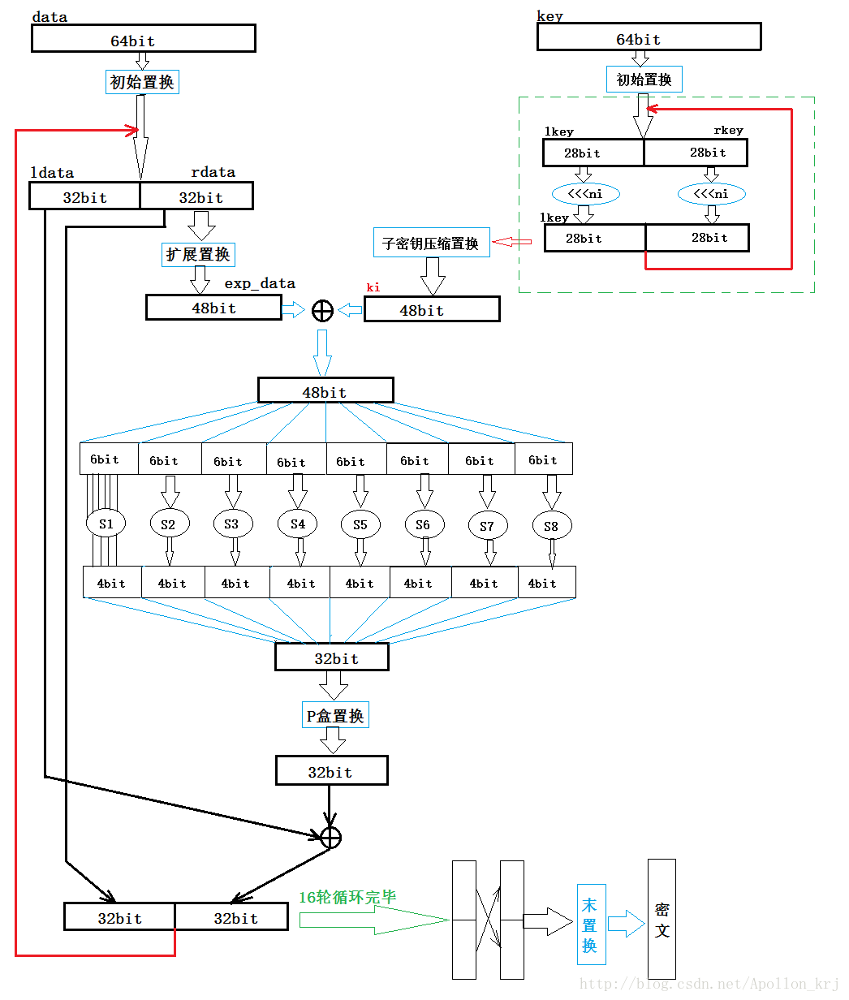

# 常用加密算法学习笔记

##对称加密算法

### DES

### AES

>  参考: https://www.cnblogs.com/luop/p/4334160.html

## 非对称加密算法

### RSA

> 原理: https://www.cnblogs.com/gwind/p/8013116.html

## 摘要算法

### SHA256

> 原理: https://blog.csdn.net/u011583927/article/details/80905740

### MD5

> 原理: https://www.cnblogs.com/ttss/p/4243274.html

