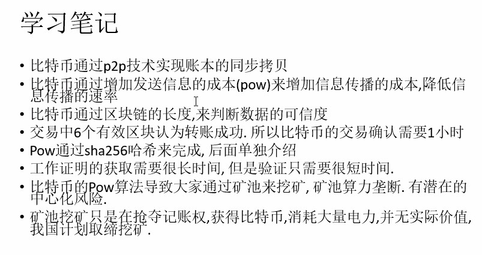
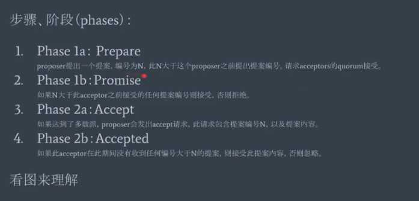
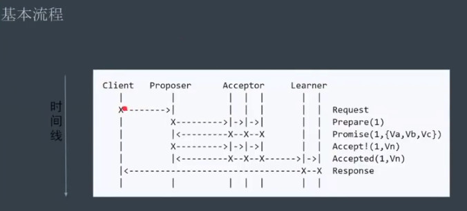
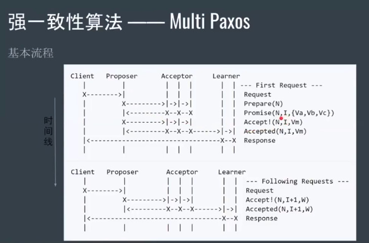

# 区块链理论相关

## 货币的本质
- 价值交换的载体
- 一个交易的媒体
- 一种储藏价值和记账的一种工具

## 电子货币的缺陷
电子货币与真实的货币有联系的.
- 中心化安全问题
- 交易的验证问题
- 双花问题

## 分布式账本

概念: 分布式账本由所有人同步更新.
区分中央节点记账

## 结论:

- 比特币不是一种货币, 它是一种分布式的总账系统, 电子总账在每个参与者的电脑上备份, 实时的同步和对账.

---

## 分布式问题

> 分布式系统的核心问题:  一致性（Consistency）、可用性（Availability）和分区容忍性（Partition）

- 一致性：任何操作应该都是原子的，发生在后面的事件能看到前面事件发生导致的结果，注意这里指的是强一致性；
- 可用性：在有限时间内，任何非失败节点都能应答请求；
- 分区容忍性：网络可能发生分区，即节点之间的通信不可保障。

## 拜占庭将军问题
>假设拜占庭帝国的几支军队在敌人的城池外扎营，每支军队听命于自己的将军，这些将军之间只能通过信使传递消息。在对敌军进行侦察后，将军们必须制订一份共同行动计划。但是，有些将军可能是叛徒，这些叛徒会阻碍那些忠诚的将军达成共识。

比特币使用了PoW(工作量证明机制)解决了拜占庭将军问题.

##  数据一致性问题

要超过全网51%的算力, 也就是6个比特币只有就能确定.  

## 结论

## 区块链解决的问题

- 谁记账
- 如何记账
- 从信任某个人, 到信任某个机制

## 区块链的发展
- 区块链1.0  比特币(c++)
- 区块链2.0   以太坊(Solitidy)
- 区块链3.0  hyperledger(go , nodejs, python.....)

## 区块链的分类
- 公链
公共区块链是指全世界任何人都可读取的、任何人都能发送交易且交易能获得有效确认的、任何人都能参与其中共识过程的区块链
- 联盟链
联盟区块链是指其共识过程受到预选节点控制的区块链
- 私链
完全私有的区块链是指其写入权限仅在一个组织手里的区块链。
- 侧链
不同区块链之间, 通过侧链连接在一起.

>区块链类型划分
公链不看人，只相信密码验证；
私链不让别人用，只能在自己的范围内用；
联盟链半开放，要授权才能让别人用；
侧链是试图连接两种不同链的技术。

## 共识协议

## 共识算法 (重点理解)
https://www.bilibili.com/video/av21667358/

### Paxos  算法  

- 角色

- 步骤

- BasicPaxos基本流程

- Basic Paxos
活锁问题解决: 用随机等待时间解决即可.
- Multi Paxos
将两轮RPC优化成一轮RPC(省去了一轮竞选leader的过程)

### Raft算法
#### 3个子问题
- Leader Election
- Log Replication
- Safety

#### 角色
- Leader
- Follower
- Candidate

> 原理动画解释:   http://thesecretlivesofdata.com/raft
> 场景测试: https://raft.github.io/

## 其他参考

- 区块链面试的理论:https://blog.csdn.net/qq_41618084/article/details/81570842

- 比特币的UTXO理解 : https://www.jianshu.com/p/02fd289e8853