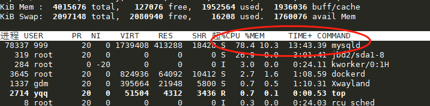

### 使用mysql的docker镜像

参考: <https://blog.csdn.net/qq_19348391/article/details/82998391>

```
#从docker hub中拉取msyql镜像(默认是8.x最新版)
#
sudo docker pull mysql

#查看镜像
sudo docker images

#创建病启动mysql容器
sudo docker run --name mysql -e MYSQL_ROOT_PASSWORD=123456 -p 3306:3306 -d mysql

yqq@ubuntu18-04:~/mine/docker$ docker images
REPOSITORY          TAG                 IMAGE ID            CREATED             SIZE
mysql               5.7                 e1e1680ac726        3 days ago          373MB
my_dev_ubuntu       latest              58978f248089        8 months ago        688MB
aliyun_ubuntu       latest              05a713fa81c4        8 months ago        204MB
ubuntu_test_test    latest              d27f050e1bc0        8 months ago        86.2MB
nginx               latest              568c4670fa80        8 months ago        109MB
ubuntu              18.04               93fd78260bd1        9 months ago        86.2MB
ubuntu              latest              93fd78260bd1        9 months ago        86.2MB
golang              latest              df6ac9d1bf64        9 months ago        774MB
mysql               latest              f991c20cb508        9 months ago        486MB
centos              centos7.1.1503      000733bc1a76        10 months ago       212MB
yqq@ubuntu18-04:~/mine/docker$ 
yqq@ubuntu18-04:~/mine/docker$ 
yqq@ubuntu18-04:~/mine/docker$ sudo docker run --name mysql5.7 -e MYSQL_ROOT_PASSWORD=123456 -p 3306:3306 -d mysql:5.7
dc58bf66b81bbcf536d7d8a0bf4a178d0fdcd241b57a4026d98db638a9750618
yqq@ubuntu18-04:~/mine/docker$ 
yqq@ubuntu18-04:~/mine/docker$ 
yqq@ubuntu18-04:~/mine/docker$ docker ps
CONTAINER ID        IMAGE               COMMAND                  CREATED             STATUS              PORTS                               NAMES
dc58bf66b81b        mysql:5.7           "docker-entrypoint.s…"   5 seconds ago       Up 2 seconds        0.0.0.0:3306->3306/tcp, 33060/tcp   mysql5.7
yqq@ubuntu18-04:~/mine/docker$ 
yqq@ubuntu18-04:~/mine/docker$ 
yqq@ubuntu18-04:~/mine/docker$ 


#进行mysql容器
sudo docker exec -it 3d1a00bbf39e /bin/bash

#修改密码
ALTER USER 'root'@'%' IDENTIFIED WITH mysql_native_password BY '123456';

```


### Docker run 命令

<https://www.runoob.com/docker/docker-run-command.html>

```
docker run ：创建一个新的容器并运行一个命令

语法
docker run [OPTIONS] IMAGE [COMMAND] [ARG...]
IMAGE说明: 可以是  REPOSITORY:TAG 例如 mysql:5.7,  也可以是  IMAGE ID

OPTIONS说明：

-a stdin: 指定标准输入输出内容类型，可选 STDIN/STDOUT/STDERR 三项；

-d: 后台运行容器，并返回容器ID；

-i: 以交互模式运行容器，通常与 -t 同时使用；

-P: 随机端口映射，容器内部端口随机映射到主机的高端口

-p: 指定端口映射，格式为：主机(宿主)端口:容器端口

-t: 为容器重新分配一个伪输入终端，通常与 -i 同时使用；

--name="nginx-lb": 为容器指定一个名称；

--dns 8.8.8.8: 指定容器使用的DNS服务器，默认和宿主一致；

--dns-search example.com: 指定容器DNS搜索域名，默认和宿主一致；

-h "mars": 指定容器的hostname；

-e username="ritchie": 设置环境变量；

--env-file=[]: 从指定文件读入环境变量；

--cpuset="0-2" or --cpuset="0,1,2": 绑定容器到指定CPU运行；

-m :设置容器使用内存最大值；

--net="bridge": 指定容器的网络连接类型，支持 bridge/host/none/container: 四种类型；

--link=[]: 添加链接到另一个容器；

--expose=[]: 开放一个端口或一组端口；

--volume , -v:	绑定一个卷
```


<https://blog.csdn.net/qq_41754409/article/details/92402262>


测试sql

```sql
create table s1(
id int,
name varchar(20),
gender char(6),
email varchar(50)
);


DROP PROCEDURE auto_insert1

create procedure auto_insert1()
BEGIN
    declare i int default 5000000;
    while(i<5000000+30000)do
        insert into s1 values(i,concat('egon',i),'male',concat('egon',i,'@oldboy'));
        set i=i+1;
    end while;
END

show create procedure auto_insert1  

call auto_insert1();
```





关于docker运行时cpu占用过高的问题:

docker run  默认使用了root权限获得了系统的全部资源

<https://blog.csdn.net/youcijibi/article/details/85269213>


### 查看docker 使用的资源状况

```
docker stats


CONTAINER ID        NAME                CPU %               MEM USAGE / LIMIT    MEM %               NET I/O             BLOCK I/O           PIDS
dc58bf66b81b        mysql5.7            0.09%               118.7MiB / 3.83GiB   3.03%               4.13kB / 520B       20.6MB / 34.8MB     28
^C
yqq@ubuntu18-04:~/mine/docker$ 

```

```
docker stats --no-stream

yqq@ubuntu18-04:~/mine/docker$ docker stats --no-stream
CONTAINER ID        NAME                CPU %               MEM USAGE / LIMIT    MEM %               NET I/O             BLOCK I/O           PIDS
dc58bf66b81b        mysql5.7            0.05%               118.7MiB / 3.83GiB   3.03%               4.13kB / 520B       20.6MB / 34.8MB     28
yqq@ubuntu18-04:~/mine/docker$ 
yqq@ubuntu18-04:~/mine/docker$ 
```


### docker容器扩容


<https://www.cnblogs.com/liuyansheng/p/6734553.html>

```
一、配置文件里更改容器创建时的默认磁盘大小

[root@ip-10-10-125-7 ~]# cat /etc/sysconfig/docker-storage
DOCKER_STORAGE_OPTIONS="--storage-opt dm.loopdatasize=2000G -storage-opt dm.loopmetadatasize=10G --storage-opt dm.fs=ext4 --storage-opt dm.basesize=20G"
参数：
dm.loopdatasize=2000G是指存放数据的数据库空间为2t，默认是100g
dm.loopmetadatasize=10G是存放Metadata数据空间为10g，默认是2g
dm.fs=ext4是指容器磁盘分区为ext4
dm.basesize=20G是指容器根分区默认为20g，默认是10g
```

