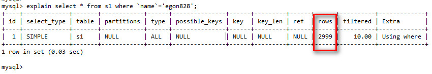
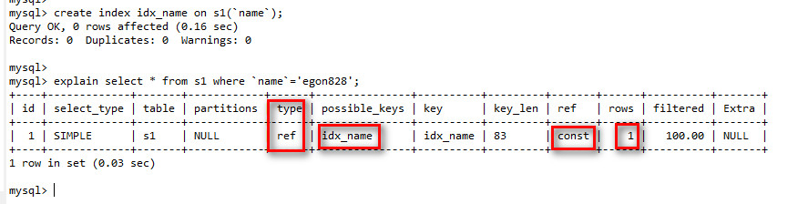
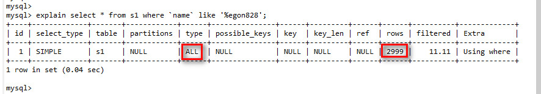
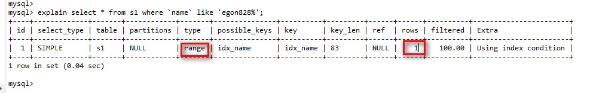
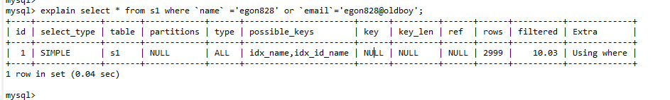
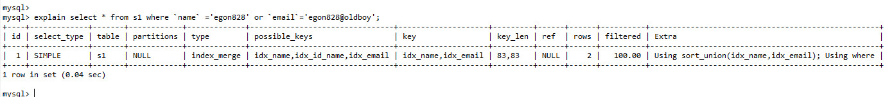

## MySQL索引

参考: <https://www.cnblogs.com/bypp/p/7755307.html>


### 存储过程

```


DROP PROCEDURE auto_insert1

create procedure auto_insert1()
BEGIN
    declare i int default 1;
    while(i<3000000)do
        insert into s1 values(i,concat('egon',i),'male',concat('egon',i,'@oldboy'));
        set i=i+1;
    end while;
END

show create procedure auto_insert1  

call auto_insert1();
```


### 创建索引的语法

```sql
添加普通索引
create index cat_id on goods(`cat_id`);

添加唯一索引

 create unique index `idx_goods_sn` on goods(`goods_sn`);
 
添加单列索引, 指定索引长度优化查询速度
create index `idx_goods_name` on goods(`goods_name`(10));
```


### 使用索引注意点

<https://www.cnblogs.com/yushangzuiyue/p/8352796.html>

- 更新频繁的列不应设置索引
- 数据量小的表不要使用索引（毕竟总共2页的文档，还要目录吗？）
- 重复数据多的字段不应设为索引（比如性别，只有男和女，一般来说：重复的数据超过百分之15就不该建索引）
- 首先应该考虑对where 和 order by 涉及的列上建立索引


```

SELECT SQL_NO_CACHE  

1.对当前query不使用数据库已有缓存来查询，则当前query花费时间会多点

2.对当前query的产生的结果集不缓存至系统query cache里，则下次相同query花费时间会多点
```


## Mysql性能优化


### 1.优化查询

参考: <https://www.cnblogs.com/yycc/p/7338894.html>

```
EXPLAIN  分析sql语句

id:在查询中select语句所在的位置


talbe: 表名


type: 这是重要的列，显示连接使用了何种类型。从最好到最差的连接类型为const、eq_reg、ref、range、index和ALL ; type显示的是访问类型，是较为重要的一个指标，结果值从好到坏依次是：system > const > eq_ref > ref > fulltext > ref_or_null > index_merge > unique_subquery > index_subquery > range > index > ALL   一般来说，得保证查询至少达到range级别，最好能达到ref。


possible_keys：显示可能应用在这张表中的索引。如果为空，没有可能的索引。可以为相关的域从WHERE语句中选择一个合适的语句

key： 实际使用的索引。如果为NULL，则没有使用索引。很少的情况下，MYSQL会选择优化不足的索引。这种情况下，可以在SELECT语句中使用USE INDEX（indexname）来强制使用一个索引或者用IGNORE INDEX（indexname）来强制MYSQL忽略索引

key_len：使用的索引的长度。在不损失精确性的情况下，长度越短越好

ref：显示索引的哪一列被使用了，如果可能的话，是一个常数

rows：MYSQL认为必须检查的用来返回请求数据的行数(行数越多越差)

```





- 使用索引进行优化




- 使用索引进行查询




- 优化Like语句  , 把 '%' 放到其他位置(不是第一个)




- 使用多列索引(遵循最左前缀原则, 否则索引不可用)


- 关键字OR

  如果查询语句中包含  or , 要查询的字段必须都是索引, 否则索引不可用

  

   如果两个字段都是索引, 则会使用索引

  


### 2.优化数据库结构


- 将字段很多的表分解成多个表

- 增加中间表, 降低联表查询的次数

- 优化插入记录的速度

  - 禁用索引: 如果有大量的数据需要插入时,可以先禁用索引,待插入完之后再启用索引

    ```
    ALTER TABLE 表名 DISABLE KEYS;
    ALTER TABLE 表名 ENABLE KEYS;
    ```

  - 禁用唯一性检查

    ```
    SET UNIQUE_CHECKS=0;
    SET UNIQUE_CHECKS=1;
    ```

  - 优化 INSERT语句, 尽量使用一条insert插入多条数据, 而不使用多条insert语句

    


### 3.查询高速缓存

```
mysql> show variables like '%query_cache%';
+------------------------------+---------+
| Variable_name                | Value   |
+------------------------------+---------+
| have_query_cache             | YES     |
| query_cache_limit            | 1048576 |
| query_cache_min_res_unit     | 4096    |
| query_cache_size             | 1048576 |
| query_cache_type             | OFF     |
| query_cache_wlock_invalidate | OFF     |
+------------------------------+---------+
6 rows in set (0.05 sec)

mysql> 

have_query_cache : 是否配置高速缓存
query_cache_size : 高速缓存分配空间
query_cache_type  : 判断高速缓存是否开启  ON:开启  OFF:关闭  DEMAND:看情况而定


select SQL_CACHE * from s1 where `name` ='egon828' or `email`='egon828@oldboy';
```


如果表发生变化, 高速缓存就会失效 ,  如果不用高速缓存则使用: SQL_NO_CACHE


### 4.优化多表查询

使用子查询来优化多表查询语句


### 5.优化表设计


### 6.分析表, 检查表,优化表

```
ANALAYZE TABLE 表名1 ....

CHECK TABLE 表名1 ...

OPTIMIZE TABLE 表名1 ....

```


