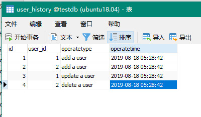
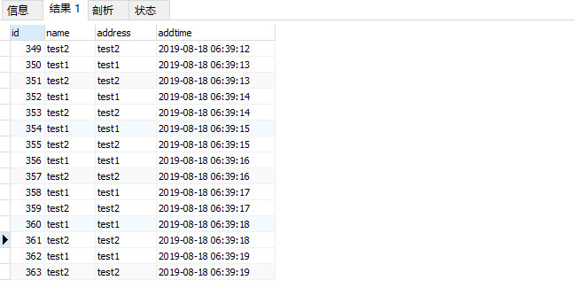

### 视图

将查询结果存为视图, 相当于一张虚拟的表


### 触发器

当 INSERT , UPDATE, DELETE 事件发生自动执行触发器中的一系列操作

```

DROP TABLE IF EXISTS `user`;
CREATE TABLE `user` (
  `id` bigint(20) NOT NULL AUTO_INCREMENT,
  `account` varchar(255) DEFAULT NULL,
  `name` varchar(255) DEFAULT NULL,
  `address` varchar(255) DEFAULT NULL,
  PRIMARY KEY (`id`)
) ENGINE=InnoDB DEFAULT CHARSET=utf8;


DROP TABLE IF EXISTS `user_history`;
CREATE TABLE `user_history` (
  `id` bigint(20) NOT NULL AUTO_INCREMENT,
  `user_id` bigint(20) NOT NULL,
  `operatetype` varchar(200) NOT NULL,
  `operatetime` datetime NOT NULL,
  PRIMARY KEY (`id`)
) ENGINE=InnoDB DEFAULT CHARSET=utf8;


DROP TRIGGER IF EXISTS `tri_insert_user`;
DELIMITER ;;
CREATE TRIGGER `tri_insert_user` AFTER INSERT ON `user` FOR EACH ROW begin
    INSERT INTO user_history(user_id, operatetype, operatetime) VALUES (new.id, 'add a user',  now());
end
;;
DELIMITER ;


DROP TRIGGER IF EXISTS `tri_update_user`;
DELIMITER ;;
CREATE TRIGGER `tri_update_user` AFTER UPDATE ON `user` FOR EACH ROW begin
    INSERT INTO user_history(user_id,operatetype, operatetime) VALUES (new.id, 'update a user', now());
end
;;
DELIMITER ;


DROP TRIGGER IF EXISTS `tri_delete_user`;
DELIMITER ;;
CREATE TRIGGER `tri_delete_user` AFTER DELETE ON `user` FOR EACH ROW begin
    INSERT INTO user_history(user_id, operatetype, operatetime) VALUES (old.id, 'delete a user', now());
end
;;
DELIMITER ;


INSERT INTO user(account, name, address) VALUES ('user1', 'user1', 'user1');
INSERT INTO user(account, name, address) VALUES ('user2', 'user2', 'user2');

UPDATE user SET name = 'user3', account = 'user3', address='user3' where name='user1';

DELETE FROM `user` where name = 'user2';

```





### MySQL中的锁

参考: <https://www.cnblogs.com/shamgod-lct/p/9318032.html>


- 表锁 : 锁住整个表, MyISAM使用表锁
- 行锁: 锁住表中一行数据, InnoDB锁住一行
- 共享锁(读锁, S锁):  一个事务获取了共享锁，其他事务可以获取共享锁，不能获取排他锁，其他事务可以进行读操作，不能进行写操作。
- 排它锁(写锁, X锁) : 如果事务T对数据A加上排他锁后，则其他事务不能再对A加任任何类型的封锁。拥有排他锁的事务既能读数据，又能写数据。


> 注意：在InnoDB中，例如模糊查询select * from tb where name like 'lin%'的时候也会锁住一整张


对于insert、update、delete，InnoDB会自动给涉及的数据加排他锁（X）；

对于一般的select语句，InnoDB不会加任何锁，事务可以通过以下语句给显式加共享锁或排他锁。

共享锁：SELECT ... LOCK IN SHARE MODE;

排他锁：SELECT ... FOR UPDATE;


测试共享锁和排他锁

```

SET AUTOCOMMIT=0;
BEGIN;
SELECT * FROM `user_history`  WHERE id=1 LOCK IN SHARE MODE;


COMMIT;


UPDATE user_history set operatetype = 'helloworld' WHERE id=1;

```


> 死锁: 两个事务互相等待对方先释放资源.  InnoDB表会自动处理这样的死锁.


### 事件

可以定期的执行一些操作

参考: <https://www.cnblogs.com/wt645631686/p/9208245.html>


```

DROP TABLE IF EXISTS `user`;
CREATE TABLE `user` (
  `id` bigint(20) NOT NULL AUTO_INCREMENT,
  `name` varchar(200) NOT NULL,
  `address` varchar(500) NOT NULL,
  `addtime` datetime NOT NULL,
  PRIMARY KEY (`id`)
) ENGINE=InnoDB DEFAULT CHARSET=utf8;


show VARIABLES LIKE 'event_scheduler';

set GLOBAL event_scheduler=ON; //开启事件(临时), 想永久开启, 需修改 my.cnf文件


show PROCESSLIST;  //查看事件


//创建事件

DROP EVENT IF EXISTS `event_sec`;
DELIMITER ;;
CREATE  EVENT `event_sec` ON SCHEDULE EVERY 1 SECOND
ON COMPLETION  PRESERVE ENABLE DO 

BEGIN
    INSERT INTO testdb.`user`(name, address,addtime) VALUES('test1','test1',now());
    INSERT INTO  testdb.`user`(name, address,addtime) VALUES('test2','test2',now());
END
;;
DELIMITER ;


SELECT * from 	`user`;


ALTER EVENT `event_sec` DISABLE;

ALTER EVENT `event_sec` ENABLE;


DROP EVENT IF EXISTS event_sec;


```





