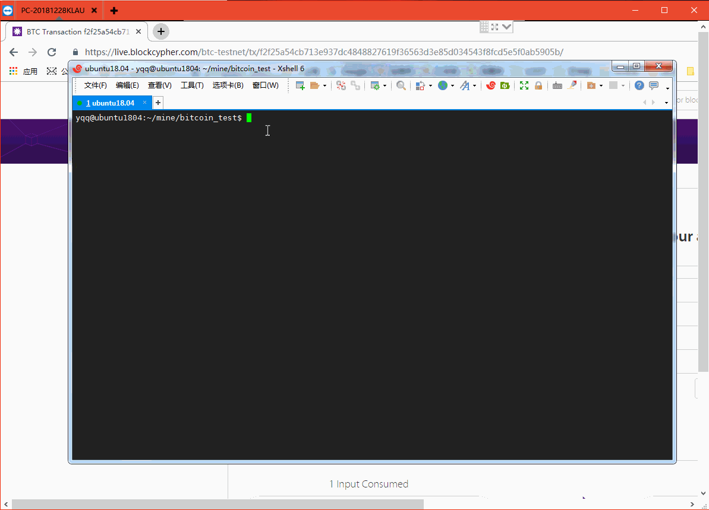

# 搭建比特币测试网络testnet


- 下载bitcoincore 

  > https://bitcoin.org/zh_CN/download

  ```
   #下载页面
   #https://bitcoin.org/zh_CN/download
  
  cd /opt/
  wget https://bitcoin.org/bin/bitcoin-core-0.17.1/bitcoin-0.17.1-x86_64-linux-gnu.tar.gz
  
   #解压, 将客户端程序和服务端程序复制到  /usr/local/bin/目录下
  tar zxf bitcoin-0.17.1-x86_64-linux-gnu.tar.gz
  cd  bitcoin-0.17.1
  sudo cp bitcoin-cli bitcoind  /usr/local/bin/
  
  ```

- 启动testnet

  编辑 ~/.bitcoin/bitcoin.conf

  ```
  testnet=1
  dbcache=10240
  txindex=1
  rpcuser=btc
  rpcpassword=btc2018
  daemon=1
  server=1
  rest=1
  rpcbind=0.0.0.0:18332
  rpcallowip=0.0.0.0/0
  deprecatedrpc=accounts
  ```

  直接启动  bitcoind

  启动之后, 会同步测试网络数据, 大概30G左右.   (也可以使用轻节点方式)


- 测试RPC

  ```
  bitcoin-cli getblockchaininfo     #查看区块链同步情况
  bitcoin-cli getmininginfo
  
  
  #curl访问rpc测试
  curl -s -X POST --user btc:btc2018  \
    -H 'content-type: text/plain;' http://127.0.0.1:18332/ \
    --data-binary '{"jsonrpc": "1.0", "id":"curltest", "method": "getmininginfo", "params": [] }' 
  
  #查询最新区块高度
  curl -s -X POST --user btc:btc2018  \
    -H 'content-type: text/plain;' http://127.0.0.1:18332/ \
    --data-binary '{"jsonrpc": "1.0", "id":"curltest", "method": "getblockcount", "params": [] }' \
    |awk -F '[:,]' '{print $3}'
  ```

### 使用C++编写代码进行RPC调用实现转账交易

- 创建接受地址

  ```
  bitcoin-cli getaccountaddress "yqq"    //获取账户地址, 如果账户不存在则创建, 用于接收 
  GetNewAddress
  ```


- 获取测试币

  > https://coinfaucet.eu/en/btc-testnet/

- 安装依赖库

  ```
  https://github.com/cinemast/libjson-rpc-cpp
  https://github.com/minium/bitcoin-api-cpp
  ```


- 转账代码

  ```cpp
  #include <bitcoinapi/bitcoinapi.h>
  
  int main()
  {
      std::string username = "btc";   //bitcoin.conf 中设置rpc用户
      std::string password = "btc2018"; //bitcoin.conf 中设置的rpc密码
      //std::string address = "192.168.10.199";
      std::string address = "192.168.10.56";
      int port = 18332;
  
      try
      {
          /* Constructor to connect to the bitcoin daemon */
          BitcoinAPI btc(username, password, address, port);
  
  		btc.walletpassphrase("123456"/*这里是加密钱包时设置的密码*/, 5);  
  
  		//转账
  		const std::string strDstAddr = "mv4rnyY3Su5gjcDNzbMLKBQkBicCtHUtFB";
  		const std::string strComment = "yqq";
  		const std::string strComment_to = "hello";
  		std::string strTxid = btc.sendtoaddress(strDstAddr, 0.001, strComment, strComment_to);
  
  		std::cout << "txid: " << strTxid << std::endl;
  
      }
      catch(BitcoinException e)
      {
          std::cerr << e.getMessage() << std::endl;
      }
  }
  ```


- makefile

  ```
  test:
  	g++  test_testnet_transaction.cpp -lbitcoinapi
  ```


转账效果




### 附录

- Window下启动 testnet:  在命令行中  使用`  bitcoin.exe  -testnet  `即可启动测试网络
- linux也可以使用  `bitcoin-qt  -testnet` 启动测试网络


### 参考

- https://www.cnblogs.com/elvi/p/10203927.html
- https://blog.csdn.net/yzpbright/article/details/81017807