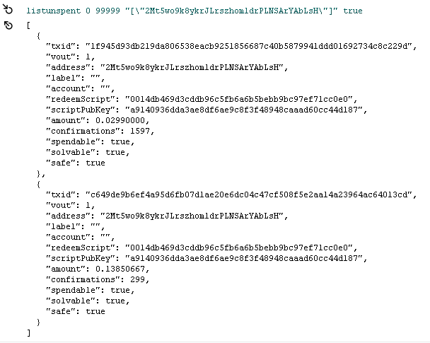
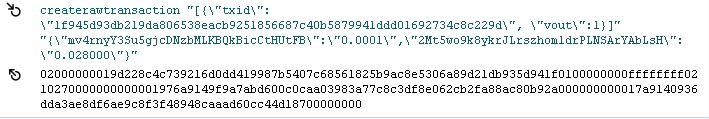
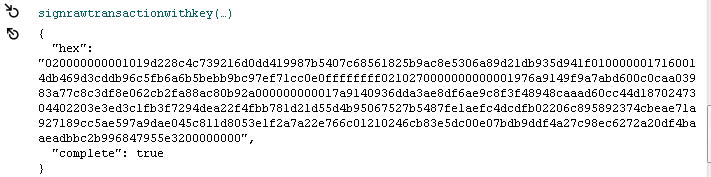

# 比特币对接

## 地址分类

- p2sk(``)   
- p2skh(主网地址是以"1"开头,例如:`16dN3XhaTejyZFy4hWompK2x8de2T46wA8`; 测试网是以"m"或"n"开头, 例如:`mvZjn2485hwxjVPJoLAZVyJKUDn8aGpBy5`)
- p2sh (主网地址是以"3"开头,例如:`33ZzFZZJcvtnLBWRdne6F9SpD9Rc7sjSDX`; 测试网以"2"开头,例如:`2Mt5wo9k8ykrJLrszhom1drPLNSArYAbLsH`;  ), 目前, 多重签名基本上使用这种类型地址


## 提币流程

### 1.地址导入

- 热钱包(私钥在钱包软件中):通过钱包密码就可以直接进行转账

- 观察钱包(私钥不在钱包软件中):只能监测地址的入币和出币,可以通过listunspent列出其utxo集, 也可以使用createrawtransaction创建交易


### 2.列出utxo
通过rpc接口`listunspent`列出一个地址的utxo集


```
listunspent  最小确认数  最大确认数  ["地址1", "地址2" ]  include_unsafe(是否包含不安全的utxo,即确认数太少)  query_options("其他查询选项")

例如:

listunspent 0 9999999 '[\'2MyeRq1tEWJR9rNeTcAZzoW6tUZiQpvRJum\']' true  

```




### 3.创建裸交易

```
createrawtransaction "[{\"txid\":\"1f945d93db219da806538eacb9251856687c40b5879941ddd01692734c8c229d\", \"vout\":1}]" "{\"mv4rnyY3Su5gjcDNzbMLKBQkBicCtHUtFB\":\"0.0001\",\"2Mt5wo9k8ykrJLrszhom1drPLNSArYAbLsH\":\"0.028000\"}"

```




### 4.交易签名(离线, 在线)


- 离线签名(支持多签, 如果是p2sh地址, 需要填写redeemScript, redeemScript创建多签地址时生成的, 如果是普通p2sh地址需要将私钥导入钱包,使用listunspent可以查看到redeemScript)
```
signrawtransactionwithkey 02000000019d228c4c739216d0dd419987b5407c68561825b9ac8e5306a89d21db935d941f0100000000ffffffff0210270000000000001976a9149f9a7abd600c0caa03983a77c8c3df8e062cb2fa88ac80b92a000000000017a9140936dda3ae8df6ae9c8f3f48948caaad60cc44d18700000000 "[\"cPGsdAQLFnKRWrtbGKbdcbLRCnx2MEJ7vk5uCFy9a6PRpNaJDsAT\"]" "[{\"txid\":\"1f945d93db219da806538eacb9251856687c40b5879941ddd01692734c8c229d\", \"vout\":1, \"redeemScript\": \"0014db469d3cddb96c5fb6a6b5bebb9bc97ef71cc0e0\", \"scriptPubKey\": \"a9140936dda3ae8df6ae9c8f3f48948caaad60cc44d187\",\"amount\": 0.02990000}]" "ALL"

```

- 在线签名(私钥在钱包中)不需要inputs


- 普通p2skh地址(主网是"1"开头, 测试网是"m"或"n"开头), input中不需要填写 redeemScript




### 5.发送交易

在全节点上使用sendrawtransaction发送即可


如果在signerawtransaction时,input中的amout填写错误, 在发送sendrawtransaction会出现`non-mandatory-script-verify-flag (Signature must be zero for failed CHECK(MULTI)SIG operation) (code 64) (code -26)`

```

sendrawtransaction 020000000001019d228c4c739216d0dd419987b5407c68561825b9ac8e5306a89d21db935d941f0100000017160014db469d3cddb96c5fb6a6b5bebb9bc97ef71cc0e0ffffffff0210270000000000001976a9149f9a7abd600c0caa03983a77c8c3df8e062cb2fa88ac80b92a000000000017a9140936dda3ae8df6ae9c8f3f48948caaad60cc44d1870247304402206647f4945ca9cf625a66b9b80d72deb98a21e52ede4c4958644f51c390c814620220330a6b8e238f63011b8514303002a0582961e2a68771fd22429ca039509f864b01210246cb83e5dc00e07bdb9ddf4a27c98ec6272a20df4baaeadbbc2b996847955e3200000000

txid如下:
75eaa247413b9b1cbd1aa4000a4e732be1fb6182f17b36435a6cfee4e3737a78

```


### 6.交易确认

```
算法描述:

```


```
getrawtransaction 75eaa247413b9b1cbd1aa4000a4e732be1fb6182f17b36435a6cfee4e3737a78 true

{
  "txid": "75eaa247413b9b1cbd1aa4000a4e732be1fb6182f17b36435a6cfee4e3737a78",
  "hash": "1e2b637a3a7bc409e9db6c83b015f9682a075f3cec88ff3cc1407023cba938db",
  "version": 2,
  "size": 249,
  "vsize": 168,
  "weight": 669,
  "locktime": 0,
  "vin": [
    {
      "txid": "1f945d93db219da806538eacb9251856687c40b5879941ddd01692734c8c229d",
      "vout": 1,
      "scriptSig": {
        "asm": "0014db469d3cddb96c5fb6a6b5bebb9bc97ef71cc0e0",
        "hex": "160014db469d3cddb96c5fb6a6b5bebb9bc97ef71cc0e0"
      },
      "txinwitness": [
        "304402206647f4945ca9cf625a66b9b80d72deb98a21e52ede4c4958644f51c390c814620220330a6b8e238f63011b8514303002a0582961e2a68771fd22429ca039509f864b01",
        "0246cb83e5dc00e07bdb9ddf4a27c98ec6272a20df4baaeadbbc2b996847955e32"
      ],
      "sequence": 4294967295
    }
  ],
  "vout": [
    {
      "value": 0.00010000,
      "n": 0,
      "scriptPubKey": {
        "asm": "OP_DUP OP_HASH160 9f9a7abd600c0caa03983a77c8c3df8e062cb2fa OP_EQUALVERIFY OP_CHECKSIG",
        "hex": "76a9149f9a7abd600c0caa03983a77c8c3df8e062cb2fa88ac",
        "reqSigs": 1,
        "type": "pubkeyhash",
        "addresses": [
          "mv4rnyY3Su5gjcDNzbMLKBQkBicCtHUtFB"
        ]
      }
    },
    {
      "value": 0.02800000,
      "n": 1,
      "scriptPubKey": {
        "asm": "OP_HASH160 0936dda3ae8df6ae9c8f3f48948caaad60cc44d1 OP_EQUAL",
        "hex": "a9140936dda3ae8df6ae9c8f3f48948caaad60cc44d187",
        "reqSigs": 1,
        "type": "scripthash",
        "addresses": [
          "2Mt5wo9k8ykrJLrszhom1drPLNSArYAbLsH"
        ]
      }
    }
  ],
  "hex": "020000000001019d228c4c739216d0dd419987b5407c68561825b9ac8e5306a89d21db935d941f0100000017160014db469d3cddb96c5fb6a6b5bebb9bc97ef71cc0e0ffffffff0210270000000000001976a9149f9a7abd600c0caa03983a77c8c3df8e062cb2fa88ac80b92a000000000017a9140936dda3ae8df6ae9c8f3f48948caaad60cc44d1870247304402206647f4945ca9cf625a66b9b80d72deb98a21e52ede4c4958644f51c390c814620220330a6b8e238f63011b8514303002a0582961e2a68771fd22429ca039509f864b01210246cb83e5dc00e07bdb9ddf4a27c98ec6272a20df4baaeadbbc2b996847955e3200000000",
  "blockhash": "00000000000001bc26994340915b8b13db186c66e065b572ca684ab377bf64ef", //交易所在区块的区块hash
  "confirmations": 4,   //交易确认数
  "time": 1550718558,
  "blocktime": 1550718558
}
```


```
getblock 00000000000001bc26994340915b8b13db186c66e065b572ca684ab377bf64ef


{
  "hash": "00000000000001bc26994340915b8b13db186c66e065b572ca684ab377bf64ef",
  "confirmations": 7,  //目前区块确认数
  "strippedsize": 1022,
  "size": 1707,
  "weight": 4773,
  "height": 1479868,
  "version": 807034880,
  "versionHex": "301a6000",
  "merkleroot": "0799ecf47189b8c6f302965fa2fbcf289099fb6264a290ba2643a051989a4f63",
  "tx": [
    "3103afff6e37d3edbb03a97fc2e2b1c46758e837d7569a9cd797de17a0ec35a9",
    "75eaa247413b9b1cbd1aa4000a4e732be1fb6182f17b36435a6cfee4e3737a78",
    "cb08675a7f240a6a9b86b8e50535001f8e75092013c1f2370b6f39f5e550fad2",
    "80d70233474d9d9383c24bd3aec1d94304f92ee49bb9cccc1fac67cb297663fc"
  ],
  "time": 1550718558,
  "mediantime": 1550718216,
  "nonce": 658858781,
  "bits": "1a03f010",
  "difficulty": 4260551.067022134,
  "chainwork": "0000000000000000000000000000000000000000000000f563640f85fedea691",
  "nTx": 4,
  "previousblockhash": "00000000000002580ef22c6a097723f010e56bd046360d5f8eefa8dcbb91e84d",
  "nextblockhash": "000000000000007ed7332a15fbe4566e1e5410966d4a3b48b2789695e20ef0a6"
}
```


## 区块监测(充币通知)

- 方案1(理论上适用所有币)

  解析最新区块中的交易, 找到关心的交易

  根据区块hash获取区块信息

  

- 方案2(比特币可以用这种方法做, 其他币未知)

  将地址导入钱包中(观察钱包), 使用 `listunspent`(可以设置确认数)来监测区块变化, 例如:使用`listunspent 0 0 ["地址A"]`可以查看交易池中刚刚收到的交易, 通过设置确认数可以查看地址是否入币了


