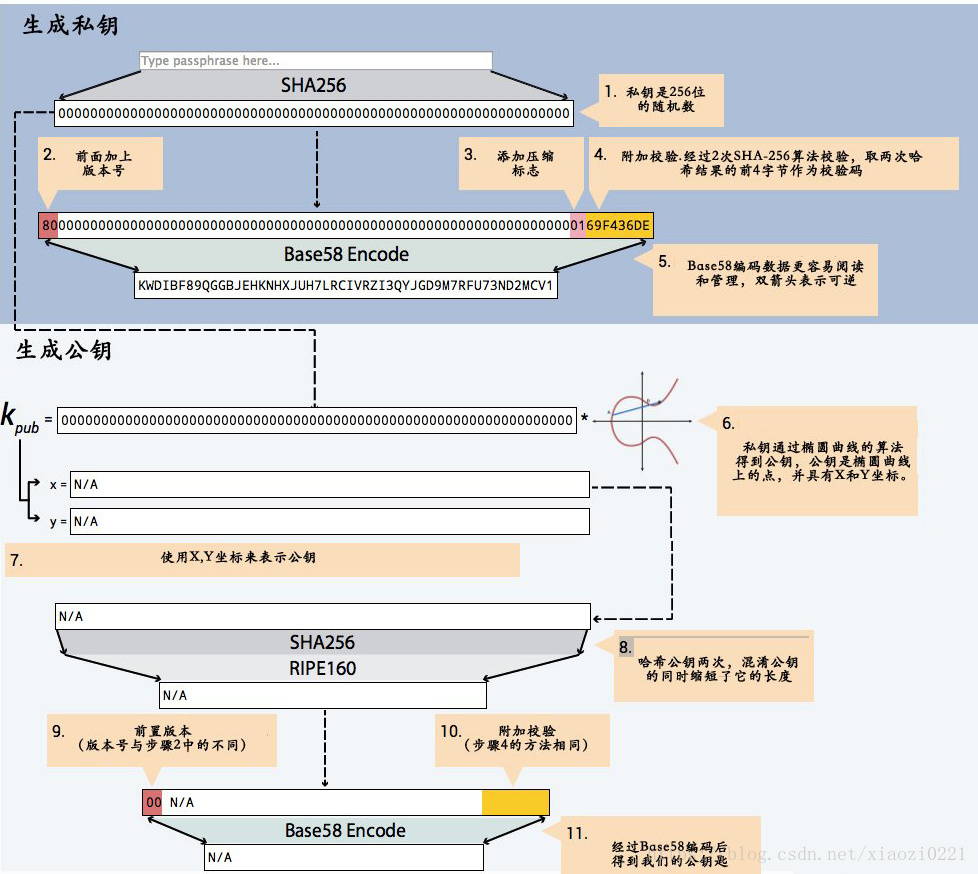

## 比特币私钥公钥地址生成算法

### 原理




### 实现

```python

#!coding:utf8

#author:yqq
#date:2019/3/4 0004 14:35
#description:  比特币地址生成算法

import hashlib
import ecdsa
import os


#2019-05-15  添加私钥限制范围
g_b58 = '123456789ABCDEFGHJKLMNPQRSTUVWXYZabcdefghijkmnopqrstuvwxyz'

#g_nMaxPrivKey = 0xFFFFFFFFFFFFFFFFFFFFFFFFFFFFFFFEBAAEDCE6AF48A03BBFD25E8CD0364140 - 0x423423843  #私钥最大值 (差值是自定义的)
#g_nMinPrivKey = 0x0000000000000000000000000000000000000000000000000000000000000001 + 0x324389329  #私钥最小值 (增值是自定义的)

#2019-11-12 根据官方定义修改  有限域
# http://www.secg.org/sec2-v2.pdf#page=9&zoom=100,0,249
# 关于 有限域的定义 请参考
# 0xEFFFFFC2F = 2**32 - 2**9 - 2**8 - 2**7 - 2**6 - 2**4 - 1
g_nFactor = 0xEFFFFFC2F + 0x23492397 #增值自定义
g_nMaxPrivKey = 0xFFFFFFFFFFFFFFFFFFFFFFFFFFFFFFFEBAAEDCE6AF48A03BBFD25E8CD0364140 - g_nFactor #私钥最大值 (差值是自定义的)
g_nMinPrivKey = 0x0000000000000000000000000000000000000000000000000000000000000001 + g_nFactor #私钥最小值 (增值是自定义的)


def Base58encode(n):
    '''
    base58编码
    :param n: 需要编码的数
    :return: 编码后的
    '''
    result = ''
    while n > 0:
        result = g_b58[n % 58] + result
        n /= 58
    return result


def Base256decode(s):
    '''
    base256编码
    :param s:
    :return:
    '''
    result = 0
    for c in s:
        result = result * 256 + ord(c)
    return result


def CountLeadingChars(s, ch):
    '''
    计算一个字符串开头的字符的次数
    比如:  CountLeadingChars('000001234', '0')  结果是5
    :param s:字符串
    :param ch:字符
    :return:次数
    '''
    count = 0
    for c in s:
        if c == ch:
            count += 1
        else:
            break
    return count


def Base58CheckEncode(version, payload):
    '''

    :param version: 版本前缀  , 用于区分主网 和 测试网络
    :param payload:
    :return:
    '''
    s = chr(version) + payload
    checksum = hashlib.sha256(hashlib.sha256(s).digest()).digest()[0:4]  #两次sha256, 区前4字节作为校验和
    result = s + checksum
    leadingZeros = CountLeadingChars(result, '\0')
    return '1' * leadingZeros + Base58encode(Base256decode(result))


def PrivKeyToPubKey(privKey):
    '''
    私钥-->公钥
    :param privKey: 共65个字节:  0x04   +  x的坐标  +   y的坐标
    :return:
    '''
    sk = ecdsa.SigningKey.from_string(privKey.decode('hex'), curve=ecdsa.SECP256k1)
    # vk = sk.verifying_key
    return ('\04' + sk.verifying_key.to_string()).encode('hex')

def PrivKeyToPubKeyCompress(privKey):
    '''
    私钥-->公钥  压缩格式公钥
    :param privKey:  ( 如果是奇数,前缀是 03; 如果是偶数, 前缀是 02)   +  x轴坐标
    :return:
    '''
    sk = ecdsa.SigningKey.from_string(privKey.decode('hex'), curve=ecdsa.SECP256k1)
    # vk = sk.verifying_key
    try:
        # print(sk.verifying_key.to_string().encode('hex'))
        point_x = sk.verifying_key.to_string().encode('hex')[     : 32*2] #获取点的 x 轴坐标
        point_y = sk.verifying_key.to_string().encode('hex')[32*2 :     ]  #获取点的 y 轴坐标
        # print("point_x:", point_x)

        if (long(point_y, 16) & 1) == 1:  # 如果是奇数,前缀是 03; 如果是偶数, 前缀是 02
            prefix = '03'
        else:
            prefix = '02'
        return prefix + point_x
    except:
        raise("array overindex")
        pass


#https://en.bitcoin.it/wiki/List_of_address_prefixes
def PubKeyToAddr(privKey, isTestnet = False):
    '''
    公钥-->地址
    :param privKey:私钥
    :param isTestnet:是否是测试网络
    :return:地址
    '''
    ripemd160 = hashlib.new('ripemd160')
    ripemd160.update(hashlib.sha256(privKey.decode('hex')).digest())
    if isTestnet:
        return Base58CheckEncode(0x6F, ripemd160.digest())  #0x6F  p2pkh  testnet
    # return base58CheckEncode(0x05, ripemd160.digest())  #05  p2sh mainnet
    return Base58CheckEncode(0x00, ripemd160.digest())  #00  p2pkh  mainnet


def PrivKeyToWIF(privKey, isTestnet = False):
    '''
    将私钥转为 WIF格式 , 用于比特币钱包导入
    :param privKey: 私钥(16进制字符串)
    :return: WIF格式的私钥
    '''
    if isTestnet:
        # return Base58CheckEncode(0xEF, privKey.decode('hex') + '\01') #0xEF 测试网络          fix bug: 2019-04-03 yqq 01是多余的, 只有是压缩的格式的时候,才需要加
        return Base58CheckEncode(0xEF, privKey.decode('hex') ) #0xEF 测试网络
    # return Base58CheckEncode(0x80, privKey.decode('hex') + '\01') #0x80 主网
    return Base58CheckEncode(0x80, privKey.decode('hex') ) #0x80 主网

def PrivKeyToWIFCompress(privKey, isTestnet = False):
    '''
    压缩格式
    将私钥转为 WIF格式 , 用于比特币钱包导入
    :param privKey: 私钥(16进制字符串)
    :return: WIF格式的私钥
    '''
    if isTestnet:
        return Base58CheckEncode(0xEF, privKey.decode('hex') + '\01') #0xEF 测试网络
    return Base58CheckEncode(0x80, privKey.decode('hex') + '\01') #0x80 主网


def GenPrivKey():
    '''
    生成私钥, 使用 os.urandom (底层使用了操作系统的随机函数接口, 取决于CPU的性能,各种的硬件的数据指标)
    :return:私钥(16进制编码)
    '''

    #2019-05-15 添加私钥范围限制
    while True:
        privKey = os.urandom(32).encode('hex')    #生成 256位 私钥
        if  g_nMinPrivKey < int(privKey, 16) <   g_nMaxPrivKey:
            return privKey


def GenAddr(isTestnet=False):
    '''
    此函数用于C++调用,
    :param isTestnet: 是否是测试网络
    :return:  (私钥, 公钥, 地址)
    '''
    privKey = GenPrivKey()
    # print("privkey : " + privKey)
    privKeyWIF =  PrivKeyToWIF(privKey, isTestnet)
    # print("privkey WIF:" + PrivKeyToWIF(privKey, isTestnet))
    pubKey = PrivKeyToPubKey(privKey)
    # print("pubkey : " + pubKey)
    addr = PubKeyToAddr(pubKey, isTestnet)
    # print("addr : " + addr)
    return str(privKeyWIF), str(pubKey), str(addr)


def GenAddrCompress(isTestnet=False):
    '''
    此函数用于C++调用,
    :param isTestnet: 是否是测试网络
    :param isCompress: 是否压缩
    :return:  (私钥, 公钥, 地址)
    '''
    privKey = GenPrivKey()
    # print("privkey : " + privKey)
    privKeyWIF =  PrivKeyToWIFCompress(privKey, isTestnet)
    # print("privkey WIF:" + PrivKeyToWIF(privKey, isTestnet))
    pubKey = PrivKeyToPubKeyCompress(privKey)
    # print("pubkey : " + pubKey)
    addr = PubKeyToAddr(pubKey, isTestnet)
    # print("addr : " + addr)
    return str(privKeyWIF), str(pubKey), str(addr)


def GenMultiAddr(nAddrCount = 1, isTestnet=True):
    '''
    生成多个地址
    :param nAddrCount:
    :param isTestnet:
    :return:
    '''
    # return [("1111", "2222", "3333"), ("4444", "55555", "66666")]
    # return [1, 2, 3, 4]
    # return ["1111", "2222", "3333", "4444"]

    lstRet = []
    for i in range(nAddrCount):
        lstRet.append(GenAddrCompress(isTestnet))
    return lstRet

#
def good():

    isTestnet = True


    # private_key = GenPrivKey()
    private_key = '95b51ad564bd26811aeafc06ebe64643d2a50f82aa4901e714ba4be635ed9a57'
    print("privkey : " + private_key)
    print("privkey WIF:" + PrivKeyToWIF(private_key, isTestnet))
    pubKey = PrivKeyToPubKey(private_key)
    print("pubkey : " + pubKey)
    addr = PubKeyToAddr( pubKey , isTestnet)
    print("addr : " + addr)
    print("-----------------------------")
    print("privkey WIF compress:" + PrivKeyToWIFCompress(private_key, isTestnet))
    pubKey = PrivKeyToPubKeyCompress(private_key)
    print("pubkey  compress : " + pubKey)
    addr = PubKeyToAddr( pubKey , isTestnet)
    print("addr  compress: " + addr)
#
#
# def main():
#     good()
#     for i in range(1):
#         print(GenAddr(True))

# if __name__ == '__main__':
#
#     main()

```


### 关于地址压缩

参考链接: `https://bitcoin.stackexchange.com/questions/3059/what-is-a-compressed-bitcoin-key`


